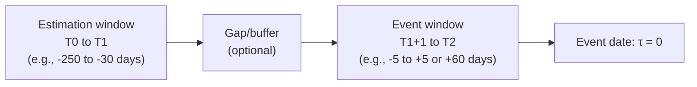
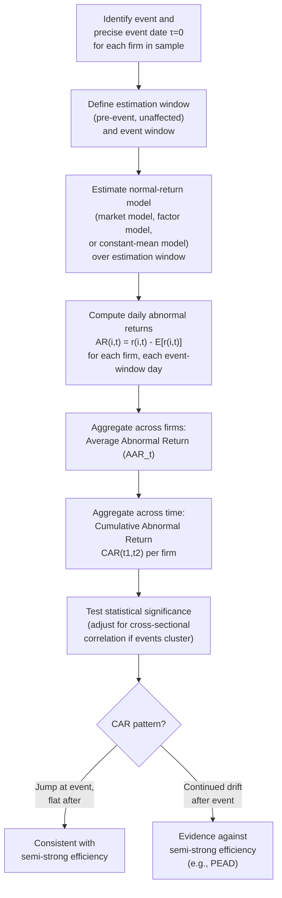

## Event study methodology

### Overview and Purpose

Event study methodology is the primary empirical technique in financial economics for measuring the impact of a specific, dateable event (an earnings announcement, merger, regulatory change, stock split, dividend announcement, index inclusion, etc.) on security prices. Developed in its modern form by **Fama, Fisher, Jensen, and Roll (1969)** (studying stock splits) and building on **Ball and Brown (1968)** (studying earnings announcements), the method isolates the **abnormal return** attributable to an event by comparing realized returns to a benchmark ("normal") return that would have been expected absent the event. Event studies are the principal empirical vehicle for testing **semi-strong-form market efficiency**, since they directly measure the speed and completeness with which new public information is incorporated into price.

### The Standard Event Study Procedure

**Step 1 — Define the Event and Event Date**

Precisely identify the event of interest and the **event date** $\tau = 0$ for each firm/security in the sample. Precision matters enormously: for corporate announcements, the relevant date is typically the date information first became public (which may be the *announcement* date, not the date reported in a database if there is a lag, and may require adjusting for after-hours vs. intraday announcement timing).

**Step 2 — Define the Event Window and Estimation Window**

- **Estimation window** $[T_0, T_1]$: a period *prior to* the event (or otherwise unaffected by it) used to estimate the parameters of the normal-return model, typically 100–250 trading days ending well before the event window begins (to avoid contamination from information leakage/anticipation).
- **Event window** $[T_1+1, T_2]$: the period surrounding the event during which abnormal returns are measured — often includes a few days *before* the announcement (to capture leakage/anticipation effects) and an extended period *after* (to detect any drift/delayed reaction).

**Step 3 — Choose and Estimate a Normal (Expected) Return Model**

The most common models, in increasing order of sophistication:

1. **Constant mean return model**: $E[r_{i,t}] = \hat\mu_i$, the firm's own average return over the estimation window. Simple but ignores market-wide co-movement.
2. **Market model** (most common in practice): $r_{i,t} = \alpha_i + \beta_i r_{m,t} + \varepsilon_{i,t}$, estimated via OLS over the estimation window, giving $(\hat\alpha_i, \hat\beta_i)$.
3. **Factor models** (e.g., CAPM-based, or Fama-French three/five-factor): $r_{i,t} - r_{f,t} = \alpha_i + \beta_i(r_{m,t}-r_{f,t}) + s_i\,SMB_t + h_i\,HML_t + \varepsilon_{i,t}$, providing risk adjustment along additional dimensions beyond market beta — used especially when the event sample is concentrated in firms with a common characteristic (e.g., small-cap firms), where a single-factor market model could confound the characteristic with the event effect.

**Step 4 — Compute Abnormal Returns**

For each firm $i$ and each day $t$ in the event window, using the market-model example:

$$AR_{i,t} = r_{i,t} - (\hat\alpha_i + \hat\beta_i\, r_{m,t})$$

**Step 5 — Aggregate Across Firms: Average Abnormal Return (AAR)**

$$\overline{AR}_t = \frac{1}{N}\sum_{i=1}^N AR_{i,t}$$

where $N$ is the number of firms in the event sample. Aggregating across firms exploits cross-sectional averaging to increase statistical power and reduce the influence of firm-specific idiosyncratic noise unrelated to the event.

**Step 6 — Aggregate Across Time: Cumulative Abnormal Return (CAR)**

$$CAR_i(t_1, t_2) = \sum_{t=t_1}^{t_2} AR_{i,t}, \qquad \overline{CAR}(t_1, t_2) = \frac{1}{N}\sum_{i=1}^N CAR_i(t_1, t_2)$$

The **Cumulative Average Abnormal Return (CAAR)** is often plotted graphically against event time to visually inspect the pattern of price adjustment — a flat CAAR before the event, a sharp jump at $t=0$, and a flat CAAR immediately after is the visual signature consistent with efficient, instantaneous incorporation; a continued drift after $t=0$ is the visual signature of a semi-strong efficiency violation.

### Statistical Inference

**Standard (cross-sectional) t-test**:

$$t = \frac{\overline{CAR}(t_1,t_2)}{\hat\sigma\big(\overline{CAR}(t_1,t_2)\big)}$$

where the standard error is typically computed either:

- **Time-series/cross-sectional standard deviation approach**: using the cross-sectional standard deviation of individual $CAR_i$ across firms, divided by $\sqrt{N}$: $\hat\sigma(\overline{CAR}) = \dfrac{s(CAR_i)}{\sqrt{N}}$.
- **Estimation-window-based approach**: using the variance of $AR_{i,t}$ estimated from the pre-event estimation window residuals, aggregated appropriately across the event window length, assuming abnormal returns are independent across time and firms.

**Key Points**

- A well-known statistical concern is **cross-sectional correlation** in abnormal returns across firms with **overlapping event dates** (a common occurrence, e.g., all firms announcing earnings in the same quarter, or all affected by the same macro/regulatory event) — if event dates cluster in calendar time, the assumption of cross-sectional independence used in the simple $\sqrt{N}$-scaling standard error is violated, leading to **understated standard errors and overstated statistical significance**.
- **Standard corrections**:
  - Adjust for cross-sectional correlation directly (e.g., via a portfolio approach: form a single calendar-time portfolio of all event firms and compute a single time-series of portfolio abnormal returns, then test that single series — the **calendar-time portfolio approach**, closely associated with the **Jaffe (1974) / Mandelker (1974)** cumulative-average-residual methodology and later formalized further by **Fama (1998)** in critiquing long-horizon event studies).
  - Use a **bootstrap or simulation-based** approach to generate the correct empirical distribution of the test statistic under the null, accounting for observed cross-sectional and serial dependence.

### Diagram: CAAR Pattern Consistent with Efficiency vs. Violation (svg_diagram)

<svg xmlns="http://www.w3.org/2000/svg" viewBox="0 0 740 380">
<text x="370" y="24" text-anchor="middle" font-size="16" font-weight="bold" fill="#1a1a2e">CAAR Patterns Around Event (svg_diagram)</text>
<line x1="70" y1="320" x2="680" y2="320" stroke="#333" stroke-width="1.5" />
<line x1="70" y1="320" x2="70" y2="60" stroke="#333" stroke-width="1.5" />
<text x="370" y="350" text-anchor="middle" font-size="12">Event time (days relative to announcement)</text>
<text x="30" y="190" text-anchor="middle" font-size="12" transform="rotate(-90 30 190)">CAAR</text>
<line x1="375" y1="60" x2="375" y2="320" stroke="#a0aec0" stroke-dasharray="4,3" />
<text x="375" y="45" text-anchor="middle" font-size="11" fill="#4a5568">Event date (τ=0)</text>
<path d="M 70 260 L 300 260 L 375 130 L 680 130" fill="none" stroke="#2f855a" stroke-width="2.5" />
<text x="500" y="115" font-size="11" fill="#2f855a">Consistent with efficiency:</text>
<text x="500" y="130" font-size="11" fill="#2f855a">instant jump, flat after</text>
<path d="M 70 260 L 300 260 L 375 180 L 500 145 L 680 100" fill="none" stroke="#c53030" stroke-width="2.5" stroke-dasharray="2,2" />
<text x="500" y="230" font-size="11" fill="#c53030">Post-event drift:</text>
<text x="500" y="245" font-size="11" fill="#c53030">semi-strong violation (e.g. PEAD)</text>
<path d="M 70 260 L 300 260 L 375 130 L 500 175 L 680 260" fill="none" stroke="#805ad5" stroke-width="2.5" stroke-dasharray="6,2" />
<text x="120" y="290" font-size="11" fill="#805ad5">Overreaction and reversal</text>
</svg>

### Choice of Normal-Return Model: Practical Considerations

**Key Points**

- The **market model** is by far the most widely used, offering a good balance of simplicity and risk adjustment; the **constant-mean-return model** is simpler and, per MacKinlay (1997), often performs comparably in short event windows because risk adjustment matters more for long horizons, where cumulative market movements can be substantial.
- Using a **multifactor model** (Fama-French) becomes important when the event sample is concentrated in a particular characteristic subgroup (small firms, high book-to-market firms, recent IPOs) that has a documented risk-adjusted return premium unrelated to the event — failing to control for this can generate spurious "abnormal" returns that are actually just the compensated factor premium of the sample composition, not a true event effect.
- For **long-horizon event studies** (CARs measured over months or years after the event, as in studies of long-run IPO or SEO underperformance), standard short-window methods are known to suffer from severe statistical problems — compounding of returns creates skewness, and benchmark/model misspecification errors compound over long horizons. **Fama (1998)** and **Barber-Lyon (1997)** document that long-horizon abnormal return estimates are highly sensitive to methodological choices (buy-and-hold abnormal returns vs. cumulative abnormal returns, choice of matching-firm benchmark vs. factor-model benchmark), and recommend the **calendar-time portfolio approach** with careful matching as more robust than naive long-horizon CAR aggregation.

### Common Pitfalls and Methodological Refinements

**1. Event-Date Clustering and Cross-Sectional Dependence**

As noted, when events cluster in calendar time (common for regulatory events, macro announcements, or earnings seasons), abnormal returns across firms are cross-sectionally correlated, inflating naive $t$-statistics. Solution: calendar-time portfolio regressions, or explicit cross-sectional correlation-robust standard errors (e.g., clustering by event-date).

**2. Confounding Events**

If other value-relevant news occurs within the event window for some sample firms (e.g., a firm announces both earnings and a merger on the same day), the measured abnormal return conflates multiple information shocks. Standard practice is to **screen out** or separately flag firms with confounding events within the event window.

**3. Selection Bias in the Event Sample**

If the event itself is *endogenously chosen* by the firm (e.g., firms choose *when* to announce a stock buyback, or *whether* to pursue a merger), the sample of firms experiencing the event may be systematically different from a random firm — this is less a flaw in the event-study *statistical* methodology than an **interpretive** caveat: the measured average abnormal return describes the market's reaction to the event *conditional on the firm's endogenous choice to have that event*, which may not generalize to firms that did not select into it.

**4. Thin Trading and Non-Synchronous Trading**

For less liquid securities, observed daily returns may reflect stale prices (bid-ask bounce, non-trading), biasing estimated market-model betas (typically downward, per the Scholes-Williams and Dimson correction techniques) and consequently biasing abnormal return estimates. Corrections use multi-lag/lead market returns in the beta estimation regression to account for non-synchronous trading effects.

**5. Choice of Return Interval**

Daily data is standard for short-window studies; intraday (minute-by-minute) data is increasingly used for high-frequency event studies (e.g., measuring the speed of price adjustment to scheduled macro announcements down to sub-second or few-second windows) — a domain that has grown substantially with the availability of high-frequency trade and quote data, revealing that markets often incorporate scheduled, unambiguous public information (e.g., a known-format earnings number) within seconds, while more ambiguous or complex information (e.g., a nuanced conference-call statement) is incorporated more slowly, consistent with limited attention / information processing frictions rather than instantaneous, costless parsing.

### Diagram: Event Study Statistical Workflow

### Landmark Applications

- **Fama-Fisher-Jensen-Roll (1969)**: stock splits — found that abnormal returns associated with splits actually reflect *anticipated* future dividend increases (information content of the split announcement), with the market correctly and rapidly impounding this information, providing early support for semi-strong efficiency and establishing the canonical event-study template still used today.
- **Ball-Brown (1968)**: earnings announcements — the *first* rigorous event study of accounting earnings information, finding that the market reacts to earnings surprises but also discovering the initial evidence of **post-earnings-announcement drift**, a persistent challenge to semi-strong efficiency that remains actively studied over five decades later.
- **Merger and acquisition announcement studies** (large literature, e.g., Jensen-Ruback 1983 survey): consistently find large, statistically significant positive abnormal returns to **target** shareholders at announcement (typically in the range of a large double-digit percentage, varying by deal structure and era) and, on average, close-to-zero or modestly negative abnormal returns to **acquirer** shareholders — a widely replicated asymmetry central to the corporate finance literature on M&A value creation/destruction.
- **Index inclusion studies** (e.g., studies of S&P 500 additions): document positive abnormal returns upon announcement of index inclusion, despite no change in the firm's fundamentals — interpreted as evidence of **downward-sloping demand curves for stocks** (a genuine price-pressure/liquidity effect from index-fund rebalancing) or as a semi-strong efficiency puzzle, depending on interpretation, another instance of the **joint hypothesis problem** in practice.

### Comparison Table: Normal-Return Model Choices

| Model | Formula | When Preferred | Key Limitation |
| --- | --- | --- | --- |
| Constant mean return | $E[r_{i,t}] = \hat\mu_i$ | Short windows; simplicity valued; MacKinlay (1997) shows comparable power to market model in many short-window settings | Ignores systematic co-movement with the market |
| Market model | $r_{i,t} = \alpha_i + \beta_i r_{m,t} + \varepsilon_{i,t}$ | Standard default choice for most event studies | Single-factor; may not control for size/value tilts in sample |
| Multifactor (Fama-French) | Adds SMB, HML (and momentum, profitability, investment factors) | Sample concentrated in a characteristic subgroup with known factor premia | More parameters to estimate; requires longer, stable estimation window |
| Matching-firm/characteristic-matched benchmark | $AR = r_{i,t} - r_{\text{matched firm/portfolio},t}$ | Long-horizon studies; avoids factor-model misspecification compounding over time | Matching-firm selection introduces its own methodological choices/bias risk |

### Extensions: Beyond Returns

Event study logic extends beyond stock returns to other market-based measures:

- **Bond event studies**: measuring abnormal bond price/yield reactions to credit rating changes, covenant violations, or corporate events, using a bond-market analog of the market model (often more complicated due to illiquidity and heterogeneous bond characteristics).
- **Volume and volatility event studies**: examining abnormal *trading volume* or *return volatility* around events (not just abnormal returns), used to study information asymmetry, disagreement among investors, and market microstructure effects around announcements — abnormal volume often persists longer than abnormal returns, of independent interest for studying investor disagreement (Kandel-Pearson 1995 framework) separately from the price-level efficiency question.
- **Options-market event studies**: examining abnormal implied volatility changes around scheduled/unscheduled events, used to study option-implied information and volatility risk premia dynamics.

**Related Topics**

- Weak, semi-strong, and strong-form market efficiency
- The joint hypothesis problem in empirical asset pricing
- Post-earnings-announcement drift (PEAD)
- Fama-French multifactor models and normal-return model selection
- Calendar-time portfolio approach and long-horizon event study methodology (Fama 1998, Barber-Lyon 1997)
- Merger and acquisition announcement returns
- Index inclusion effects and downward-sloping demand curves for stocks
- Non-synchronous trading and beta estimation bias (Scholes-Williams, Dimson corrections)
- High-frequency event studies and speed of price discovery
- Information asymmetry and abnormal trading volume around announcements