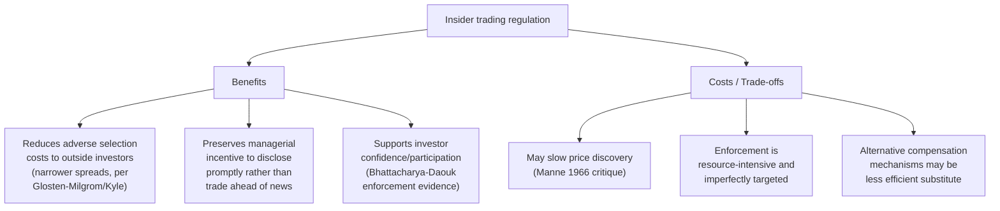

## Insider trading and information disclosure

### Overview and Connection to Market Efficiency

Insider trading and mandatory information disclosure sit at the intersection of market microstructure, corporate finance, and securities regulation, and are directly tied to the **strong-form efficiency** and **rational expectations equilibrium** material covered earlier in this chapter. The empirical rejection of strong-form efficiency (insiders earn abnormal returns on private information) motivates a policy response — disclosure regulation and insider trading law — designed to accelerate the migration of information from the *private* information set (accessible only to insiders) into the *public* information set (accessible to all, and hence the relevant set for semi-strong efficiency). This topic examines both the empirical evidence and the theoretical rationale for regulating information flow in securities markets.

### Legal Definition and Regulatory Framework

**Insider trading** generally refers to trading a company's securities by individuals with access to **material, non-public information (MNPI)** about that company. Legal frameworks vary by jurisdiction, but the U.S. framework (the most heavily studied and litigated) rests on:

- **Securities Exchange Act of 1934, Section 10(b)** and **SEC Rule 10b-5**: prohibit fraud "in connection with the purchase or sale of any security," the primary statutory basis for insider trading liability in the absence of a specific insider-trading statute.
- **The "classical theory"** (established in *SEC v. Texas Gulf Sulphur*, 1968, and *Chiarella v. United States*, 1980): liability attaches to a **corporate insider** (officer, director, employee) who trades on MNPI in breach of a **fiduciary duty** owed to the company's shareholders.
- **The "misappropriation theory"** (established in *United States v. O'Hagan*, 1997): extends liability to **outsiders** (e.g., an investment banker, lawyer, or family member) who trade on MNPI obtained in breach of a duty of trust and confidence owed to the *source* of the information, even absent any fiduciary duty to the company's own shareholders.
- **Section 16(b) "short-swing profit rule"**: requires officers, directors, and >10% shareholders to disgorge any profit from a purchase-and-sale (or sale-and-purchase) of company stock within a six-month window, applied essentially as a strict-liability rule (no proof of actual information use required) — a prophylactic anti-insider-trading measure distinct from Rule 10b-5 fraud liability.
- **Mandatory reporting**: insiders must publicly report their trades (Form 4 filings with the SEC in the U.S., typically within two business days of the transaction), creating the disclosed insider-trading data used extensively in academic research.

**Key Points**

- Legal insider trading (trading by insiders that **complies** with disclosure and timing rules, e.g., is not based on MNPI, or is executed under a pre-arranged **Rule 10b5-1 trading plan** established before possessing MNPI) is legal and common; "insider trading" as a violation specifically requires trading *on the basis of* material non-public information in breach of a duty.
- Regulatory frameworks differ meaningfully across jurisdictions in scope (who counts as an "insider"), the required mental state/knowledge standard, and enforcement intensity — cross-country comparisons (see below) exploit this heterogeneity for empirical identification.

### Theoretical Rationale for Regulating Insider Trading

There is a genuine, unresolved theoretical debate (not merely a settled policy consensus) about whether insider trading should be prohibited at all — this is a useful illustration of how positive (empirical) and normative (welfare) analysis can diverge in financial economics.

**Arguments for prohibiting insider trading**:

- **Fairness/level playing field**: outside investors may rationally withdraw from markets perceived as tilted toward informed insiders, reducing market participation, liquidity, and the cost of capital for firms overall (a market-unraveling argument).
- **Reduced managerial incentives to disclose**: if managers can profit from trading ahead of good/bad news, they may have reduced incentive to disclose that news promptly (or may even have an incentive to *delay* disclosure to maximize personal trading profit) — a direct conflict between insider incentives and efficient information dissemination.
- **Adverse selection costs to market makers/liquidity providers**: informed insider trading widens effective bid-ask spreads (per the **Glosten-Milgrom / Kyle** market-microstructure framework — see below), imposing a cost borne by all liquidity-demanding traders, not just those directly trading against the insider.

**Arguments in favor of permitting (or being more permissive about) insider trading** (associated originally with **Manne 1966**, *Insider Trading and the Stock Market*):

- **Faster price discovery**: insider trading is a *mechanism* by which private information gets impounded into price — restricting it may slow the very information-aggregation process that makes markets informative (directly connecting to the Grossman-Stiglitz logic: someone must trade on private information for prices to reflect it).
- **Efficient managerial compensation**: permitting insiders to trade on their own private assessment of firm value could function as a **low-cost compensation mechanism**, aligning managerial incentives with long-run firm value without requiring costly explicit contracting.
- **Difficulty and cost of enforcement**: detecting and prosecuting insider trading is resource-intensive, and the deterrence value of the prohibition must be weighed against enforcement costs and the risk of chilling legitimate informed trading by analysts and other market participants.

**Key Points**

- [Inference] While regulatory practice worldwide has settled overwhelmingly on prohibition (virtually all developed securities markets now have some form of insider trading law), the *theoretical* welfare case is not as unambiguous as the near-universal regulatory consensus might suggest, and this tension (Manne's efficiency argument vs. the fairness/disclosure-incentive counterarguments) remains a standard topic of debate in law-and-economics and financial-regulation coursework, rather than a fully settled question in the economics literature.

### Empirical Evidence on Insider Trading Profitability

**Foundational studies**:

- **Jaffe (1974)**: one of the first systematic studies using SEC-reported insider transactions, finding that portfolios mimicking heavy insider buying activity earned statistically significant abnormal returns over subsequent months — direct evidence against strong-form efficiency, since this used *publicly reported* (lagged) insider-trading data, meaning even *outside investors* mimicking disclosed insider trades could earn abnormal returns, a stronger and more policy-relevant finding than merely showing insiders themselves profit.
- **Seyhun (1986, 1998)**: extensive follow-up work confirming and refining these findings — insider purchases predict positive abnormal returns, insider sales predict (weaker, but still detectable) negative abnormal returns, with the purchase-signal generally found to be more informative than the sale-signal (since insiders sell for many liquidity/diversification reasons unrelated to negative information, diluting the average informativeness of a sale signal relative to a purchase signal, which is less likely to have a similarly large "noise" component of routine, uninformative trading).
- **Lakonishok-Lee (2001)**: find that insider trading is more predictive of *future returns* for **smaller firms** (where information asymmetry between insiders and outsiders is presumably larger, and analyst/media coverage is thinner) than for large firms, and finds aggregate insider trading has some predictive power even for market-wide (not just firm-specific) returns.

**Cross-country evidence on enforcement**:

- **Bhattacharya-Daouk (2002)**: exploit the fact that the *existence* of insider trading laws on the books is not the same as *enforcement* — many countries adopted insider trading laws but did not bring the first enforcement action for years or decades afterward. Comparing the cost of equity capital before and after the **first enforcement** (not merely the first law) in a country, they find the cost of equity capital declines significantly following first enforcement, but find **no significant effect from the mere existence of an unenforced law** — a striking result suggesting that *credible enforcement*, not just legal prohibition on paper, is what generates the posited investor-confidence/market-participation benefits.

**Key Points**

- The persistence and consistency of insider-profitability findings across many decades, countries, and methodologies is regarded as among the most robust anomalies in the empirical asset pricing literature — considerably more robust and less contested than many of the semi-strong-form anomalies (value, momentum) discussed elsewhere in this chapter, precisely because there is a clear, uncontroversial theoretical reason (genuine information advantage) rather than an ambiguous risk-vs-behavioral interpretive divide.
- This relative lack of joint-hypothesis ambiguity (few researchers seriously propose that insider purchase profitability reflects a "risk factor" insiders are compensated for bearing) is itself informative — it illustrates that when a plausible informational-advantage channel is directly present and independently verifiable (insiders demonstrably possess private information by virtue of their corporate role), the joint hypothesis problem is far less severe than in anomalies where the source of any informational or behavioral edge is not independently observable.

### Market Microstructure Perspective: How Insider Trading Affects Prices and Liquidity

**Glosten-Milgrom (1985)** and **Kyle (1985)** provide the foundational market-microstructure models of how the *presence* of informed (potentially insider) traders affects market prices and liquidity, connecting directly to the rational expectations equilibrium material:

- **Glosten-Milgrom sequential-trade model**: a monopolistic, risk-neutral, competitive market maker sets bid and ask prices to break even *on average* against an unknown mix of informed and uninformed ("noise") traders arriving sequentially. Because the market maker cannot distinguish an informed trader's order from a noise trader's order, they must set a **bid-ask spread** wide enough to compensate for expected losses to informed traders (adverse selection), with the losses to informed trading effectively cross-subsidized by profits earned from uninformed order flow.
- **Kyle (1985) model**: a single risk-neutral, monopolistic informed trader strategically manages the *size* of their trades to maximize profit while minimizing price impact, trading against noise traders and a competitive, risk-neutral market maker who sets price as a linear function of aggregate (informed + noise) order flow. Kyle's **"lambda" ($\lambda$)**, the price-impact coefficient, is the standard theoretical measure of market illiquidity/adverse-selection cost in the market microstructure literature, and is directly increasing in the amount of informed trading relative to noise trading.

**Key Points**

- Both frameworks formalize the same core empirical implication: markets with more (or more advantaged) informed/insider trading exhibit **wider bid-ask spreads** and **greater price impact**, imposing a measurable liquidity cost on all other market participants — this is the direct microstructure channel through which insider trading, even when perfectly legal and undetected, imposes costs beyond the insider's direct trading counterparty.
- This connects the insider trading topic to the broader **rational expectations equilibrium** framework covered earlier: Kyle's model is essentially a strategic, finite-trader analog of the competitive noisy-REE setting (Grossman-Stiglitz), with the key difference that the informed trader in Kyle internalizes their own price impact (strategic behavior) rather than acting as an atomistic price-taker.

### Diagram: Information Flow and Disclosure Regulation (svg_diagram)

<svg xmlns="http://www.w3.org/2000/svg" viewBox="0 0 740 360">
<text x="370" y="24" text-anchor="middle" font-size="16" font-weight="bold" fill="#1a1a2e">Disclosure Regulation and Information Sets (svg_diagram)</text>
<rect x="30" y="60" width="220" height="90" rx="8" fill="#fed7d7" stroke="#c53030" stroke-width="2" />
<text x="140" y="90" text-anchor="middle" font-size="13" font-weight="bold">Private information</text>
<text x="140" y="108" text-anchor="middle" font-size="11">(insiders only)</text>
<text x="140" y="126" text-anchor="middle" font-size="11">MNPI, pre-disclosure</text>
<line x1="250" y1="105" x2="360" y2="105" stroke="#4a5568" stroke-width="2" marker-end="url(#a6)" />
<text x="305" y="90" text-anchor="middle" font-size="10">Mandatory disclosure</text>
<text x="305" y="130" text-anchor="middle" font-size="10">(10-K, 10-Q, Reg FD, 8-K)</text>
<rect x="370" y="60" width="220" height="90" rx="8" fill="#c6f6d5" stroke="#2f855a" stroke-width="2" />
<text x="480" y="90" text-anchor="middle" font-size="13" font-weight="bold">Public information</text>
<text x="480" y="108" text-anchor="middle" font-size="11">(everyone; semi-strong</text>
<text x="480" y="126" text-anchor="middle" font-size="11">efficiency information set)</text>
<line x1="140" y1="150" x2="140" y2="210" stroke="#4a5568" stroke-width="2" marker-end="url(#a6)" />
<rect x="30" y="220" width="220" height="90" rx="8" fill="#bee3f8" stroke="#2b6cb0" stroke-width="2" />
<text x="140" y="250" text-anchor="middle" font-size="13" font-weight="bold">Insider trading law</text>
<text x="140" y="268" text-anchor="middle" font-size="11">restricts trading on</text>
<text x="140" y="286" text-anchor="middle" font-size="11">the un-disclosed portion</text>
<line x1="480" y1="150" x2="480" y2="210" stroke="#4a5568" stroke-width="2" marker-end="url(#a6)" />
<rect x="370" y="220" width="220" height="90" rx="8" fill="#fefcbf" stroke="#b7791f" stroke-width="2" />
<text x="480" y="250" text-anchor="middle" font-size="13" font-weight="bold">Event studies measure</text>
<text x="480" y="268" text-anchor="middle" font-size="11">speed/completeness of</text>
<text x="480" y="286" text-anchor="middle" font-size="11">price reaction to disclosure</text>

<text x="60" y="340" font-size="11" fill="`#4a5568`">Regulation FD (2000): prohibits selective disclosure — must disclose to all investors simultaneously</text>

</svg>

### Mandatory Disclosure Regulation

**Rationale**: mandatory disclosure requirements are the complementary regulatory tool to insider trading prohibitions — rather than (only) *restricting* trading on private information, disclosure rules aim to *shrink* the private information set itself by compelling firms to make information public promptly and broadly.

**Key U.S. disclosure regime components**:

- **Periodic disclosure**: **10-K** (annual report) and **10-Q** (quarterly report) filings, standardizing and mandating the frequency/content of financial disclosure to reduce information asymmetry between managers and outside investors.
- **Event-driven disclosure**: **Form 8-K**, requiring prompt disclosure of specified material corporate events (e.g., leadership changes, bankruptcy, material agreements) within a short window (typically four business days) of occurrence, rather than waiting for the next periodic filing.
- **Regulation Fair Disclosure (Reg FD, 2000)**: prohibits **selective disclosure** — if a company discloses material information to any market participant (e.g., a sell-side analyst or large institutional investor) in a non-public setting, it must simultaneously (or promptly) disclose the same information broadly to the public. Reg FD was a direct regulatory response to the perceived unfairness (and strong-form-efficiency-relevant informational advantage) of selective analyst briefings.
- [Inference] The empirical literature on **Reg FD's effects** is mixed: some studies find reduced information asymmetry and reduced analyst forecast dispersion post-Reg FD, while others find evidence of reduced overall information flow to the market (firms disclosing less overall to avoid the compliance burden/legal risk of selective disclosure), an ambiguity that is itself informative about the difficulty of designing disclosure regulation that unambiguously improves information aggregation without unintended side effects on the *quantity* of information firms choose to produce and share.

### Diagram: Insider Trading Regulation Trade-offs

### Comparison Table: Classical vs. Misappropriation Theory (U.S. Law)

| Feature | Classical Theory | Misappropriation Theory |
| --- | --- | --- |
| Established by | *Chiarella v. United States* (1980) | *United States v. O'Hagan* (1997) |
| Who can be liable | Corporate insiders (officers, directors, employees) | Outsiders (e.g., lawyers, bankers) who breach a duty to the *source* of information |
| Duty breached | Fiduciary duty to the company's own shareholders | Duty of trust/confidence to the information source (not necessarily the traded company's shareholders) |
| Typical fact pattern | CEO trades on undisclosed merger news before announcement | Lawyer trades on client's confidential acquisition plans for a *different* company's stock |

### Applications and Ongoing Research Directions

- **Regulatory design and enforcement resource allocation**: the Bhattacharya-Daouk (2002) finding that *enforcement*, not mere legal existence, drives market benefits directly informs how securities regulators (e.g., SEC, and international counterparts via IOSCO cooperation) prioritize enforcement resources and communicate credible deterrence.
- **Compliance and corporate governance**: the design of **Rule 10b5-1 trading plans** (pre-committed trading schedules established before possessing MNPI, intended to provide a legal safe harbor for insiders who wish to trade on a schedule) is an active area of both academic study and regulatory reform (the SEC tightened 10b5-1 plan rules in 2022–2023 in response to evidence that some plans were being used opportunistically around the edges of the safe harbor).
- **Cryptocurrency and digital asset markets**: the application (or non-application) of traditional insider trading law to digital asset markets — which often lack a clear "issuer" with fiduciary-duty-bearing insiders in the traditional corporate sense — is a live and unsettled area of securities-law and market-design research, given the sharply different institutional structure (no traditional board/officer relationship in many decentralized protocols) despite analogous information-asymmetry concerns arising in practice.
- **Machine learning and alternative data**: analogous informational-advantage debates now extend to firms using satellite imagery, credit-card transaction data, and web-scraping to gain trading edges on material information *before* it becomes conventionally "public" — raising a live definitional question about where "legitimate diligent research" ends and where quasi-insider-trading-like informational advantages begin, an area of ongoing legal and regulatory ambiguity as of this writing. [Unverified] Specific current enforcement posture or case law on this exact question is evolving and should be verified against current regulatory guidance if directly relevant to a live compliance question.

**Related Topics**

- Weak, semi-strong, and strong-form market efficiency
- Rational expectations equilibrium and the Grossman-Stiglitz paradox
- Kyle (1985) strategic informed trading model
- Glosten-Milgrom sequential trade and adverse selection
- Event study methodology and disclosure-reaction measurement
- Regulation Fair Disclosure and selective disclosure prohibition
- Market microstructure: bid-ask spreads and price impact
- Corporate governance and executive compensation design
- Fraud-on-the-market doctrine in securities litigation
- Cross-country securities law enforcement and cost of capital