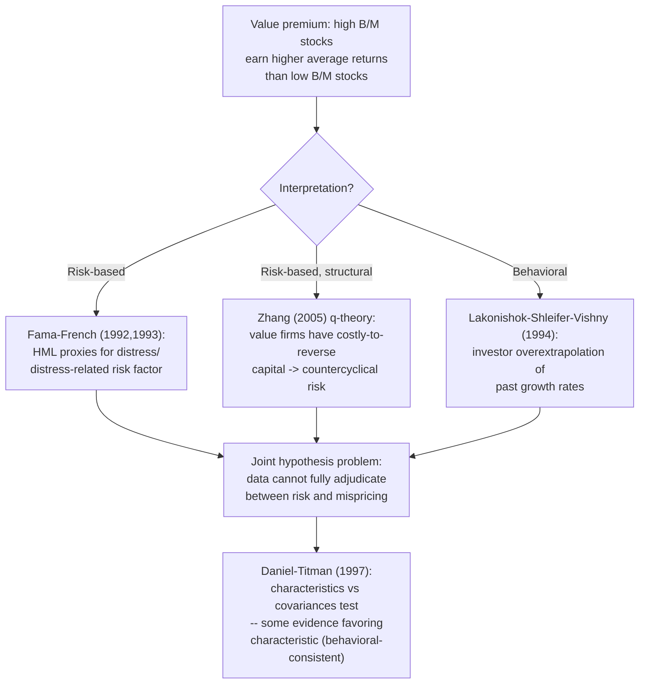

## The value and growth anomaly

### Definition and Empirical Regularity

The value/growth anomaly refers to the persistent empirical finding that stocks with **high ratios of fundamental accounting measures to market price** ("value" stocks) earn higher average returns than stocks with **low such ratios** ("growth" stocks), a pattern that is difficult to fully rationalize within the single-factor Capital Asset Pricing Model (CAPM). The most commonly used value metric is the **book-to-market ratio** ($B/M$, book value of equity divided by market capitalization), though earnings-to-price ($E/P$), cash-flow-to-price ($CF/P$), and dividend yield are also used as related value proxies.

**Basu (1977)** provided early evidence that low price-earnings (high $E/P$) stocks earned higher risk-adjusted returns than high $P/E$ stocks. **Fama and French (1992)**, in their influential cross-sectional regression study of U.S. stock returns from 1963–1990, found that **book-to-market equity and firm size** together largely subsumed the explanatory power of market beta for the cross-section of average returns — a finding widely interpreted as a serious challenge to the CAPM's adequacy as a complete asset-pricing model.

### Measuring the Value Premium

**Portfolio sort methodology**: the standard approach (Fama-French 1992, 1993) sorts stocks into portfolios (commonly deciles or quintiles) based on $B/M$ at the end of June each year, using the prior fiscal year-end book value and market value at that sorting date (with a lag to ensure the book-value data was plausibly public/available), then tracks subsequent monthly returns of each portfolio for one year before re-sorting.

**Value premium** is measured as the average return spread between the high-$B/M$ (value) and low-$B/M$ (growth) portfolios, often via a long-short zero-cost factor portfolio, the **HML (High Minus Low)** factor of the **Fama-French three-factor model**:

$$HML_t = \frac{1}{2}(\text{Small Value}_t + \text{Big Value}_t) - \frac{1}{2}(\text{Small Growth}_t + \text{Big Growth}_t)$$

constructed as a $2\times3$ sort on size and book-to-market to isolate the value effect independent of the size effect (since size and value are correlated but conceptually distinct sources of return variation).

**Fama-French three-factor model**:

$$r_{i,t} - r_{f,t} = \alpha_i + \beta_i(r_{m,t}-r_{f,t}) + s_i\, SMB_t + h_i\, HML_t + \varepsilon_{i,t}$$

A stock's loading $h_i$ on $HML$ captures its "value tilt": value stocks typically have $h_i > 0$, growth stocks $h_i < 0$.

**Key Points**

- The value premium has historically been economically large: Fama-French (1992, 1993) and numerous subsequent studies document average annualized $HML$ returns in the range of several percentage points over multi-decade U.S. samples, though the *precise* magnitude is sample-period- and construction-methodology-dependent, and (as discussed below) the premium has been notably weaker/more volatile in more recent decades.
- The value premium is documented not only in U.S. equities but across **international equity markets** (Fama-French 1998, 2012) and in other asset classes (value effects have been documented in currencies, commodities, and government bonds — see Asness-Moskowitz-Pedersen 2013 "Value and Momentum Everywhere"), lending support to the premium being a pervasive, cross-asset-class phenomenon rather than a U.S.-equity-specific quirk.

### Diagram: Value Premium Construction (svg_diagram)

<svg xmlns="http://www.w3.org/2000/svg" viewBox="0 0 720 340">
<text x="360" y="24" text-anchor="middle" font-size="16" font-weight="bold" fill="#1a1a2e">HML Factor Construction (svg_diagram)</text>
<rect x="40" y="60" width="280" height="80" rx="8" fill="#c6f6d5" stroke="#2f855a" stroke-width="2" />
<text x="180" y="90" text-anchor="middle" font-size="13" font-weight="bold">High B/M (Value)</text>
<text x="180" y="108" text-anchor="middle" font-size="11">Small Value + Big Value</text>
<text x="180" y="124" text-anchor="middle" font-size="11">portfolios, averaged</text>
<rect x="400" y="60" width="280" height="80" rx="8" fill="#fed7d7" stroke="#c53030" stroke-width="2" />
<text x="540" y="90" text-anchor="middle" font-size="13" font-weight="bold">Low B/M (Growth)</text>
<text x="540" y="108" text-anchor="middle" font-size="11">Small Growth + Big Growth</text>
<text x="540" y="124" text-anchor="middle" font-size="11">portfolios, averaged</text>

<text x="360" y="175" text-anchor="middle" font-size="14" font-weight="bold">minus</text>

<line x1="180" y1="140" x2="360" y2="200" stroke="#4a5568" stroke-width="2" />
<line x1="540" y1="140" x2="360" y2="200" stroke="#4a5568" stroke-width="2" />
<rect x="230" y="210" width="260" height="70" rx="8" fill="#fefcbf" stroke="#b7791f" stroke-width="2" />
<text x="360" y="240" text-anchor="middle" font-size="13" font-weight="bold">HML factor return</text>
<text x="360" y="258" text-anchor="middle" font-size="11">(zero-cost, long-short portfolio)</text>

<text x="60" y="320" font-size="11" fill="`#4a5568`">2×3 sort on size and B/M controls for the independent size effect</text>

</svg>

### Competing Interpretations: Risk-Based vs. Behavioral

This anomaly is the canonical illustration of the **joint hypothesis problem**: the identical empirical fact (value stocks earn higher average returns) supports two well-developed, mutually opposed theoretical camps.

**Risk-Based Interpretation (Fama-French, 1992, 1993, 1996)**

Fama and French interpret $HML$ as a proxy for a priced risk factor, most commonly associated with **financial distress risk / relative distress**:

- High $B/M$ firms tend to be those the market has priced down relative to book value — often firms with **poor recent earnings prospects, higher leverage, or financial distress**, and hence higher exposure to a broad, systematic "distress" risk factor that is compensated in equilibrium.
- Under this view, HML is a legitimate additional risk factor (alongside the market factor) needed to correctly specify $H_2$ (the equilibrium expected-return model) — the anomaly relative to CAPM reflects **CAPM misspecification** (an omitted risk factor), not market inefficiency.
- **Key supporting evidence cited**: value stocks show higher sensitivity to bad economic-state variables (e.g., recessions, tightening credit conditions) in some specifications; the value premium has a plausible theoretical grounding in models linking it to firms' relative ability to disinvest/reduce capital in downturns (production-based asset pricing models — Zhang 2005 "value premium" model based on costly reversibility of capital and countercyclical price of risk).

**Behavioral Interpretation (Lakonishok-Shleifer-Vishny, 1994; "LSV")**

LSV argue the value premium reflects **investor overextrapolation**, not compensation for risk:

- Investors systematically **extrapolate** past growth rates too far into the future — chasing "glamour" (growth) stocks with strong recent earnings/sales growth, bidding their prices up beyond what future fundamentals justify, while excessively shunning "value" stocks with poor recent performance, pushing their prices below intrinsic value.
- When actual future growth reverts toward the mean (as growth rates empirically do, per well-documented mean-reversion in corporate earnings growth), glamour stocks disappoint relative to their previously inflated expectations, and value stocks outperform relative to their previously depressed expectations — generating the value premium as a **correction of prior investor overreaction**, not compensation for bearing extra systematic risk.
- **Key supporting evidence cited**: LSV find that value stocks do *not* appear riskier by standard measures during actual bad economic times (e.g., they do not underperform disproportionately during the worst market downturns in their sample, which would be expected if value were compensating for a genuine "bad-times" risk premium) — though this specific empirical claim has been contested and re-examined by subsequent risk-based researchers using different downturn definitions and samples.

**Key Points**

- [Inference] As with several anomalies discussed in this chapter's coverage of the joint hypothesis problem, no single decisive test has settled this debate; the profession broadly continues to be divided, with the risk-based camp (Fama-French tradition) and behavioral camp (LSV/Lakonishok tradition, and subsequent extensions like Daniel-Titman 1997 "characteristics vs. covariances") each maintaining active, evolving research programs rather than one having been empirically falsified.
- **Daniel-Titman (1997)** provide a particularly sharp test: they examine whether it is a stock's **loading (covariance) on HML** or its **raw characteristic (book-to-market itself)** that predicts returns, finding evidence that the *characteristic* has explanatory power **even after controlling for the loading** — a finding difficult to reconcile with a pure risk-based (covariance-based) interpretation, since a true risk-factor story implies only the *covariance* with the risk factor, not the raw characteristic per se, should matter for expected returns. [Inference] This finding remains debated, and subsequent literature has offered risk-based rebuttals and alternative test specifications with mixed conclusions.

### Q-Theory / Production-Based Explanation (Risk-Based Extension)

**Zhang (2005)** and related **q-theory of investment** models provide a more structural risk-based account: value firms (low market-to-book) tend to have more **unproductive, hard-to-reverse capital** (costly to disinvest), making them particularly vulnerable in bad economic states when firms would ideally want to shrink capital but cannot easily do so (asymmetric adjustment costs — it is easier to expand than to contract capital). This generates:

- **Countercyclical risk** for value firms specifically: their cash flows/returns become riskier precisely when the price of risk is high (recessions), consistent with a genuine risk-based risk premium.
- Growth firms, by contrast, have more flexibility (unexercised growth options can be abandoned without incurring costly disinvestment), making them comparatively safer in bad times, consistent with lower average returns.

**Key Points**

- This model provides an explicit micro-founded mechanism for *why* book-to-market should proxy for systematic risk exposure, addressing a criticism often leveled at the purely statistical Fama-French factor-model approach (that HML lacks independent theoretical justification beyond "it explains returns," a concern central to the broader factor-zoo critique discussed under the joint hypothesis problem).

### Diagram: Competing Explanations Summary

### Recent Performance and the "Death of Value" Debate

A significant recent development (post-2007, and especially pronounced 2017–2020) is the historically prolonged **underperformance of value relative to growth**, particularly acute during the period of dominant technology/growth-stock outperformance:

- This extended drawdown in the traditional HML factor generated substantial academic and practitioner debate over whether the value premium has **structurally weakened or disappeared** — candidate explanations include: increased intangible-asset intensity in the modern economy (traditional book value, based on historical-cost accounting, may poorly capture the true economic value of intangible-asset-heavy growth firms, mechanically distorting the $B/M$ signal), increased efficiency/arbitrage of the well-known factor by quantitative investors post-publication (a factor-specific instance of the McLean-Pontiff post-publication decay phenomenon discussed under the joint hypothesis problem), or a genuine but temporary cyclical divergence rather than a permanent structural break.
- **Fama-French (2020, "The Value Premium")** revisit U.S. data with a long historical sample and continue to find average value premium evidence, while acknowledging elevated recent volatility and the difficulty of statistically distinguishing a temporary drawdown from a genuine structural change using a limited number of additional years of post-2007 data.
- Some researchers propose adjusted value metrics that **capitalize R&D and other intangible investment** into an adjusted book value, arguing this restores a more robust and economically meaningful value signal for the modern, intangible-intensive economy — an active area of ongoing methodological refinement rather than a settled resolution.

**Key Points**

- [Speculation] Whether the post-2007 value underperformance represents a permanent structural break (driven by the rise of intangible capital or factor crowding) or a long but ultimately mean-reverting cyclical episode remains genuinely unresolved as of the most recent research available in this domain, and reasonable researchers hold different views on the relative likelihood of each explanation.

### Comparison Table: Risk-Based vs. Behavioral Camp

| Feature | Risk-Based (Fama-French, Zhang) | Behavioral (LSV, Daniel-Titman) |
| --- | --- | --- |
| Source of premium | Compensation for exposure to systematic distress/countercyclical risk | Correction of investor overextrapolation/mispricing |
| Role of HML | Legitimate additional risk factor in $H_2$ | Statistical artifact of characteristic-based mispricing |
| Predicted persistence | Should persist as long as the underlying risk exists | May erode as sophisticated capital arbitrages the mispricing (subject to limits to arbitrage) |
| Key supporting evidence | Countercyclical value-firm cash flows/returns; q-theory microfoundation | Characteristics (not just covariances) predict returns (Daniel-Titman); extrapolation evidence from analyst forecasts |
| Implication for factor investing | Value premium is a genuine risk premium, should be expected to persist (compensated risk) | Value premium may be arbitraged away or requires patient, uncrowded capital to exploit |

### Applications in Financial Economics

- **Factor investing / "smart beta" products**: the value factor is one of the most widely commercialized systematic equity factors, embedded in numerous ETFs and quantitative strategies — the risk-vs-behavioral debate has direct practical relevance for whether investors should expect the premium to persist indefinitely (risk-based view) or to be increasingly arbitraged away as more capital chases it (behavioral/crowding view).
- **Corporate finance implications**: if the value premium partly reflects genuine financial-distress risk, this has implications for how firms should think about their **cost of capital** and capital structure decisions, since a firm with characteristics correlated with the value factor faces a higher required return from the market, all else equal.
- **Performance evaluation and manager benchmarking**: institutional investors evaluating "value" fund managers must decide whether observed outperformance/underperformance relative to a growth benchmark reflects genuine skill, exposure to a legitimate (and hence *not* uniquely "skill"-attributable) risk factor, or simple factor-timing luck — directly requiring the same risk-model specification choices discussed under the joint hypothesis problem.

**Related Topics**

- The joint hypothesis problem in empirical asset pricing
- Fama-French three-factor and five-factor models
- Size (small-firm) anomaly and its interaction with value
- Momentum and the underreaction/overreaction debate
- Daniel-Titman characteristics versus covariances test
- Q-theory of investment and production-based asset pricing (Zhang 2005)
- Limits to arbitrage and post-publication factor decay (McLean-Pontiff)
- Intangible capital and modern book-value measurement issues
- Value and momentum across asset classes (Asness-Moskowitz-Pedersen)
- Behavioral finance: extrapolative expectations and investor overreaction