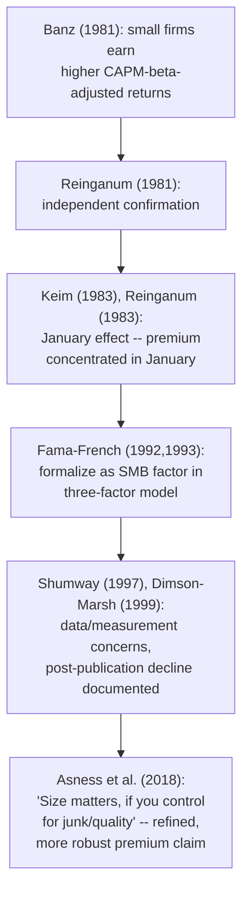

## The size effect

### Definition and Original Discovery

The size effect (also called the "small-firm effect") refers to the empirical finding that small-capitalization stocks historically earn higher average risk-adjusted returns than large-capitalization stocks, a pattern not explained by differences in CAPM market beta alone. It was first documented by **Banz (1981)**, who sorted NYSE stocks into portfolios by market equity (price times shares outstanding) and found that the smallest-decile portfolio earned average returns substantially exceeding what its CAPM beta would predict, with the effect being **nonlinear** — concentrated disproportionately in the very smallest firms rather than being a smooth, monotonic function of size across the full distribution. **Reinganum (1981)** provided independent, contemporaneous confirmation using a related methodology.

### Measuring the Size Premium

**Portfolio sort methodology**: stocks are sorted (typically annually, using market equity measured at a specific date, e.g., end of June) into size deciles or quintiles; the **size premium** is the average return spread between the smallest and largest size portfolios.

**Fama-French SMB (Small Minus Big) factor**: constructed analogously to $HML$, using a $2\times3$ independent sort on size and book-to-market to isolate the size effect from the value effect:

$$SMB_t = \frac{1}{3}(\text{Small Value} + \text{Small Neutral} + \text{Small Growth})_t - \frac{1}{3}(\text{Big Value} + \text{Big Neutral} + \text{Big Growth})_t$$

This factor loading $s_i$ in the **Fama-French three-factor model**:

$$r_{i,t} - r_{f,t} = \alpha_i + \beta_i(r_{m,t}-r_{f,t}) + s_i\, SMB_t + h_i\, HML_t + \varepsilon_{i,t}$$

captures a stock's exposure to the size factor independent of its market beta and value tilt.

### Key Empirical Characteristics

**Concentration in the smallest deciles**: the original Banz finding, and much subsequent work, emphasizes that the size premium is **not linear** across the size distribution — it is driven disproportionately by the very smallest decile (or even smaller sub-deciles) of firms, with comparatively modest differences among the middle and larger size deciles. This concentration in the extreme tail raises measurement and robustness concerns discussed below.

**The January Effect**: **Keim (1983)** and **Reinganum (1983)** documented that a substantial portion of the historical size premium was concentrated in the **month of January**, and especially the first few trading days of January — a striking seasonal pattern. Proposed explanations include:

- **Tax-loss selling**: investors sell losing small-cap positions in December for tax purposes, depressing prices, followed by a rebound in January as this selling pressure abates (Ritter 1988 provides supporting turn-of-the-year evidence linking the pattern to tax-related trading behavior).
- **Institutional "window dressing"**: fund managers sell underperforming (often small-cap) stocks before year-end reporting dates to avoid embarrassment, with a partial reversal in January.

**Key Points**

- The January effect is itself a fascinating **compounded anomaly**: not only does the size premium appear that CAPM cannot explain, but its concentration in a *specific, predictable calendar month* is itself a further and distinct violation of weak-form efficiency (a purely seasonal, calendar-based pattern should be arbitraged away if genuinely both real and economically exploitable), making the size/January effect jointly one of the most scrutinized anomaly complexes in the literature.
- [Inference] Some researchers have proposed that the January effect has weakened or become less economically significant in more recent decades, potentially consistent with either statistical fragility of the original finding or genuine arbitrage-driven erosion once the pattern became widely known (an instance of the McLean-Pontiff post-publication decay phenomenon) — this specific claim about post-discovery weakening should be verified against current-period data if precise, up-to-date magnitude estimates are required.

### Diagram: Size Effect Concentration and January Seasonality (svg_diagram)

<svg xmlns="http://www.w3.org/2000/svg" viewBox="0 0 720 360">
<text x="360" y="24" text-anchor="middle" font-size="16" font-weight="bold" fill="#1a1a2e">Size Effect: Nonlinearity and Seasonality (svg_diagram)</text>
<line x1="70" y1="300" x2="650" y2="300" stroke="#333" stroke-width="1.5" />
<line x1="70" y1="300" x2="70" y2="60" stroke="#333" stroke-width="1.5" />
<text x="360" y="330" text-anchor="middle" font-size="12">Size decile (1 = smallest, 10 = largest)</text>
<text x="30" y="180" text-anchor="middle" font-size="12" transform="rotate(-90 30 180)">Average annual return</text>
<rect x="90" y="90" width="45" height="210" fill="#c53030" />
<rect x="145" y="150" width="45" height="150" fill="#dd6b20" />
<rect x="200" y="185" width="45" height="115" fill="#d69e2e" />
<rect x="255" y="205" width="45" height="95" fill="#b7791f" />
<rect x="310" y="220" width="45" height="80" fill="#68705a" />
<rect x="365" y="230" width="45" height="70" fill="#4a5568" />
<rect x="420" y="240" width="45" height="60" fill="#4a5568" />
<rect x="475" y="248" width="45" height="52" fill="#4a5568" />
<rect x="530" y="255" width="45" height="45" fill="#4a5568" />
<rect x="585" y="262" width="45" height="38" fill="#4a5568" />

<text x="112" y="315" text-anchor="middle" font-size="10">1</text>

<text x="167" y="315" text-anchor="middle" font-size="10">2</text>

<text x="607" y="315" text-anchor="middle" font-size="10">10</text>

<text x="140" y="80" font-size="11" fill="`#c53030`" font-weight="bold">Effect concentrated in smallest deciles</text>

<text x="400" y="90" font-size="11" fill="`#4a5568`">Modest, near-flat differences among larger deciles</text>

</svg>

### Interpretations: Risk, Liquidity, and Measurement Concerns

**Risk-based interpretation**: small firms may carry genuine additional systematic risk not captured by market beta alone — greater sensitivity to credit conditions, more cyclical revenues, thinner access to capital markets during downturns, and higher operating/financial leverage on average — providing a candidate risk-based rationale for a size premium analogous to the distress-risk rationale offered for the value premium.

**Liquidity-based interpretation**: small stocks are generally less liquid (wider bid-ask spreads, higher price impact of trading, lower analyst coverage). Under this view, part or all of the measured size premium may reflect **compensation for illiquidity** (a liquidity risk premium, related to the broader liquidity-asset-pricing literature, e.g., Amihud-Mendelson 1986) rather than a distinct "size" risk factor per se — since size and liquidity are strongly (though not perfectly) correlated, disentangling the two empirically is a persistent methodological challenge.

**Measurement/data concerns — a substantial part of the modern skepticism about the size effect's robustness**:

- **Survivorship and delisting bias**: early studies using CRSP data were later found to have mismeasured returns for delisted small firms in some cases (Shumway 1997 documents systematic biases in how CRSP originally recorded delisting returns, particularly for financially distressed small firms), potentially inflating the measured historical size premium.
- **Bid-ask bounce and microstructure noise**: small, thinly-traded stocks exhibit larger bid-ask bounce effects in recorded transaction prices, which can mechanically inflate measured return volatility and, under certain portfolio-formation and rebalancing timing conventions, bias measured average returns upward.
- **Data-snooping and post-publication decline**: **Dimson-Marsh (1999)** and others document that the size premium's magnitude appears to have **declined substantially, and become far less reliable/statistically robust, in the decades following its original discovery and publication** — a pattern consistent with either (a) the original finding reflecting some combination of the data/measurement issues above rather than a purely robust economic phenomenon, or (b) genuine arbitrage-driven erosion of a real premium once it became widely known and exploited by small-cap-focused investment strategies (again, directly analogous to the McLean-Pontiff post-publication decay framework).

**Key Points**

- [Inference] Among the classic Fama-French-era anomalies, the size effect (independent of value) is generally regarded by much of the subsequent literature as one of the **least robust** in its raw, unconditional form — its apparent strength in the original 1980s samples has not reliably replicated with similar magnitude in later U.S. samples, a pattern that has led some researchers to treat "pure" size (independent of quality, value, or liquidity controls) with meaningfully more skepticism than, for example, the momentum or value effects. This assessment reflects a real and substantive strand of the literature, though it is not a universal consensus and some researchers continue to find size-related premia under refined specifications.

### The "Size and Value/Quality" Refinement: Asness et al. (2018)

A significant refinement, associated with **Asness, Frazzini, Israel, Moskowitz, and Pedersen (2018), "Size Matters, If You Control Your Junk"**, argues that the weak/unreliable raw size effect masks a genuine, robust premium once **quality/junk characteristics are controlled for**:

- They find that small-cap stocks are, on average, of systematically **lower quality** (more speculative, less profitable, more distressed "junk") than large-cap stocks in typical samples, and that this quality difference *masks* an otherwise robust size premium — i.e., naive small-minus-big comparisons implicitly compare a size effect **contaminated by** a negative junk/quality tilt in the small-cap portfolio.
- After controlling for quality (e.g., using a quality-adjusted size sort, or examining size premia within quality-matched subsamples), they report a considerably more robust and statistically significant size premium across international samples and longer historical periods.

**Key Points**

- [Inference] This finding, while influential, has itself been subject to further scrutiny and replication attempts common to essentially all factor-related claims in this active research area; it represents a meaningful and well-regarded refinement of the size-effect literature rather than a fully unchallenged final resolution, consistent with the broader pattern (per the joint hypothesis problem and factor-zoo discussions elsewhere in this syllabus) that anomaly-related claims in empirical asset pricing are rarely definitively "closed."

### Diagram: Evolution of the Size Effect Literature

### Comparison Table: Size Effect vs. Value Effect Robustness

| Feature | Size Effect (raw SMB) | Value Effect (HML) |
| --- | --- | --- |
| Original discovery | Banz (1981) | Basu (1977); Fama-French (1992) |
| Concentration pattern | Heavily concentrated in extreme small-cap tail; January seasonality | More broadly distributed across the B/M distribution |
| Post-publication robustness | Weakened substantially in later samples; contested | Also weakened post-2007 but with continued broad international/cross-asset support |
| Leading refinement | Quality/junk-adjusted size (Asness et al. 2018) | Intangible-capital-adjusted book value measures |
| General consensus on robustness | More contested; often regarded as among the weaker classic anomalies in raw form | More broadly accepted as a persistent (if recently weaker) pattern, though interpretation (risk vs. behavioral) remains disputed |

### Applications in Financial Economics

- **Factor investing**: despite the size effect's documented fragility, "small-cap" and "small-cap value" remain widely offered systematic investment style categories in index funds, ETFs, and institutional mandates — the Asness et al. quality-adjustment refinement has directly influenced the design of more recent "quality-small-cap" or "small-cap without junk" systematic strategies.
- **Cost of capital estimation**: some practitioner cost-of-capital methodologies (e.g., certain build-up approaches used in corporate valuation and private-equity/venture-capital contexts) historically incorporated an explicit "small-stock premium" adjustment derived from the size-effect literature — a practice that has become more contested as academic confidence in the raw, unconditional size premium has declined, illustrating a case where practitioner methodology can lag behind evolving academic consensus.
- **IPO and small-firm financing research**: the size effect intersects with the broader literature on long-run IPO underperformance and small-firm financing frictions, since newly public and small firms share many of the same liquidity, coverage, and distress-risk characteristics implicated in size-effect explanations.

**Related Topics**

- The value/growth anomaly and Fama-French three-factor model
- The joint hypothesis problem in empirical asset pricing
- January effect and calendar-based return anomalies
- Liquidity risk and the Amihud-Mendelson illiquidity premium
- Survivorship bias and delisting-return measurement (Shumway 1997)
- Quality and "junk" factors in equity investing (Asness et al. 2018)
- Momentum and long-horizon reversal anomalies
- Factor investing, smart beta, and post-publication decay (McLean-Pontiff)
- Long-run IPO underperformance and small-firm financing frictions
- Data-snooping bias and the "factor zoo" critique