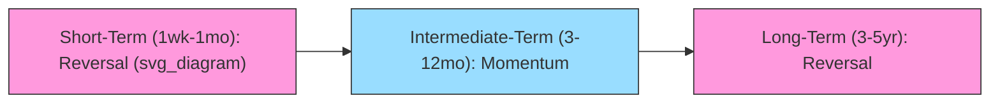

## Momentum and Long-Term Reversal

### Overview

Momentum and long-term reversal are two of the most robust cross-sectional return anomalies in empirical asset pricing. Both describe how past returns predict future returns, but over opposite horizons and in opposite directions:

- **Momentum**: stocks that have performed well (poorly) over the past 3–12 months continue to perform well (poorly) over the subsequent 3–12 months.
- **Long-term reversal**: stocks that have performed well (poorly) over the past 3–5 years tend to underperform (outperform) over the subsequent 3–5 years.

Together they form a puzzle for the Efficient Market Hypothesis (EMH), since both patterns imply that past prices contain information not fully reflected in current prices — a direct challenge to weak-form efficiency.

### Historical Discovery

**Long-term reversal** was documented first, by De Bondt and Thaler (1985), who found that portfolios of extreme past losers ("losers") over 3–5 years subsequently outperformed extreme past winners ("winners") by economically large margins over the following 3–5 years.

**Momentum** was documented later by Jegadeesh and Titman (1993), who found the opposite pattern at intermediate horizons: past winners over 3–12 months continued to outperform past losers over the next 3–12 months.

The coexistence of these findings — reversal at long horizons, momentum at intermediate horizons — became one of the central puzzles motivating behavioral finance as an alternative to purely rational asset pricing.

### Momentum Strategy Construction

**Formation and Holding Periods**

The canonical Jegadeesh-Titman (JT) strategy uses a $J \times K$ design:

- **Formation period ($J$)**: rank stocks by cumulative return over the past $J$ months (commonly 3, 6, 9, or 12 months).
- **Holding period ($K$)**: hold the resulting portfolio for the next $K$ months (commonly 3, 6, 9, or 12 months).

A common implementation is **12-month formation, 1-month skip, 1-month holding (12-1-1)**, or more generally **($J$, skip, $K$)**.

**Skip Month**

A one-month gap is typically inserted between formation and holding periods to avoid **bid-ask bounce** and **short-term reversal** contamination, both of which are microstructure-driven effects that would otherwise attenuate or distort the momentum signal.

**Portfolio Formation**

1. At each month $t$, compute each stock's cumulative return over months $t-J$ to $t-1$ (excluding the skip month if used).
2. Sort stocks into deciles (or terciles/quintiles) based on this ranking.
3. Go long the top decile ("winners") and short the bottom decile ("losers").
4. Hold for $K$ months, often using **overlapping portfolios**: at any given month, the portfolio held is an equal-weighted average of $K$ separate sub-portfolios formed in each of the prior $K$ months, which smooths turnover and reduces the influence of any single formation date.

**Momentum Return Definition**

$$R_{WML,t} = R_{Winner,t} - R_{Loser,t}$$

This is the **Winners-Minus-Losers (WML)** or **Up-Minus-Down (UMD)** factor return, later formalized in the Carhart (1997) four-factor model as the momentum factor (MOM).

### Long-Term Reversal Strategy Construction

**Formation and Holding Periods**

The De Bondt-Thaler (DT) design typically uses:

- **Formation period**: 36–60 months (3–5 years) of past cumulative return.
- **Holding period**: 36–60 months (3–5 years) forward.

**Portfolio Formation**

1. Rank stocks by cumulative return over the past 36–60 months.
2. Form winner and loser deciles (or top/bottom 35% in the original DT study).
3. Go long losers and short winners (opposite sign convention to momentum).
4. Hold for the long formation-equivalent horizon, often with minimal rebalancing given the long holding period.

**Long-Term Reversal Return Definition**

$$R_{LTR,t} = R_{Loser,t} - R_{Winner,t}$$

### Key Empirical Regularities

**Key Points**

- Momentum profits are strongest at 3–12 month horizons; they attenuate and reverse beyond ~12 months.
- Long-term reversal profits emerge at horizons of 3+ years and are strongest for extreme past losers.
- Momentum is found across nearly all major equity markets, asset classes (commodities, currencies, bonds, international equities), and time periods, though with `some` variation in magnitude — a pattern generally cited as evidence against explanations based on data-mining alone. [Inference: cross-asset universality is an empirical observation subject to ongoing debate regarding data-snooping and regime dependence.]
- Momentum profits are asymmetric: loser-side underperformance often contributes more to momentum profit persistence than winner-side outperformance, and momentum is subject to sharp, infrequent **momentum crashes**, notably during market rebounds following steep downturns (e.g., 2009).
- Long-term reversal profits are concentrated in loser stocks and are related to size effects, since past extreme losers tend to be smaller, more volatile, and more likely to have experienced financial distress.

### The Momentum-Reversal Term Structure

A useful way to conceptualize the phenomenon is as a single term structure of return autocorrelation across horizons:

| Horizon | Pattern | Typical Explanation |
| --- | --- | --- |
| 1 week – 1 month | Short-term reversal | Bid-ask bounce, liquidity provision, overreaction to firm-specific news |
| 3–12 months | Momentum | Underreaction to information, slow diffusion of news |
| 3–5 years | Long-term reversal | Overreaction correction, extrapolative bias unwinding |

### Behavioral Explanations

**Underreaction Models (Momentum)**

- **Barberis, Shleifer, and Vishny (1998, BSV)**: investors exhibit conservatism bias, underweighting new information relative to priors, causing prices to adjust slowly to news — generating short/intermediate-term momentum, followed by eventual correction (long-term reversal) once the full information is incorporated.
- **Hong and Stein (1999)**: two investor types — "newswatchers" who trade on private fundamental signals but ignore price history, and "momentum traders" who condition only on past price changes — interact such that information diffuses gradually across the newswatcher population, producing momentum, while momentum traders' trend-chasing behavior eventually overshoots fundamentals, generating reversal.

**Overreaction Models (Long-Term Reversal)**

- **De Bondt and Thaler (1985)** attribute long-term reversal to investor overreaction: extreme price movements over long horizons reflect excessive optimism or pessimism that is subsequently corrected as fundamentals reassert themselves.
- **Daniel, Hirshleifer, and Subrahmanyam (1998, DHS)**: investor overconfidence in private signals, combined with biased self-attribution (confidence rises after confirming public news but doesn't fall symmetrically after disconfirming news), generates short-run continuation (momentum) followed by long-run correction (reversal) as overconfidence unwinds.

### Risk-Based Explanations

- **Conditional CAPM / time-varying risk**: momentum profits may partly reflect compensation for time-varying exposure to systematic risk factors, since winner and loser portfolios can have different (and shifting) betas.
- **Macroeconomic risk**: some studies link momentum profits to exposure to unexpected changes in economic state variables (e.g., industrial production, credit conditions).
- **Liquidity risk**: momentum returns have been linked to exposure to aggregate liquidity shocks, with momentum portfolios suffering during liquidity crises. [Inference: the strength of this channel is debated and varies by sample period.]
- Risk-based explanations generally struggle to fully account for the magnitude, sign consistency, and reversal-following-momentum pattern observed empirically, which is why behavioral models remain prominent in this literature. [Unverified: relative explanatory power differs across studies and is not a settled matter.]

### Momentum Crashes

Momentum strategies, while profitable on average, exhibit strongly **negatively skewed** and **fat-tailed** return distributions:

- **Daniel and Moskowitz (2016)** document that momentum crashes occur predominantly during market rebounds following prolonged market declines, when past "losers" (many of which are high-beta, distressed firms) experience sharp rallies while the momentum strategy remains short them.
- These crashes are `panic`-like, clustering in time, and are largely predictable ex-ante using measures of past market volatility and the market's own recent trend, motivating **dynamic/risk-managed momentum** strategies that scale exposure down during high-volatility, post-crash regimes.

### Interaction Between Momentum and Reversal

A key empirical and theoretical link: many models (BSV, Hong-Stein, DHS) treat momentum and long-term reversal as **two phases of the same mispricing cycle** rather than independent phenomena:

1. Information underreaction generates initial underpricing/overpricing (momentum phase).
2. Continued trend-following by naive investors or feedback traders pushes prices beyond fundamental value (overshooting).
3. Eventual correction back toward fundamentals produces long-horizon reversal.

This gives momentum and reversal a natural **term structure of predictability** rather than treating them as unrelated anomalies.

### Fama-French Perspective and Factor Models

- Momentum was **not** included in the original Fama-French three-factor model (1993), largely because Fama and French have historically treated it as harder to rationalize within a risk-based framework than value or size.
- **Carhart (1997)** added momentum (MOM/UMD) as a fourth factor, primarily to explain persistence in mutual fund performance.
- The Fama-French five-factor model (2015) still excludes momentum; the widely used six-factor extension adds momentum to the five factors (market, size, value, profitability, investment).
- Long-term reversal is not part of standard factor models but is studied as a standalone anomaly, often analyzed alongside contrarian and value effects given their conceptual overlap (both are long-horizon, "cheap vs. expensive" or "loser vs. winner" strategies).

### Relation to the Value Effect

Long-term reversal loser portfolios overlap conceptually and empirically with **value stocks** (high book-to-market), since firms with poor multi-year price performance often become statistically cheap on fundamental ratios. This has led researchers to question the degree to which long-term reversal is a distinct anomaly versus a manifestation of the value premium measured differently. [Inference: the exact decomposition of overlap versus distinctiveness varies by sample and methodology across studies.]

### Practical Implementation Considerations

**Key Points**

- **Transaction costs**: momentum strategies have high turnover (monthly rebalancing of overlapping portfolios), making them sensitive to trading costs and price impact, especially in the loser leg (often small, illiquid stocks).
- **Short-selling constraints**: losers in both momentum and reversal strategies are frequently small-cap, high-short-interest, hard-to-borrow stocks, so realized profits from the short leg can be difficult to capture in practice.
- **Skip-month convention**: essential for isolating momentum from microstructure-driven short-term reversal.
- **Volatility scaling**: risk-managed momentum variants scale position sizes inversely to recent realized volatility to mitigate crash risk.
- **Industry-adjusted momentum**: Moskowitz and Grinblatt (1999) show a substantial portion of momentum profits derives from industry-level continuation rather than purely firm-specific momentum, motivating industry-neutral momentum construction in practice.

### Worked Example

**Example**

Suppose at month $t$, a universe of 1,000 stocks is ranked by cumulative return over months $t-12$ to $t-2$ (skipping month $t-1$).

- Decile 10 (winners): average formation-period return of +45%.
- Decile 1 (losers): average formation-period return of −30%.
- Long winners, short losers in equal-weighted decile portfolios, hold 1 month, then re-rank.

If over the holding month the winner decile returns +2.1% and the loser decile returns −0.8%:

$$R_{WML} = 2.1\% - (-0.8\%) = 2.9\%$$

This single-month WML return is one observation in a monthly time series that is then used to estimate average momentum profit, its factor loadings (e.g., via time-series regression on market, size, and value factors), and its statistical significance (typically via Newey-West adjusted $t$-statistics due to overlapping-portfolio autocorrelation).

### Testing Statistical Significance

Because overlapping portfolio holding periods induce serial correlation in monthly WML/LTR returns, standard OLS standard errors understate true sampling variability. Researchers typically use:

- **Newey-West (HAC) standard errors** with lag length approximately equal to $K-1$ (holding period minus one).
- **Bootstrap or block-bootstrap methods** to account for both serial correlation and potential non-normality (fat tails, skewness) in strategy returns.

### Related Topics

- Short-term reversal and microstructure effects (bid-ask bounce, liquidity provision)
- Fama-French three-, five-, and six-factor models
- Carhart four-factor model and momentum in mutual fund performance evaluation
- Post-earnings-announcement drift (PEAD) as a related underreaction anomaly
- Value effect and book-to-market anomaly
- Time-series momentum (trend-following) versus cross-sectional momentum
- Behavioral asset pricing models: BSV, Hong-Stein, DHS, overconfidence models
- Risk-managed and volatility-scaled momentum strategies
- Industry momentum (Moskowitz-Grinblatt)
- 52-week high momentum (George and Hwang)
- Momentum crashes and tail risk management
- International and cross-asset momentum (commodities, currencies, fixed income)