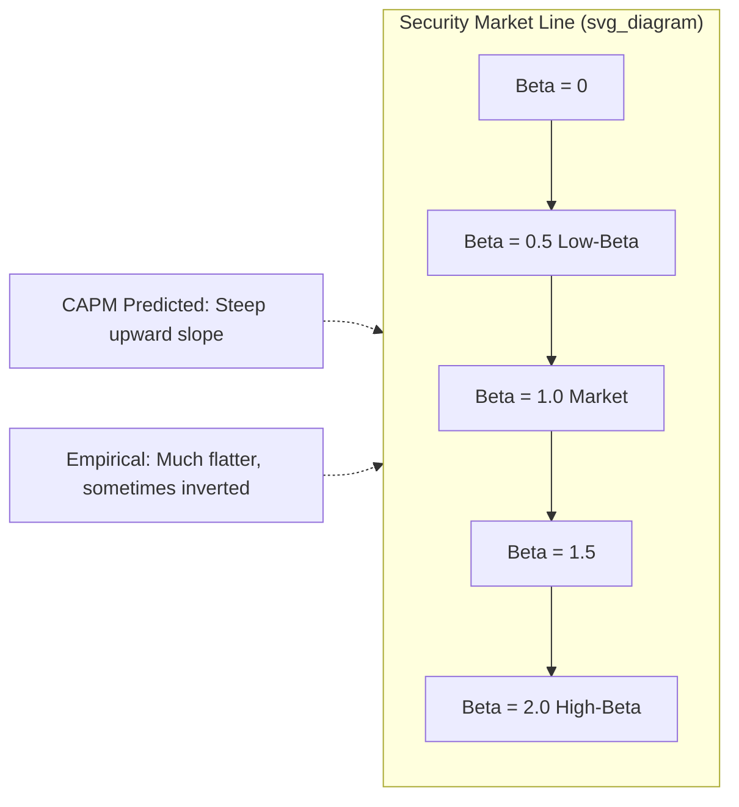

## The Low-Volatility Anomaly

### Overview

The low-volatility anomaly refers to the persistent empirical finding that stocks with lower volatility (or lower beta) tend to earn risk-adjusted returns equal to or higher than stocks with higher volatility (or higher beta), directly contradicting the central prediction of the Capital Asset Pricing Model (CAPM) that expected return should increase monotonically with systematic risk. In its strongest forms, absolute (not just risk-adjusted) returns on low-volatility portfolios have matched or exceeded those of high-volatility portfolios, despite bearing substantially less risk — a pattern sometimes called the "low-volatility puzzle."

### Theoretical Prediction Being Violated

Under the CAPM, expected excess return is a linear, increasing function of beta:

$$E[R_i] - R_f = \beta_i (E[R_m] - R_f)$$

This implies the **Security Market Line (SML)** should slope upward: higher-beta stocks should earn higher expected returns to compensate for bearing more systematic risk. The low-volatility anomaly is the empirical observation that the realized SML is much flatter than predicted, and in many samples, essentially flat or even downward-sloping — high-beta stocks do not deliver commensurately higher returns, and in some periods actually underperform low-beta stocks.

### Historical Discovery

- **Black, Jensen, and Scholes (1972)** were among the first to document that the empirical relationship between beta and average return was flatter than the CAPM predicted.
- **Haugen and Heins (1975)** found that low-variance portfolios had historically produced higher, not just risk-adjusted-equal, average returns than high-variance portfolios over 1926–1971 U.S. data.
- The anomaly was revived and popularized in modern asset pricing by **Ang, Hodrick, Xing, and Zhang (2006, 2009)**, who documented that stocks with high idiosyncratic volatility (relative to the Fama-French three-factor model) earned abnormally low average returns — a finding they termed the **idiosyncratic volatility puzzle**.
- **Frazzini and Pedersen (2014)** formalized a leverage-constraint-based explanation and introduced the **Betting Against Beta (BAB)** factor, which became a standard empirical benchmark for the anomaly.

### Two Related but Distinct Anomalies

**Key Points**

- **Low-beta anomaly**: sorting on **systematic risk** (beta relative to the market) shows a flatter-than-predicted relationship between beta and return.
- **Low-idiosyncratic-volatility anomaly**: sorting on **total or idiosyncratic volatility** (stock-specific risk not explained by factor models) shows that high-idiosyncratic-volatility stocks earn abnormally low returns, even though idiosyncratic risk should, in principle, be diversifiable and unpriced under CAPM/APT logic.

These are related empirically (high-beta stocks tend to also have high idiosyncratic volatility) but are conceptually distinct and are sometimes found to have different drivers.

### Portfolio Construction Methodologies

**Beta-Sorted Portfolios**

1. Estimate rolling beta for each stock (commonly using 12–60 months of past returns via OLS regression against a market index, or using higher-frequency data such as daily returns over 1–5 years).
2. Sort stocks into deciles (or quintiles) by estimated beta.
3. Form value-weighted or equal-weighted portfolios; compute forward returns over the next month (or quarter), then re-rank and rebalance.
4. Compare the Low-Beta-minus-High-Beta (or a long-only low-beta) portfolio's risk-adjusted performance (Sharpe ratio, CAPM alpha) against high-beta deciles.

**Volatility-Sorted Portfolios**

1. Compute either **total volatility** (standard deviation of raw returns) or **idiosyncratic volatility** (standard deviation of residuals from a factor model regression, typically Fama-French three-factor) over a trailing window (e.g., 1 month of daily returns, or 12–60 months of monthly returns).
2. Sort into deciles; form long-short or long-only portfolios analogous to the beta-sort case.

**Betting Against Beta (BAB) Factor**

Frazzini and Pedersen construct a beta-neutral, self-financing portfolio that:

1. Ranks stocks by estimated beta and forms low-beta and high-beta portfolios.
2. **Rescales** each leg to have a beta of exactly 1 using leverage (buying low-beta stocks with borrowed money, i.e., levering up the low-beta leg) or de-leveraging (shorting high-beta stocks and holding cash in the high-beta leg).
3. Goes long the leveraged low-beta portfolio and short the de-leveraged high-beta portfolio, so that the combined position is market-beta-neutral by construction:

$$R_{BAB} = \frac{1}{\beta_L}(R_L - R_f) - \frac{1}{\beta_H}(R_H - R_f)$$

where $\beta_L$ and $\beta_H$ are the betas of the low- and high-beta legs respectively, and $R_L$, $R_H$ are their returns.

### Explanations: Leverage and Funding Constraints

**Frazzini-Pedersen (2014) Leverage Constraint Theory**

The central mechanism: many investors (e.g., mutual funds, pension funds, retail investors) face **leverage constraints** — they cannot borrow freely to scale up low-beta positions to achieve their desired portfolio risk/return level. Instead of borrowing to lever a low-beta portfolio, constrained investors tilt their holdings toward high-beta stocks to achieve higher expected returns without using leverage.

This creates persistent excess demand for high-beta stocks, bidding up their prices and depressing their expected returns relative to CAPM predictions, while low-beta stocks are relatively under-demanded and thus offer higher risk-adjusted (alpha) returns.

**Key implications of this theory:**

- The BAB factor's returns should be related to **funding liquidity conditions** — when funding constraints tighten (e.g., during crises), the anomaly should strengthen. [Inference: empirical support for this time-varying prediction is mixed and depends on sample period and crisis definition.]
- Assets/institutions facing looser leverage constraints (e.g., certain hedge funds) should be natural arbitrageurs of this anomaly, but capital allocated to this strategy has historically been limited relative to its apparent size, consistent with limits to arbitrage.

### Explanations: Behavioral and Preference-Based

- **Lottery preference / demand for skewness (Bali, Cakici, Whitelaw, 2011; Barberis and Huang, 2008)**: many investors have a preference for positively skewed, lottery-like payoffs, and high-volatility/high-beta stocks tend to exhibit more lottery-like return distributions. This excess demand for "lottery stocks" bids up their prices, lowering subsequent expected returns.
- **Benchmarking and delegated portfolio management**: institutional managers evaluated relative to a benchmark index (e.g., tracking error minimization) have an incentive to hold higher-beta stocks to maximize the probability of outperforming the benchmark in rising markets, since compensation is often asymmetric (rewarded for outperformance, less penalized for matching or slightly missing on the downside) — this analyst/agency-based demand tilts capital toward high-beta names.
- **Analyst optimism / representativeness bias**: investors may overextrapolate recent strong performance of high-volatility "growth" or "story" stocks, leading to systematic overpricing.
- **Overconfidence**: investors overconfident in private information may gravitate toward high-volatility stocks where mispricing (and thus perceived profit opportunity) seems largest, again driving up their prices.

### Idiosyncratic Volatility Puzzle Specifics (Ang, Hodrick, Xing, Zhang)

The AHXZ finding is distinct because it directly challenges the classical **diversification argument**: under standard asset pricing theory, idiosyncratic risk is diversifiable and should carry **no risk premium** — it should be uncorrelated with expected returns, not negatively so.

**Key Points**

- AHXZ (2006) find that U.S. stocks in the highest idiosyncratic volatility quintile (relative to the Fama-French three-factor model, using daily data) earn average returns roughly 1% per month **lower** than those in the lowest quintile, even after controlling for size, book-to-market, and momentum.
- AHXZ (2009) confirm this pattern is present in most developed international equity markets, `not` a U.S.-specific artifact.
- Proposed explanations include: limits to arbitrage (idiosyncratic risk cannot be hedged away by arbitrageurs, so mispricing can persist longer), short-sale constraints concentrated in high-idiosyncratic-volatility names, and the aforementioned lottery-demand and skewness-preference channels.
- The puzzle has proven statistically robust but the underlying economic mechanism remains actively debated. [Unverified: no single explanation has achieved full consensus in the literature.]

### The Empirical Security Market Line

The gap between the CAPM-predicted SML and the empirically observed, much flatter SML is the visual signature of the anomaly across nearly all studies that plot average returns against beta deciles.

### Low-Volatility Investing in Practice

**Minimum Variance Portfolios**

Rather than simply sorting on individual-stock volatility, some practitioners construct **minimum-variance portfolios** using full covariance matrix optimization:

$$\min_{w} \, w^T \Sigma w \quad \text{subject to} \quad \sum_i w_i = 1$$

where $\Sigma$ is the covariance matrix of asset returns and $w$ is the vector of portfolio weights. This approach exploits both low individual volatility and low pairwise correlations, potentially capturing more of the anomaly's diversification benefit than univariate volatility sorts.

**Low-Volatility ETFs and Smart Beta**

The anomaly has been commercialized extensively through "smart beta" or "factor investing" products (e.g., low-volatility equity ETFs), which mechanically overweight historically low-beta or low-volatility stocks relative to a cap-weighted benchmark.

**Practical Considerations**

- **Sector concentration**: low-volatility portfolios have historically concentrated in defensive sectors (utilities, consumer staples, healthcare), introducing unintended sector bets.
- **Interest rate sensitivity**: because low-volatility/defensive stocks often resemble bond-like cash flow profiles, these portfolios can exhibit meaningful **duration risk**, underperforming when interest rates rise sharply.
- **Crowding risk**: the popularity of low-volatility strategies has led to concerns about valuation crowding — as more capital flows into low-volatility names, their relative valuations rise, potentially compressing the future magnitude of the anomaly. [Inference: crowding-driven decay is a widely discussed but not universally confirmed empirical concern.]
- **Beta estimation risk**: rolling beta and volatility estimates are noisy and sensitive to the estimation window and return frequency chosen, introducing implementation risk relative to backtested results.

### Interaction with Other Factors

- Low-volatility strategies exhibit meaningful overlap with the **quality** factor (profitable, stable-earnings firms tend to have lower volatility) and with **value** in certain periods, though the anomaly is generally found to be robust after controlling for size, value, and momentum in factor-model tests.
- The BAB factor has been shown to carry a statistically significant loading distinct from standard Fama-French and momentum factors, supporting its treatment as an independent risk/mispricing phenomenon rather than a repackaging of other known factors. [Inference: independence findings are sample- and methodology-dependent, as with most factor "distinctness" claims in this literature.]

### Worked Example

**Example**

Suppose a universe is sorted annually into beta quintiles using 3 years of monthly returns against a market index:

- Quintile 1 (lowest beta, average $\beta = 0.55$): realized average annual return of 9.5%, annualized volatility of 11%.
- Quintile 5 (highest beta, average $\beta = 1.75$): realized average annual return of 8.0%, annualized volatility of 32%.

Computing Sharpe ratios (assuming a 2% risk-free rate):

$$\text{Sharpe}_{Q1} = \frac{9.5\% - 2\%}{11\%} \approx 0.68$$

$$\text{Sharpe}_{Q5} = \frac{8.0\% - 2\%}{32\%} \approx 0.19$$

Despite bearing roughly three times the volatility, the high-beta quintile delivers a substantially lower Sharpe ratio and even a lower absolute average return — the canonical signature of the low-volatility anomaly.

### Testing and Robustness

- Tests typically use **Fama-MacBeth cross-sectional regressions** of returns on beta (and controls) to estimate the empirical price of beta risk, or **time-series regressions** of long-short beta/volatility portfolios (like BAB) on standard factor models to test for non-zero alpha.
- Robustness checks commonly include controlling for size, value, momentum, and quality factors; testing across international markets and asset classes (BAB has been documented in equities, bonds, currencies, and commodities by Frazzini and Pedersen); and examining sub-period stability, since the anomaly's magnitude has varied meaningfully across decades. [Inference: sub-period magnitude variation is documented but its interpretation — structural change vs. noise — remains debated.]

### Related Topics

- Capital Asset Pricing Model (CAPM) and Security Market Line theory
- Betting Against Beta (BAB) factor construction and Frazzini-Pedersen leverage-constraint model
- Idiosyncratic volatility puzzle (Ang, Hodrick, Xing, Zhang)
- Limits to arbitrage and short-sale constraints
- Lottery-demand and skewness preference in asset pricing (Barberis-Huang, MAX effect)
- Minimum-variance portfolio construction and covariance matrix estimation
- Quality factor and its overlap with low-volatility strategies
- Smart beta and factor-based ETF construction
- Benchmarking incentives and delegated portfolio management theory
- Fama-MacBeth cross-sectional regression methodology
- Duration risk and defensive-sector concentration in low-volatility portfolios