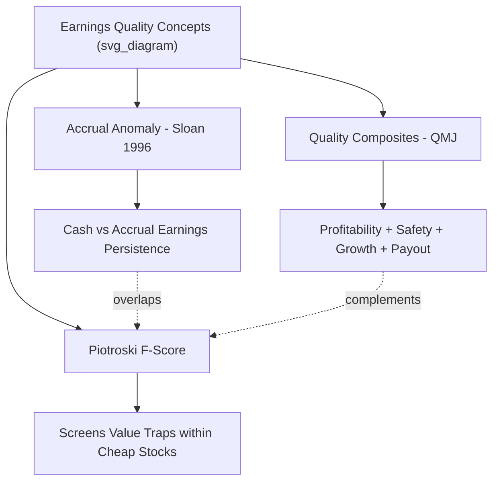

## Accruals and Quality-Related Anomalies

### Overview

Accruals and quality-related anomalies describe a family of cross-sectional return predictability patterns linked to accounting fundamentals: the extent to which reported earnings are composed of cash versus non-cash (accrual) components, and broader measures of firm "quality" such as profitability, earnings stability, and balance-sheet health. These anomalies show that firms with higher accruals, lower earnings quality, or weaker fundamental quality tend to earn systematically lower future stock returns than firms with the opposite characteristics — a pattern that has proven difficult to reconcile with rational risk-based asset pricing.

### The Accrual Anomaly

**Definition of Accruals**

Accruals represent the non-cash portion of reported earnings, arising from the difference between accrual-basis accounting (recognizing revenue/expenses when earned/incurred) and cash-basis accounting (recognizing them when cash changes hands):

$$\text{Accruals} = \text{Net Income} - \text{Operating Cash Flow}$$

Equivalently, using the balance-sheet approach originally employed by Sloan (1996):

$$\text{Accruals} = \Delta CA - \Delta Cash - \Delta CL + \Delta STD - Dep$$

where $\Delta CA$ is the change in current assets, $\Delta Cash$ is the change in cash, $\Delta CL$ is the change in current liabilities, $\Delta STD$ is the change in short-term debt included in current liabilities, and $Dep$ is depreciation and amortization expense.

**Historical Discovery**

**Sloan (1996)** documented that firms with high accruals (earnings composed largely of non-cash items, e.g., aggressive revenue recognition, growing receivables/inventory) subsequently earn significantly lower stock returns than firms with low accruals (earnings composed largely of cash flow), even though both groups may report similar current earnings levels. This became known as the **accrual anomaly**.

**Mechanism: The Earnings Persistence Channel**

Sloan's core insight was that the **cash flow component of earnings is more persistent** (predictive of future earnings) than the **accrual component**. Investors, however, appear to **fixate on the bottom-line earnings number** without adequately distinguishing between its more-persistent cash and less-persistent accrual components — a form of **earnings fixation** or **functional fixation**.

- High-accrual firms tend to experience subsequent **earnings disappointments** as the temporarily inflated accrual-driven earnings mean-revert.
- The market appears to be surprised by these disappointments, leading to negative returns when they are announced — consistent with a mispricing (rather than risk) explanation.

**Portfolio Construction**

1. Compute total accruals scaled by average total assets for each firm.
2. Sort firms into deciles based on scaled accruals.
3. Go long the lowest-accrual decile (low accruals, higher cash-flow-based earnings quality) and short the highest-accrual decile.
4. Rebalance annually, typically aligned with fiscal year-end reporting dates with an appropriate lag (commonly 3–6 months) to ensure information availability, avoiding look-ahead bias.

**Decomposition: Working Capital vs. Long-Term Accruals**

Subsequent research (e.g., Richardson, Sloan, Soliman, and Tuna, 2005) decomposed total accruals into finer components:

- **Working capital accruals** (changes in receivables, inventory, payables): found to be the least persistent and most associated with mispricing.
- **Non-current operating accruals** (changes in long-term operating assets/liabilities, e.g., capitalized costs).
- **Financial accruals** (changes in financial assets/liabilities).

Their **reliability framework** proposed that accruals requiring more subjective estimation (less "reliable," e.g., relying on management judgment about future collectability or useful lives) are associated with lower earnings persistence and stronger return predictability, extending Sloan's original mechanism.

### Explanations for the Accrual Anomaly

**Behavioral: Earnings Fixation**

The dominant explanation is that investors do not fully "see through" the accounting mechanics of earnings — they anchor on the aggregate earnings number and fail to appropriately discount the lower persistence of the accrual component, leading to systematic mispricing that corrects as future earnings realizations disappoint high-accrual firms.

**Risk-Based Explanations**

- Some researchers have argued that high accruals may proxy for higher **operating risk**, **distress risk**, or **growth-related uncertainty**, and thus the anomaly represents fair compensation for risk rather than mispricing. [Inference: risk-based explanations for accruals have generally received less empirical support than for other anomalies, but remain part of the ongoing debate.]
- Tests examining whether accrual-based portfolios' returns can be explained by exposure to standard risk factors (market, size, value) have generally found the anomaly's alpha to be robust, weakening pure risk-based accounts. [Unverified: robustness varies by sample period and factor model specification used.]

**Limits to Arbitrage**

High-accrual firms also tend to have characteristics (smaller size, lower liquidity, higher transaction costs, greater short-sale constraints) that make it costly for arbitrageurs to correct the mispricing, allowing the anomaly to persist despite being well-documented in the academic literature for decades.

### Quality Investing Framework

**Definition of "Quality"**

"Quality" is a broad, multi-dimensional construct in empirical asset pricing, generally encompassing firms characterized by high and stable profitability, strong balance sheets, conservative accounting/investment policies, and low earnings management. Unlike accruals (a narrower, specific measure), quality is typically constructed as a composite score across several of these dimensions.

**Key Components of Quality Composites**

- **Profitability**: measures such as gross profitability (Novy-Marx, 2013), return on equity (ROE), or operating profitability (used in the Fama-French five-factor model).
- **Growth**: stability and persistence of profitability/earnings growth over time.
- **Safety**: low leverage, low earnings/stock volatility, low distress risk (e.g., low Altman Z-score-implied risk).
- **Payout/Investment discipline**: conservative capital allocation, avoidance of excessive asset growth or share issuance.

**Novy-Marx Gross Profitability Premium**

Novy-Marx (2013) showed that **gross profitability** — defined as:

$$\text{Gross Profitability} = \frac{\text{Revenue} - \text{Cost of Goods Sold}}{\text{Total Assets}}$$

is a strong positive predictor of future returns, comparable in magnitude to the value premium, and that it is **largely uncorrelated with, and helps explain returns left unexplained by, standard value metrics**. This finding was influential in motivating the inclusion of a profitability factor in the Fama-French five-factor model (2015).

**Asness, Frazzini, and Pedersen: Quality Minus Junk (QMJ)**

Asness, Frazzini, and Pedersen (2019) constructed the **Quality Minus Junk (QMJ)** factor, built from a composite score across profitability, growth, safety, and payout dimensions:

1. Standardize (z-score) each underlying quality signal (e.g., profitability, low leverage, low earnings volatility) cross-sectionally.
2. Average the standardized signals into a composite quality score per firm.
3. Sort firms into a long "quality" portfolio (high composite score) and short "junk" portfolio (low composite score).
4. Document that quality stocks earn significantly positive risk-adjusted returns (positive alpha relative to standard factor models) across multiple international markets and time periods.

### Piotroski F-Score

Piotroski (2000) developed a practical **fundamental screening tool** aimed specifically at identifying likely-outperforming firms within the value/low-price-to-book universe, addressing the concern that many statistically "cheap" firms are cheap because they are genuinely troubled (value traps).

**F-Score Construction (9 binary signals, 1 point each, summed to 0–9)**

*Profitability signals (4):*

- Positive net income (ROA > 0)
- Positive operating cash flow
- Increasing ROA year-over-year
- Operating cash flow exceeds net income (accrual quality check — directly related to the Sloan accrual logic)

*Leverage, liquidity, and source of funds signals (3):*

- Decrease in long-term debt ratio
- Increase in current ratio
- No new share issuance (avoiding dilution)

*Operating efficiency signals (2):*

- Increase in gross margin
- Increase in asset turnover ratio

**Application**: Piotroski showed that within a universe of high book-to-market (value) stocks, going long high F-Score firms and short low F-Score firms generated significant abnormal returns, effectively filtering out likely "value traps" from genuine undervalued opportunities.

### Relationship Between Accruals, Quality, and Value

**Key Points**

- Accruals research focuses narrowly on **earnings composition and persistence**.
- Quality frameworks (QMJ, gross profitability) take a **broader, multi-signal approach** to firm fundamental strength.
- The Piotroski F-Score sits at an intersection: a practical, quality-oriented screen historically applied within value investing to avoid value traps.
- All three families share the common theme that **fundamental accounting information not fully reflected in current prices predicts future returns**, consistent with market underreaction to fundamentals rather than compensation for systematic risk.

### Fama-French Five-Factor Model Connection

The empirical success of profitability-based anomalies (Novy-Marx and related work) directly motivated Fama and French to extend their three-factor model to five factors by adding:

- **RMW (Robust Minus Weak)**: a profitability factor, long robust (high) operating profitability firms, short weak (low) operating profitability firms.
- **CMA (Conservative Minus Aggressive)**: an investment factor, long conservative (low asset growth) firms, short aggressive (high asset growth) firms — related conceptually to accrual/quality logic, since aggressive asset growth is associated with lower subsequent returns similarly to high accruals.

This reflects the broader academic consensus that profitability and investment patterns (both quality-adjacent constructs) contain return-relevant information beyond size and value alone.

### The Asset Growth Anomaly

Closely related to accruals and quality: **Cooper, Gulen, and Schill (2008)** documented that firms with high total asset growth (rapid expansion of the balance sheet, often financed through debt or equity issuance) subsequently earn significantly lower returns than firms with low or negative asset growth.

- **Mechanism**: proposed explanations include overinvestment by empire-building or overoptimistic managers, and investor overextrapolation of growth firms' recent performance leading to overpricing that later corrects.
- **Relation to accruals**: asset growth and accruals are correlated (both capture aspects of balance-sheet expansion), but empirical tests generally find each retains incremental predictive power controlling for the other. [Inference: the precise degree of independence between asset growth and accrual effects varies across studies and sample periods.]

### Practical Implementation Considerations

**Key Points**

- **Reporting lag**: accrual and quality signals rely on financial statement data, which is released with a lag (typically 60–90+ days after fiscal year-end); backtests must apply a realistic lag to avoid look-ahead bias.
- **Data quality**: computing accruals accurately requires careful handling of mergers, acquisitions, and one-time items that can distort balance-sheet-based accrual calculations; the cash-flow-statement-based approach (net income minus operating cash flow) is generally considered more robust `to` these distortions than the balance-sheet approach.
- **Sector effects**: profitability and quality metrics can vary systematically by industry (e.g., asset-light software firms vs. capital-intensive manufacturers), so many practical implementations use industry-relative or industry-neutral scoring.
- **Turnover and rebalancing**: annual fundamental-data-driven rebalancing is standard, given financial statements are typically only updated quarterly or annually, resulting in lower turnover than short-horizon technical or momentum strategies.

### Worked Example

**Example**

Consider two firms with identical reported net income of $100 million in a given year:

- **Firm A**: operating cash flow of $95 million → accruals = $100M − $95M = $5 million (low accruals, high earnings quality).
- **Firm B**: operating cash flow of $40 million → accruals = $100M − $40M = $60 million (high accruals, low earnings quality, likely driven by rising receivables/inventory or aggressive revenue recognition).

Under the Sloan framework, Firm B's earnings are predicted to be **less persistent**: its future earnings are more likely to disappoint as the elevated accruals unwind (e.g., receivables prove harder to collect, or inventory must be written down). A hedge portfolio long Firm A-type (low-accrual) firms and short Firm B-type (high-accrual) firms is expected to earn a positive average return as this earnings quality differential resolves.

### Testing Methodology

- Standard tests use **Fama-MacBeth cross-sectional regressions** of future returns on accrual/quality measures (with controls for size, value, momentum) or **portfolio sort time-series regressions** on standard factor models to estimate alpha.
- Robustness checks typically include out-of-sample and international replication (QMJ and gross profitability have both been documented across multiple global markets), and decomposition tests (e.g., separating working capital from long-term accruals) to isolate which components drive the anomaly.

### Related Topics

- Post-earnings-announcement drift and earnings quality signals
- Fama-French five-factor model (RMW and CMA factors)
- Piotroski F-Score and value-trap avoidance
- Asset growth anomaly and overinvestment theories
- Net operating assets and balance-sheet bloat measures
- Quality Minus Junk (QMJ) factor construction and international evidence
- Earnings management and discretionary accrual detection (Jones model)
- Limits to arbitrage and short-sale constraints in anomaly persistence
- Momentum and long-term reversal (related underreaction/overreaction anomalies)
- Distress risk and the Altman Z-score