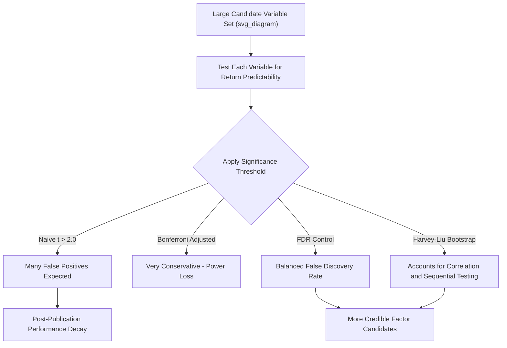

## Data Mining and Multiple-Testing Concerns

### Overview

Data mining and multiple-testing concerns address a foundational methodological problem underlying the entire cross-sectional anomalies literature: when researchers test many candidate variables for return predictability, some will appear statistically significant purely by chance, even if no true predictive relationship exists. This issue has become increasingly central to empirical asset pricing as the number of proposed "anomalies" and "factors" has grown dramatically, prompting a body of research specifically focused on distinguishing genuine return predictability from statistical artifacts of extensive searching.

### The Core Statistical Problem

**Multiple Hypothesis Testing**

When testing a single hypothesis at a conventional significance level (e.g., $\alpha = 0.05$), there is a 5% chance of a **false positive** (Type I error) under the null hypothesis of no true effect. When testing $N$ independent hypotheses simultaneously, the probability of at least one false positive rises sharply:

$$P(\text{at least one false positive}) = 1 - (1-\alpha)^N$$

For example, with $N = 100$ independent tests at $\alpha = 0.05$:

$$P(\text{at least one false positive}) = 1 - (0.95)^{100} \approx 0.994$$

This means that testing 100 unrelated candidate variables at conventional significance thresholds makes it **virtually certain** that at least one will appear "significant" purely by chance.

**Application to Factor Discovery**

The anomalies literature has proposed hundreds of candidate return predictors ("the factor zoo") over several decades. If each was tested independently at conventional thresholds without adjustment, a large number of "discoveries" would be expected under the null of no true predictability, purely as a statistical artifact of the sheer number of variables examined.

### The "Factor Zoo" Problem

**Harvey, Liu, and Zhu (2016) — "…and the Cross-Section of Expected Returns"**

This influential paper catalogued over 300 factors published in top finance journals and argued that most published findings likely reflect data mining rather than genuine predictability, given the scale of multiple testing implicit in decades of academic research (much of it unpublished or unobserved by any single researcher, making the true multiple-testing scope even larger than visible in published work alone).

**Key Recommendations from Harvey, Liu, and Zhu**

- Conventional **t-statistic thresholds of 2.0** (roughly corresponding to $p < 0.05$) are argued to be far too lenient given the scale of testing in the literature; they propose a much higher threshold (e.g., $t > 3.0$) for a newly discovered factor to be considered credible.
- They propose adjusting significance thresholds using multiple-testing correction frameworks originally developed in other fields (e.g., genomics, where thousands of genes are tested simultaneously for association with a disease).

### Multiple-Testing Correction Frameworks

**Bonferroni Correction**

The simplest and most conservative approach: divide the desired overall significance level by the number of tests conducted:

$$\alpha_{adjusted} = \frac{\alpha}{N}$$

For $N = 300$ factors tested and a desired overall 5% family-wise error rate:

$$\alpha_{adjusted} = \frac{0.05}{300} \approx 0.00017$$

This is often considered excessively conservative in practice, since it controls the probability of **any** false positive across all tests (family-wise error rate), which becomes an extremely stringent bar as $N$ grows, potentially causing many genuine effects to be discarded (Type II errors).

**Holm-Bonferroni Method**

A step-down refinement of the Bonferroni correction that is less conservative: p-values are ranked from smallest to largest, and each is compared to a progressively less strict threshold, improving statistical power while still controlling the family-wise error rate.

**Benjamini-Hochberg False Discovery Rate (FDR) Control**

Rather than controlling the probability of *any* false positive (family-wise error rate), the **False Discovery Rate (FDR)** approach controls the *expected proportion* of false positives *among all findings declared significant*:

$$FDR = E\left[\frac{\text{False Positives}}{\text{Total Positives Declared}}\right]$$

**Procedure:**

1. Rank $N$ p-values from smallest ($p_{(1)}$) to largest ($p_{(N)}$).
2. Find the largest $k$ such that $p_{(k)} \leq \frac{k}{N} \times \alpha$.
3. Declare all tests with $p$-values $\leq p_{(k)}$ as significant.

FDR control is generally considered more appropriate than family-wise error rate control in factor discovery contexts, since it tolerates a controlled proportion of false discoveries in exchange for greater power to detect true effects among a large candidate set. This tradeoff (power vs. strictness) is a key reason FDR-based methods have gained traction in the factor-testing literature relative to Bonferroni-style corrections. [Inference: the specific tradeoff preference is a methodological judgment call rather than a universally agreed-upon standard.]

### Harvey and Liu's Bootstrap Multiple-Testing Framework

Harvey and Liu (2015, 2020) developed a **bootstrap-based multiple-testing procedure** specifically tailored to sequential factor discovery, which accounts for:

- **Time-series dependence** in returns (autocorrelation), which standard independent-test frameworks (like basic Bonferroni) do not address.
- **Cross-sectional correlation** among candidate factors, since many proposed factors are correlated with each other (e.g., variants of value or profitability measures), meaning the "effective" number of independent tests is smaller than the raw count of factors proposed.
- **Sequential testing**, since factors are proposed over time as a cumulative literature, not as a single simultaneous batch — later factors are implicitly tested against the backdrop of all prior discoveries.

Their approach uses bootstrap resampling of the time-series of returns to construct an empirical null distribution of the *maximum* test statistic that would be expected to arise purely by chance given the correlation structure among the tests actually conducted, providing a more tailored (and often less conservative than naive Bonferroni) benchmark for evaluating whether a newly proposed factor's t-statistic is genuinely unusual.

### Data Mining Bias in Practice

**In-Sample vs. Out-of-Sample Performance Decay**

A well-documented empirical regularity: many published anomalies show **weaker performance after publication** than in the original in-sample discovery period.

**McLean and Pontiff (2016) — "Does Academic Research Destroy Stock Return Predictability?"**

This study examined 97 published anomalies and found that average returns decline significantly after publication, on the order of about a 26% decline in return predictability post-publication relative to the original in-sample period, with a further decline observed after academic publication specifically (beyond the initial post-sample decline), attributed to a combination of statistical overfitting in the original discovery and investors trading on the anomaly once it becomes public knowledge (arbitrage/crowding effect).

**Distinguishing Two Separate Explanations for Post-Publication Decay**

1. **Statistical overfitting / data mining**: the original in-sample result partly reflected chance, so out-of-sample and post-publication periods regress toward the true (smaller or zero) effect — a pure statistical artifact.
2. **Genuine arbitrage/crowding**: the anomaly was real, but publication informs the investing public, leading to increased trading that competes away the mispricing — a real economic effect of information dissemination, consistent with market efficiency operating with a lag.

McLean and Pontiff's methodology attempts to separate these two channels by comparing the **post-sample, pre-publication** period (which should reflect only statistical overfitting decay, since the anomaly isn't yet public) against the **post-publication** period (which reflects both channels), finding evidence for both effects operating simultaneously.

### P-Hacking and Specification Search

**Definition**

**P-hacking** refers to the practice (whether deliberate or inadvertent) of exploring many alternative specifications, variable definitions, sample periods, control variables, or subsamples until a statistically significant result is found, then reporting only that result without disclosing the broader search that produced it.

**Common Forms in Asset Pricing Research**

- **Variable definition flexibility**: testing multiple ways to construct a signal (e.g., different accrual measures, different volatility windows) and reporting only the best-performing specification.
- **Sample period selection**: choosing start/end dates that maximize an anomaly's apparent significance.
- **Control variable selection**: adding or removing control variables in regressions until the variable of interest achieves significance.
- **Outlier and data-cleaning choices**: winsorization thresholds, exclusion criteria (e.g., excluding financial firms, penny stocks) chosen post hoc to strengthen results.
- **Universe selection**: restricting to specific exchanges, market-cap ranges, or geographies that happen to produce stronger results.

**Pre-Registration as a Partial Solution**

Some researchers have advocated **pre-registration** of hypotheses and methodology (specifying the exact test to be conducted before examining the data) as a partial remedy, analogous to practices adopted in clinical trials research, though this remains uncommon in empirical finance relative to fields like medicine and psychology. [Inference: adoption rates and enforcement of pre-registration in finance are limited and evolving.]

### Out-of-Sample and Replication Testing

**Key Points**

- **International replication**: testing whether a U.S.-discovered anomaly holds in other developed and emerging markets is a common robustness check, since genuine economic mechanisms should not be purely a U.S. phenomenon, whereas pure data-mining artifacts would not be expected to replicate internationally. [Inference: successful international replication is suggestive evidence of genuine predictability but does not definitively rule out data mining, since research methodologies can themselves be replicated across markets.]
- **Time-period splitting**: testing an anomaly on a held-out later sample after its initial discovery period (as in McLean-Pontiff) provides a genuine out-of-sample test, though publication itself can contaminate this test via the arbitrage/crowding channel discussed above.
- **Placebo/random variable tests**: some methodological papers test randomly generated (economically meaningless) variables using the same search procedures used to discover real anomalies, to illustrate how many "significant" results can be manufactured purely through extensive specification search.

### Practitioner and Regulatory Implications

**Key Points**

- **Factor investing product design**: asset managers building smart-beta or factor-based investment products face direct commercial incentives to identify statistically compelling backtested strategies, creating potential misalignment between statistical rigor and product marketing incentives.
- **Backtest overfitting in quantitative strategy development**: the same multiple-testing logic applies within quantitative trading desks and hedge funds testing many candidate signals internally; practitioners increasingly use techniques such as the **Deflated Sharpe Ratio** (Bailey and López de Prado, 2014) to adjust reported backtest performance for the number of strategy variations tested before arriving at the reported result.
- **Academic incentive structures**: the "publish or perish" academic environment, combined with journals' historical preference for statistically significant, novel findings ("publication bias"), has been argued to structurally incentivize the kind of specification search that produces data-mined results. [Inference: the magnitude of this incentive effect on the overall anomalies literature is difficult to measure precisely and is a subject of ongoing methodological discussion.]

### Illustrative Framework

### Worked Example

**Example**

Suppose a research team tests 50 candidate accounting ratios for return predictability, each independently, at a conventional 5% significance threshold.

**Naive approach**: if none of the 50 ratios has any true predictive power, the expected number of "significant" results purely by chance is:

$$E[\text{false positives}] = 50 \times 0.05 = 2.5$$

So roughly 2–3 "discoveries" would be expected even if nothing in the dataset is genuinely predictive.

**Bonferroni-adjusted approach**: to control the family-wise error rate at 5% across all 50 tests:

$$\alpha_{adjusted} = \frac{0.05}{50} = 0.001$$

Only ratios with $p < 0.001$ (roughly $t > 3.3$ for typical sample sizes) would be declared significant — a far more stringent bar that would eliminate most of the spurious findings expected under the naive approach, at the cost of potentially also missing some genuinely predictive but moderately-powered signals (Type II error risk).

### Related Topics

- The factor zoo and factor proliferation in academic finance
- Deflated Sharpe Ratio and backtest overfitting corrections
- Post-publication return decay (McLean and Pontiff)
- Harvey, Liu, and Zhu's t-statistic threshold recommendations
- False Discovery Rate control (Benjamini-Hochberg procedure)
- Pre-registration and replication standards in empirical finance
- Limits to arbitrage as a competing explanation for anomaly persistence
- Fama-French factor model evolution as a response to factor proliferation
- Machine learning approaches to return prediction and overfitting risk
- International replication studies of U.S.-discovered anomalies