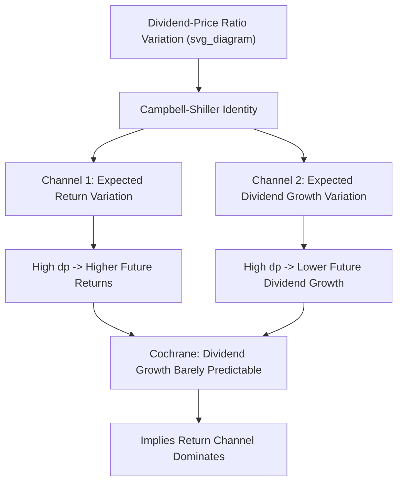

## Dividend Yield and Return Forecasting

### Overview

Dividend yield and return forecasting is a central topic in time-series asset pricing, examining whether the aggregate market's dividend-to-price ratio (or related valuation ratios) can predict future stock market returns. This literature sits at the intersection of the Gordon Growth Model, present-value identities, and predictive regression methodology, and has generated one of the longest-running and most contentious debates in empirical finance regarding the existence, magnitude, and statistical reliability of time-varying expected returns.

### Theoretical Foundation: The Gordon Growth Model

The dividend discount model expresses price as the present value of expected future dividends. Under the simplifying assumption of a constant expected return $r$ and constant expected dividend growth rate $g$:

$$P_t = \frac{D_{t+1}}{r - g}$$

Rearranging to express the dividend-price ratio:

$$\frac{D_t}{P_t} = \frac{r - g}{1 + g} \approx r - g$$

This identity implies that the dividend yield $D_t/P_t$ must move with **either** expected future returns $r$ **or** expected future dividend growth $g$ (or both). If dividend growth expectations are relatively stable over time, then variation in the dividend yield should primarily reflect variation in expected returns — providing the theoretical basis for using dividend yield as a return-forecasting variable.

### The Campbell-Shiller Present Value Decomposition

**Campbell and Shiller (1988)** developed a more rigorous **log-linear present value framework** that avoids the restrictive constant-growth assumption. The dividend-price ratio can be decomposed as an expectation of the present discounted value of all future returns minus all future dividend growth rates:

$$dp_t \approx \sum_{j=0}^{\infty} \rho^j E_t[r_{t+1+j} - \Delta d_{t+1+j}] + \text{constant}$$

where $dp_t$ is the log dividend-price ratio, $\rho$ is a discount coefficient close to but less than 1 (derived from a linearization around the average dividend yield), $r$ denotes log returns, and $\Delta d$ denotes log dividend growth.

**Key Implication**

This identity is a pure accounting relationship (given the linearization), not a behavioral or economic claim. It implies that a high current dividend yield must forecast **some combination** of:

1. **Higher future returns** (the return-predictability channel), or
2. **Lower future dividend growth** (the cash-flow channel).

Empirically distinguishing which channel dominates is a central question in this literature.

### Predictive Regression Framework

**Standard Specification**

$$r_{t+1} = \alpha + \beta \cdot dp_t + \varepsilon_{t+1}$$

where $r_{t+1}$ is the (excess) market return over the next period, and $dp_t$ is the log dividend-price ratio (or dividend yield) observed at time $t$. A positive and statistically significant $\hat{\beta}$ is interpreted as evidence that dividend yield predicts returns: a high dividend yield (relatively low price relative to dividends) today is followed by higher-than-average future returns.

**Historical Empirical Findings**

- **Fama and French (1988)** and related early studies found that dividend yield had modest but statistically significant predictive power for returns, with predictability increasing at longer forecast horizons (e.g., 1-year, 2-year, 4-year returns showed progressively higher $R^2$ than 1-month returns).
- **Campbell and Shiller (1988)** documented that dividend-price ratios (and related valuation ratios like price-earnings ratios) had substantial power to predict returns over multi-year horizons using U.S. data, with particularly strong predictive patterns evident around major valuation extremes (e.g., the late 1990s dot-com period was widely cited, in real time and retrospectively, as an example of the dividend yield/valuation framework signaling depressed subsequent returns).

### Statistical Challenges in Predictive Regressions

**Persistence and the "Stambaugh Bias"**

The dividend-price ratio is a highly **persistent** (near-unit-root) time series — it changes slowly over time, since prices and dividends both adjust gradually. This creates a well-known econometric problem:

**Stambaugh (1999)** showed that when the predictor variable ($dp_t$) is persistent and its innovations are correlated with the return innovations ($\varepsilon_{t+1}$) — which is mechanically true for dividend yield, since an unexpected return shock directly moves the price and thus the yield — standard OLS estimates of $\beta$ are **biased**, typically biased upward (toward finding predictability) in finite samples, and this bias is larger for more persistent predictors, and standard t-statistics have distorted size properties (rejecting the null of no predictability more often than the nominal significance level would suggest, i.e., producing spuriously significant results). [Inference: the magnitude of finite-sample bias is sample- and parameter-dependent, but the direction and existence of the bias in this data-generating setup is a well-established methodological result.]

**Look-Ahead Bias and Data-Snooping**

Since dividend-price ratios and similar variables were often "discovered" as predictors partly through examining the same historical sample repeatedly across decades of research, concerns analogous to the broader data-mining/multiple-testing problem apply directly to this literature (see related chapter content on data mining and multiple-testing concerns).

**Overlapping Return Horizons**

Multi-year return forecasting regressions (e.g., regressing 3-year or 5-year returns on current dividend yield) necessarily use **overlapping observations** when estimated with annual or monthly data, inducing strong serial correlation in the regression residuals. This requires **Newey-West (HAC) standard errors** or related corrections; failure to adjust for this overlap-induced autocorrelation produces severely understated standard errors and overstated statistical significance.

### Goyal and Welch: Out-of-Sample Skepticism

**Goyal and Welch (2008)** — "A Comprehensive Look at the Empirical Performance of Equity Premium Prediction" — conducted an extensive **out-of-sample** evaluation of dividend yield and numerous other proposed return predictors (book-to-market, term spread, default spread, and others).

**Key Findings**

- Despite many predictors (including dividend yield) showing statistically significant **in-sample** predictive power, most performed **worse than a simple historical average return** (a naive "no predictability" benchmark) in genuine **out-of-sample** forecasting tests.
- They interpret this in-sample/out-of-sample gap as evidence that much of the apparent in-sample predictability documented in the literature reflects **overfitting or statistical artifacts** rather than genuine, stable, exploitable predictability.
- This paper became a major methodological benchmark, prompting extensive follow-up research either defending predictability (via alternative methodologies) or extending the out-of-sample skepticism to other variables.

**Out-of-Sample $R^2$ Metric**

Goyal and Welch popularized the use of an **out-of-sample $R^2$** statistic comparing a predictive model's forecast errors to those of the historical average benchmark:

$$R^2_{OOS} = 1 - \frac{\sum_t (r_t - \hat{r}_t)^2}{\sum_t (r_t - \bar{r}_t)^2}$$

where $\hat{r}_t$ is the out-of-sample forecast from the predictive regression (estimated using only data available prior to $t$) and $\bar{r}_t$ is the historical average return computed using only data available prior to $t$. A **negative** $R^2_{OOS}$ indicates the predictive variable performs *worse* than simply assuming no predictability at all.

### Campbell and Thompson: A More Favorable Reassessment

**Campbell and Thompson (2008)** challenged the Goyal-Welch conclusions by arguing that **imposing sensible theoretical restrictions** on the forecasting regression substantially improves out-of-sample performance:

- **Restricting the sign of the coefficient**: since theory predicts dividend yield should positively predict returns, imposing $\hat{\beta} \geq 0$ (setting forecasts to the historical average when the unrestricted regression would imply a negative relationship) improves out-of-sample performance.
- **Restricting the sign of the forecast**: similarly, setting negative return forecasts to zero (since a negative expected equity premium is economically implausible over reasonable horizons) further improves performance.

With these restrictions, Campbell and Thompson found that dividend yield and several related valuation ratios **do** exhibit modest but economically meaningful out-of-sample predictive power, suggesting the Goyal-Welch pessimism was partly attributable to the unrestricted regression's sensitivity to estimation noise rather than a complete absence of genuine predictability.

### Long-Horizon Predictability Patterns

**Key Points**

- Predictive $R^2$ for dividend yield-based regressions is typically small (often single-digit percentages) at short (monthly, quarterly) horizons but increases substantially at longer horizons (3–5 years), a pattern documented across multiple studies including Campbell and Shiller (1988) and Fama and French (1988).
- This horizon pattern is mechanically related to the persistence of the dividend yield itself: since $dp_t$ evolves slowly, its information content compounds over longer holding periods in an overlapping-return regression framework, partly a statistical feature of the regression setup rather than purely a economic phenomenon reflecting genuinely stronger long-horizon predictability. [Inference: the extent to which the horizon-increasing $R^2$ pattern reflects a genuine economic phenomenon versus a mechanical/statistical artifact of persistence and overlapping returns remains debated in the literature.]

### Time-Varying Expected Returns vs. Time-Varying Cash Flow Growth

Returning to the Campbell-Shiller decomposition, subsequent research has attempted to empirically attribute variation in the dividend-price ratio between the return-forecasting channel and the dividend-growth-forecasting channel:

- **Cochrane (2008)** — "The Dog That Did Not Bark" — argued forcefully that, given the present-value identity, if dividend yield does **not** predict dividend growth (which is empirically close to true — dividend growth is difficult to forecast using the dividend yield), then it is **logically almost required** that dividend yield predicts returns instead, since the yield's variation has to be explained by variation in *something* in the identity. Cochrane interpreted the weak evidence for dividend-growth predictability as indirect but strong evidence *for* return predictability.
- This reframed the debate: rather than asking "does dividend yield predict returns?" in isolation, the more informative question became "how is dividend yield's predictive power split between the return and cash-flow-growth channels?" — with the bulk of accumulated evidence suggesting the return channel dominates. [Inference: the precise quantitative split between channels varies across studies, sample periods, and countries.]

### Illustrative Framework

### Behavioral and Rational Interpretations

**Rational Time-Varying Risk Premia**

A leading rational explanation is that expected returns vary over time because **risk or risk aversion** varies over the business cycle — investors demand a higher risk premium during recessions or periods of high economic uncertainty, and dividend yield rises (prices fall relative to dividends) during exactly these periods, consistent with rational asset pricing models featuring time-varying risk premia (e.g., habit formation models, long-run risk models).

**Behavioral Overreaction/Underreaction**

Alternative behavioral explanations suggest that dividend yield predictability reflects investor sentiment-driven mispricing: prices become excessively high relative to fundamentals during periods of investor optimism (depressing the yield) and subsequently correct, generating the observed negative relationship between low yields and low future returns (and vice versa for high yields).

Distinguishing between these two broad classes of explanation (rational time-varying risk premia vs. behavioral mispricing) remains a central, largely unresolved question in the literature. [Unverified: no consensus exists on the relative contribution of each channel.]

### Related Valuation Ratio Predictors

**Key Points**

- **Price-earnings ratio (P/E)** and **cyclically-adjusted P/E (CAPE, Shiller P/E)**: similar present-value logic applies, smoothing earnings over 10 years (CAPE) to reduce cyclicality noise in the earnings denominator.
- **Book-to-market ratio**: aggregate book-to-market has also been studied as a return predictor, analogous to its firm-level cross-sectional counterpart (the value anomaly).
- **Net payout yield / total payout yield**: extensions of dividend yield accounting for share buybacks, which have become an increasingly important form of corporate payout relative to dividends since the 1980s–1990s, potentially biasing pure dividend-based measures if buybacks substitute for dividends over time.

### Practical Implementation Considerations

**Key Points**

- **Data frequency and horizon choice**: researchers must choose between monthly, quarterly, or annual data, and short versus long forecast horizons, each involving different tradeoffs between statistical power, persistence-driven bias, and economic relevance for practical asset allocation decisions.
- **Real-time vs. revised data**: using data as it was actually available in real time (rather than later-revised dividend/earnings figures) is important for genuine out-of-sample validity, since ex-post revised data can embed look-ahead information unavailable to contemporaneous investors.
- **Structural breaks**: the relationship between dividend yield and returns may not be stable over long sample periods (e.g., due to changing payout policies favoring buybacks, changing monetary policy regimes, or structural shifts in risk aversion), and predictive regressions estimated over very long samples may mask important time-variation in the underlying relationship. [Inference: the presence and dating of structural breaks is itself a subject of ongoing empirical investigation rather than settled fact.]

### Worked Example

**Example**

Suppose the current dividend-price ratio for a market index is 3.5%, compared to a long-run historical average of 2.0%. Using a fitted predictive regression with a historically estimated slope coefficient of $\hat{\beta} = 3$ (in appropriate units) relating the log dividend-price ratio deviation to next-year excess returns:

$$\hat{r}_{t+1} = \bar{r} + \hat{\beta} \times (dp_t - \overline{dp})$$

With $dp_t - \overline{dp} = 1.5\%$ (a positive deviation, i.e., dividend yield unusually high, valuations unusually low) and $\hat{\beta} = 3$:

$$\hat{r}_{t+1} - \bar{r} = 3 \times 1.5\% = 4.5\%$$

This implies a forecast excess return roughly 4.5 percentage points above the historical average — illustrating the mechanical logic of how an elevated dividend yield translates into a higher forecast return under the predictive regression framework, while bearing in mind the substantial estimation uncertainty and out-of-sample skepticism discussed above regarding the reliability of any such point forecast.

### Related Topics

- Campbell-Shiller present value decomposition and log-linearization
- Stambaugh bias and persistent-regressor econometrics
- Goyal-Welch out-of-sample predictability skepticism
- Campbell-Thompson sign-restricted forecasting improvements
- Cochrane's "Dog That Did Not Bark" cash-flow/return decomposition
- CAPE (Shiller P/E) and cyclically-adjusted valuation ratios
- Time-varying risk premia and habit formation asset pricing models
- Net and total payout yield as dividend yield extensions
- Newey-West standard errors and overlapping return regressions
- Data mining and multiple-testing concerns (predictive regression analog)