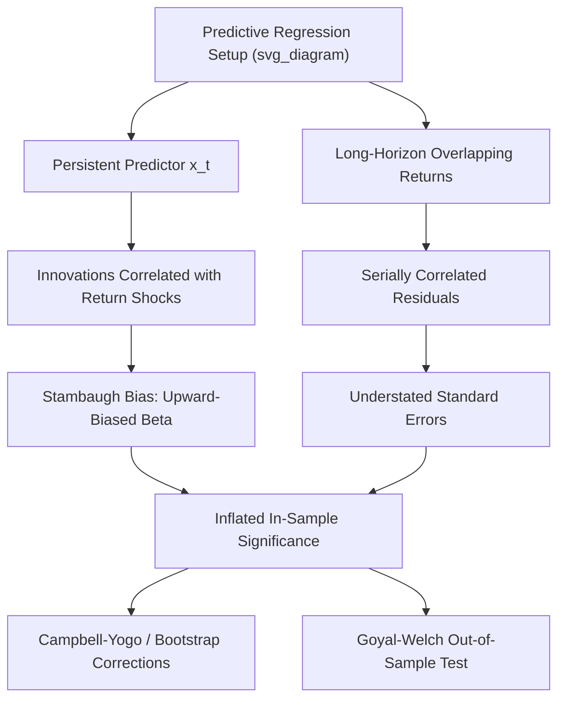

## Predictive Regressions and Their Statistical Pitfalls

### Overview

Predictive regressions are the primary empirical tool used to test whether observable variables — dividend yield, interest rate spreads, valuation ratios, macroeconomic indicators — forecast future asset returns. While conceptually simple (regress future returns on a lagged predictor), this class of regression suffers from a distinctive and severe set of statistical pitfalls that have generated decades of dedicated econometric research. This topic surveys those pitfalls systematically, providing the methodological foundation underlying debates over dividend yield, term spread, and other return-forecasting variables.

### The Baseline Predictive Regression Model

$$r_{t+1} = \alpha + \beta x_t + \varepsilon_{t+1}$$

where $r_{t+1}$ is the (excess) return over period $t$ to $t+1$, and $x_t$ is a predictor variable observed at time $t$ (e.g., dividend yield, term spread, valuation ratio). The predictor is frequently modeled as following a highly persistent autoregressive process:

$$x_{t+1} = \phi x_t + u_{t+1}$$

with $\phi$ close to 1 (near unit root), and it is this persistence — combined with a specific correlation structure with the return equation's error — that generates the core statistical problems in this literature.

### Pitfall 1: The Stambaugh Bias

**Mechanism**

**Stambaugh (1999)** formalized the finite-sample bias that arises when:

1. The predictor $x_t$ is persistent ($\phi$ close to 1), and
2. The innovation $u_{t+1}$ in the predictor's own autoregressive process is **contemporaneously correlated** with the return innovation $\varepsilon_{t+1}$ (formally, $Corr(\varepsilon_{t+1}, u_{t+1}) = \rho \neq 0$).

This correlation is not a special case — it is the **mechanical norm** for financial valuation ratios: an unexpected positive return shock directly and immediately raises the price, which mechanically lowers the dividend yield (or similar ratio) in the same period. This creates a structural, non-zero correlation between the two innovations by construction.

**Bias Formula (Approximate)**

The bias in the OLS estimator $\hat{\beta}$ is approximately:

$$E[\hat{\beta} - \beta] \approx \frac{\rho \cdot \sigma_\varepsilon}{\sigma_u} \times E[\hat{\phi} - \phi]$$

Since the autoregressive coefficient estimator $\hat{\phi}$ is itself biased downward in finite samples (a well-known separate result for persistent time series, sometimes called the **Kendall bias**), and $\rho$ is typically negative for valuation-ratio predictors (positive return shocks lower the yield), the combination produces a predictable-direction bias in $\hat{\beta}$ — commonly **upward**, toward finding spurious evidence of predictability, for the typical case of valuation-ratio predictors. [Inference: exact magnitude and even direction depend on the specific sign and size of $\rho$ and $\phi$ in a given application, though the upward-bias direction is the commonly cited result for standard valuation-ratio predictors.]

**Practical Implication**

Naive OLS t-statistics in predictive regressions using persistent, endogenously-determined predictors like dividend yield **overstate statistical significance**, making it appear that predictability exists (or is stronger than it is) even under the null hypothesis of no true predictability.

### Pitfall 2: Overlapping Observations and Serial Correlation

**The Problem**

Many predictive regression studies use **long-horizon returns** as the dependent variable (e.g., cumulative 3-year or 5-year returns) to increase statistical power, since predictive $R^2$ tends to rise mechanically at longer horizons for persistent predictors. When constructed from monthly or annual data with a forecast horizon longer than the data sampling interval, consecutive observations of the dependent variable **overlap**:

$$r_{t \to t+k} = r_{t+1} + r_{t+2} + \dots + r_{t+k}$$

Successive $k$-period return observations (e.g., at $t$, $t+1$, $t+2$, …) share $k-1$ of the same underlying single-period returns, mechanically inducing strong serial correlation in the regression residuals, **even if the single-period returns themselves are unpredictable and independent**.

**Consequence**

Standard OLS standard errors, which assume independent and identically distributed errors, are **severely understated** when residuals are this strongly autocorrelated, leading to inflated t-statistics and false confidence in predictability that may not exist at the single-period level.

**Correction: Newey-West (HAC) Standard Errors**

The standard remedy is to use **heteroskedasticity- and autocorrelation-consistent (HAC)** standard errors, typically the **Newey-West** estimator, with a lag truncation parameter often set to approximately the forecast horizon minus one (or determined via automatic bandwidth selection procedures):

$$\hat{V}_{NW} = \hat{V}_{OLS} + \sum_{j=1}^{L} w_j (\hat{\Gamma}_j + \hat{\Gamma}_j')$$

where $\hat{\Gamma}_j$ are estimated autocovariances at lag $j$, $w_j$ are Bartlett kernel weights, and $L$ is the chosen lag truncation. Even with this correction, Newey-West standard errors are known to perform poorly (remain understated) in small samples with highly persistent regressors and long overlap horizons, motivating simulation-based alternatives discussed below.

### Pitfall 3: Persistence-Induced Spurious Regression

**Near Unit-Root Predictors**

When the predictor variable $x_t$ has an autoregressive root $\phi$ very close to 1 (i.e., is close to being non-stationary), standard asymptotic theory (which relies on the Central Limit Theorem applying to well-behaved stationary processes) **breaks down**. Test statistics for $\beta$ no longer follow standard normal or t-distributions even asymptotically; instead they follow **non-standard distributions** that depend on the unknown persistence parameter $\phi$ and the correlation $\rho$ between innovations.

**Implication for Inference**

Using standard critical values (e.g., from a t-distribution or normal distribution) when the true predictor process is highly persistent leads to **incorrectly sized tests** — the actual probability of rejecting a true null hypothesis of no predictability can be substantially higher than the nominal significance level (e.g., an intended 5% test might actually reject 15–20% of the time under the null), compounding the bias problem described above.

### Econometric Solutions and Robust Inference Methods

**Campbell and Yogo (2006) — Bonferroni Q-Test**

Campbell and Yogo developed a testing procedure specifically designed for the near-unit-root predictive regression setting, combining a **confidence interval for the persistence parameter $\phi$** (which is itself estimated with uncertainty) with a **Bonferroni-adjusted test** for $\beta$ that accounts for this joint uncertainty, producing valid inference that does not rely on standard (but inapplicable) asymptotic approximations. This approach is widely regarded as a methodological standard for robust inference in this literature. [Inference: "widely regarded" reflects the paper's substantial citation influence and adoption in subsequent studies, not a claim of universal consensus on the single best method.]

**Simulation-Based / Bootstrap Approaches**

An alternative and complementary approach constructs **empirical (simulated or bootstrapped) distributions** of the test statistic under the null hypothesis of no predictability, explicitly accounting for the persistence of the predictor and its correlation with returns, rather than relying on standard asymptotic critical values. This class of methods (used extensively in related work by Goyal, Welch, and others) tends to produce more conservative (wider) confidence intervals and less frequent rejections of the null than naive OLS.

**Reduced-Bias Estimators**

Various estimators have been proposed to directly correct for the Stambaugh finite-sample bias analytically (rather than only correcting the standard errors), by explicitly modeling the joint bias in $\hat{\phi}$ and $\hat{\beta}$ and subtracting an estimated bias term from the naive OLS coefficient.

### Pitfall 4: In-Sample vs. Out-of-Sample Divergence

**The Core Distinction**

- **In-sample tests**: estimate $\beta$ using the full available dataset, then test whether $\hat{\beta}$ is statistically distinguishable from zero using that same dataset — vulnerable to all the biases described above, and additionally vulnerable to look-ahead information leaking into the estimation.
- **Out-of-sample tests**: estimate $\beta$ using only data available up to time $t$, generate a genuine forecast for $t+1$, then repeat this process recursively (expanding or rolling window) through the sample, comparing realized out-of-sample forecast errors to a benchmark (commonly the historical average return).

**Why the Distinction Matters**

Goyal and Welch (2008) demonstrated that numerous predictors showing statistically significant **in-sample** coefficients performed **worse than the historical average** when evaluated genuinely out-of-sample (see related dividend yield chapter content), a pattern strongly suggestive that at least part of the in-sample "predictability" reflects overfitting, data mining, or the finite-sample biases discussed above rather than genuine, stable, forward-looking predictive relationships.

**Out-of-Sample $R^2$ and Its Own Pitfalls**

While the out-of-sample $R^2$ metric (comparing forecast errors of the predictive model versus the historical-average benchmark) is a useful diagnostic, it too has known limitations:

- It can be **noisy and unstable** in small out-of-sample evaluation windows.
- **Clark and McCracken (2001)** and related work developed formal tests for statistically comparing nested forecasting models' out-of-sample performance, since simple sign comparisons of $R^2_{OOS}$ do not constitute a formal hypothesis test on their own.

### Pitfall 5: Look-Ahead Bias and Data Availability

**Key Points**

- Predictor variables must be constructed using only information that would have been genuinely available to investors at the time of the forecast — using later-revised macroeconomic data (e.g., GDP figures subject to multiple subsequent revisions) as if it were known contemporaneously introduces a form of look-ahead bias that inflates apparent predictive power.
- Financial statement-based predictors (analogous to accrual/quality signals) require appropriate reporting lags to avoid assuming knowledge of information before its public release.
- Variable and model selection performed with knowledge of the full historical sample (including the very periods later used for "out-of-sample" testing) can undermine the claimed out-of-sample nature of a test — a subtler form of look-ahead bias sometimes termed **"pre-testing bias."**

### Illustrative Framework

### Comparison of Correction Methods

| Method | Addresses | Key Tradeoff |
| --- | --- | --- |
| Newey-West HAC standard errors | Serial correlation from overlapping returns | Still understated in small samples with high persistence |
| Campbell-Yogo Bonferroni Q-test | Stambaugh bias, near-unit-root inference | More conservative, wider confidence intervals |
| Bootstrap/simulation-based null distributions | Joint persistence + correlation structure | Computationally intensive, requires correct model specification |
| Out-of-sample $R^2$ testing | In-sample overfitting, data mining | Sensitive to evaluation window choice; low power in short samples |
| Sign-restricted forecasts (Campbell-Thompson) | Economically implausible forecasts | Imposes prior theoretical beliefs, reducing flexibility |

### Worked Example

**Example**

Suppose a researcher estimates a predictive regression of next-year excess returns on the log dividend yield using 60 years of annual data, obtaining $\hat{\beta} = 0.15$ with a naive OLS t-statistic of 2.3 (nominally significant at the 5% level, two-tailed critical value ≈1.96).

Suppose further that the estimated persistence of the dividend yield is $\hat{\phi} = 0.94$ (highly persistent, close to unit root) and the correlation between return innovations and dividend-yield innovations is estimated at $\hat{\rho} = -0.85$ (strongly negative, as expected mechanically).

Given this combination of high persistence and strong negative correlation, a Stambaugh-bias-corrected or Campbell-Yogo Bonferroni-adjusted procedure would be expected to show:

1. A **downward-adjusted point estimate** for $\beta$ relative to the naive $\hat{\beta} = 0.15$.
2. A **wider confidence interval** that may include zero, even though the naive t-statistic suggested significance.

This illustrates the central practical lesson: naive predictive regression results using persistent, endogenous financial ratios should always be treated with caution until confirmed by bias-corrected or robust inference procedures.

### Practical Implementation Considerations

**Key Points**

- **Always report both naive and bias-corrected inference** (e.g., Newey-West alongside Campbell-Yogo or bootstrap results) when presenting predictive regression findings, given how sensitive conclusions can be to the correction method chosen.
- **Explicitly test and report the persistence** ($\hat{\phi}$) of any predictor variable used, since the severity of the Stambaugh bias and non-standard inference problems scales directly with how close $\hat{\phi}$ is to 1.
- **Conduct genuine out-of-sample validation** wherever feasible, using only data available at each historical forecast date, as the single most direct check against overfitting and data-mining concerns.
- **Be cautious with long-horizon regressions**: while they often show higher (apparent) $R^2$, this is partly a mechanical consequence of overlapping-return construction and persistence, not necessarily evidence of stronger genuine economic predictability at longer horizons.

### Related Topics

- Dividend yield and return forecasting (primary empirical application)
- Stambaugh bias and finite-sample econometrics of persistent regressors
- Campbell-Yogo Bonferroni Q-test methodology
- Newey-West HAC standard error estimation
- Goyal-Welch out-of-sample predictability framework
- Data mining and multiple-testing concerns (cross-sectional analog)
- Unit root and near-unit-root time series econometrics
- Clark-McCracken nested model forecast comparison tests
- Term spread, default spread, and other macro-financial return predictors
- Vector autoregression (VAR) approaches to return and cash-flow decomposition