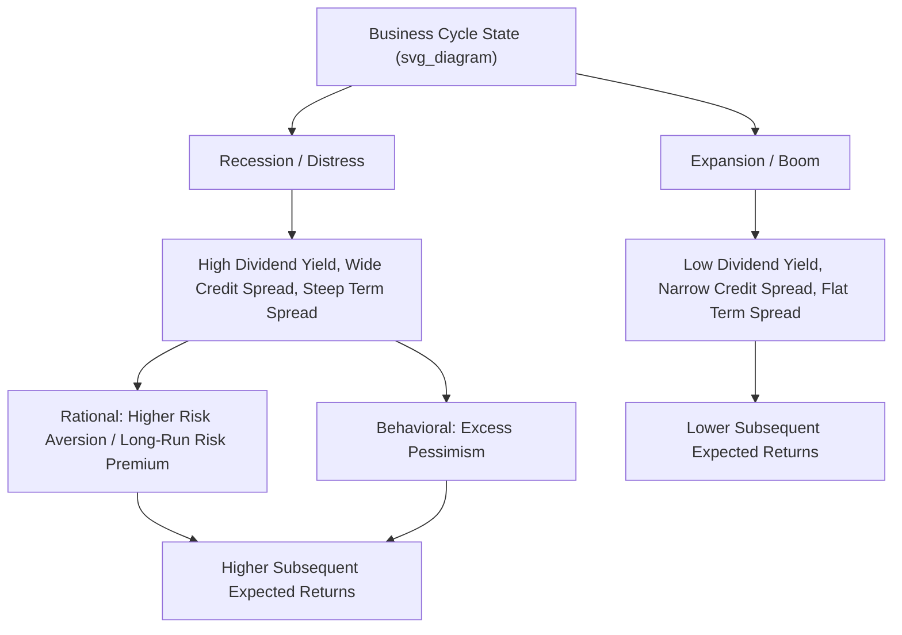

## Business-Cycle Variation in Expected Returns

### Overview

Business-cycle variation in expected returns examines the empirical and theoretical proposition that expected (required) returns on risky assets are not constant over time but instead fluctuate systematically with the state of the macroeconomy — rising during recessions and periods of economic distress, and falling during expansions. This topic connects time-series return predictability directly to macroeconomic theory, providing the leading rational (risk-based) framework for interpreting patterns such as dividend yield predictability, credit spread predictability, and countercyclical risk premia more broadly.

### Core Empirical Pattern: Countercyclical Expected Returns

**Key Points**

- Multiple predictive variables associated with poor current economic conditions (recessions, financial distress, elevated uncertainty) tend to be followed by **higher-than-average subsequent stock returns**, while variables associated with strong economic conditions tend to be followed by **lower-than-average subsequent returns**.
- This pattern is broadly termed **countercyclical risk premia** or **countercyclical expected returns**: the price of risk (compensation demanded by investors per unit of risk borne) appears to rise during bad economic times and fall during good economic times, rather than remaining constant as assumed in the simplest CAPM framework.
- This countercyclicality is documented across multiple asset classes (equities, corporate bonds, and to some extent other risk assets), and across multiple predictor variables tied to macroeconomic and financial conditions, lending the pattern broad empirical support as a genuine business-cycle phenomenon rather than an artifact specific to any single variable. [Inference: the degree of consistency across specific variables and sub-periods varies, and some individual predictors show weaker or less stable patterns than others.]

### Key Predictor Variables Linked to the Business Cycle

**Dividend Yield**

As covered in related chapter content, the aggregate dividend-price ratio rises when prices fall relative to dividends — a pattern that tends to coincide with recessions and market downturns, consistent with dividend yield partly proxying for a countercyclical risk premium.

**Term Spread (Yield Curve Slope)**

$$\text{Term Spread} = y_{long} - y_{short}$$

The spread between long-term and short-term government bond yields has been documented as a predictor of both future economic activity (an inverted or flat yield curve has historically preceded recessions) and future stock and bond returns, with a steep term spread often associated with subsequently higher expected returns, consistent with a compensation-for-risk story tied to the business cycle.

**Default Spread (Credit Spread)**

$$\text{Default Spread} = y_{Baa} - y_{Aaa}$$

The spread between yields on lower-rated (e.g., Baa) and higher-rated (e.g., Aaa) corporate bonds widens during periods of economic distress and heightened default risk, and has been shown to predict higher subsequent equity and corporate bond returns — interpreted as compensation for bearing credit and business-cycle risk that is elevated precisely when the spread is wide.

**Consumption-Wealth Ratio (CAY)**

**Lettau and Ludvigson (2001)** constructed a measure of the deviation of consumption from its long-run relationship with aggregate wealth (labor income and asset wealth), finding that this **consumption-wealth ratio (cay)** has significant power to predict future stock returns, particularly at business-cycle-relevant horizons, with elevated cay (consumption high relative to wealth, or equivalently wealth low relative to consumption, tending to occur near business-cycle troughs) forecasting higher subsequent returns.

**Aggregate Volatility and Variance Risk Premium**

Measures of aggregate stock market volatility and the gap between implied and realized volatility (the "variance risk premium") tend to spike during recessions and financial crises and have been linked to subsequent higher expected returns, consistent with volatility itself serving as a state variable tracking the business cycle.

### Theoretical Frameworks: Rational Time-Varying Risk Premia

**Consumption-Based Asset Pricing Foundation**

In standard consumption-based asset pricing models, the price of an asset satisfies the Euler equation:

$$E_t\left[M_{t+1}(1 + R_{t+1})\right] = 1$$

where $M_{t+1}$ is the stochastic discount factor (SDF), often modeled as a function of marginal utility growth. Expected returns vary over time if and only if the conditional distribution of $M_{t+1}$ (or its covariance with returns) varies over time — countercyclical risk premia arise naturally in models where the SDF's volatility or the risk aversion it embeds rises during economic downturns.

**Habit Formation Models (Campbell-Cochrane, 1999)**

Campbell and Cochrane developed an influential **external habit formation model** in which investors' utility depends on consumption relative to a slowly-adjusting habit (subsistence) level, rather than on the absolute level of consumption alone.

**Mechanism:**

1. During recessions, consumption falls closer to the habit level, meaning the same absolute consumption shock represents a **larger proportional threat** to utility.
2. This raises the investor's **effective local risk aversion**, since utility becomes more curved (more sensitive to further declines) as consumption approaches habit.
3. Higher effective risk aversion requires a **higher risk premium** to induce investors to hold risky assets, generating the countercyclical expected-return pattern.
4. Time-varying risk aversion also generates time-varying and countercyclical stock market **volatility** and **Sharpe ratios**, matching several additional empirical regularities beyond simple return predictability.

**Long-Run Risk Models (Bansal-Yaron, 2004)**

An alternative rational framework proposes that asset prices respond strongly to small, persistent shocks to the **long-run growth rate** of consumption (rather than only short-run consumption fluctuations), combined with **Epstein-Zin recursive preferences** that separate risk aversion from the elasticity of intertemporal substitution.

**Mechanism:**

- Investors with a preference for early resolution of uncertainty demand a substantial risk premium for exposure to **long-run growth risk** and **time-varying economic uncertainty (volatility risk)**.
- Both the expected long-run growth rate and its volatility fluctuate with the business cycle, generating time-varying, countercyclical risk premia consistent with the empirical patterns described above.

**Intermediary-Based Asset Pricing**

More recent theoretical work (e.g., He and Krishnamurthy, 2013, and related intermediary asset pricing models) links time-varying risk premia to the **balance-sheet capacity of financial intermediaries** (banks, broker-dealers, hedge funds): during crises, intermediary capital is depleted, reducing their risk-bearing capacity and requiring a higher risk premium to induce them (and other investors relying on their intermediation) to hold risky assets, again generating countercyclical expected returns tied directly to financial-sector distress.

### Behavioral Alternative: Time-Varying Sentiment

**Key Points**

- An alternative, non-fully-rational explanation attributes apparent countercyclical expected returns to time-varying **investor sentiment**: excessive pessimism during downturns depresses prices below fundamental value (generating high subsequent realized returns as sentiment normalizes), while excessive optimism during expansions inflates prices above fundamental value (generating low subsequent realized returns).
- Distinguishing this behavioral account from the rational time-varying-risk-premium accounts above is difficult using return data alone, since both frameworks predict the same qualitative pattern (high subsequent returns following bad times, low subsequent returns following good times) — the distinction typically requires additional evidence such as survey-based sentiment measures, or examining whether the pattern is proportional to plausible measures of risk versus fluctuating independently of risk. [Unverified: no consensus exists on the relative empirical support for behavioral versus fully rational explanations of this pattern.]

### Illustrative Framework

### Empirical Testing Approaches

**Predictive Regressions with Business-Cycle Variables**

The standard empirical test regresses future returns on lagged business-cycle-related predictors (individually or jointly), subject to all the statistical pitfalls discussed in related predictive-regression chapter content (Stambaugh bias, overlapping observations, persistence-induced inference problems).

**NBER Recession Indicator Interactions**

Some studies directly interact predictive variables with a binary NBER recession indicator, or estimate separate coefficients for recession versus expansion periods, to test whether predictive relationships differ systematically by business-cycle phase — a test of **regime-dependent predictability** rather than assuming a single constant linear relationship across the full cycle.

**Conditional Asset Pricing Tests**

Rather than only testing unconditional average returns against risk factor exposures (as in standard CAPM/factor-model tests), **conditional asset pricing tests** allow both risk exposures (betas) and risk prices (the compensation per unit of risk) to vary with business-cycle state variables, testing whether apparent unconditional anomalies (e.g., the value or momentum premium) can be explained once time-varying, business-cycle-linked risk is properly accounted for.

### Practical and Investment Implications

**Key Points**

- **Tactical asset allocation**: if expected returns genuinely rise during recessions/distress, this provides a theoretical rationale for **countercyclical or contrarian rebalancing** strategies — increasing equity exposure after market declines and business-cycle downturns, though implementation faces the same statistical reliability challenges as any predictive-regression-based strategy.
- **Risk management timing**: countercyclical risk premia imply that risk itself (in the sense of required compensation, not necessarily realized volatility alone) is time-varying, motivating dynamic risk budgeting approaches that scale exposure based on business-cycle indicators rather than maintaining constant exposure.
- **Difficulty of exploitation**: even if countercyclical expected returns are genuine, exploiting them requires identifying the business-cycle state in **real time** (a nontrivial forecasting problem itself, since recessions are often only officially dated well after they begin/end) and bearing potentially severe short-term losses if the downturn deepens further before the anticipated higher returns materialize — a manifestation of limits to arbitrage even for a rational, risk-based effect.

### Worked Example

**Example**

Consider a simplified regime-based framework where research estimates two distinct expected excess return regimes based on the current default spread:

- **Regime 1 (default spread below its historical median)**: estimated expected annual excess return ≈ 4%.
- **Regime 2 (default spread above its historical median, indicating elevated credit/business-cycle stress)**: estimated expected annual excess return ≈ 9%.

If the default spread is currently at its 80th historical percentile (well into Regime 2 territory), this framework would suggest that the equity risk premium currently embedded in prices is closer to 9% than the long-run unconditional average (which might blend both regimes to around 6%). This higher required return manifests empirically as **currently depressed prices** relative to fundamentals — consistent with the theoretical prediction that countercyclical risk premia and depressed valuations go hand in hand during periods of financial distress.

### Related Topics

- Dividend yield and return forecasting (a core countercyclical predictor)
- Predictive regressions and their statistical pitfalls (methodological foundation)
- Campbell-Cochrane external habit formation model
- Bansal-Yaron long-run risk model and Epstein-Zin preferences
- Intermediary-based asset pricing and financial-sector risk-bearing capacity
- Term spread and default spread as business-cycle indicators
- Consumption-wealth ratio (cay) and Lettau-Ludvigson methodology
- Conditional asset pricing tests and time-varying betas
- Investor sentiment measures and behavioral asset pricing
- Variance risk premium and its relation to the business cycle