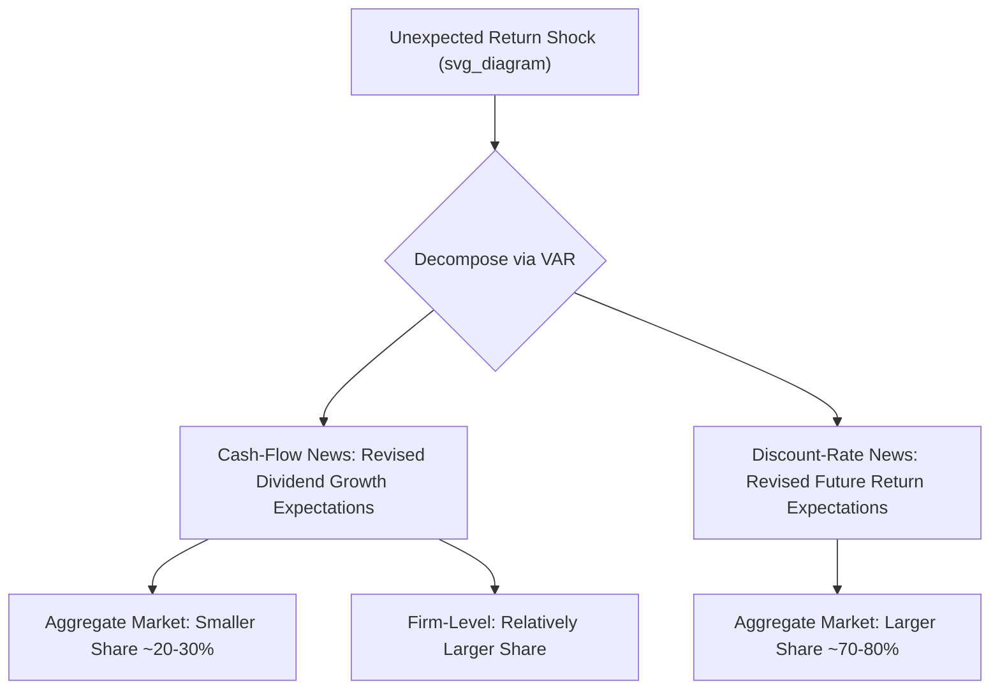

## Variance Decomposition of Stock Prices

### Overview

Variance decomposition of stock prices addresses a foundational question in asset pricing: how much of the observed volatility in stock prices (or price-dividend ratios) is attributable to news about future cash flows (dividends) versus news about future discount rates (expected returns)? This framework, pioneered by Shiller's excess volatility work and formalized by Campbell and Shiller's present-value decomposition, provides a rigorous accounting identity for partitioning price variation into cash-flow news and discount-rate news components, with far-reaching implications for whether observed stock price volatility is consistent with rational asset pricing.

### Historical Origins: The Excess Volatility Debate

**Shiller (1981) and LeRoy-Porter (1981)**

Robert Shiller and, independently, LeRoy and Porter, showed that aggregate stock prices appeared to be **far more volatile** than could be justified by subsequent realized variation in dividends under a simple constant-discount-rate present value model. If prices equal the present value of expected future dividends at a constant discount rate, price volatility should be **bounded above** by the volatility of the ex-post rational (perfect-foresight) price computed from actual realized dividends.

**Shiller's Variance Bound**

$$Var(P_t) \leq Var(P_t^*)$$

where $P_t^*$ is the ex-post rational price (computed using perfect foresight of all future dividends, discounted at a constant rate). Shiller found that actual observed price volatility substantially **exceeded** this theoretical bound — a finding interpreted as evidence against the simplest constant-discount-rate efficient markets model, and initially interpreted by some as evidence of "excess volatility" driven by irrational investor behavior.

**Methodological Critiques**

Subsequent research (notably by Kleidon, 1986, and Marsh and Merton, 1986) raised serious econometric objections to Shiller's variance bounds tests, particularly regarding the **non-stationarity** of dividends and prices, which can invalidate the standard variance comparison methodology and its statistical inference. This critique substantially tempered the strength of conclusions that could be drawn from the earliest excess volatility tests, redirecting the literature toward the more econometrically robust Campbell-Shiller log-linear framework. [Inference: the degree to which these critiques fully overturned versus merely qualified Shiller's original conclusions remains a matter of ongoing scholarly interpretation.]

### The Campbell-Shiller Log-Linear Present Value Framework

**Derivation**

Campbell and Shiller (1988) developed a **log-linear approximation** to the exact present value identity, avoiding the non-stationarity problems of level-based variance bounds tests. Starting from the definition of a one-period log return:

$$r_{t+1} = \log(P_{t+1} + D_{t+1}) - \log(P_t)$$

Taking a first-order Taylor approximation around the mean log dividend-price ratio yields the linearized identity:

$$r_{t+1} \approx k + \rho p_{t+1} + (1-\rho) d_{t+1} - p_t$$

where $p_t$ and $d_t$ are log price and log dividend respectively, $k$ is a linearization constant, and $\rho = \frac{1}{1 + \exp(\overline{d-p})}$ is a discount coefficient close to (but slightly less than) 1, derived from the average dividend-price ratio around which the approximation is taken.

**Solving Forward: The Price-Dividend Ratio Identity**

Solving this difference equation forward (imposing a transversality/no-bubble condition ruling out explosive rational bubble terms) yields:

$$dp_t \equiv d_t - p_t \approx -\frac{k}{1-\rho} + \sum_{j=0}^{\infty} \rho^j E_t[r_{t+1+j}] - \sum_{j=0}^{\infty} \rho^j E_t[\Delta d_{t+1+j}]$$

This is the central identity: the log dividend-price ratio equals (up to a constant) the expected present discounted value of **all future returns** minus the expected present discounted value of **all future dividend growth rates**.

### The Variance Decomposition

Taking the variance of both sides of the (demeaned) identity and using the definitions of the discounted sums of expected returns ($\widehat{RN}_t$, "return news" or discount-rate news) and expected dividend growth ($\widehat{CFN}_t$, "cash-flow news"):

$$Var(dp_t) = Var(\widehat{RN}_t) + Var(\widehat{CFN}_t) - 2Cov(\widehat{RN}_t, \widehat{CFN}_t)$$

More commonly, the decomposition is expressed directly in terms of **unexpected returns** rather than the price-dividend ratio itself. Campbell (1991) showed that unexpected returns can be decomposed as:

$$r_{t+1} - E_t[r_{t+1}] = \eta_{CF,t+1} - \eta_{DR,t+1}$$

where:

- $\eta_{CF,t+1} = (E_{t+1} - E_t)\sum_{j=0}^{\infty} \rho^j \Delta d_{t+1+j}$ is **cash-flow news** — the revision in expectations about all future dividend growth.
- $\eta_{DR,t+1} = (E_{t+1} - E_t)\sum_{j=1}^{\infty} \rho^j r_{t+1+j}$ is **discount-rate news** — the revision in expectations about all future returns.

Taking variances:

$$Var(r_{t+1} - E_t[r_{t+1}]) = Var(\eta_{CF,t+1}) + Var(\eta_{DR,t+1}) - 2Cov(\eta_{CF,t+1}, \eta_{DR,t+1})$$

**Interpretation**

An **unexpected positive return shock** (a surprise price increase) must be attributable to **either**:

1. **Good cash-flow news**: investors revised upward their expectations of future dividend growth ($\eta_{CF,t+1} > 0$), or
2. **Good discount-rate news**: investors revised downward their expectations of future required returns/discount rates ($\eta_{DR,t+1} < 0$, since a lower discount rate raises the present value of a given cash-flow stream).

### Empirical Findings: Discount-Rate News Dominance

**Campbell (1991) and Campbell and Vuolteenaho (2004)**

A striking and highly influential empirical finding across this literature: at the **aggregate market level**, the **majority of stock price/return variance is attributable to discount-rate news, not cash-flow news** — contrary to what might be naively expected under a simple model where prices move primarily because of information about future company earnings/dividends.

**Key Points**

- Estimates in this literature commonly attribute somewhere in the range of **70–80% (or more)** of aggregate market return variance to discount-rate news, with cash-flow news accounting for a comparatively small share, though the precise split varies meaningfully depending on sample period, data frequency, and the specific VAR specification used to estimate the news components. [Inference: cited percentage ranges are illustrative of a commonly-reported pattern in this literature rather than a single universally agreed-upon precise figure.]
- This finding is significant because it implies that most of what moves stock prices day-to-day (or year-to-year) is **not** primarily new information about companies' future cash-generating ability, but rather changing views about the appropriate discount rate/required return — directly reinforcing the business-cycle-variation-in-expected-returns literature (time-varying expected returns are large enough to be the dominant driver of aggregate price variance, not a secondary phenomenon).
- **Firm-level** variance decompositions, by contrast, often show a relatively larger role for cash-flow news than the aggregate market decomposition, since idiosyncratic firm-specific cash-flow shocks (earnings surprises, product outcomes) are a much larger share of firm-level return variance than they are of market-wide variance, where idiosyncratic cash-flow shocks average out across many firms. [Inference: the precise aggregate-versus-firm-level contrast in relative shares is a general empirical pattern subject to measurement-method sensitivity.]

### VAR Methodology for Estimating News Components

**Standard Approach**

Since $\eta_{CF}$ and $\eta_{DR}$ are not directly observable (they are revisions in *expectations* about infinite future sums), they must be estimated using a **Vector Autoregression (VAR)** framework:

1. Specify a state vector $z_t$ including the return $r_t$ and a set of predictor variables believed to forecast returns (e.g., dividend-price ratio, term spread, other predictors discussed in related chapter content).
2. Estimate a first-order VAR:

$$z_{t+1} = A z_t + w_{t+1}$$

3. Discount-rate news is then recovered as a linear function of the VAR shock vector $w_{t+1}$ and the estimated VAR coefficient matrix $A$:

$$\eta_{DR,t+1} = e_1' \rho A (I - \rho A)^{-1} w_{t+1}$$

where $e_1'$ selects the return equation's shock.

4. Cash-flow news is then recovered as the **residual**, using the identity that unexpected returns equal cash-flow news minus discount-rate news:

$$\eta_{CF,t+1} = w_{r,t+1} + \eta_{DR,t+1}$$

where $w_{r,t+1}$ is the unexpected return shock (the return equation's own VAR residual).

**Key Methodological Point**

Because cash-flow news is typically backed out as a **residual** in this VAR framework (rather than estimated from a direct dividend-growth forecasting equation), the variance decomposition results are **sensitive to the choice of state variables** included in the VAR — omitting a genuinely return-relevant predictor can distort the apparent split between cash-flow and discount-rate news. This sensitivity has been a recurring point of methodological debate and robustness testing in the literature.

### Illustrative Framework

### Implications for Return Predictability

**Connection to the Time-Varying Expected Returns Literature**

The dominance of discount-rate news in aggregate price variance provides strong indirect support for the **existence of substantial time-varying expected returns**, since if discount rates were constant (as in the simplest CAPM), there would be no discount-rate news component at all, and essentially all price variance would need to be attributed to cash-flow news — directly contradicting the empirical decomposition findings.

**Connection to Cochrane's "Dog That Did Not Bark" Argument**

This variance decomposition result is closely related to, and mutually reinforcing with, Cochrane's (2008) argument (discussed in related dividend yield chapter content) that weak dividend-growth predictability from the dividend-price ratio implies strong return predictability, given the present-value identity. Both lines of evidence point to the same conclusion: **most aggregate stock market volatility reflects changing discount rates (expected returns), not changing views about future cash flows.**

### Applications to Cross-Sectional Asset Pricing

**Campbell and Vuolteenaho's "Bad Beta, Good Beta" (2004)**

Campbell and Vuolteenaho extended the variance decomposition framework to the **cross-section** of stock returns, decomposing individual stocks' market betas into:

- **"Bad beta"**: sensitivity to aggregate **discount-rate news** (cash-flow-news-driven market movements are argued to be relatively less painful for long-horizon investors since they don't necessarily worsen the investment opportunity set going forward, whereas discount-rate shocks that raise future required returns are argued to be a more persistent, worse form of risk).
- **"Good beta"**: sensitivity to aggregate **cash-flow news**.

They find that value stocks tend to have higher "bad beta" (more sensitivity to discount-rate news) than growth stocks, and argue this provides a partial risk-based explanation for the value premium — value stocks are riskier in the sense that matters more for long-horizon investors, justifying their higher average returns without requiring a purely behavioral/mispricing explanation. [Inference: acceptance of this "bad beta/good beta" risk-based explanation for the value premium is not universal in the literature and remains one of several competing explanations discussed in cross-sectional anomaly research.]

### Practical and Methodological Considerations

**Key Points**

- **VAR specification sensitivity**: results are highly dependent on which state variables are included; robustness checks across multiple VAR specifications are standard practice in this literature.
- **Sample period sensitivity**: the relative share of discount-rate versus cash-flow news has been shown to vary across sub-periods, with some studies finding a larger cash-flow news role in specific eras (e.g., periods with unusually large earnings surprises or macroeconomic shocks). [Unverified: the specific dating and magnitude of such sub-period shifts vary across studies and are not settled facts.]
- **Discount coefficient ($\rho$) calibration**: the linearization constant $\rho$ is typically calibrated close to a value like 0.95–0.97 (annual data) based on the average historical dividend-price ratio, and results can be somewhat sensitive to this choice, though this sensitivity is generally considered secondary to the VAR specification choice. [Inference: relative sensitivity ranking is based on typical robustness-check patterns reported across studies, not a universal quantitative result.]

### Worked Example

**Example**

Suppose a researcher estimates a simple two-variable VAR (return and log dividend-price ratio) on annual aggregate market data and obtains the following variance decomposition of unexpected market returns:

- $Var(\eta_{CF})$ (cash-flow news variance): 0.008
- $Var(\eta_{DR})$ (discount-rate news variance): 0.021
- $Cov(\eta_{CF}, \eta_{DR})$: 0.003

Total unexpected return variance:

$$Var(r - E[r]) = 0.008 + 0.021 - 2(0.003) = 0.023$$

The discount-rate news variance (0.021) is substantially larger than the cash-flow news variance (0.008), and their **positive** covariance (0.003) implies cash-flow news and discount-rate news tend to move in the **same direction** (e.g., good cash-flow news tends to coincide with declining discount rates), which **reduces** the offsetting effect that would otherwise occur if they moved in opposite directions, since discount-rate news enters the unexpected-return identity with a negative sign. This numerical example illustrates the typical qualitative pattern of discount-rate-news dominance found throughout the aggregate variance decomposition literature.

### Related Topics

- Dividend yield and return forecasting (the underlying present-value identity)
- Predictive regressions and their statistical pitfalls (VAR estimation challenges)
- Business-cycle variation in expected returns (economic interpretation of discount-rate news)
- Cochrane's "Dog That Did Not Bark" cash-flow/return decomposition argument
- Campbell-Vuolteenaho "bad beta, good beta" cross-sectional application
- Shiller excess volatility debate and Kleidon/Marsh-Merton critiques
- Vector autoregression (VAR) methodology in asset pricing
- Rational bubbles and transversality conditions in present-value models
- Habit formation and long-run risk models (theoretical sources of discount-rate variation)
- Firm-level versus aggregate variance decomposition differences