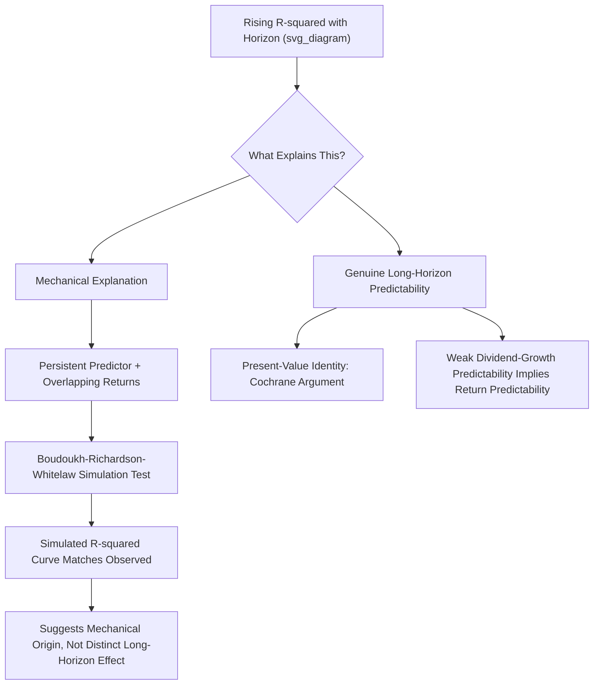

## The Long-Horizon Predictability Debate

### Overview

The long-horizon predictability debate concerns whether stock returns become **more predictable at longer forecast horizons** (3, 5, or even 10-year returns) than at short horizons (monthly or quarterly), and whether the statistical evidence for this pattern reflects genuine economic phenomena or is instead a byproduct of mechanical statistical features inherent in long-horizon regression methodology. This debate sits at the intersection of the dividend yield, predictive regression, and variance decomposition literatures already covered, and represents one of the most methodologically contentious areas in empirical asset pricing.

### The Empirical Pattern

**Rising $R^2$ with Horizon**

A widely replicated empirical finding: predictive regressions of cumulative returns on lagged valuation ratios (dividend yield, book-to-market, and similar measures) show **increasing $R^2$ statistics as the forecast horizon lengthens**.

$$r_{t \to t+k} = \alpha_k + \beta_k \cdot dp_t + \varepsilon_{t \to t+k}$$

Typical patterns documented in studies such as Fama and French (1988) and Campbell and Shiller (1988) show $R^2$ rising from perhaps 1–3% at a 1-month or 1-quarter horizon to 20–40% or more at 4- or 5-year horizons, depending on sample period and specification. [Inference: exact percentage ranges vary substantially by sample period, country, and predictor variable; the figures cited are illustrative of the commonly-reported qualitative pattern rather than a single precise universal estimate.]

**Naive Interpretation**

At face value, this pattern appears to suggest that while short-horizon returns are nearly unpredictable (consistent with something close to a random walk over short periods), a substantial and increasingly large fraction of long-horizon return variation is forecastable using current valuation levels — implying markets exhibit meaningful **mean reversion** over multi-year horizons even if they appear close to efficient at short horizons.

### Mechanical/Statistical Explanations for Rising Long-Horizon $R^2$

**Persistence of the Predictor**

Because $dp_t$ (or similar valuation ratios) is highly **persistent** (evolves slowly, with autoregressive coefficient $\phi$ close to 1), a given deviation of $dp_t$ from its mean tends to **remain informative for many periods into the future**. This mechanically causes the *cumulative* forecast (summing predicted returns over many future periods, each partially explained by the persistent predictor) to explain a larger share of *cumulative* return variance than any single-period forecast explains of single-period variance — even under a data-generating process where the *true* underlying relationship is the same simple linear one at every horizon.

**Overlapping Observations and Small-Sample Artifacts**

As discussed extensively in the predictive-regression pitfalls literature, long-horizon regressions constructed from overlapping return windows induce severe serial correlation in residuals. Critically, this overlap-induced correlation structure can itself **mechanically inflate the apparent $R^2$** at long horizons in finite samples, independent of any genuine increase in economic predictability, because the effective number of independent observations shrinks dramatically as the horizon lengthens relative to the sample length (e.g., 60 years of annual data provides only about 12 non-overlapping 5-year return observations).

**Boudoukh, Richardson, and Whitelaw (2008) — "The Myth of Long-Horizon Predictability"**

This influential paper directly challenged the interpretation of rising long-horizon $R^2$ as evidence of genuine, economically meaningful long-horizon predictability distinct from short-horizon predictability.

**Key Argument**

- Under the null hypothesis that the *only* source of predictability is the simple single-period linear relationship (i.e., no additional, distinct "long-horizon-specific" predictability exists), the mechanical construction of overlapping long-horizon returns **still produces a rising $R^2$ pattern that closely resembles what is observed empirically**.
- They demonstrate via simulation that the qualitative shape of the rising $R^2$ curve found in actual data is largely consistent with what would be generated purely mechanically from the known persistence properties of the predictor, **without requiring any additional true long-horizon effect beyond the single-period relationship.**
- Their conclusion: much of the celebrated "long-horizon predictability" finding may be a **statistical illusion driven by the mechanics of persistent regressors and overlapping-return construction**, rather than a genuine distinct economic phenomenon requiring separate theoretical explanation.

### Boudoukh-Richardson-Whitelaw Simulation Methodology

**Approach**

1. Estimate the single-period (e.g., monthly) predictive regression relationship and the persistence parameter of the predictor from actual data.
2. Simulate artificial return and predictor data using **only** this single-period relationship (imposing that there is no additional predictability beyond what the one-period regression captures).
3. Construct long-horizon cumulative returns from this simulated single-period data using the same overlapping-window methodology used in actual empirical studies.
4. Compare the $R^2$ pattern generated purely mechanically in the simulation to the $R^2$ pattern observed in real data.

**Finding**

The simulated, purely-mechanical $R^2$ pattern closely tracks the empirically observed pattern, supporting the interpretation that the rising-$R^2$-with-horizon finding does not necessarily require positing any genuinely distinct long-horizon economic mechanism.

### Counter-Arguments and Defenses of Genuine Long-Horizon Predictability

**Cochrane's Response and the Present-Value Identity Argument**

Cochrane (and related work) has argued that the present-value/variance-decomposition framework (discussed in related chapter content) provides an **independent, non-mechanical** argument for long-horizon return predictability: given that dividend growth is essentially unpredictable from the dividend-price ratio (an empirically robust finding not itself subject to the overlapping-window critique in the same way), the present-value identity **logically requires** that the dividend-price ratio predict long-horizon returns, since the identity states that variation in $dp_t$ must be explained by *something* — and if it isn't dividend growth, it must be returns. This argument is presented as standing somewhat independently of the specific overlapping-regression $R^2$ mechanics that Boudoukh-Richardson-Whitelaw critique.

**Distinguishing "Mechanical" from "Meaningless"**

Some researchers have pushed back on the framing that a mechanically-generated rising $R^2$ pattern is therefore **economically meaningless**. Even if the *rise* in $R^2$ with horizon is a mathematical consequence of persistence (which is not itself in dispute), the *existence* of even modest single-period predictability, if genuine, still implies genuine (if smaller in relative $R^2$ terms once properly benchmarked) economic long-horizon predictability — the debate is thus partly about **how the finding should be interpreted and communicated**, rather than solely about whether any predictability exists at all. [Inference: this reconciliation view represents one interpretive stance among several in an unsettled methodological debate.]

### Statistical Tools for Adjudicating the Debate

**Comparing Actual vs. Simulated $R^2$ Curves**

The core empirical test in this literature involves directly comparing the observed $R^2$-versus-horizon curve to the curve implied purely by the single-period relationship and predictor persistence (via simulation, as in Boudoukh-Richardson-Whitelaw), rather than treating the observed long-horizon $R^2$ in isolation as if it were self-evidently meaningful.

**Direct Long-Horizon Hypothesis Tests with Robust Inference**

Given the serial correlation problems, valid inference on long-horizon coefficients requires:

- **Newey-West HAC standard errors** with an appropriately long lag truncation (though, as noted in related content, these can still perform poorly in small samples with very long horizons relative to sample length).
- **Simulation-based or bootstrap critical values**, constructed under an explicit null hypothesis (e.g., no predictability at all, or "only single-period predictability with no additional long-horizon-specific effect") to properly benchmark whether an observed long-horizon coefficient/$R^2$ is unusual relative to that specific null.

**Out-of-Sample Long-Horizon Tests**

Analogous to the Goyal-Welch approach at short horizons, genuine out-of-sample forecasting tests at long horizons (recursively estimating the model using only past data and generating true forward long-horizon forecasts) provide an important, if less commonly implemented due to data requirements, check on whether the in-sample long-horizon predictability pattern is exploitable in a genuine forecasting sense.

### Illustrative Framework

### Connection to Related Debates

**Relationship to Variance Decomposition**

The long-horizon predictability debate is closely intertwined with the variance decomposition literature (discussed in related chapter content): if discount-rate news dominates aggregate return variance, and discount rates are persistent, this naturally generates both (a) modest short-horizon predictability and (b) mechanically larger apparent long-horizon $R^2$, without requiring these to be viewed as two separate phenomena needing distinct explanations.

**Relationship to the Business-Cycle Framework**

Genuine economic theories of time-varying, countercyclical expected returns (habit formation, long-run risk, as discussed in related chapter content) generally predict return predictability that **is** persistent over multiple years, since business cycles themselves last multiple years — providing a plausible economic rationale for why long-horizon predictability, even if partly mechanical in its $R^2$ measurement, could still reflect a genuine underlying phenomenon operating at business-cycle frequencies.

### Practical Implementation Considerations

**Key Points**

- **Never interpret rising long-horizon $R^2$ in isolation** as strong evidence of a distinct "long-horizon effect" without benchmarking against what a purely mechanical simulation (given the predictor's known persistence) would generate under the null of only single-period predictability.
- **Report effective sample size**, not just calendar sample length, when presenting long-horizon regression results, given how few genuinely independent long-horizon observations are available even in datasets spanning many decades.
- **Prefer simulation-based or bootstrapped critical values** over naive asymptotic or even standard Newey-West-adjusted critical values for long-horizon coefficient tests, given the documented poor small-sample performance of HAC standard errors at very long horizons.
- **Combine long-horizon regression evidence with independent tests** (e.g., variance decomposition, dividend-growth predictability tests) rather than relying on a single methodological approach, since the debate largely centers on the interpretation of a single class of statistical evidence viewed in isolation.

### Worked Example

**Example**

Suppose a researcher observes the following pattern of $R^2$ values from predictive regressions of cumulative returns on dividend yield at different horizons using 70 years of annual U.S. data:

| Horizon | Observed $R^2$ |
| --- | --- |
| 1 year | 4% |
| 3 years | 14% |
| 5 years | 27% |

Applying the Boudoukh-Richardson-Whitelaw simulation approach: using only the estimated 1-year relationship ($\hat{\beta}_1$ and its implied persistence-driven mechanical extrapolation) to simulate artificial data with no additional long-horizon-specific effect, suppose the simulation produces:

| Horizon | Simulated (Mechanical) $R^2$ |
| --- | --- |
| 1 year | 4% (matches by construction) |
| 3 years | 12% |
| 5 years | 24% |

Since the simulated mechanical $R^2$ values (12%, 24%) are reasonably close to the actual observed values (14%, 27%), this would support the Boudoukh-Richardson-Whitelaw interpretation that most of the apparent rise in $R^2$ with horizon is attributable to the mechanical persistence effect rather than a separate, additional long-horizon-specific predictive phenomenon requiring its own economic explanation.

### Related Topics

- Predictive regressions and their statistical pitfalls (Stambaugh bias, overlapping returns)
- Dividend yield and return forecasting (the primary empirical application)
- Variance decomposition of stock prices (Cochrane's counter-argument foundation)
- Business-cycle variation in expected returns (economic rationale for persistence)
- Boudoukh, Richardson, and Whitelaw simulation methodology
- Goyal-Welch out-of-sample predictability framework
- Newey-West standard errors and small-sample performance limitations
- Unit root and near-unit-root econometrics of persistent predictors
- Campbell-Yogo Bonferroni Q-test as an alternative robust inference approach
- Present-value identities and the Campbell-Shiller log-linearization