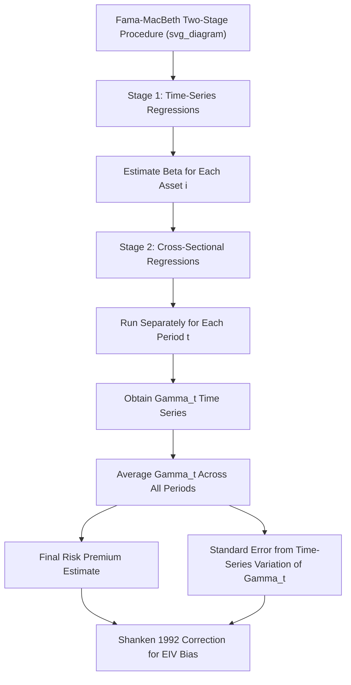

## Fama-MacBeth Cross-Sectional Regressions

### Overview

The Fama-MacBeth procedure is a two-stage econometric methodology, introduced by Fama and MacBeth (1973), designed to test asset pricing models by estimating and evaluating the **cross-sectional relationship between risk exposures (betas) and average returns**. It remains one of the most widely used empirical methods in asset pricing for testing whether a proposed risk factor is priced (commands a statistically and economically significant risk premium) in the cross-section of asset returns, and for estimating factor risk premia directly.

### Motivation: Testing the Cross-Section of Expected Returns

**The Basic Asset Pricing Question**

A central prediction of factor asset pricing models (CAPM, Fama-French three/five-factor models, and their extensions) is that an asset's **expected return** should be a linear function of its **exposures (betas)** to one or more systematic risk factors:

$$E[R_i] = \gamma_0 + \gamma_1 \beta_{i,1} + \gamma_2 \beta_{i,2} + \dots + \gamma_K \beta_{i,K}$$

where $\beta_{i,k}$ is asset $i$'s exposure to factor $k$, and $\gamma_k$ is the **risk premium** (price of risk) associated with factor $k$. Testing this relationship requires (1) estimating each asset's factor betas, and (2) testing whether these betas are meaningfully related to average returns in the cross-section, with $\gamma_k$ statistically distinguishable from zero for factors believed to be priced.

### The Two-Stage Procedure

**Stage 1: Time-Series Regressions to Estimate Betas**

For each asset (or portfolio) $i$, run a **time-series regression** of its returns on the candidate factor(s) using the full available sample:

$$R_{i,t} = \alpha_i + \beta_{i,1} F_{1,t} + \beta_{i,2} F_{2,t} + \dots + \beta_{i,K} F_{K,t} + \varepsilon_{i,t}$$

This produces an estimated beta vector $\hat{\beta}_i = (\hat{\beta}_{i,1}, \dots, \hat{\beta}_{i,K})$ for each asset $i$, typically estimated once using the full sample (a "full-period beta" approach) or, in some implementations, using a rolling window that allows betas to vary over time.

**Stage 2: Cross-Sectional Regressions, Period by Period**

For **each time period** $t$ in the sample, run a **cross-sectional regression** of that period's realized returns across all $N$ assets on their (Stage 1-estimated) betas:

$$R_{i,t} = \gamma_{0,t} + \gamma_{1,t} \hat{\beta}_{i,1} + \gamma_{2,t} \hat{\beta}_{i,2} + \dots + \gamma_{K,t} \hat{\beta}_{i,K} + \eta_{i,t}, \quad \text{for } i = 1, \dots, N$$

This is estimated **separately for every single time period** $t = 1, \dots, T$ in the sample, producing a full **time series** of estimated risk premia $\{\hat{\gamma}_{k,t}\}_{t=1}^{T}$ for each factor $k$.

**Final Step: Time-Series Averaging**

The final Fama-MacBeth estimate of each factor's risk premium is simply the **time-series average** of the period-by-period cross-sectional coefficient estimates:

$$\hat{\gamma}_k = \frac{1}{T} \sum_{t=1}^{T} \hat{\gamma}_{k,t}$$

**Standard Error Construction**

Because the same underlying asset pricing relationship is (under the null) expected to hold in every period, but sampling variation causes $\hat{\gamma}_{k,t}$ to fluctuate period to period, the standard error of $\hat{\gamma}_k$ is computed directly from the **time-series variation** of the period-by-period estimates:

$$SE(\hat{\gamma}_k) = \frac{\sigma(\hat{\gamma}_{k,t})}{\sqrt{T}}$$

where $\sigma(\hat{\gamma}_{k,t})$ is the sample standard deviation of the time series $\{\hat{\gamma}_{k,t}\}$. This construction is the defining innovation of the Fama-MacBeth approach: it automatically accounts for **cross-sectional correlation** in the residuals $\eta_{i,t}$ within each period (since assets' returns are correlated with each other contemporaneously due to common shocks), a problem that a single naive pooled OLS regression across all assets and time periods would ignore, leading to understated standard errors if uncorrected.

### Why Fama-MacBeth Standard Errors Handle Cross-Sectional Correlation

**The Core Insight**

In a single cross-sectional regression at time $t$, the residuals $\eta_{i,t}$ across different assets $i$ are very likely to be correlated with each other, since all assets are exposed (to varying degrees) to common contemporaneous shocks (market-wide news, sector-wide events, and so on) not fully captured by the included factor(s). A naive pooled regression across all $(i,t)$ observations, treating each as an independent observation, would ignore this cross-sectional dependence and dramatically understate the true standard errors.

By instead estimating **one$coefficient per period** and then treating the resulting time series of period-by-period estimates as the unit of inference, the Fama-MacBeth procedure implicitly and automatically absorbs any form of cross-sectional correlation in a given period — since whatever common shock affected many assets in period $t$ is fully reflected in that period's single $\hat{\gamma}_{k,t}$ estimate, without requiring the researcher to explicitly model the cross-sectional covariance structure of $\eta_{i,t}$.

### Statistical Refinements and Known Issues

**Errors-in-Variables (EIV) Problem**

Because the Stage 1 betas $\hat{\beta}_i$ used as regressors in Stage 2 are themselves **estimated with sampling error** (rather than known with certainty), the Stage 2 cross-sectional regression suffers from a classic **errors-in-variables** problem, which is known to bias the estimated risk premium $\hat{\gamma}_k$ **toward zero** (attenuation bias), similarly to measurement error bias in a standard regressor.

**Shanken (1992) Correction**

Shanken developed an adjustment to the Fama-MacBeth standard errors (and, in some treatments, the point estimates) that explicitly accounts for the sampling uncertainty in the first-stage beta estimates, producing corrected ("Shanken-corrected") standard errors that are generally **larger** than the naive Fama-MacBeth standard errors, reflecting the additional source of estimation uncertainty from Stage 1. Reporting Shanken-corrected standard errors alongside standard Fama-MacBeth standard errors has become common practice in rigorous empirical asset pricing work, since failing to make this adjustment can overstate the statistical significance of estimated risk premia.

**Portfolio Grouping to Reduce Beta Estimation Error**

A widely used practical remedy, predating and complementing the Shanken correction, is to **group individual assets into portfolios** (e.g., sorted by size and book-to-market, as in Fama-French's original 25 size/value portfolios) before running the two-stage procedure, rather than using individual stocks directly.

**Rationale:**

- Individual stock betas are estimated with substantial noise (idiosyncratic volatility dominates).
- Grouping stocks into portfolios based on characteristics correlated with true betas (e.g., prior beta rank, size, industry) produces portfolios with **more precisely estimated betas** (averaging out idiosyncratic estimation error across the many stocks within each portfolio), at the cost of a coarser cross-section (fewer distinct test assets) and reduced power to detect finer cross-sectional patterns.
- This tradeoff between reducing errors-in-variables bias (favoring portfolios) versus preserving cross-sectional granularity and statistical power (favoring individual stocks or a large number of narrowly-defined portfolios) is a persistent design choice debated throughout the empirical asset pricing literature. [Inference: the optimal degree of portfolio grouping is a methodological judgment call without a single universally agreed-upon standard.]

**"Beta on Beta" / Errors-in-Variables Alternative Solutions**

Some later methodological work has proposed alternative or complementary approaches, including instrumental-variables techniques and generalized method of moments (GMM) estimation of the full asset pricing model jointly (avoiding the strict two-stage separation), which can, under appropriate conditions, address the errors-in-variables problem more directly than the Shanken correction alone. [Inference: relative merits of GMM-based joint estimation versus corrected two-stage Fama-MacBeth are actively debated and depend on the specific application and assumptions imposed.]

### Illustrative Framework

### Testing Framework: What Constitutes a "Priced" Factor

**Key Points**

- A factor is considered **priced** in the cross-section if its estimated risk premium $\hat{\gamma}_k$ is statistically significantly different from zero (using either naive Fama-MacBeth or Shanken-corrected standard errors) and has the theoretically expected sign.
- The **intercept term** $\hat{\gamma}_0$ (averaged across periods) is often separately examined: under a well-specified asset pricing model that fully explains the cross-section, the average intercept should be close to the risk-free rate (if using excess returns as the dependent variable, it should be close to zero), and a significantly non-zero intercept can indicate model misspecification.
- **Cross-sectional $R^2$** (from the Stage 2 regressions, often averaged across periods, or computed via a GLS-weighted approach) is commonly reported as a measure of how well the candidate factor(s) explain cross-sectional return variation, complementing the significance tests on individual $\hat{\gamma}_k$ coefficients.

### Practical Implementation Steps

**Key Points**

- **Choose test assets**: individual stocks, characteristic-sorted portfolios (e.g., 25 size/value portfolios, 10 momentum deciles), or industry portfolios — the choice materially affects both statistical power and the errors-in-variables tradeoff discussed above.
- **Estimate first-stage betas**: decide on estimation window (full sample, rolling window, or expanding window) and return frequency (daily, monthly) for the time-series regressions; using a rolling window allows betas to vary over time but introduces additional estimation noise per window relative to full-sample estimation.
- **Run period-by-period cross-sectional regressions**: ensure a sufficient number of test assets $N$ relative to the number of factors $K$ in each cross-sectional regression to allow reliable coefficient estimation.
- **Average and construct standard errors**: compute the simple time-series average of $\hat{\gamma}_{k,t}$ and its associated standard error; apply the Shanken correction if reporting rigorous, EIV-adjusted inference.
- **Report both raw and Shanken-corrected results**, along with cross-sectional $R^2$ and intercept diagnostics, for a complete picture of model performance.

### Worked Example

**Example**

Suppose a researcher tests the CAPM using 25 size/book-to-market sorted portfolios (Fama-French style) over 480 months (40 years) of monthly data.

**Stage 1**: For each of the 25 portfolios, regress monthly excess returns on the market excess return over the full 480-month sample, obtaining 25 estimated market betas $\hat{\beta}_i$ ranging, say, from 0.7 to 1.4 across portfolios.

**Stage 2**: For each of the 480 months, run a cross-sectional regression of that month's 25 portfolio excess returns on the 25 (fixed) estimated betas:

$$R_{i,t} = \gamma_{0,t} + \gamma_{1,t}\hat{\beta}_i + \eta_{i,t}, \quad i = 1, \dots, 25$$

This produces 480 separate estimates of $\gamma_{1,t}$ (the month-by-month "price of market risk").

**Final Averaging**: Suppose the time-series average of these 480 monthly estimates is $\hat{\gamma}_1 = 0.45\%$ per month, with a time-series standard deviation of $\sigma(\hat{\gamma}_{1,t}) = 4.5\%$. The Fama-MacBeth standard error is:

$$SE(\hat{\gamma}_1) = \frac{4.5\%}{\sqrt{480}} \approx 0.205\%$$

giving a t-statistic of approximately:

$$t = \frac{0.45\%}{0.205\%} \approx 2.2$$

This would be interpreted as statistically significant evidence (at conventional levels, though marginal) that market beta commands a positive risk premium in this sample — though a rigorous presentation would additionally report the Shanken-corrected standard error, which would typically be somewhat larger, potentially reducing this t-statistic and the apparent strength of the significance finding.

### Related Topics

- Shanken (1992) correction for errors-in-variables bias
- CAPM and multi-factor model testing frameworks
- Fama-French three- and five-factor model empirical tests
- Portfolio sorting methodology (characteristic-based test asset construction)
- Generalized Method of Moments (GMM) asset pricing estimation
- Cross-sectional $R^2$ and model comparison metrics in asset pricing
- Data mining and multiple-testing concerns (relevant to factor-testing applications)
- Time-series versus cross-sectional regression tradeoffs in empirical finance
- Rolling-window versus full-sample beta estimation
- Newey-West standard errors (contrast with Fama-MacBeth's period-averaging approach)