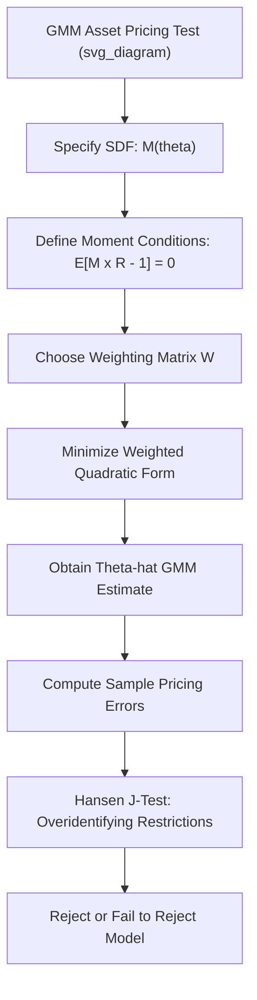

## GMM-Based Tests of Asset Pricing Models

### Overview

The Generalized Method of Moments (GMM), introduced to economics by Hansen (1982) and applied to asset pricing by Hansen and Singleton (1982), provides a unified, statistically rigorous framework for estimating and testing asset pricing models directly from their fundamental Euler equation (stochastic discount factor) restrictions, without requiring the strong distributional assumptions (e.g., normality, homoskedasticity) or the two-stage beta/risk-premium separation inherent in the Fama-MacBeth approach. GMM has become a standard, and in many respects more theoretically grounded, alternative for testing modern consumption-based and factor asset pricing models.

### The Stochastic Discount Factor Framework

**The Fundamental Pricing Equation**

Nearly all asset pricing models can be expressed through a single **stochastic discount factor (SDF)**, or pricing kernel, $M_{t+1}$, satisfying the fundamental Euler equation for any asset $i$:

$$E_t[M_{t+1} R_{i,t+1}] = 1$$

or, in excess return form:

$$E_t[M_{t+1} R^e_{i,t+1}] = 0$$

where $R^e_{i,t+1} = R_{i,t+1} - R_f$ is the excess return. Different asset pricing models correspond to different specifications of $M_{t+1}$:

- **CAPM**: $M_{t+1} = a - b R_{m,t+1}$ (a linear function of the market return).
- **Consumption CAPM**: $M_{t+1} = \delta \left(\frac{C_{t+1}}{C_t}\right)^{-\gamma}$ (discounted marginal utility growth, with $\gamma$ the coefficient of relative risk aversion).
- **Fama-French multifactor models**: $M_{t+1} = a - b_1 F_{1,t+1} - b_2 F_{2,t+1} - \dots$ (a linear function of multiple factors).

GMM directly estimates the parameters of $M_{t+1}$ (e.g., $a, b$ or $\gamma, \delta$) using the Euler equation as the defining moment condition, rather than working through the two-stage beta-based procedure.

### GMM Estimation Procedure

**Moment Conditions**

For a set of $N$ test assets and a candidate SDF $M_{t+1}(\theta)$ parameterized by a parameter vector $\theta$, the model implies $N$ population moment conditions:

$$E[g_t(\theta)] = E\left[M_{t+1}(\theta) R_{i,t+1} - 1\right] = 0, \quad i = 1, \dots, N$$

The sample analog, averaged over $T$ time periods, is:

$$\bar{g}_T(\theta) = \frac{1}{T}\sum_{t=1}^{T} g_t(\theta)$$

**The GMM Objective Function**

Since there are typically more moment conditions ($N$ test assets) than parameters to estimate (the dimension of $\theta$), the model is generally **overidentified**. GMM chooses $\hat{\theta}$ to minimize a weighted quadratic form in the sample moments:

$$\hat{\theta}_{GMM} = \arg\min_{\theta} \; \bar{g}_T(\theta)' W \bar{g}_T(\theta)$$

where $W$ is a positive semi-definite **weighting matrix** chosen by the researcher (or estimated optimally, as discussed below).

**Choice of Weighting Matrix**

- **Identity weighting matrix** ($W = I$): treats all moment conditions (test assets) equally; simple but not statistically efficient.
- **Optimal (efficient) GMM weighting matrix**: $W = S^{-1}$, where $S$ is the (estimated) long-run covariance matrix of the moment conditions $g_t(\theta)$. This choice, established by Hansen (1982), yields the asymptotically most efficient GMM estimator among all choices of $W$ for a given set of moment conditions, in the sense of producing the smallest asymptotic variance for $\hat{\theta}$.
- In practice, the optimal weighting matrix is typically estimated iteratively: an initial (e.g., identity-weighted) estimate of $\theta$ is used to compute residuals, which are used to estimate $S$, which is then used to re-estimate $\theta$, often iterated to convergence (a **two-step** or **iterated GMM** procedure).

### The J-Test: Testing Overidentifying Restrictions

**Hansen's J-Statistic**

When the model is overidentified ($N$ moment conditions exceed the number of parameters $K$ in $\theta$), GMM provides a natural **specification test** of whether the model's pricing restrictions hold jointly across all test assets:

$$J = T \cdot \bar{g}_T(\hat{\theta})' \hat{S}^{-1} \bar{g}_T(\hat{\theta}) \sim \chi^2_{N-K}$$

under the null hypothesis that the model is correctly specified (i.e., that the true SDF genuinely satisfies all $N$ moment conditions), where $\hat{S}$ is the estimated optimal weighting matrix and $N - K$ is the number of overidentifying restrictions (degrees of freedom).

**Interpretation**

- A **large** J-statistic (relative to the $\chi^2_{N-K}$ distribution, i.e., a small p-value) indicates that the model's pricing errors are jointly too large to be consistent with sampling error alone — evidence **against** the model.
- A **small** J-statistic (large p-value) indicates the model's pricing restrictions are not statistically rejected by the data — though, as with any specification test, failure to reject does **not** constitute positive proof the model is correct, only that the data do not provide strong evidence against it.

**Practical Note on J-Test Power**

The J-test's power to detect model misspecification depends heavily on the choice of test assets and sample size; a model can fail to be rejected simply because the chosen test assets do not provide much power to distinguish it from alternatives, a concern closely related to broader debates about test asset selection in the empirical asset pricing literature more generally.

### GMM vs. Fama-MacBeth: Key Comparisons

**Key Points**

- **Unified vs. two-stage estimation**: GMM estimates SDF parameters directly from the Euler equation in a single step, whereas Fama-MacBeth separates beta estimation (Stage 1, time series) from risk premium estimation (Stage 2, cross-section).
- **Errors-in-variables**: GMM does not suffer from the classic Fama-MacBeth errors-in-variables problem in the same way, since it does not rely on plugging noisy first-stage beta estimates into a second-stage regression as regressors — SDF parameters and implied pricing errors are estimated jointly and consistently under GMM's asymptotic theory.
- **Distributional assumptions**: GMM's asymptotic theory relies on relatively weak assumptions (stationarity and ergodicity of the relevant time series, plus standard regularity conditions), and does **not** require returns to be normally distributed or homoskedastic, whereas some classical alternative testing frameworks (e.g., certain maximum-likelihood-based tests) impose stronger distributional assumptions.
- **Direct testability via the J-test**: GMM provides a natural, built-in overidentification test (the J-test) of the full set of pricing restrictions jointly, whereas Fama-MacBeth relies on separate diagnostics (intercept tests, cross-sectional $R^2$) that are less unified.
- **Complexity and interpretability**: Fama-MacBeth remains popular in applied cross-sectional asset pricing partly due to its relative simplicity and direct interpretability (risk premia expressed in familiar return units), while GMM is often preferred in more theoretically-oriented consumption-based asset pricing research where the SDF itself, rather than a linear beta-risk-premium decomposition, is the primary object of interest. [Inference: relative popularity across subfields is a general pattern in the literature rather than a strict rule.]

### Linear Factor Models as a GMM Special Case

**Beta Representation vs. SDF Representation**

Linear multifactor models (like Fama-French) can be tested via GMM using the **SDF representation** described above (treating $M_{t+1} = a - b'F_{t+1}$ as the object being estimated), which is mathematically equivalent, under standard conditions, to the traditional **beta representation** (expected returns as a linear function of factor betas, as tested via Fama-MacBeth), though the two approaches can produce different finite-sample estimates and inference due to their different estimation mechanics.

**Equivalence and Practical Divergence**

While the two representations are asymptotically equivalent under correct model specification, GMM's SDF-based approach and the traditional beta/Fama-MacBeth approach can, and often do, produce numerically different point estimates, standard errors, and test statistics in any given finite sample, and researchers frequently report both approaches as complementary robustness checks on the same underlying economic question. [Inference: the degree of practical divergence is sample- and model-specific.]

### Illustrative Framework

### Practical Implementation Steps

**Key Points**

- **Specify the candidate SDF**: choose the functional form (linear factor model, consumption-based power utility, habit formation, or other) whose parameters are to be estimated and tested.
- **Select test assets**: as with Fama-MacBeth, the choice of test assets (individual stocks, characteristic-sorted portfolios, industry portfolios) affects both estimation precision and the power of the J-test; this remains a live methodological choice in GMM applications just as in beta-based approaches.
- **Choose estimation approach**: one-step (identity or pre-specified weighting matrix), two-step (estimate once, then re-weight optimally and re-estimate), or fully iterated GMM (repeat the re-weighting/re-estimation process to convergence).
- **Compute standard errors**: GMM standard errors are derived from the estimated asymptotic covariance matrix of $\hat{\theta}$, which properly accounts for both parameter estimation uncertainty and (via appropriate HAC-type long-run covariance estimation of $S$) serial correlation and heteroskedasticity in the moment conditions.
- **Conduct the J-test**: report the J-statistic, its degrees of freedom ($N - K$), and the associated p-value as the primary overall model specification test.
- **Examine individual pricing errors**: beyond the aggregate J-test, researchers commonly also examine the individual (asset-by-asset) sample pricing errors $\bar{g}_{T,i}(\hat{\theta})$ to identify which specific test assets the model prices poorly, providing more granular diagnostic information than the single aggregate J-statistic alone.

### Known Practical and Statistical Issues

**Key Points**

- **Weak identification**: when the candidate factors are weakly correlated with returns, or when consumption-based models' parameters (e.g., risk aversion $\gamma$) are difficult to pin down precisely from the available moment conditions, GMM estimates can be poorly identified, with the objective function relatively flat over a wide range of parameter values, producing unstable point estimates and unreliable standard errors. [Inference: weak identification concerns are particularly prominent in the consumption-based asset pricing literature, though their precise severity is model- and dataset-dependent.]
- **Small-sample performance of the J-test**: the asymptotic $\chi^2$ distribution of the J-statistic can be a poor approximation in small or moderate samples, particularly with many overidentifying restrictions (large $N$ relative to $T$), motivating the use of bootstrap-based alternatives to the asymptotic J-test critical values in some applications.
- **Sensitivity to weighting matrix estimation**: the estimated optimal weighting matrix $\hat{S}$ requires choices about long-run covariance estimation (e.g., HAC bandwidth/lag truncation, similar to the Newey-West choices discussed in the predictive regression literature), and results can be sensitive to these choices, particularly in smaller samples.
- **Test asset selection sensitivity**: as with Fama-MacBeth, GMM test results (both point estimates and the J-test outcome) can depend materially on which test assets are included, a persistent methodological concern across essentially all empirical asset pricing testing frameworks.

### Worked Example

**Example**

Suppose a researcher tests a simple linear two-factor model (market and value factors) via GMM using 10 industry portfolios as test assets, so $N = 10$ moment conditions and $K = 3$ parameters (the SDF constant plus two factor loadings, $a, b_1, b_2$), giving $N - K = 7$ overidentifying restrictions.

After two-step GMM estimation, suppose the researcher obtains:

- Estimated SDF parameters: $\hat{a} = 1.02$, $\hat{b}_1 = 0.85$, $\hat{b}_2 = 0.40$.
- J-statistic: $J = 9.8$.

Comparing to the $\chi^2_7$ distribution, the critical value at the 5% significance level is approximately 14.07. Since $9.8 < 14.07$, the researcher would **fail to reject** the null hypothesis that this two-factor model correctly prices the 10 industry portfolios jointly — evidence broadly consistent with (though not definitive proof of) the model's validity for this particular set of test assets, subject to the caveats about test power and test asset selection discussed above.

### Related Topics

- Fama-MacBeth cross-sectional regressions (comparison methodology)
- Hansen (1982) and the foundational GMM econometric theory
- Consumption-based asset pricing and the stochastic discount factor
- Hansen-Jagannathan bounds on the SDF's volatility
- Habit formation and long-run risk models as SDF specifications
- Newey-West HAC long-run covariance estimation (relevant to weighting matrix construction)
- Data mining and multiple-testing concerns (test asset selection parallels)
- Weak identification in structural econometric models
- Bootstrap methods for small-sample inference in asset pricing tests
- Linear factor model beta representation vs. SDF representation equivalence