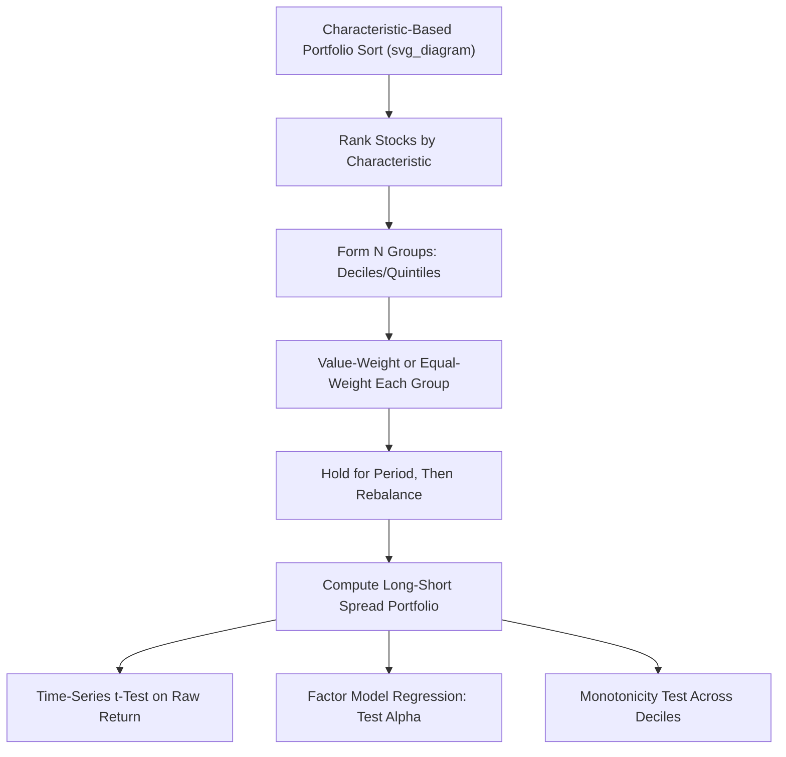

## Portfolio Sorts and Characteristic-Based Tests

### Overview

Portfolio sorting is the foundational empirical methodology of the cross-sectional asset pricing literature: grouping stocks into portfolios based on one or more observable characteristics (size, book-to-market, momentum, accruals, and similar), then examining whether average returns differ systematically across the resulting portfolios. This nonparametric approach predates and complements the regression-based methods (Fama-MacBeth, GMM) covered elsewhere in this chapter, and remains the standard first-pass diagnostic tool for documenting and characterizing virtually every anomaly discussed throughout this course.

### Rationale for Portfolio Sorting

**Why Sort Rather Than Regress Directly on Individual Stocks**

- **Noise reduction**: individual stock returns are extremely noisy (dominated by idiosyncratic volatility); averaging returns across many stocks sharing a common characteristic substantially reduces this noise, revealing the underlying relationship between the characteristic and average returns more clearly.
- **Nonparametric flexibility**: portfolio sorts do not impose a specific functional form (e.g., linearity) on the relationship between the characteristic and expected returns, unlike a standard linear regression, allowing nonlinearities (e.g., a relationship strong only in the extreme deciles) to be visually and statistically apparent.
- **Direct economic interpretability**: a long-short portfolio return (e.g., high-minus-low decile) has an immediate, intuitive interpretation as the payoff to an implementable trading strategy, unlike an abstract regression coefficient.
- **Reduced sensitivity to outliers**: extreme individual observations are diluted within a portfolio average, unlike in individual-stock regressions where outliers can have disproportionate leverage on estimated coefficients.

### Single-Sort Methodology

**Basic Procedure**

1. At each portfolio formation date (commonly monthly or annually, depending on the characteristic's update frequency), rank all stocks in the universe by the characteristic of interest (e.g., book-to-market ratio).
2. Divide the ranked stocks into $N$ groups (commonly deciles, $N=10$, or quintiles, $N=5$, though tercile or other breakpoints are also used).
3. Form a portfolio for each group, typically **value-weighted** (weighting each stock by its market capitalization) or **equal-weighted** (equal dollar weight per stock), and hold for a subsequent period (commonly one month).
4. Rebalance at the next formation date, repeating the ranking and portfolio formation process.
5. Compute the resulting time series of portfolio returns for each decile, and construct a **long-short (hedge) portfolio** return, typically the extreme decile difference:

$$R_{HML,t} = R_{Decile\ 10,t} - R_{Decile\ 1,t}$$

**Breakpoint Choice**

- **NYSE breakpoints**: a common convention (originating with Fama and French) uses breakpoints computed from **NYSE-listed stocks only**, then applies those breakpoints to the full universe including NASDAQ and AMEX stocks. This avoids the smaller-average-size distortion that would result from computing breakpoints across the full universe, since NASDAQ historically includes a disproportionate number of very small stocks that would otherwise skew equal-count breakpoints toward capturing mostly micro-cap variation.
- **All-stock breakpoints**: alternatively, breakpoints can be computed using the full universe directly, which is simpler but can result in decile portfolios dominated by very small, illiquid stocks at the extremes.

### Value-Weighted vs. Equal-Weighted Portfolios

**Key Points**

- **Value-weighted portfolios** better represent the returns actually achievable by the aggregate market (since they reflect how capital is actually allocated across firms of different sizes) and are less influenced by the potentially extreme returns of very small, illiquid stocks.
- **Equal-weighted portfolios** give every stock equal influence regardless of size, which can make anomalies appear stronger if the effect is concentrated in small-cap stocks (a common empirical pattern for many anomalies, including value and momentum), but may overstate the practically achievable return for a large investor facing capacity and liquidity constraints in small-cap names.
- Reporting **both** value-weighted and equal-weighted results is standard practice, since a large discrepancy between the two (anomaly present and strong under equal-weighting but weak or absent under value-weighting) is itself an important diagnostic, often signaling that an anomaly may be concentrated in small, illiquid, hard-to-trade stocks with limited practical exploitability. [Inference: while this pattern is a commonly cited diagnostic heuristic in the literature, its interpretation as evidence of limited exploitability versus other explanations depends on the specific anomaly and context.]

### Double Sorts and Multi-Way Sorts

**Motivation**

A **single sort** on one characteristic cannot distinguish whether the observed return pattern is genuinely attributable to that characteristic or is instead a byproduct of correlation with another, known return-relevant characteristic (a confounding variable problem analogous to omitted variable bias in regression).

**Independent Double Sort**

1. Independently sort stocks into groups based on **Characteristic A** (e.g., size) and, separately, into groups based on **Characteristic B** (e.g., book-to-market), each using the full universe's breakpoints.
2. Form the intersection portfolios (e.g., a 5×5 sort produces 25 portfolios, one for each size-quintile/value-quintile combination).
3. To isolate Characteristic B's effect controlling for Characteristic A, average returns across all Characteristic A groups **within** each Characteristic B group (or vice versa), effectively "controlling for" the other characteristic in a fully nonparametric way.

**Dependent (Sequential) Double Sort**

1. First sort stocks into groups based on **Characteristic A** (e.g., size).
2. **Within each** Characteristic A group separately, sort stocks into groups based on **Characteristic B** (e.g., book-to-market), using breakpoints computed **within that specific size group** rather than universe-wide breakpoints.
3. This ensures a roughly **equal number of stocks** in each of the resulting intersection portfolios (unlike independent sorts, which can produce very unevenly populated cells if the two characteristics are correlated, e.g., very few large-cap, high-book-to-market stocks under an independent sort).

**Comparison**

Dependent sorts are generally preferred when the two characteristics are known to be substantially correlated (as size and book-to-market are, historically), since they avoid the sparse-cell problem of independent sorts, at the cost of the resulting characteristic-B breakpoints varying across characteristic-A groups (e.g., "high book-to-market" may correspond to a different absolute cutoff for large stocks versus small stocks).

### Triple Sorts and Higher-Dimensional Sorts

Extending the same logic, **triple sorts** (e.g., size × value × momentum) can be constructed, though the number of resulting portfolios grows multiplicatively (a 3×3×3 sort produces 27 portfolios), and each portfolio's diversification and reliability of its average return diminishes as the number of stocks per portfolio shrinks. This tradeoff between controlling for multiple confounding characteristics simultaneously versus maintaining well-diversified, statistically reliable portfolios is a key practical constraint limiting how many characteristics can be jointly sorted on in most published research. [Inference: the practical limit on sort dimensionality is a methodological convention rather than a fixed rule, and depends on universe size and data availability.]

### Statistical Testing of Portfolio Sort Results

**Time-Series t-Tests on the Long-Short Portfolio**

The standard test for whether a characteristic-based anomaly is statistically significant is a simple t-test on the time series of the long-short (extreme-decile) portfolio returns:

$$t = \frac{\bar{R}_{HML}}{SE(\bar{R}_{HML})} = \frac{\bar{R}_{HML}}{\sigma(R_{HML})/\sqrt{T}}$$

where $\bar{R}_{HML}$ is the average long-short return and $\sigma(R_{HML})$ is its time-series standard deviation.

**Risk-Adjusted Alpha Tests**

Rather than testing whether the raw average long-short return is significantly different from zero, researchers typically also test whether the long-short portfolio's **alpha** (intercept) from a time-series regression on standard factor models (CAPM, Fama-French three- or five-factor, Carhart four-factor) is significantly different from zero:

$$R_{HML,t} = \alpha + \beta_1 MKT_t + \beta_2 SMB_t + \beta_3 HML_t + \dots + \varepsilon_t$$

A statistically significant positive $\hat{\alpha}$ indicates the characteristic-based return pattern is **not fully explained** by exposure to the included standard risk factors — the hallmark test for whether a new characteristic represents a genuine, independent anomaly or is merely a repackaging of already-known risk exposures.

**Monotonicity Tests**

Beyond simply testing the extreme long-short spread, researchers often examine whether average returns are **monotonically increasing (or decreasing)** across the full range of deciles, not just different at the extremes, as a more stringent test of whether the characteristic has a genuinely systematic relationship with returns throughout the distribution rather than an effect driven entirely by one or two extreme portfolios. Formal statistical tests for monotonicity (e.g., the **Patton and Timmermann, 2010, monotonicity relation test**) have been developed to test this pattern rigorously rather than relying on visual inspection of the decile return pattern alone.

### Illustrative Framework

### Connection to Fama-MacBeth and GMM

**Complementary Roles**

Portfolio sorts and regression-based methods (Fama-MacBeth, GMM) are generally viewed as **complementary rather than competing** approaches:

- Portfolio sorts are typically used as an initial, nonparametric, easily-interpretable diagnostic to document and visualize an anomaly's existence and shape.
- Regression-based methods are then used to more rigorously test whether the characteristic's return predictability survives controlling for known risk factors and other characteristics simultaneously (rather than one or two at a time via sequential sorts), and to estimate the characteristic's "price" (marginal effect on expected return) directly.
- Sorted portfolios themselves are also commonly used **as the test assets** in Fama-MacBeth or GMM procedures (e.g., the 25 Fama-French size/book-to-market portfolios are a double-sort output subsequently used as test assets in numerous asset pricing tests), directly linking the two methodological families.

### Practical Implementation Considerations

**Key Points**

- **Rebalancing frequency**: must match the natural update frequency of the characteristic (e.g., accounting-based characteristics like book-to-market typically rebalance annually with an appropriate reporting lag, while momentum and short-term reversal characteristics rebalance monthly).
- **Look-ahead bias avoidance**: characteristics based on financial statement data must be lagged appropriately (commonly by several months after fiscal year-end) to reflect only information genuinely available to investors at the portfolio formation date.
- **Delisting and survivorship bias**: portfolio return calculations must properly account for delisting returns (the final return experienced when a stock is delisted, often due to bankruptcy or acquisition) to avoid survivorship bias that would otherwise artificially inflate average returns, particularly in the extreme "loser" or high-distress-risk portfolios where delistings are concentrated.
- **Transaction cost adjustment**: raw portfolio sort returns typically ignore transaction costs and price impact; some studies additionally report net-of-cost returns or turnover-adjusted metrics to assess practical exploitability, particularly important for high-turnover strategies like momentum.
- **Number of breakpoints**: the choice between deciles (10 groups), quintiles (5 groups), or terciles (3 groups) trades off granularity (finer breakpoints better isolate extreme-characteristic effects) against statistical reliability per portfolio (finer breakpoints mean fewer stocks, and thus noisier average returns, per portfolio).

### Worked Example

**Example**

Suppose a researcher performs a dependent double sort on **size** (2 groups: small/big, split at the NYSE median) and **book-to-market** (independently, 3 groups within each size group: low/medium/high, split at NYSE 30th/70th percentiles), producing 6 value-weighted portfolios (the standard Fama-French 2×3 sort design), rebalanced annually each June, using book-to-market data lagged to the prior December to ensure availability.

If the resulting 6 portfolios' annualized average returns are:

|  | Low B/M | Medium B/M | High B/M |
| --- | --- | --- | --- |
| **Small** | 8% | 11% | 15% |
| **Big** | 7% | 9% | 11% |

The **value premium** (HML, high-minus-low book-to-market, averaged across size groups) would be computed as:

$$HML = \frac{1}{2}[(15\% - 8\%) + (11\% - 7\%)] = \frac{1}{2}[7\% + 4\%] = 5.5\%$$

This 5.5% average annual spread, tested via a t-test on the underlying monthly (or annual) long-short return series, and further tested for a significant alpha after controlling for market and size factor exposure, would constitute the standard portfolio-sort-based evidence for the value premium's existence in this hypothetical sample — illustrating how the double-sort structure isolates the book-to-market effect while explicitly controlling for size.

### Related Topics

- Fama-MacBeth cross-sectional regressions (regression-based complement to sorts)
- GMM-based tests of asset pricing models
- Fama-French three- and five-factor model portfolio construction (SMB, HML, RMW, CMA)
- Momentum and long-term reversal (a key application of single-sort methodology)
- The low-volatility anomaly (beta/volatility-sorted portfolios)
- Accruals and quality-related anomalies (characteristic-sort applications)
- NYSE breakpoint conventions and universe construction choices
- Patton-Timmermann monotonicity relation tests
- Survivorship bias and delisting return adjustments
- Data mining and multiple-testing concerns (relevant to characteristic discovery via sorts)