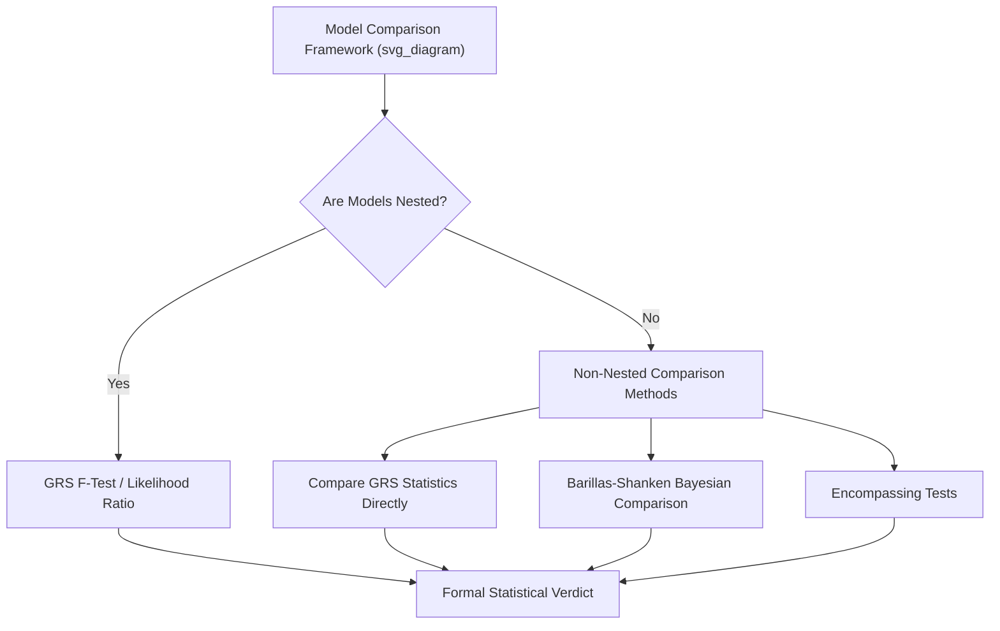

## Model Comparison and Specification Testing

### Overview

Model comparison and specification testing addresses how researchers formally evaluate competing asset pricing models against one another and assess whether a given model is correctly specified, extending beyond the single-model estimation and testing procedures (Fama-MacBeth, GMM, portfolio sorts) covered elsewhere in this chapter. As the number of proposed factor models has proliferated (CAPM, Fama-French three-factor, Carhart four-factor, Fama-French five- and six-factor, $q$-factor model, and numerous others), the field has developed a specific toolkit for rigorously determining which models best explain the cross-section of returns, whether newly proposed factors add genuine explanatory power, and how to formally test one model against another rather than evaluating each in isolation.

### The Core Comparison Problem

**Why Simple Alpha Comparison Is Insufficient**

A naive approach to comparing two models might simply compare the number or magnitude of significant alphas each model leaves unexplained across a set of test portfolios — fewer/smaller significant alphas would seem to indicate a "better" model. However, this approach has serious limitations:

- It does not account for the **joint** statistical significance of all pricing errors simultaneously (a model could have many individually insignificant but jointly significant alphas).
- It does not provide a formal statistical basis for concluding one model is significantly better than another, as opposed to simply having different (possibly by chance) point estimates.
- It can be sensitive to the specific set of test assets chosen, a concern that pervades essentially all cross-sectional asset pricing testing.

### The GRS Test (Gibbons, Ross, and Shanken, 1989)

**Purpose**

The GRS test provides a formal, joint statistical test of whether a candidate factor model's pricing errors (alphas) across a full set of $N$ test portfolios are **jointly equal to zero**, addressing the multiple-comparison problem inherent in examining $N$ separate individual t-tests on $N$ separate alphas.

**Test Statistic**

For a linear factor model estimated via $N$ time-series regressions:

$$R_{i,t} = \alpha_i + \beta_i' F_t + \varepsilon_{i,t}, \quad i = 1, \dots, N$$

the GRS test statistic is:

$$GRS = \frac{T - N - K}{N} \left[1 + \bar{F}' \hat{\Omega}^{-1} \bar{F}\right]^{-1} \hat{\alpha}' \hat{\Sigma}^{-1} \hat{\alpha} \sim F_{N, T-N-K}$$

where $T$ is the number of time periods, $K$ is the number of factors, $\hat{\alpha}$ is the $N \times 1$ vector of estimated alphas, $\hat{\Sigma}$ is the estimated residual covariance matrix, $\bar{F}$ is the sample mean factor vector, and $\hat{\Omega}$ is the sample covariance matrix of the factors. This exact finite-sample F-distribution (under the assumption of normally distributed, i.i.d. residuals) is a notable feature of the GRS test relative to many other asset pricing tests that rely only on asymptotic approximations.

**Interpretation**

- A **large** GRS statistic (small p-value) indicates the joint set of alphas is too large to be attributable to sampling error, rejecting the hypothesis that the factor model fully explains the cross-section of the $N$ test portfolios.
- A **small** GRS statistic (large p-value) fails to reject the null that the model's alphas are jointly zero — evidence broadly consistent with (though again, not proof of) the model's adequacy for the given test assets.
- The GRS test is widely used specifically to test whether a **candidate set of factor portfolios itself** (e.g., testing whether the market factor alone spans the mean-variance efficient frontier, or whether adding value and size factors is necessary) is mean-variance efficient relative to a broader set of test assets.

### Nested Model Comparisons

**The Nested Case**

When one model is a **special case** of another (e.g., CAPM is nested within the Fama-French three-factor model by setting the SMB and HML coefficients to zero), formal statistical tests can directly assess whether the additional factors in the larger model add significant explanatory power.

**GRS Test for Nested Models**

The GRS framework can be directly applied here: estimate the smaller (restricted) model and the larger (unrestricted) model on the same set of test assets, and use a GRS-type F-test (or a likelihood-ratio-type test under appropriate distributional assumptions) to assess whether the additional factors significantly reduce the joint magnitude of pricing errors.

**Spanning Tests**

A related and commonly used approach, particularly for testing whether a **newly proposed factor** adds explanatory power beyond an existing model, is a **spanning regression**: regress the new factor's returns on the existing model's factors, and examine the intercept:

$$F_{new,t} = \alpha + \beta_1 F_{1,t} + \dots + \beta_K F_{K,t} + \varepsilon_t$$

If $\hat{\alpha}$ is statistically significant, the new factor has a component of its returns **not spanned** by (not explainable as a combination of) the existing factors, providing evidence that it may capture genuinely distinct information relevant to asset pricing, though this alone does not establish that the new factor is *priced* (commands a risk premium) in the cross-section — that requires the separate cross-sectional tests (Fama-MacBeth, GMM) covered elsewhere in this chapter.

### Non-Nested Model Comparisons

**The Challenge**

Many competing asset pricing models are **not nested** within one another (e.g., the Fama-French five-factor model versus the Hou-Xue-Zhang $q$-factor model use different, only partially overlapping sets of factors), making standard nested-model F-tests inapplicable, and requiring different comparison approaches.

**Comparing GRS Statistics and $R^2$ Directly**

The simplest (if less formally rigorous as a hypothesis test) approach is to compute the GRS statistic, or related summary measures like the cross-sectional or time-series $R^2$, for each non-nested model separately on the same set of test assets, and compare these summary statistics directly — a smaller GRS statistic or higher $R^2$ for one model suggests (without a formal joint statistical test of "Model A is significantly better than Model B") relatively better performance.

**Barillas and Shanken (2017, 2018) — Bayesian Model Comparison**

Barillas and Shanken developed a rigorous **Bayesian framework** for comparing non-nested linear factor models, based on the key insight that when comparing models that share some but not all factors, only the **factors that differ between the models** (rather than the full set of test assets) need to be considered for a valid comparison, substantially simplifying the comparison problem and avoiding sensitivity to arbitrary test asset choice. Their approach produces posterior probabilities that each candidate model is the "true" (or best-approximating) model given the data, providing a formal probabilistic ranking across multiple non-nested candidates simultaneously, rather than only pairwise comparisons.

**Encompassing Tests**

An alternative non-Bayesian approach to non-nested comparison uses **encompassing tests**, which assess whether one model's pricing errors can fully "explain away" (encompass) the pricing errors of a competing model, and vice versa — allowing for the possibility that neither model fully encompasses the other (both may capture genuinely distinct, non-overlapping information).

### Illustrative Framework

### Specification Testing Beyond Alpha: Additional Diagnostics

**Time-Varying Beta Misspecification**

A model assuming **constant betas** over the full sample period may be misspecified if true factor exposures actually vary over time (e.g., due to changing firm characteristics, business-cycle-related risk exposure changes as discussed in related chapter content). Rolling-window beta estimation, or explicitly modeling time-varying betas (e.g., via conditional factor models where betas are a function of observable state variables), can reveal whether a constant-beta specification is a meaningful source of apparent pricing errors.

**Functional Form Misspecification**

Standard linear factor models assume expected returns are a **linear** function of factor betas. Nonlinearities (e.g., an anomaly that only appears in extreme decile portfolios, not intermediate ones, as sometimes revealed by portfolio sort monotonicity patterns discussed in related chapter content) can indicate that a linear specification is itself a source of model misspecification distinct from simply "missing a factor."

**Sub-Period Stability Tests**

Formal **Chow tests** or rolling-window stability analyses can assess whether a model's estimated parameters (factor loadings, risk premia) are stable across different sub-periods, or instead exhibit structural breaks — a model that fits well only in a specific sub-period raises concerns about genuine versus spurious (potentially data-mined) explanatory power, connecting directly to the broader data-mining and multiple-testing concerns discussed elsewhere in this course.

### Information Criteria Approaches

**Akaike and Bayesian Information Criteria**

Borrowed from general econometric model selection practice, **AIC** and **BIC** penalize models for the number of parameters used (factors included), providing a formal tradeoff between in-sample fit improvement and model parsimony:

$$AIC = -2\ln(L) + 2k, \qquad BIC = -2\ln(L) + k\ln(T)$$

where $L$ is the model's likelihood, $k$ is the number of estimated parameters, and $T$ is the sample size. BIC's stronger penalty for additional parameters (via the $\ln(T)$ term) makes it generally more conservative than AIC in favoring simpler models, an important consideration given the factor-proliferation concerns discussed in the data mining and multiple-testing content in this course. [Inference: the relative appropriateness of AIC versus BIC for factor model selection specifically, as opposed to general econometric model selection, is an area of ongoing methodological discussion rather than settled practice.]

### Out-of-Sample Model Comparison

**Motivation**

Paralleling the broader in-sample/out-of-sample distinction emphasized throughout the return-predictability literature (Goyal-Welch, and related content), a model that fits well in-sample may not necessarily generalize to genuinely new data, motivating out-of-sample comparison approaches:

- **Rolling or recursive out-of-sample GRS/alpha tests**: estimate model parameters using only data up to time $t$, generate implied expected returns for $t+1$, and compare realized out-of-sample pricing errors across competing models.
- **Out-of-sample $R^2$ comparison**: analogous to the Goyal-Welch return-forecasting metric, compute an out-of-sample $R^2$ for competing models' return-explaining (rather than return-forecasting) performance, comparing realized pricing errors to a naive benchmark.

### Practical Implementation Considerations

**Key Points**

- **Test asset choice remains central**: as with virtually every methodology in this chapter, model comparison conclusions can be sensitive to which test assets are used; the Barillas-Shanken approach's insight (focusing on differing factors rather than test assets) partly addresses this, but is not a complete solution across all comparison contexts.
- **Report multiple comparison metrics jointly**: rather than relying on a single test (e.g., only the GRS statistic), rigorous model comparison typically reports GRS statistics, cross-sectional $R^2$, average absolute alpha, and, where feasible, out-of-sample metrics together, since different metrics can occasionally point toward different conclusions.
- **Distinguish "better fit" from "genuinely priced factor"**: a model achieving a lower GRS statistic or higher $R^2$ does not by itself establish that every included factor is individually priced (commands a significant risk premium) — this requires the complementary cross-sectional tests (Fama-MacBeth, GMM) covered elsewhere in this chapter.
- **Beware of data mining in the model comparison process itself**: since dozens of competing factor models have been proposed over time, the model comparison exercise is itself subject to the same multiple-testing concerns discussed in the data mining chapter content — a model chosen because it happened to perform best in a particular historical sample, among many models compared, may not perform as well out-of-sample or in a genuinely new dataset.

### Worked Example

**Example**

Suppose a researcher compares the Fama-French three-factor model against the Fama-French five-factor model (a nested comparison, since the three-factor model is the five-factor model with RMW and CMA coefficients restricted to zero) using 25 size/book-to-market portfolios as test assets over 480 months.

**Three-factor model**: GRS statistic = 2.85, with an associated p-value of 0.02 (rejecting the null of jointly zero alphas at the 5% level).

**Five-factor model**: GRS statistic = 1.65, with an associated p-value of 0.18 (failing to reject the null of jointly zero alphas at conventional levels).

The substantially lower GRS statistic (and correspondingly higher p-value) for the five-factor model, combined with a formal nested F-test on the additional RMW and CMA coefficients showing they are jointly significant, would provide evidence that the additional profitability and investment factors meaningfully improve the model's ability to price this particular set of 25 test portfolios relative to the three-factor model alone — the standard type of evidence historically used to motivate the adoption of expanded factor models in the literature.

### Related Topics

- Fama-MacBeth cross-sectional regressions and GMM-based tests (complementary single-model tests)
- Gibbons-Ross-Shanken (GRS) test methodology and derivation
- Barillas-Shanken Bayesian non-nested model comparison
- Fama-French five-factor and six-factor model construction
- The $q$-factor model (Hou, Xue, and Zhang) as a competing framework
- Portfolio sorts and characteristic-based tests (test asset construction for comparisons)
- Data mining and multiple-testing concerns (parallel risks in model proliferation)
- Spanning regressions and factor redundancy tests
- Information criteria (AIC, BIC) in econometric model selection
- Out-of-sample validation methodology (Goyal-Welch parallel in model comparison context)