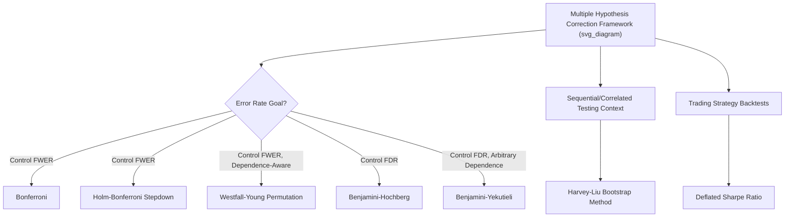

## Correcting for Data Snooping and Multiple Hypotheses

### Overview

Correcting for data snooping and multiple hypotheses extends the conceptual foundation laid out in the cross-sectional anomalies chapter's treatment of data mining into a formal, technique-focused toolkit specifically oriented toward empirical methods: the concrete statistical procedures researchers apply to adjust test statistics, significance thresholds, and inference when many hypotheses, strategies, or model specifications have been examined, whether explicitly within a single study or implicitly across the cumulative history of a research literature. This topic surveys the primary correction methodologies in depth, their underlying assumptions, and their practical tradeoffs.

### Restating the Core Problem in Testing Terms

**Family-Wise Error Rate vs. False Discovery Rate**

Two principal error-rate concepts govern the choice of correction methodology:

- **Family-Wise Error Rate (FWER)**: the probability of making **at least one** false discovery (Type I error) among all tests conducted. Controlling FWER is appropriate when even a single false positive is considered costly or misleading.
- **False Discovery Rate (FDR)**: the **expected proportion** of false discoveries among all findings declared significant. Controlling FDR is appropriate when some false positives are tolerable in exchange for greater power to detect true effects among a large candidate set, a tradeoff often considered more suitable for exploratory factor-discovery contexts where the goal is to identify a promising subset of candidates for further study rather than certify each individual finding with near-certainty.

### FWER-Controlling Procedures

**Bonferroni Correction**

The simplest FWER control method, adjusting the significance threshold by dividing by the number of tests $N$:

$$\alpha_{Bonferroni} = \frac{\alpha}{N}$$

**Properties**: guarantees FWER $\leq \alpha$ under the (conservative) assumption that tests may be arbitrarily dependent; does not require knowledge of the dependence structure among tests. Its main drawback is **excessive conservatism** when $N$ is large, since it does not exploit any correlation structure among the tests (finance factors are frequently highly correlated with one another, meaning the "effective" number of independent tests is often much smaller than the raw count $N$), leading to reduced power and a higher rate of Type II errors (failing to detect genuine effects).

**Holm-Bonferroni Step-Down Procedure**

An improvement on simple Bonferroni that remains valid under arbitrary dependence but achieves higher power:

1. Order the $N$ p-values from smallest to largest: $p_{(1)} \leq p_{(2)} \leq \dots \leq p_{(N)}$.
2. Compare $p_{(1)}$ to $\alpha/N$; if $p_{(1)} \leq \alpha/N$, reject and proceed; otherwise stop and accept all remaining hypotheses.
3. Compare $p_{(2)}$ to $\alpha/(N-1)$; continue this step-down comparison, using progressively larger (less strict) thresholds for subsequent p-values, stopping at the first failure to reject.

This sequential procedure rejects at least as many hypotheses as simple Bonferroni while maintaining the same FWER guarantee, making it a strictly preferable (weakly more powerful) alternative in essentially all applications.

**Westfall-Young Permutation-Based Stepdown**

A more powerful FWER-controlling method that explicitly exploits the **dependence structure** among test statistics (rather than assuming arbitrary/worst-case dependence, as Bonferroni-family methods do), using resampling (permutation or bootstrap) to construct the joint null distribution of the full vector of test statistics directly from the data, then applying a step-down procedure analogous to Holm-Bonferroni but calibrated to this empirically-estimated joint distribution.

### FDR-Controlling Procedures

**Benjamini-Hochberg Procedure**

The standard FDR-controlling procedure, as introduced in related cross-sectional anomalies content:

1. Order p-values from smallest to largest: $p_{(1)} \leq \dots \leq p_{(N)}$.
2. Find the largest $k$ such that $p_{(k)} \leq \frac{k}{N}\alpha$.
3. Reject all hypotheses with p-values $\leq p_{(k)}$.

**Properties**: controls FDR at level $\alpha$ under independence or certain forms of positive dependence among test statistics; generally provides substantially greater power than FWER-controlling methods when $N$ is large, at the cost of tolerating a controlled fraction of false positives among the declared discoveries rather than guaranteeing (with high probability) zero false positives overall.

**Benjamini-Yekutieli Procedure**

A more conservative variant designed to control FDR validly under **arbitrary dependence** among test statistics (rather than requiring independence or specific positive-dependence conditions), at some cost in power relative to the standard Benjamini-Hochberg procedure — a similar conservatism-for-robustness tradeoff to the Bonferroni-versus-Holm-Bonferroni relationship within the FWER family.

### The Harvey-Liu-Zhu Multiple Testing Framework for Factor Discovery

**Motivating Recommendation**

Harvey, Liu, and Zhu (2016) proposed that, given the scale of testing implicit across the cumulative finance factor literature (estimated at several hundred published factors, with the true number of implicitly tested candidate factors including unpublished null results almost certainly far larger), a substantially higher t-statistic threshold than the conventional 2.0 should be required for a newly proposed factor to be considered a credible discovery, with specific recommended thresholds derived from applying multiple-testing correction logic (analogous to Bonferroni/Holm-Bonferroni-style adjustments, calibrated to an estimated effective number of prior tests) to the historical factor literature.

**Practical Implication for New Research**

This framework has influenced editorial and refereeing standards at some finance journals, with reviewers and editors increasingly asking authors of newly proposed factors to report multiple-testing-adjusted significance levels (or at minimum, to explicitly acknowledge and discuss the multiple-testing context of their finding) rather than relying solely on a conventional single-test t-statistic or p-value. [Inference: the degree and consistency of adoption of these elevated thresholds across different journals and subfields is uneven and continues to evolve.]

### Harvey-Liu Bootstrap Approach

**Distinguishing Feature: Sequential and Correlated Testing**

As discussed in the cross-sectional anomalies chapter content, Harvey and Liu's bootstrap methodology (2015, 2020) is specifically designed to address two features of the actual factor-testing literature that simpler correction methods (Bonferroni, Benjamini-Hochberg) do not directly incorporate:

1. **Sequential testing over time**: factors are proposed one after another as a cumulative literature builds, not as a single simultaneous batch of $N$ independent tests.
2. **Cross-sectional correlation among candidate factors**: since many proposed factors are variants of, or highly correlated with, previously proposed factors (e.g., multiple accrual-quality variants, multiple momentum variants), the effective number of independent tests is substantially smaller than the raw published count.

**Bootstrap Procedure Outline**

1. Given a time series of returns, generate many bootstrap resamples of the return data (preserving relevant time-series and cross-sectional dependence structure).
2. For each bootstrap resample, compute the test statistic that would result from optimally "mining" the resampled data for the best-performing candidate specification, simulating the actual data-mining process implicit in a sequential research literature.
3. Construct the empirical distribution of this "best-case" test statistic **under the null hypothesis** (no true predictability), providing a bootstrap-derived critical value that properly accounts for the maximum-statistic-seeking behavior implicit in extensive specification search, rather than a single, isolated test's nominal critical value.

### Deflated Sharpe Ratio (Bailey and López de Prado, 2014)

**Application to Trading Strategy Backtesting**

While the correction methods above are framed primarily in terms of hypothesis testing (p-values, t-statistics), the **Deflated Sharpe Ratio (DSR)** applies analogous multiple-testing logic directly to the evaluation of backtested trading strategy performance, a closely related practical application particularly relevant to quantitative asset management.

**Formula Components**

The DSR adjusts a strategy's observed Sharpe ratio for:

1. **The number of independent trials (strategy variations) tested** before arriving at the reported strategy.
2. **The variance of Sharpe ratios across those trials** (a measure of how much "luck" was available to be capitalized upon).
3. **Non-normality** in the strategy's return distribution (skewness and kurtosis), since the standard Sharpe ratio significance testing framework assumes normally distributed returns, which many strategies (particularly those involving options, tail risk, or momentum-like payoffs) violate.

**Interpretation**

The DSR effectively computes the probability that the observed Sharpe ratio would have been achieved by chance alone, given the number of strategy variations actually tested during the development/backtesting process — directly analogous to a multiple-testing-corrected p-value, but expressed in terms of a probability of exceeding a benchmark Sharpe ratio (often zero, or the Sharpe ratio expected under pure luck given the number of trials) rather than a traditional hypothesis-test p-value.

### Illustrative Framework

### Comparative Summary of Methods

| Method | Error Rate Controlled | Dependence Assumption | Relative Power |
| --- | --- | --- | --- |
| Bonferroni | FWER | Arbitrary (worst-case) | Lowest |
| Holm-Bonferroni | FWER | Arbitrary (worst-case) | Low-moderate |
| Westfall-Young | FWER | Estimated via resampling | Moderate-high |
| Benjamini-Hochberg | FDR | Independence / positive dependence | High |
| Benjamini-Yekutieli | FDR | Arbitrary | Moderate |
| Harvey-Liu Bootstrap | Sequential/correlated FWER-type | Estimated via resampling, sequential-aware | Context-dependent |
| Deflated Sharpe Ratio | Analogous to corrected significance | Accounts for trial count and non-normality | Context-dependent |

### Practical Guidance for Researchers and Practitioners

**Key Points**

- **Disclose the full search process**: report the total number of specifications, variable definitions, or strategy variants actually examined during a research or strategy-development process, not merely the single best-performing result — a foundational transparency requirement that underlies the ability to apply any of the correction methods above meaningfully.
- **Choose FWER vs. FDR control based on context**: exploratory, early-stage factor screening across a large candidate universe may reasonably favor FDR control (tolerating some false positives to retain power for genuine discovery), while confirmatory tests intended to certify a specific factor for investment product design may reasonably favor stricter FWER control.
- **Account for correlation among tests**: when candidate factors or strategies are known to be highly correlated with one another (a common situation in finance, where many proposed variables are variants of a smaller number of underlying economic concepts), dependence-aware methods (Westfall-Young, Harvey-Liu bootstrap) generally provide more informative and appropriately powered inference than naive independence-assuming corrections (simple Bonferroni or Benjamini-Hochberg applied without considering correlation structure).
- **Combine multiple-testing correction with out-of-sample validation**: as emphasized throughout this course's time-series predictability content (Goyal-Welch), formal statistical correction for multiple testing and genuine out-of-sample validation are **complementary, not substitute**, safeguards against data snooping — a factor surviving a stringent multiple-testing-adjusted in-sample threshold still benefits from independent out-of-sample confirmation.

### Worked Example

**Example**

Suppose a quantitative research team backtests 40 candidate trading signal variations (different lookback windows, smoothing parameters, and universe filters applied to the same core momentum concept) and finds the best-performing variant has an annualized Sharpe ratio of 1.2 based on 10 years of monthly data.

**Naive interpretation**: a Sharpe ratio of 1.2 over 120 months might correspond to a conventional t-statistic well above 2, appearing highly statistically significant in isolation.

**Deflated Sharpe Ratio adjustment**: accounting for the fact that 40 variations were tested (not just one), and that the Sharpe ratios across those 40 variants had a certain estimated variance (reflecting how much "upside from luck" was available across the search), the DSR calculation might reveal that the probability of achieving a Sharpe ratio of 1.2 or higher purely by chance, given 40 trials, is considerably higher than the naive single-test framework would suggest — potentially reducing confidence in the strategy's genuine, forward-looking viability even though the single best result looks superficially compelling.

### Related Topics

- Data mining and multiple-testing concerns (foundational conceptual treatment)
- Harvey, Liu, and Zhu's factor zoo critique and elevated t-statistic thresholds
- Deflated Sharpe Ratio and backtest overfitting corrections
- Benjamini-Hochberg False Discovery Rate procedure
- Westfall-Young permutation-based stepdown testing
- McLean-Pontiff post-publication anomaly decay evidence
- Model comparison and specification testing (parallel model-selection multiple-testing risks)
- Pre-registration standards in empirical finance research
- Goyal-Welch out-of-sample validation as a complementary safeguard
- GRS test and joint hypothesis testing across portfolios