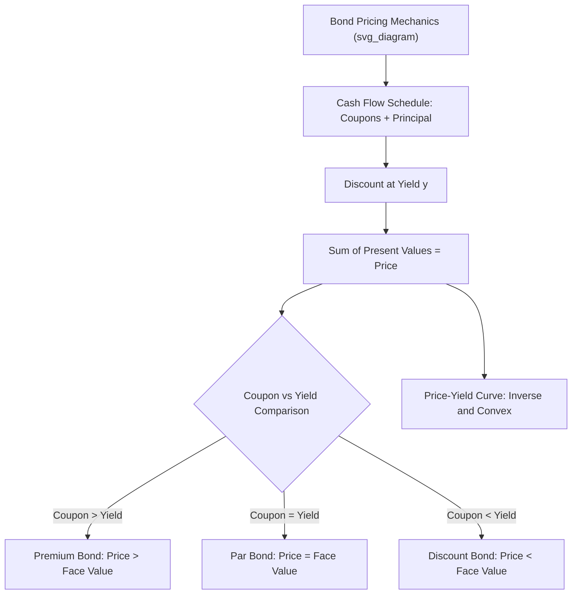

## Bond Pricing Mechanics and Yield Measures

### Overview

Bond pricing mechanics and yield measures establish the foundational quantitative framework for fixed income valuation: how a bond's price relates to its promised cash flows and prevailing interest rates, and the various yield conventions used to summarize a bond's return characteristics in a single number. This topic underlies virtually all subsequent fixed income analysis, including duration, convexity, term structure modeling, and credit risk pricing.

### The Basic Bond Pricing Equation

**Present Value of Cash Flows**

A standard coupon-bearing bond's price is the present value of all promised future cash flows (coupon payments plus final principal repayment), discounted at an appropriate yield:

$$P = \sum_{t=1}^{n} \frac{C}{(1+y)^t} + \frac{F}{(1+y)^n}$$

where $P$ is the bond's price, $C$ is the periodic coupon payment, $F$ is the face (par) value, $y$ is the yield per period, and $n$ is the number of periods to maturity.

**Semiannual Compounding Convention**

U.S. bond market convention typically quotes yields on a **semiannual bond-equivalent basis**, with coupons paid twice yearly. The pricing formula adjusts accordingly:

$$P = \sum_{t=1}^{2T} \frac{C/2}{(1+y/2)^t} + \frac{F}{(1+y/2)^{2T}}$$

where $T$ is maturity in years and $y$ is the annualized yield (compounded semiannually).

### Par, Premium, and Discount Bonds

**Key Points**

- **Par bond**: coupon rate equals the yield ($C/F = y$); price equals face value ($P = F$).
- **Premium bond**: coupon rate exceeds the yield ($C/F > y$); price exceeds face value ($P > F$), since the bond offers above-market coupon payments that investors are willing to pay extra to receive.
- **Discount bond**: coupon rate is below the yield ($C/F < y$); price is below face value ($P < F$), compensating investors for below-market coupon payments through capital appreciation to par at maturity.
- **Zero-coupon bond**: a special case with $C = 0$; price is simply the discounted face value, $P = F/(1+y)^n$, always trading at a discount to face value (for positive yields) prior to maturity.

### The Inverse Price-Yield Relationship

A fundamental and universal property of fixed-coupon bonds: **price and yield move in opposite directions**. As $y$ rises in the pricing formula, the discount factors applied to all future cash flows shrink, mechanically lowering the present value (price); as $y$ falls, discount factors rise, raising the price. This inverse relationship is also **convex** (not linear) — the price-yield curve is a convex function of yield, a property formalized and quantified through **convexity** measures covered in related duration and convexity chapter content.

### Yield to Maturity (YTM)

**Definition**

Yield to maturity is the single discount rate $y$ that, applied uniformly to all of a bond's promised cash flows, equates their present value to the bond's current market price:

$$P_{market} = \sum_{t=1}^{n} \frac{C}{(1+YTM)^t} + \frac{F}{(1+YTM)^n}$$

YTM must generally be solved for **numerically** (via iterative methods, since the equation cannot typically be solved in closed form for coupon-bearing bonds with more than a few periods), and represents the internal rate of return (IRR) of the bond's cash flow stream given its current price.

**Key Embedded Assumptions**

- **Hold to maturity**: YTM assumes the investor holds the bond until maturity, receiving all promised cash flows as scheduled.
- **Reinvestment at the YTM rate**: critically, YTM assumes that **all coupon payments received are reinvested at the same rate as the YTM itself** — an assumption that is generally unrealistic in practice, since reinvestment rates fluctuate with prevailing market conditions at each coupon date, and is a primary limitation of YTM as a true "expected return" measure, particularly for longer-maturity, higher-coupon bonds where a larger share of total return depends on this reinvestment assumption.
- **No default**: YTM assumes all promised payments are made in full and on schedule, i.e., it does not adjust for credit risk; for bonds with meaningful default risk, YTM overstates the actual expected return, since it does not discount for the probability-weighted possibility of missed or reduced payments.

### Current Yield

**Definition**

A simpler, less complete yield measure:

$$\text{Current Yield} = \frac{C}{P}$$

Current yield only accounts for coupon income relative to the current price, ignoring both the time value of money across the full cash flow schedule and any capital gain or loss the investor will realize by holding to maturity (i.e., the difference between the purchase price and the face value received at maturity). It is a simpler, less complete metric than YTM and is used primarily as a quick, back-of-envelope income metric rather than a comprehensive valuation tool.

### Yield to Call and Yield to Worst

**Yield to Call (YTC)**

For **callable bonds** (bonds the issuer has the right to redeem prior to maturity, typically at a specified call price on or after a specified call date), yield to call computes the same internal-rate-of-return calculation as YTM, but assumes the bond is called (redeemed early) at the earliest call date rather than held to final maturity:

$$P_{market} = \sum_{t=1}^{n_c} \frac{C}{(1+YTC)^t} + \frac{Call\ Price}{(1+YTC)^{n_c}}$$

where $n_c$ is the number of periods until the call date.

**Yield to Worst (YTW)**

Since a callable bond may have multiple potential call dates (or a range of possible early-redemption scenarios), **yield to worst** is defined as the **minimum** of all possible yield-to-call calculations across every eligible call date, plus the yield-to-maturity calculation — representing the most conservative (lowest) yield an investor could receive under any plausible early-redemption scenario the issuer might exercise. YTW is the standard, market-convention yield quote for callable bonds precisely because it captures this downside scenario relevant to a risk-averse fixed income investor.

### Bond Equivalent Yield and Yield Convention Adjustments

**Bond Equivalent Yield (BEY)**

Certain money-market instruments (e.g., Treasury bills) are quoted using a **discount yield** convention that differs from the standard bond-equivalent (semiannual compounding, actual days/365 or similar) convention used for coupon bonds. Bond equivalent yield converts a discount-yield-quoted instrument's return into a comparable semiannual-bond-equivalent basis, enabling direct comparison across instrument types that would otherwise use inconsistent yield quoting conventions.

**Day-Count Conventions**

Different bond markets and instrument types use different **day-count conventions** (e.g., Actual/Actual, 30/360, Actual/360) for computing accrued interest and precise yield calculations, and mismatched day-count assumptions between two instruments can produce apparent yield differences that do not reflect genuine differences in return, a practical detail relevant whenever comparing yields across different bond market segments (e.g., Treasury versus corporate versus money-market instruments).

### Accrued Interest and Clean vs. Dirty Price

**The Distinction**

When a bond trades between coupon payment dates, the buyer must compensate the seller for the portion of the current coupon period's interest that has **accrued** but not yet been paid (since the next full coupon payment will go entirely to whoever holds the bond on the payment date, regardless of how long they've actually held it during that coupon period).

$$\text{Dirty Price (Invoice Price)} = \text{Clean Price} + \text{Accrued Interest}$$

**Accrued Interest Calculation**

$$\text{Accrued Interest} = C \times \frac{\text{Days since last coupon}}{\text{Days in current coupon period}}$$

using the applicable day-count convention. Bond prices are typically **quoted** in the market as the **clean price** (excluding accrued interest), but the actual cash amount a buyer pays (the **dirty price**, or invoice price) includes the accrued interest component — an important practical distinction for anyone actually transacting in bonds, as opposed to simply reading a quoted price.

### Illustrative Framework: Price-Yield Relationship

### The Reinvestment Risk Problem in Detail

**Key Points**

- A bond's **total realized return** over the holding period to maturity depends on three components: (1) coupon payments received, (2) the price paid and received (or par value at maturity), and (3) **income earned from reinvesting coupon payments** at whatever rates prevail at each coupon date.
- YTM implicitly assumes component (3) occurs at exactly the YTM rate itself — if actual reinvestment rates are lower than YTM (e.g., because interest rates decline after purchase), the investor's realized return will fall **short** of the quoted YTM; if reinvestment rates are higher, realized return will **exceed** YTM.
- **Reinvestment risk is larger** for bonds with (a) higher coupon rates (more cash flow subject to reinvestment risk relative to the final principal repayment) and (b) longer maturities (more coupon reinvestment periods over which rates can diverge from the original YTM), while it is essentially **absent** for zero-coupon bonds (no intermediate cash flows to reinvest, so the realized return to maturity is locked in exactly at the original YTM, assuming no default) — a property that becomes particularly important in the related duration and immunization literature.

### Realized (Horizon) Return vs. Yield to Maturity

**Distinguishing the Concepts**

Because of the reinvestment assumption embedded in YTM, and because an investor may sell a bond before maturity at a price reflecting then-prevailing yields (rather than holding to maturity as YTM assumes), the **realized return** an investor actually experiences over any given holding period can differ substantially from the YTM quoted at purchase. Computing a genuine **realized (horizon) return** requires explicitly specifying (1) the actual or assumed reinvestment rate for coupons received during the holding period, and (2) the assumed sale price (or yield) if the bond is sold before maturity, then computing the actual internal rate of return over the specific holding period based on these explicit assumptions, rather than relying on the YTM's built-in assumptions.

### Practical Implementation Considerations

**Key Points**

- **YTM is not directly comparable across bonds with very different coupon rates** without adjusting for the reinvestment assumption, since two bonds with identical YTM but very different coupon rates embed very different degrees of reinvestment risk and thus different realized-return sensitivity to future interest rate paths.
- **Callable bonds require yield-to-worst, not YTM, as the standard comparison metric**, since quoting YTM alone on a callable bond can substantially overstate the yield an investor is likely to actually realize if the bond is called early (which issuers rationally tend to do precisely when interest rates have fallen, making early redemption and refinancing attractive to them, and correspondingly reinvestment-disadvantageous for the bondholder).
- **Clean versus dirty price matters for actual settlement**: any bond trade settlement calculation must properly account for accrued interest using the correct day-count convention for that specific bond market/instrument type to arrive at the correct total cash amount exchanged.
- **Numerical solution methods for YTM**: since YTM generally has no closed-form solution for standard multi-period coupon bonds, practical implementations rely on iterative root-finding algorithms (e.g., Newton-Raphson), widely implemented in standard financial calculators and spreadsheet functions.

### Worked Example

**Example**

Consider a bond with a $1,000 face value, a 6% annual coupon rate (paid semiannually, so $30 every six months), 5 years (10 semiannual periods) to maturity, currently priced at $958.42.

To find the YTM, solve for $y$ (semiannual) such that:

$$958.42 = \sum_{t=1}^{10} \frac{30}{(1+y)^t} + \frac{1000}{(1+y)^{10}}$$

Solving iteratively yields a semiannual yield of approximately $y \approx 3.5\%$, giving an annualized (bond-equivalent) YTM of approximately:

$$YTM \approx 2 \times 3.5\% = 7.0\%$$

Since the coupon rate (6%) is **below** the computed YTM (7.0%), this confirms the bond is correctly priced as a **discount bond** ($958.42 < $1,000 face value), consistent with the general par/premium/discount relationship described above — the bond's price below par exactly compensates the investor, via appreciation to face value at maturity, for its below-market coupon rate relative to prevailing yields.

### Related Topics

- Duration and convexity as measures of interest rate sensitivity
- Term structure of interest rates and the yield curve
- Callable and puttable bond valuation
- Credit spreads and corporate bond yield decomposition
- Zero-coupon bonds and the spot rate curve
- Day-count conventions across bond market segments
- Immunization and reinvestment risk management strategies
- Forward rates and the expectations hypothesis
- Treasury bill discount yield versus bond-equivalent yield conversion
- Realized (horizon) return analysis versus quoted yield measures