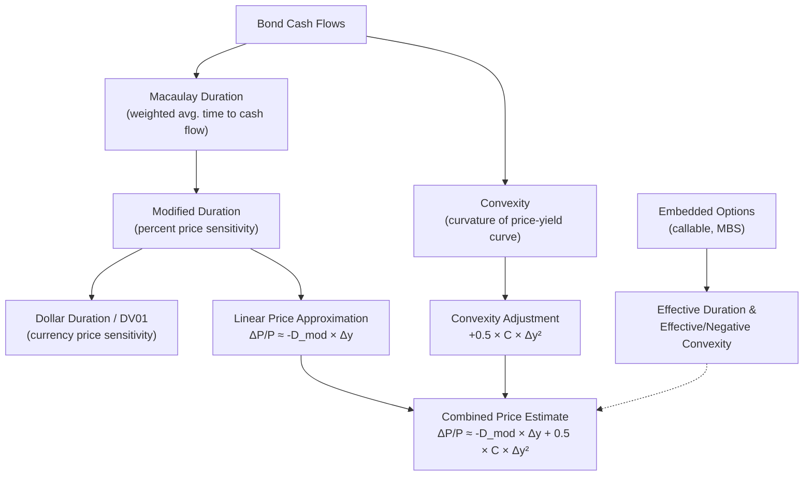

## Duration and Convexity

### Overview

Duration and convexity are the two primary measures of a bond's price sensitivity to changes in interest rates. Duration approximates the linear (first-order) relationship between price and yield, while convexity captures the curvature (second-order) that duration alone misses. Together, they form a Taylor series approximation of the price-yield relationship, which is fundamentally non-linear (convex) for standard fixed-income instruments.

### The Price-Yield Relationship

Bond prices and yields move inversely. The price of a bond is the present value of its future cash flows discounted at the yield to maturity (YTM):

$$P = \sum_{t=1}^{n} \frac{C_t}{(1+y)^t} + \frac{F}{(1+y)^n}$$

where $P$ is price, $C_t$ is the coupon at time $t$, $y$ is the yield per period, $F$ is face value, and $n$ is the number of periods.

This function is convex in $y$: as $y$ falls, price rises at an increasing rate; as $y$ rises, price falls at a decreasing rate. This asymmetry is the source of convexity's value.

**(svg_diagram) Price-Yield Curve vs. Duration Tangent**

<svg xmlns="http://www.w3.org/2000/svg" viewBox="0 0 600 380">

<text x="300" y="24" text-anchor="middle" font-size="15" font-weight="bold" fill="`#1a1a2e`">Price-Yield Relationship (svg_diagram)</text>

<line x1="60" y1="330" x2="560" y2="330" stroke="#333" stroke-width="1.5" />

<line x1="60" y1="330" x2="60" y2="50" stroke="#333" stroke-width="1.5" />

<text x="300" y="365" text-anchor="middle" font-size="13" fill="#333">Yield (y)</text>

<text x="25" y="190" text-anchor="middle" font-size="13" fill="#333" transform="rotate(-90 25 190)">Price (P)</text>

<path d="M 90 90 Q 300 200 530 320" fill="none" stroke="`#2266cc`" stroke-width="3" />

<line x1="140" y1="70" x2="470" y2="300" stroke="`#cc3333`" stroke-width="2" stroke-dasharray="6,4" />

<circle cx="300" cy="185" r="5" fill="`#1a1a2e`" />

<text x="310" y="175" font-size="12" fill="`#1a1a2e`">y0, P0</text>

<text x="440" y="90" font-size="12" fill="`#2266cc`" font-weight="bold">Actual price-yield curve</text>

<text x="440" y="290" font-size="12" fill="`#cc3333`" font-weight="bold">Duration (tangent line)</text>

<line x1="300" y1="185" x2="300" y2="330" stroke="#999" stroke-width="1" stroke-dasharray="3,3" />

<text x="150" y="150" font-size="11" fill="`#2266cc`">Convexity gap: actual price</text>

<text x="150" y="165" font-size="11" fill="`#2266cc`">exceeds duration estimate</text>

</svg>

### Macaulay Duration

Macaulay duration is the weighted-average time to receipt of a bond's cash flows, with weights equal to the present value of each cash flow as a fraction of the bond's total price:

$$D_{Mac} = \sum_{t=1}^{n} t \cdot \frac{PV(C_t)}{P}$$

**Key Points**

- Measured in years (or periods).
- For a zero-coupon bond, Macaulay duration equals maturity exactly.
- For a coupon bond, Macaulay duration is always less than maturity, since some cash flow is received before the final payment.
- Higher coupon rates reduce Macaulay duration (more weight is received earlier).
- Longer maturity generally increases Macaulay duration, though the relationship flattens for deep-discount, long-maturity bonds.

### Modified Duration

Modified duration converts Macaulay duration into a direct measure of price sensitivity to yield changes:

$$D_{Mod} = \frac{D_{Mac}}{1 + y/k}$$

where $k$ is the number of compounding periods per year (e.g., $k=2$ for semiannual coupons).

Modified duration gives the approximate percentage price change for a 1 percentage point (100 bps) change in yield:

$$\frac{\Delta P}{P} \approx -D_{Mod} \cdot \Delta y$$

**Example**

A bond has Macaulay duration of 8.5 years, semiannual compounding, and a yield of 6%.

$$D_{Mod} = \frac{8.5}{1 + 0.06/2} = \frac{8.5}{1.03} = 8.25$$

For a 50 bps ($\Delta y = 0.005$) increase in yield:

$$\frac{\Delta P}{P} \approx -8.25 \times 0.005 = -0.04125 = -4.125\%$$

If the bond is priced at $1,000, this implies an approximate price decline of $41.25.

### Dollar Duration (DV01 / BPV)

Dollar duration, also called DV01 (dollar value of a basis point) or BPV (basis point value), expresses price sensitivity in currency terms rather than percentage terms:

$$\text{Dollar Duration} = D_{Mod} \times P$$

$$DV01 = \text{Dollar Duration} \times 0.0001$$

DV01 gives the dollar price change for a one-basis-point (0.01%) yield move. It is widely used in trading desks and hedging because it allows direct comparison and offsetting of positions with different prices and durations.

### Effective Duration

For bonds with embedded options (callable, putable, mortgage-backed securities), Macaulay and modified duration are unreliable because expected cash flows change as yields change. Effective duration measures price sensitivity using a valuation model that re-prices the bond under shifted yield curve scenarios:

$$D_{Eff} = \frac{P_{-} - P_{+}}{2 \cdot P_0 \cdot \Delta y}$$

where $P_{-}$ is the price if yields fall by $\Delta y$, and $P_{+}$ is the price if yields rise by $\Delta y$, both computed from an option-adjusted (e.g., binomial or Monte Carlo) pricing model.

**Key Points**

- Effective duration accounts for changing cash flows (e.g., prepayment or call risk).
- It is the appropriate measure whenever cash flows are yield-dependent. [Inference: the precise duration estimate depends on the option-pricing model's assumptions, such as volatility inputs and the term structure model used, so results can vary across implementations.]

### Duration of a Portfolio

Portfolio duration is the market-value-weighted average of the durations of its constituent bonds:

$$D_{portfolio} = \sum_{i=1}^{n} w_i \cdot D_i$$

where $w_i = \dfrac{\text{Market Value}_i}{\text{Total Portfolio Value}}$.

This property makes duration additive and central to portfolio immunization strategies, where a portfolio's duration is matched to a liability's duration to hedge against parallel yield curve shifts.

### Limitations of Duration

**Key Points**

- Duration is a linear approximation; it systematically misestimates price changes for large yield moves because the true price-yield relationship is convex.
- Duration assumes a parallel shift in the yield curve; it does not capture changes in curve shape (steepening, flattening, twists).
- Duration alone underestimates the price increase from a yield decrease and overestimates the price decrease from a yield increase — this asymmetric error is precisely what convexity corrects for.

### Convexity

Convexity measures the curvature of the price-yield relationship — the rate of change of duration itself with respect to yield. Formally, it is the second derivative of price with respect to yield, scaled by price:

$$C = \frac{1}{P} \cdot \frac{d^2P}{dy^2} = \frac{1}{P} \sum_{t=1}^{n} \frac{t(t+1) \cdot C_t}{(1+y)^{t+2}}$$

**Key Points**

- Convexity is always positive for option-free (bullet) bonds: price increases from a yield decline always exceed price decreases from an equivalent yield increase.
- Bonds with greater dispersion of cash flows (e.g., barbell portfolios) exhibit higher convexity than bonds with concentrated cash flows (e.g., bullet bonds) of the same duration.
- Longer maturity and lower coupon generally increase convexity.
- Zero-coupon bonds have higher convexity than coupon bonds of the same duration, for a given maturity.

### The Combined Price Approximation

Including convexity substantially improves the accuracy of the price change estimate, especially for large yield moves:

$$\frac{\Delta P}{P} \approx -D_{Mod} \cdot \Delta y + \frac{1}{2} \cdot C \cdot (\Delta y)^2$$

The duration term captures the linear effect; the convexity term is always non-negative (for positive convexity instruments) and adds back value that pure duration underestimates.

**Example**

Using the same bond ($D_{Mod} = 8.25$) with convexity $C = 95$, for a 200 bps yield increase ($\Delta y = 0.02$):

Duration-only estimate:

$$\frac{\Delta P}{P} \approx -8.25 \times 0.02 = -16.5\%$$

Duration + convexity estimate:

$$\frac{\Delta P}{P} \approx -8.25 \times 0.02 + \frac{1}{2} \times 95 \times (0.02)^2 = -16.5\% + 1.9\% = -14.6\%$$

The convexity adjustment reduces the estimated loss from 16.5% to 14.6%, reflecting the fact that price declines less than the linear duration estimate suggests as yields rise.

### Negative Convexity

Certain instruments — most notably callable bonds and mortgage-backed securities — exhibit **negative convexity** over some yield ranges. As yields fall, the issuer's (or borrower's) incentive to call/refinance increases, capping price appreciation. This produces a price-yield curve that flattens or even bends downward at low yields, in contrast to the standard convex shape.

**Key Points**

- Negative convexity means duration effectively shortens as yields fall — the opposite of the beneficial asymmetry of positive convexity.
- MBS investors demand a yield premium (option-adjusted spread) to compensate for this prepayment risk.

**(svg_diagram) Positive vs. Negative Convexity**

<svg xmlns="http://www.w3.org/2000/svg" viewBox="0 0 600 340">

<text x="300" y="24" text-anchor="middle" font-size="15" font-weight="bold" fill="`#1a1a2e`">Positive vs. Negative Convexity (svg_diagram)</text>

<line x1="60" y1="290" x2="560" y2="290" stroke="#333" stroke-width="1.5" />

<line x1="60" y1="290" x2="60" y2="50" stroke="#333" stroke-width="1.5" />

<text x="300" y="320" text-anchor="middle" font-size="13" fill="#333">Yield (y)</text>

<text x="25" y="170" text-anchor="middle" font-size="13" fill="#333" transform="rotate(-90 25 170)">Price (P)</text>

<path d="M 90 260 Q 300 150 520 70" fill="none" stroke="`#2266cc`" stroke-width="3" />

<path d="M 90 260 Q 260 130 400 100 Q 470 88 520 130" fill="none" stroke="`#cc3333`" stroke-width="3" />

<text x="380" y="60" font-size="12" fill="`#2266cc`" font-weight="bold">Option-free bond</text>

<text x="380" y="145" font-size="12" fill="`#cc3333`" font-weight="bold">Callable bond (negative convexity region)</text>

<text x="200" y="105" font-size="11" fill="`#cc3333`">Price capped near</text>

<text x="200" y="118" font-size="11" fill="`#cc3333`">call price as yields fall</text>

</svg>

### Duration and Convexity of a Zero-Coupon Bond

For a zero-coupon bond maturing in $n$ years:

$$D_{Mac} = n, \qquad D_{Mod} = \frac{n}{1+y}, \qquad C = \frac{n(n+1)}{(1+y)^2}$$

This makes zero-coupon bonds the standard benchmark for high duration and high convexity per unit of maturity, and they are frequently used in duration-matching and barbell strategies.

### Key Rate Duration

Key rate duration decomposes total interest rate sensitivity into sensitivities to changes in specific points on the yield curve (e.g., 2-year, 5-year, 10-year, 30-year key rates), holding all other points fixed. This addresses duration's core limitation — the parallel-shift assumption — by allowing analysis of non-parallel curve movements (steepening/flattening).

$$D_{KR,i} = -\frac{1}{P} \cdot \frac{\partial P}{\partial y_i}$$

The sum of key rate durations across all key rate points approximately equals the bond's effective duration.

### Applications

**Key Points**

- **Immunization**: Matching the duration of assets to liabilities protects a portfolio's value against small parallel yield shifts (used heavily by pension funds and insurers).
- **Hedging**: DV01/BPV-based hedging offsets interest rate exposure across positions, often using futures or swaps sized to match dollar duration.
- **Bond ranking and risk budgeting**: Duration allows quick comparison of interest rate risk across bonds of different maturities and coupons.
- **Barbell vs. bullet strategies**: Investors choose between concentrated (bullet) and dispersed (barbell) cash flow structures partly based on the convexity trade-off, even when durations are matched.

### Common Pitfalls

**Key Points**

- Applying Macaulay or modified duration to bonds with embedded options rather than effective duration, leading to systematically wrong sensitivity estimates.
- Assuming duration alone is sufficient for large yield changes; the convexity term becomes material once $|\Delta y|$ exceeds roughly 50–100 bps. [Inference: the exact threshold at which convexity becomes material depends on the specific bond's convexity value and desired approximation accuracy.]
- Confusing duration (a measure of interest rate risk in years) with maturity (a measure of time to final cash flow).
- Ignoring negative convexity in mortgage or callable bond portfolios, which understates downside risk when yields fall.

### Duration-Convexity Relationship Diagram

### Related Topics

- Yield curve construction and the term structure of interest rates
- Bond immunization and asset-liability matching
- Option-adjusted spread (OAS) analysis for callable bonds and MBS
- Key rate duration and non-parallel yield curve risk
- Interest rate swaps and duration-based hedging with derivatives
- Portfolio duration matching and barbell vs. bullet strategy construction
- The term structure of interest rates (spot, forward, par yield curves)