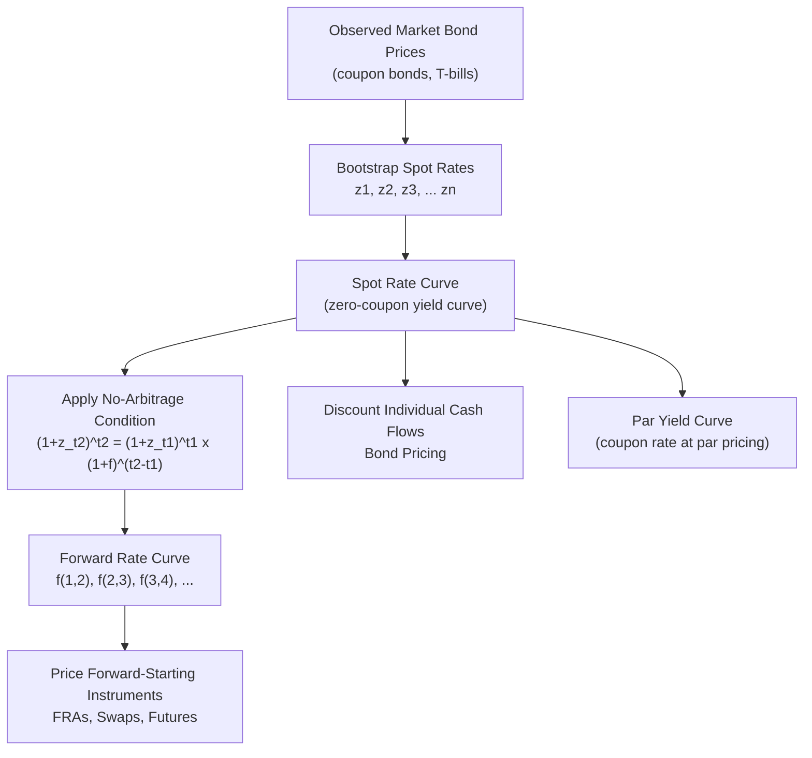

## Spot Rates, Forward Rates, and the Yield Curve

### Overview

Spot rates and forward rates are the two fundamental building blocks of the term structure of interest rates. The spot rate curve (also called the zero-coupon yield curve) gives the discount rate applicable to a single cash flow at each maturity, while forward rates represent rates implied by the spot curve for future periods. Together they underpin all fixed-income valuation, from simple bond pricing to interest rate derivatives.

### Spot Rates

The spot rate $z_t$ (or $r_t$) is the yield on a zero-coupon bond maturing at time $t$. It represents the annualized return an investor earns by holding a single, risk-free cash flow from today until time $t$, with no intermediate payments.

**Key Points**

- Spot rates are also called zero rates or zero-coupon yields.
- Each maturity has its own spot rate; the collection of spot rates across maturities forms the spot rate curve (or zero curve).
- Spot rates are used to discount individual cash flows, making them the theoretically correct discount rate for valuing any single future payment.

**Discounting with spot rates**

The present value of a cash flow $CF_t$ received at time $t$ is:

$$PV = \frac{CF_t}{(1+z_t)^t}$$

For continuously compounded spot rates:

$$PV = CF_t \cdot e^{-z_t \cdot t}$$

### Bond Pricing Using the Spot Curve

Because a coupon bond is simply a portfolio of individual cash flows (coupons plus final principal), its no-arbitrage price is obtained by discounting each cash flow at the spot rate matching its own maturity — not by using a single yield to maturity for all cash flows:

$$P = \sum_{t=1}^{n} \frac{C_t}{(1+z_t)^t} + \frac{F}{(1+z_n)^n}$$

**Example**

A 3-year bond pays annual coupons of $50 on $1,000 face value. Spot rates are: $z_1 = 4\%$, $z_2 = 4.5\%$, $z_3 = 5\%$.

$$P = \frac{50}{1.04} + \frac{50}{1.045^2} + \frac{1050}{1.05^3}$$

$$P = 48.08 + 45.80 + 907.03 = 1000.91$$

This price differs from a valuation using a single YTM discount rate, because the spot curve here is upward-sloping — later cash flows are discounted at progressively higher rates, precisely reflecting the term structure rather than an averaged rate.

### Bootstrapping the Spot Curve

Since zero-coupon bonds are not observable at every maturity, spot rates are typically derived (bootstrapped) from the prices of coupon-bearing Treasury securities, working from the shortest maturity outward.

**Key Points**

- Start with the shortest-maturity instrument (often a T-bill, which is already zero-coupon).
- Use its implied spot rate to discount the coupon portions of the next-maturity coupon bond.
- Solve for the unknown spot rate that equates the present value of the remaining (undiscounted) cash flow to the bond's market price.
- Repeat iteratively, using previously solved spot rates at each step, to build out the full curve.

**Example: 2-year bootstrap step**

Given: 1-year spot rate $z_1 = 4\%$ (from a T-bill). A 2-year bond pays a 5% annual coupon, priced at $1,009.35 (face $1,000).

$$1009.35 = \frac{50}{1.04} + \frac{1050}{(1+z_2)^2}$$

$$1009.35 = 48.08 + \frac{1050}{(1+z_2)^2}$$

$$(1+z_2)^2 = \frac{1050}{961.27} = 1.0923 \implies z_2 \approx 4.51\%$$

### Forward Rates

A forward rate is an interest rate for a future period, implied today by the current spot rate curve. It represents the rate at which an investor could contractually lock in borrowing or lending for a future period, consistent with no-arbitrage pricing.

**No-arbitrage forward rate formula**

The forward rate $f(t_1, t_2)$ applicable between times $t_1$ and $t_2$ satisfies:

$$(1+z_{t_2})^{t_2} = (1+z_{t_1})^{t_1} \cdot (1+f(t_1,t_2))^{(t_2-t_1)}$$

Solving for the forward rate:

$$f(t_1, t_2) = \left[\frac{(1+z_{t_2})^{t_2}}{(1+z_{t_1})^{t_1}}\right]^{\frac{1}{t_2-t_1}} - 1$$

**Key Points**

- Forward rates are derived, not directly observed; they are mathematically implied by the requirement that investing at the spot rate for the longer period must equal investing at the spot rate for the shorter period and then reinvesting at the forward rate.
- The one-period forward rate for period $t$ (i.e., $f(t-1, t)$) is often denoted $f_t$ and represents the market's implied rate for a single future period.
- Forward rates can be computed for any pair of maturities on the curve, not just adjacent annual periods.

**Example**

Using $z_1 = 4\%$ and $z_2 = 4.51\%$ from above, the 1-year forward rate one year from now, $f(1,2)$:

$$f(1,2) = \frac{(1.0451)^2}{(1.04)^1} - 1 = \frac{1.0922}{1.04} - 1 = 0.0502 = 5.02\%$$

This means the market's implied rate for lending money from year 1 to year 2 is approximately 5.02%, consistent with the observed spot rates.

### The Relationship Between Spot and Forward Rates

The spot rate for maturity $n$ can be expressed as the geometric average of the sequence of one-period forward rates:

$$(1+z_n)^n = (1+z_1)(1+f_2)(1+f_3)\cdots(1+f_n)$$

**Key Points**

- The $n$-year spot rate is the geometric mean of the one-year spot rate and all subsequent one-year forward rates.
- If forward rates are rising with maturity, the spot curve is upward-sloping (each additional spot rate pulls the average up).
- If forward rates are falling, the spot curve is downward-sloping (inverted).
- A flat spot curve implies constant forward rates equal to the spot rate.

### Yield Curve Shapes

**Key Points**

- **Normal (upward-sloping)**: Long-term spot rates exceed short-term rates. Historically the most common shape, generally reflecting a positive term premium and expectations of economic growth or gradually rising short rates.
- **Inverted (downward-sloping)**: Short-term rates exceed long-term rates. Often associated with expectations of monetary tightening followed by future rate cuts, and has historically preceded economic slowdowns in many markets. [Inference: the predictive reliability of curve inversion for recessions varies across economic cycles and countries and is not a certainty.]
- **Flat**: Short- and long-term rates are similar, often observed during transitions between normal and inverted regimes.
- **Humped**: Intermediate maturities have higher yields than both short and long maturities.

**(svg_diagram) Yield Curve Shapes**

<svg xmlns="http://www.w3.org/2000/svg" viewBox="0 0 620 380">

<text x="310" y="24" text-anchor="middle" font-size="15" font-weight="bold" fill="`#1a1a2e`">Yield Curve Shapes (svg_diagram)</text>

<line x1="70" y1="330" x2="580" y2="330" stroke="#333" stroke-width="1.5" />

<line x1="70" y1="330" x2="70" y2="50" stroke="#333" stroke-width="1.5" />

<text x="325" y="360" text-anchor="middle" font-size="13" fill="#333">Maturity</text>

<text x="35" y="190" text-anchor="middle" font-size="13" fill="#333" transform="rotate(-90 35 190)">Yield</text>

<path d="M 100 290 Q 330 180 550 100" fill="none" stroke="`#2266cc`" stroke-width="3" />

<text x="440" y="90" font-size="12" fill="`#2266cc`" font-weight="bold">Normal (upward)</text>

<path d="M 100 110 Q 330 200 550 290" fill="none" stroke="`#cc3333`" stroke-width="3" />

<text x="410" y="310" font-size="12" fill="`#cc3333`" font-weight="bold">Inverted (downward)</text>

<path d="M 100 210 L 550 210" fill="none" stroke="`#33aa55`" stroke-width="3" />

<text x="470" y="200" font-size="12" fill="`#33aa55`" font-weight="bold">Flat</text>

<path d="M 100 280 Q 250 130 330 130 Q 410 130 550 250" fill="none" stroke="`#aa7733`" stroke-width="3" />

<text x="230" y="115" font-size="12" fill="`#aa7733`" font-weight="bold">Humped</text>

</svg>

### Theories of the Term Structure

**Expectations Theory**

Forward rates are unbiased predictors of future spot rates. Under the pure expectations hypothesis, the yield curve's shape reflects the market's collective expectation of future short-term rates: an upward-sloping curve implies the market expects rates to rise.

**Liquidity Preference Theory**

Investors demand a liquidity premium for holding longer-maturity bonds, since these carry greater interest rate risk. This premium means forward rates are biased estimates of future spot rates — they embed both expectations and a term premium:

$$f_t = E[z_t^{future}] + \text{liquidity premium}_t$$

The liquidity premium is typically assumed to increase with maturity.

**Market Segmentation Theory**

Investors and issuers have strong preferences for specific maturity segments (driven by regulatory constraints, liability matching needs, or institutional mandates), and yields in each segment are determined primarily by supply and demand within that segment rather than by expectations of future rates.

**Preferred Habitat Theory**

An extension of segmentation theory: investors have preferred maturity habitats but will move outside them if sufficiently compensated by a risk premium, allowing partial arbitrage across segments while still permitting persistent term premia.

**Key Points**

- These theories are not mutually exclusive; most practitioners view the observed yield curve as reflecting a combination of rate expectations, term/liquidity premia, and some degree of segmentation. [Inference: the relative weight of each theoretical component in explaining any specific observed curve is a matter of ongoing empirical debate and cannot be precisely decomposed with certainty.]

### Par Yield Curve vs. Spot Curve vs. Forward Curve

**Key Points**

- **Par yield curve**: The coupon rate at which a bond of each maturity would be priced at exactly par (100), given the underlying spot curve. Commonly quoted by markets (e.g., "the 10-year Treasury yield") because most benchmark bonds trade near par at issuance.
- **Spot (zero) curve**: Rates for discounting individual zero-coupon cash flows; derived from the par curve via bootstrapping.
- **Forward curve**: Rates implied for future periods, derived from the spot curve; used for pricing forward-starting instruments, FRAs, and swaps.
- These three curves coincide only when the yield curve is flat; otherwise they diverge, with the spot curve lying above the par curve when the curve is upward-sloping (and vice versa for inverted curves).

### Using Forward Rates for Valuation and Hedging

**Key Points**

- Forward rates are used to price forward rate agreements (FRAs), interest rate futures, and the floating legs of interest rate swaps.
- A trader's view relative to implied forward rates determines relative-value strategies: if a trader believes actual future rates will be lower than the forwards imply, they may position to benefit from "rolling down the curve."
- Forward rates provide breakeven rates: an investor is indifferent between the two investment strategies (long-maturity vs. rolling over short-maturity bonds) only if actual future spot rates equal the forward rates embedded in today's curve.

### Constructing the Curve: Practical Considerations

**Key Points**

- On-the-run (most recently issued) government securities are typically most liquid and used preferentially for curve construction, though they may carry a slight liquidity premium relative to off-the-run issues.
- Interpolation methods (linear, cubic spline, Nelson-Siegel, Svensson) are used to estimate rates at maturities without directly observed instruments.
- Interbank curves (e.g., SOFR-based curves following LIBOR transition) are constructed similarly but from money market instruments, FRAs, and swap rates rather than government bonds, and now serve as the primary discounting curve for most derivatives. [Unverified: the precise instruments and conventions used in current SOFR curve construction can vary by institution and continue to evolve as the market matures.]

### Forward Rate Derivation Process

### Common Pitfalls

**Key Points**

- Using a single YTM to discount all cash flows of a bond rather than maturity-matched spot rates, which introduces pricing error whenever the curve is not flat.
- Treating forward rates as forecasts of future spot rates without accounting for the term/liquidity premium embedded in them under liquidity preference theory.
- Confusing the par curve (commonly quoted Treasury yields) with the spot curve when performing discounting — they are only equal at par-priced maturities.
- Assuming curve inversion mechanically causes recessions rather than reflecting market expectations that may or may not materialize.

### Related Topics

- Bootstrapping methodology and interpolation techniques (cubic splines, Nelson-Siegel, Svensson models)
- Duration and convexity (price sensitivity measures built on the yield curve)
- Interest rate swaps, FRAs, and swap curve construction
- The expectations hypothesis and empirical tests of forward rate unbiasedness
- SOFR transition and the construction of risk-free reference rate curves
- Term premium estimation and decomposition models
- Yield curve inversion as a business cycle indicator