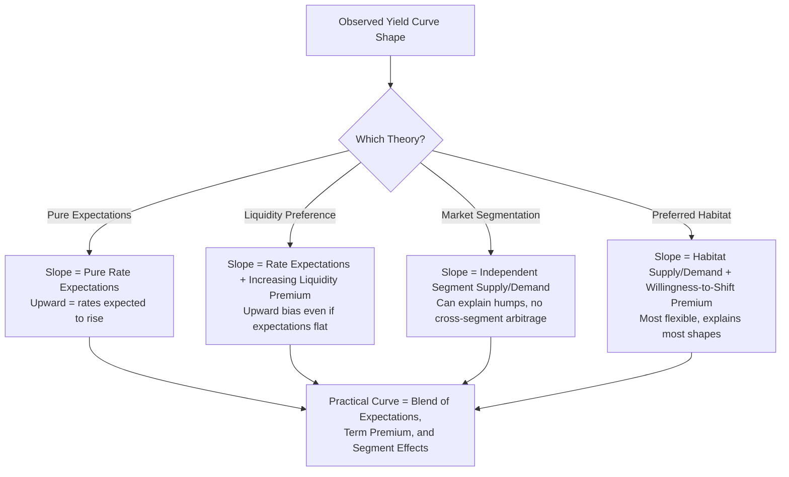

## Theories of the Yield Curve Shape

### Overview

The yield curve's shape — whether upward-sloping, inverted, flat, or humped — is one of the most closely watched signals in financial economics. Several competing (and complementary) theories attempt to explain why yields differ across maturities and what economic information the curve's shape conveys. These theories differ in their assumptions about investor behavior, market segmentation, and risk compensation, and each implies a different interpretation of the relationship between spot rates, forward rates, and expected future short-term rates.

### The Central Question

All term structure theories address the same underlying question: why does the yield on a bond depend on its maturity, even when default risk is held constant (e.g., across default-free government securities)? The answer in each theory hinges on how investors and issuers treat the risk, liquidity, and expectations components embedded in longer-versus-shorter maturities.

Recall the no-arbitrage relationship linking spot and forward rates:

$$(1+z_n)^n = (1+z_1)(1+f_2)(1+f_3)\cdots(1+f_n)$$

Each theory offers a different economic explanation for the one-period forward rates $f_t$ that make this identity hold.

### Pure Expectations Theory (Unbiased Expectations Hypothesis)

**Key Points**

- States that forward rates are unbiased predictors of future spot (short-term) rates: $f_t = E[z_t^{future}]$, with no additional risk premium.
- The shape of the yield curve reflects only the market's collective expectations about the future path of short-term interest rates.
- An upward-sloping curve implies the market expects short-term rates to rise; an inverted curve implies expected declines; a flat curve implies expected stability.
- Under this theory, an investor is indifferent between (a) buying a long-maturity bond and holding it to maturity, and (b) rolling over a sequence of short-maturity bonds, since expected returns are equalized across strategies.

**Example**

If the 1-year spot rate is 4% and the market expects the 1-year rate one year from now to be 6%, pure expectations theory predicts the 2-year spot rate satisfies:

$$(1+z_2)^2 = (1.04)(1.06) = 1.1024 \implies z_2 \approx 5.00\%$$

The resulting curve is upward-sloping purely because the market expects rates to rise, with no risk premium involved.

**Limitations**

- Empirically, forward rates have been found to be biased predictors of future spot rates in many studies, generally overstating the degree of rate increases embedded in an upward-sloping curve. [Inference: the magnitude and consistency of this bias vary across time periods, markets, and the specific segment of the curve studied.]
- The theory does not explain why the yield curve is upward-sloping more often than downward-sloping over long historical samples, since expectations of rising and falling rates might otherwise be expected to occur with roughly similar frequency.

### Liquidity Preference Theory

**Key Points**

- Builds on expectations theory but adds that investors require compensation (a liquidity premium) for bearing the greater price volatility and reduced liquidity of longer-maturity bonds.
- Forward rates equal expected future spot rates plus an increasing liquidity premium: $f_t = E[z_t^{future}] + L_t$, where $L_t$ generally increases with maturity ($L_2 < L_3 < L_4 \ldots$).
- This liquidity premium biases the yield curve toward an upward slope even when the market expects short-term rates to remain flat or decline modestly, which helps explain the historical tendency toward upward-sloping curves.
- Under this theory, borrowers (issuers) of long-term debt must generally pay a premium over what pure rate expectations alone would justify, compensating lenders for interest rate risk exposure.

**Example**

Suppose the market expects the 1-year rate one year forward to remain at 4% (flat expectations), but investors demand a 0.5% liquidity premium for the 2-year maturity:

$$f_2 = 4\% + 0.5\% = 4.5\%$$

$$(1+z_2)^2 = (1.04)(1.045) = 1.0868 \implies z_2 \approx 4.25\%$$

The curve slopes upward (from 4% to 4.25%) purely due to the liquidity premium, even though rate expectations themselves are flat.

**Key distinction from pure expectations theory**

- Under liquidity preference theory, an upward-sloping curve no longer unambiguously signals expected rate increases — some (or all) of the upward slope may simply reflect the liquidity premium, making the curve's informational content about future rates ambiguous without further adjustment.

### Market Segmentation Theory

**Key Points**

- Assumes that investors and borrowers have strict maturity preferences (driven by regulatory requirements, asset-liability matching needs, or institutional mandates) and do not consider substituting across maturity segments regardless of relative yields.
- Examples of typical habitat behavior: banks and money market funds prefer short-maturity instruments to match short-term liabilities; pension funds and insurers prefer long-maturity instruments to match long-dated liabilities.
- Under strict segmentation, yields at each maturity are determined independently by the supply and demand for funds within that specific maturity segment, with no arbitrage linkage across segments.
- This theory can explain humped or otherwise irregular curve shapes that pure expectations theory struggles to justify, since supply/demand imbalances in a specific segment (e.g., heavy Treasury issuance concentrated in a particular maturity) can distort that segment's yield independently of the rest of the curve.

**Limitations**

- The assumption of zero cross-segment substitution is generally considered too rigid, since large institutional investors and arbitrageurs do shift between maturities when compensated sufficiently, which imposes at least some linkage across segments in practice.

### Preferred Habitat Theory

**Key Points**

- A moderated version of segmentation theory: investors have a preferred maturity habitat (for the same institutional/liability-matching reasons as above), but they are willing to move outside that habitat if offered a sufficient risk premium to compensate for the mismatch.
- This allows partial arbitrage across maturity segments while still permitting persistent, segment-specific supply/demand effects and term premia to influence the curve's shape.
- Forward rates reflect expected future spot rates plus a premium that can vary in sign and magnitude by maturity segment (unlike liquidity preference theory's assumption of a monotonically increasing premium).
- Considered by many practitioners to be the most empirically flexible of the theories, since it can accommodate upward, downward, humped, and irregular curve shapes depending on relative habitat imbalances. [Inference: the relative empirical support for preferred habitat theory versus the other theories depends on the specific market, time period, and econometric methodology used in a given study.]

### Comparing the Theories

| Theory | Key Assumption | Explains Upward Slope Bias? | Explains Humps/Irregularities? |
| --- | --- | --- | --- |
| Pure Expectations | Forwards are unbiased rate forecasts | No | No |
| Liquidity Preference | Increasing premium for longer maturities | Yes | Limited |
| Market Segmentation | Strict maturity habitats, no substitution | Yes (via segment supply/demand) | Yes |
| Preferred Habitat | Habitats with willingness to shift for premium | Yes | Yes |

### Synthesis: How Practitioners Interpret the Curve

**Key Points**

- Most modern term structure analysis treats the observed yield curve as reflecting a combination of (1) market expectations of future short-term rates, (2) a term premium that generally increases with maturity, and (3) segment-specific supply/demand effects (e.g., driven by government issuance patterns, central bank asset purchases, or regulatory demand for long-dated safe assets).
- Empirical term structure models (e.g., affine term structure models) attempt to statistically decompose observed yields into an expectations component and a term premium component, though this decomposition is model-dependent. [Inference: because the decomposition relies on model assumptions and estimation techniques that vary across research approaches, the exact split between expectations and term premium in any given curve is not uniquely observable.]
- Central bank policy actions (e.g., quantitative easing, forward guidance) are understood to influence the curve through multiple channels simultaneously: shifting rate expectations, compressing term premia via large-scale asset purchases, and altering segment-specific supply.

### Yield Curve Shape Interpretation Under Each Theory

### Empirical Evidence and Practical Implications

**Key Points**

- Historical data on Treasury yield curves shows upward-sloping shapes have occurred more frequently than inverted shapes over long samples, which is generally cited as evidence favoring liquidity preference and/or preferred habitat theories over pure expectations theory alone.
- Yield curve inversions (short rates exceeding long rates) have historically coincided with subsequent economic slowdowns in a number of developed markets, a pattern often interpreted through an expectations-theory lens (the market pricing in future central bank rate cuts in response to anticipated weakness). [Inference: the reliability and lead time of this relationship as a recession predictor is debated and has varied across historical episodes.]
- Central bank quantitative easing programs, by concentrating purchases in specific maturity segments, have historically been associated with compressed term premia in those segments — evidence often cited in support of preferred habitat and segmentation effects operating alongside expectations. [Unverified: the precise magnitude of QE's effect on term premia versus other concurrent factors is difficult to isolate empirically and estimates vary considerably across studies.]

### Common Pitfalls

**Key Points**

- Treating an upward-sloping curve as unambiguous evidence that the market expects rising rates, without considering that some or all of the slope may reflect a liquidity/term premium rather than expectations.
- Applying pure expectations theory to explain humped or irregular curve shapes, which it is not well-suited to do.
- Assuming market segmentation implies zero relationship between yields at different maturities, when in practice most observed markets show at least partial linkage (consistent with preferred habitat rather than strict segmentation).
- Conflating the term premium with a risk-free rate forecast error; the term premium is a compensation for risk, not necessarily a forecasting mistake by the market.

### Related Topics

- Spot rates, forward rates, and the yield curve (foundational mechanics underlying these theories)
- Affine term structure models and empirical decomposition of yields
- Yield curve inversion as a business cycle and recession indicator
- Central bank monetary policy transmission via the yield curve (forward guidance, QE)
- Term premium estimation methodologies
- Duration and convexity (price sensitivity measures conditioned on curve shape)
- Interest rate risk management and asset-liability matching under different curve regimes