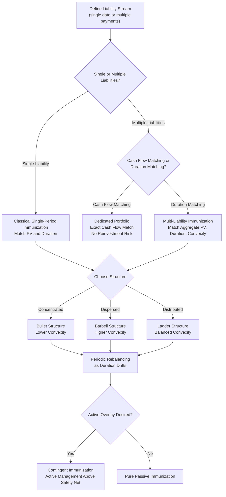

## Bond Portfolio Immunization Strategies

### Overview

Immunization is a portfolio construction strategy designed to protect a bond portfolio's value, or its ability to fund a future liability, against changes in interest rates. It exploits the offsetting effects of price risk and reinvestment risk: when rates rise, bond prices fall but coupon reinvestment income rises, and vice versa. By matching key risk measures — most commonly duration — between assets and liabilities, an investor can neutralize interest rate risk over a defined horizon, at least to a first-order approximation.

### The Core Problem: Price Risk vs. Reinvestment Risk

**Key Points**

- **Price risk**: The risk that a bond's market value falls when interest rates rise (or the risk of forgone appreciation if rates fall and the bond must be sold before maturity).
- **Reinvestment risk**: The risk that coupon payments must be reinvested at a rate different from the original yield — if rates fall, reinvested coupons earn less than expected.
- These two risks move in opposite directions in response to a rate change: a rate increase hurts price but helps reinvestment income; a rate decrease helps price but hurts reinvestment income.
- Immunization strategies are built on the insight that there exists a specific holding period — equal to the bond's (or portfolio's) Macaulay duration — at which these two effects offset almost exactly for a one-time parallel shift in rates.

### Classical Single-Period Immunization

**Key Points**

- If an investor's holding period equals the portfolio's Macaulay duration, the portfolio's ending value is largely insulated from a one-time, instantaneous parallel shift in interest rates, because the loss (gain) in reinvestment income is offset by the gain (loss) in price.
- This result holds only approximately, and specifically for small, parallel shifts in a flat or parallel-shifting yield curve; it does not fully protect against non-parallel shifts (curve twists or changes in shape).
- The classical framework, often attributed to Redington's theory of immunization, forms the basis for liability-driven investing at pension funds and insurers.

**Illustrative mechanism**

Consider a bond with Macaulay duration $D$ purchased with the intent to fund a liability due at time $D$.

- If rates rise immediately after purchase: the bond's price falls, but each subsequent coupon is reinvested at the new, higher rate, generating more reinvestment income by time $D$.
- If rates fall immediately after purchase: the bond's price rises, but coupons are reinvested at the new, lower rate, generating less reinvestment income by time $D$.

At exactly the duration-matched horizon, these two effects offset to first order, leaving the accumulated value close to what was originally projected under the original yield.

### Duration Matching for Liability Funding

The most common application of immunization is funding a single future liability (a target date obligation) or a stream of liabilities (as in pension or insurance portfolios).

**Single liability immunization conditions**

$$D_{Assets} = D_{Liability}$$

$$PV(Assets) = PV(Liability)$$

**Key Points**

- Matching duration alone is necessary but not sufficient; the present value of assets must also at least equal the present value of the liability at the outset.
- Because duration changes as time passes and as yields change (duration drift), the portfolio requires periodic rebalancing to maintain the match — it is not a "buy and forget" strategy.

**Example**

A pension fund has a liability of $10 million due in 7 years, with a liability duration of 7 (since it is a single fixed payment). To immunize, the fund purchases a bond portfolio with:

- Present value of assets = $10,000,000 / $(1+y)^7$ (discounted at the current relevant yield)
- Portfolio Macaulay duration = 7 years

This can be achieved with a single 7-year zero-coupon bond (if available) or, more typically, a combination of shorter and longer coupon bonds whose value-weighted average duration equals 7.

### Multiple Liability Immunization (Cash Flow Matching vs. Duration Matching)

For portfolios funding a stream of future liabilities (e.g., a pension's projected annual benefit payments), two broad approaches exist:

**Cash Flow Matching (Dedication)**

- Construct a bond portfolio whose cash flows (coupons and principal) exactly match the timing and amount of each future liability payment.
- **Key Points**: Eliminates reinvestment risk entirely, since no reinvestment assumption is needed. Requires no ongoing rebalancing once constructed. Often more expensive than duration-matching approaches because exact cash flow matches may require holding bonds that are not otherwise optimal, and typically requires a wider investable universe.

**Duration Matching (Multiple-Liability Immunization)**

- Construct a portfolio whose aggregate present value and duration match the aggregate present value and duration of the liability stream, without matching individual cash flows exactly.
- **Key Points**: Requires periodic rebalancing as durations drift with time and yield changes. Generally requires satisfying an additional condition beyond simple duration matching, related to matching the dispersion (convexity) of asset and liability cash flows around the target horizon, to reduce vulnerability to non-parallel shifts. Typically less costly to construct than full cash flow matching, but carries residual risk from non-parallel yield curve shifts.

### Redington's Immunization Conditions

For classical multi-period immunization against small parallel yield shifts, three conditions are generally required:

1. **Present value matching**: $PV(Assets) = PV(Liabilities)$
2. **Duration matching**: $D_{Assets} = D_{Liabilities}$
3. **Convexity condition**: The convexity (or dispersion of cash flows) of the asset portfolio should be greater than or equal to that of the liability portfolio, ideally with cash flows dispersed around the liability's duration rather than concentrated at a single point.

**Key Points**

- The third condition matters because a portfolio with cash flows widely dispersed around the target duration (a barbell structure) is more convex than one with cash flows concentrated at the duration point (a bullet structure), even if both have identical duration.
- Higher asset convexity relative to liabilities provides better protection because the asset side gains more than the liability side for large rate moves in either direction, given equal duration.

### Structural Approaches: Bullet vs. Barbell vs. Ladder

**Bullet Structure**

- Concentrates asset cash flows near a single maturity close to the duration target.
- **Key Points**: Lower convexity than a duration-matched barbell. Simpler to construct and rebalance. More exposed to non-parallel curve shifts (e.g., a twist around the duration point) than a barbell of equal duration.

**Barbell Structure**

- Combines short-maturity and long-maturity bonds to achieve a target average duration, with no holdings at the intermediate maturity.
- **Key Points**: Higher convexity than a bullet of equal duration, providing better protection against large rate moves and curve twists. More sensitive to yield curve shape changes (steepening/flattening) between the two ends of the barbell. Commonly used when the additional convexity is desired without sacrificing the average duration target.

**Ladder Structure**

- Spreads bond holdings evenly across a range of maturities (e.g., equal amounts maturing in years 1 through 10).
- **Key Points**: Provides diversification across the curve and steady, predictable reinvestment cash flows. Simplifies rebalancing since maturing bonds are continuously replaced at the long end. Generally offers a compromise in convexity between bullet and barbell structures.

**(svg_diagram) Bullet vs. Barbell Cash Flow Dispersion**

<svg xmlns="http://www.w3.org/2000/svg" viewBox="0 0 600 340">

<text x="300" y="24" text-anchor="middle" font-size="15" font-weight="bold" fill="`#1a1a2e`">Bullet vs. Barbell Structures (svg_diagram)</text>

<line x1="60" y1="290" x2="560" y2="290" stroke="#333" stroke-width="1.5" />

<text x="310" y="320" text-anchor="middle" font-size="13" fill="#333">Maturity (years)</text>

<rect x="290" y="150" width="30" height="140" fill="`#2266cc`" />

<text x="305" y="145" text-anchor="middle" font-size="11" fill="`#2266cc`">Bullet</text>

<text x="305" y="310" text-anchor="middle" font-size="11" fill="#333">7yr</text>

<rect x="100" y="200" width="30" height="90" fill="`#cc3333`" />

<rect x="470" y="100" width="30" height="190" fill="`#cc3333`" />

<text x="115" y="195" text-anchor="middle" font-size="11" fill="`#cc3333`">Barbell</text>

<text x="115" y="310" text-anchor="middle" font-size="11" fill="#333">2yr</text>

<text x="485" y="95" text-anchor="middle" font-size="11" fill="`#cc3333`">Barbell</text>

<text x="485" y="310" text-anchor="middle" font-size="11" fill="#333">15yr</text>

<text x="290" y="50" font-size="12" fill="#333">Both structures: duration = 7 years</text>

<text x="150" y="70" font-size="12" fill="`#cc3333`">Barbell: higher convexity</text>

<text x="150" y="90" font-size="12" fill="`#cc3333`">(cash flows dispersed)</text>

</svg>

### Contingent Immunization

**Key Points**

- A hybrid, active-passive strategy: the portfolio is actively managed (seeking returns above the immunized rate) as long as its value remains above a "safety net" threshold sufficient to fully immunize the liability if converted to a passive strategy immediately.
- If the portfolio's value falls to the safety net threshold, the manager must switch to a fully passive, classically immunized strategy to guarantee the liability is met.
- This allows some upside potential from active management while providing a floor of protection, at the cost of requiring careful, continuous monitoring of the cushion (the gap between current portfolio value and the immunization threshold).

### Rebalancing and Duration Drift

**Key Points**

- Duration changes passively over time even without yield changes (it generally decreases roughly in step with the passage of time, though not one-for-one, since coupon-weighted duration falls more slowly than maturity as the bond ages).
- Duration also changes with the level of yields, and non-parallel yield curve shifts can cause the asset and liability durations to drift apart even if they were initially matched.
- Practical immunization programs require periodic rebalancing (e.g., quarterly or when duration drifts beyond a tolerance band) to restore the duration match, which involves transaction costs that must be weighed against the cost of tracking error from an unrebalanced mismatch.

### Limitations of Immunization

**Key Points**

- Duration-based immunization protects primarily against small, parallel shifts in the yield curve; it does not fully protect against non-parallel shifts (steepening, flattening, twists), which key rate duration analysis is better suited to address.
- Immunization assumes no default risk in the asset portfolio; credit risk (downgrades, defaults) can undermine the funding guarantee even with a perfect duration match.
- Reinvestment of intermediate cash flows is generally assumed to occur at the prevailing market rate; assumptions about transaction costs and the ability to trade at quoted prices may not always hold in practice, particularly in less liquid segments of the bond market. [Inference: the practical slippage between theoretical and realized immunized returns depends on market liquidity conditions and transaction cost assumptions specific to the portfolio and time period.]
- Immunization is a risk-minimization strategy relative to a specific liability or horizon, not a total return maximization strategy; it typically sacrifices some expected return relative to unconstrained active management in exchange for reduced funding risk.

### Immunization Strategy Selection Process

### Applications in Practice

**Key Points**

- **Pension funds**: Use liability-driven investing (LDI), a close relative of immunization, to match asset duration to the duration of projected benefit obligations, reducing funding ratio volatility.
- **Insurance companies**: Immunize against interest rate risk on fixed liabilities such as guaranteed annuity contracts, often combined with cash flow matching for near-term obligations and duration matching for longer-dated ones.
- **Banks**: Apply related asset-liability management (ALM) techniques to manage the duration gap between interest-sensitive assets (loans) and liabilities (deposits), though full immunization is less common than partial gap management.
- **Target-date and defined-maturity bond funds**: Use immunization-like duration management as the fund approaches its target maturity date, progressively reducing duration.

### Common Pitfalls

**Key Points**

- Assuming a one-time duration match is sufficient without ongoing rebalancing, ignoring duration drift from time passage and yield changes.
- Matching duration but ignoring convexity, leaving the portfolio exposed to larger, asymmetric losses under big rate moves or curve twists relative to the liability.
- Applying classical immunization theory (built for parallel shifts) to situations dominated by non-parallel curve risk without supplementing it with key rate duration analysis.
- Overlooking credit and liquidity risk in the asset portfolio, treating immunization as a guarantee when it is conditioned on the assets performing as modeled (no defaults, ability to transact at assumed prices).
- Confusing cash flow matching (a stronger, reinvestment-risk-free approach) with duration matching (a weaker approximation requiring rebalancing) as though they provide equivalent protection.

### Related Topics

- Duration and convexity (the core risk measures underlying immunization)
- Key rate duration and non-parallel yield curve risk management
- Liability-driven investing (LDI) for pension and insurance portfolios
- Asset-liability management (ALM) and duration gap analysis for banks
- Spot rates, forward rates, and the yield curve (term structure inputs to immunization)
- Barbell, bullet, and ladder portfolio construction strategies
- Contingent immunization and active-passive hybrid strategies