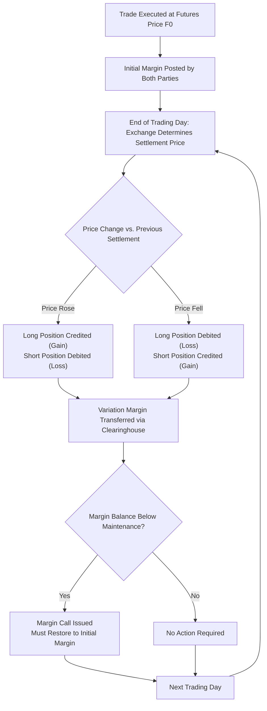

## Forward and Futures Contract Mechanics

### Overview

Forwards and futures are the foundational derivative instruments for locking in a price today for an asset to be exchanged at a future date. Though economically similar in their basic payoff structure, they differ substantially in their operational mechanics — counterparty structure, settlement, standardization, and margining — which produces materially different risk and cash flow profiles. Understanding these mechanics is a prerequisite for pricing, hedging, and risk-managing any derivative built on top of them.

### Defining Forward and Futures Contracts

**Forward contract**: A private, customized, over-the-counter (OTC) agreement between two counterparties to buy or sell an asset at a specified price (the forward price) on a specified future date.

**Futures contract**: A standardized agreement, traded on an organized exchange, to buy or sell an asset at a specified price on a specified future date, with the exchange's clearinghouse acting as the counterparty to every trade.

**Key Points**

- Both are legally binding commitments (unlike options, which grant a right but not an obligation).
- The party agreeing to buy the underlying asset holds the **long position**; the party agreeing to sell holds the **short position**.
- Both instruments derive their payoff from the difference between the contract price and the prevailing spot price at (or before) expiration.

### Comparison of Forwards and Futures

| Feature | Forward Contracts | Futures Contracts |
| --- | --- | --- |
| Trading venue | OTC (privately negotiated) | Organized exchange |
| Standardization | Customized (size, maturity, underlying) | Standardized by exchange |
| Counterparty | Direct bilateral counterparty | Clearinghouse (central counterparty) |
| Credit risk | Bilateral counterparty risk | Minimal (mutualized via clearinghouse) |
| Settlement | Typically at maturity only | Marked-to-market daily |
| Margin | Often none, or bilaterally negotiated (CSA) | Required (initial and maintenance margin) |
| Liquidity | Generally lower, harder to exit early | Generally higher, easy to offset/close |
| Regulation | Historically lighter (though post-2008 reforms increased oversight of OTC derivatives) | Heavily regulated by exchange and regulators |

### Payoff Structure

At maturity $T$, for a contract with delivery price $K$ (the price fixed at inception) and spot price $S_T$ (the market price at maturity):

**Long forward/futures payoff:**

$$\text{Payoff}_{Long} = S_T - K$$

**Short forward/futures payoff:**

$$\text{Payoff}_{Short} = K - S_T$$

**Key Points**

- The payoff is linear and symmetric: gains for the long position are exactly offset by losses for the short position, and vice versa (a zero-sum relationship before considering transaction costs and counterparty risk differences).
- Unlike options, there is no premium paid at initiation for a forward or futures contract entered at the fair (no-arbitrage) forward price — the contract has zero initial value.

**(svg_diagram) Long and Short Forward Payoff Diagrams**

<svg xmlns="http://www.w3.org/2000/svg" viewBox="0 0 620 340">

<text x="310" y="24" text-anchor="middle" font-size="15" font-weight="bold" fill="`#1a1a2e`">Forward Contract Payoffs (svg_diagram)</text>

<line x1="80" y1="180" x2="580" y2="180" stroke="#333" stroke-width="1" />

<line x1="330" y1="50" x2="330" y2="310" stroke="#333" stroke-width="1.5" />

<text x="330" y="330" text-anchor="middle" font-size="12" fill="#333">K (Delivery Price)</text>

<line x1="130" y1="280" x2="530" y2="80" stroke="`#2266cc`" stroke-width="3" />

<text x="480" y="70" font-size="12" fill="`#2266cc`" font-weight="bold">Long Payoff</text>

<line x1="130" y1="80" x2="530" y2="280" stroke="`#cc3333`" stroke-width="3" />

<text x="480" y="290" font-size="12" fill="`#cc3333`" font-weight="bold">Short Payoff</text>

<text x="30" y="45" font-size="13" fill="#333">Payoff</text>

<text x="560" y="200" font-size="13" fill="#333">S_T</text>

</svg>

### Marking-to-Market and Margin (Futures-Specific)

Futures contracts are settled daily through the marking-to-market process, which is central to how they differ operationally from forwards.

**Key Points**

- **Initial margin**: A good-faith deposit required to open a futures position, set by the exchange/clearinghouse, typically a small percentage of the contract's notional value.
- **Maintenance margin**: A lower threshold below which the account balance cannot fall before triggering a margin call; typically set below the initial margin level.
- **Variation margin**: The daily gain or loss credited to or debited from the margin account based on the change in the futures settlement price, effectively realizing gains/losses each day rather than only at maturity.
- **Margin call**: If the account balance falls below the maintenance margin, the holder must deposit additional funds (typically back up to the initial margin level) or the position may be liquidated.

**Example**

An investor buys 1 futures contract on 100 barrels of oil at $80/barrel (notional = $8,000). Initial margin = $800; maintenance margin = $600.

Day 1: Price falls to $78/barrel. Loss = $(80-78) \times 100 = \$200$. Margin account balance = $800 − $200 = $600 (exactly at maintenance level, generally no call triggered).

Day 2: Price falls further to $76.50/barrel. Loss = $(78-76.5) \times 100 = \$150$. Margin balance = $600 − $150 = $450, which is below the $600 maintenance threshold, triggering a margin call for $350 to restore the balance to the $800 initial margin level.

### Daily Settlement Mechanics

### Counterparty Risk and the Role of the Clearinghouse

**Key Points**

- In a forward contract, each party bears direct credit (default) risk on the other party for the full amount owed at maturity, since there is no intermediary and typically no daily settlement.
- In a futures contract, the exchange's clearinghouse becomes the legal counterparty to both the buyer and the seller (via novation), so neither original party bears direct credit risk on the other.
- Daily marking-to-market in futures markets limits the maximum credit exposure at any time to roughly one day's price movement, since losses are settled continuously rather than accumulating until maturity.
- Clearinghouses further mitigate systemic risk through mutualized default funds (guarantee funds) contributed by clearing members, which absorb losses if a member defaults and margin proves insufficient.

### Settlement Methods

**Physical settlement**: The underlying asset is actually delivered by the short to the long at contract maturity, in exchange for payment of the agreed price.

**Cash settlement**: No physical delivery occurs; instead, the difference between the contract price and the final settlement price (or reference index) is paid in cash.

**Key Points**

- Physical settlement is common for many commodity and some interest rate futures, though many market participants close out positions before delivery to avoid the logistics of physical delivery.
- Cash settlement is standard for contracts on assets that are impractical or impossible to deliver, such as stock index futures (e.g., S&P 500 futures) and many interest rate and currency contracts.
- The choice of settlement method is specified in the contract terms and, for futures, standardized by the exchange.

### Standardized Contract Terms (Futures)

**Key Points**

- **Contract size**: The fixed quantity of the underlying asset per contract (e.g., 1,000 barrels of crude oil, 5,000 bushels of corn, $100,000 face value of Treasury bonds).
- **Tick size and tick value**: The minimum price movement allowed and its corresponding dollar value per contract, which determines the granularity of daily gains/losses.
- **Delivery months**: A fixed cycle of contract expiration months set by the exchange (e.g., quarterly cycle: March, June, September, December for many financial futures).
- **Delivery location/grade**: For physically settled commodities, the exchange specifies acceptable delivery locations and quality grades, often with price adjustments for non-standard grades.
- **Position limits**: Exchange-imposed caps on the number of contracts a single trader may hold, intended to prevent market manipulation and excessive concentration risk.

### Closing Out a Position

**Key Points**

- **Offsetting trade**: The most common way to close a futures position before maturity — entering an equal and opposite position in the same contract, which the clearinghouse nets against the original position.
- **Delivery**: Holding a physically settled contract to expiration and completing the delivery process (relatively rare in practice for financial futures; more common in some commodity markets).
- **Cash settlement at expiration**: For cash-settled contracts, the position is automatically closed at expiration based on the final settlement price, with no action required by the holder beyond the final cash flow.
- Forward contracts, lacking an active secondary market, are generally harder to exit before maturity and may require negotiating a separate offsetting contract or unwind agreement directly with the original counterparty (or a novation to a third party if permitted).

### Basis and Convergence

**Basis** is defined as the difference between the spot price and the futures price:

$$\text{Basis} = S_t - F_t$$

**Key Points**

- As a futures contract approaches expiration, its price generally converges toward the spot price of the underlying asset — a phenomenon known as convergence.
- At expiration, basis theoretically approaches zero (for a contract on the exact deliverable asset), since any persistent divergence would present an arbitrage opportunity.
- Basis risk arises in hedging applications when the asset being hedged does not exactly match the underlying of the futures contract (e.g., hedging jet fuel exposure with heating oil futures), or when the hedge is lifted before the futures contract's expiration.
- [Inference: the speed and smoothness of convergence can vary depending on the specific underlying asset's liquidity, delivery mechanics, and any market frictions near expiration, and is not always perfectly smooth in practice.]

### Exchange-Traded vs. OTC Market Structure

**Key Points**

- Futures exchanges (e.g., CME Group, ICE) provide centralized price discovery, high pre-trade and post-trade transparency, and standardized contract specifications that facilitate liquidity.
- OTC forward markets allow full customization of notional amount, maturity date, and underlying reference, which is valuable for precise hedging needs that standardized futures cannot match exactly.
- Post-2008 financial crisis regulatory reforms (e.g., Dodd-Frank in the U.S., EMIR in the EU) introduced mandatory central clearing and reporting requirements for many standardized OTC derivatives, narrowing some of the historical structural gap between forwards/swaps and futures. [Unverified: the precise scope of mandatory clearing requirements varies by jurisdiction, product type, and counterparty classification, and continues to evolve through regulatory rule-making.]

### Common Uses

**Key Points**

- **Hedging**: Producers, consumers, and financial institutions use forwards and futures to lock in prices and reduce exposure to adverse price movements (e.g., an airline hedging fuel costs, an exporter hedging currency risk).
- **Speculation**: Traders take directional positions to profit from anticipated price movements, using the leverage inherent in margin-based futures trading.
- **Arbitrage**: Traders exploit mispricing between the futures price and the theoretical no-arbitrage forward price implied by the cost-of-carry model.
- **Asset allocation and portfolio management**: Index futures allow institutional investors to efficiently adjust portfolio exposure (e.g., equitizing cash, hedging beta) without transacting in the underlying securities directly.

### Common Pitfalls

**Key Points**

- Treating forwards and futures as economically identical in all respects; while their terminal payoffs are similar, the presence of daily marking-to-market in futures can cause the two to have different values prior to maturity, particularly when interest rates are correlated with the underlying asset's price. [Inference: the magnitude of this valuation difference depends on the correlation between interest rates and the underlying asset, and is often negligible in practice for many asset classes but can be material for interest rate futures.]
- Underestimating margin call/liquidity risk in futures positions — an investor can be forced to close a fundamentally sound position due to short-term margin calls even if the position would have been profitable at maturity.
- Ignoring basis risk when using a futures contract that imperfectly matches the hedged exposure in underlying asset, location, or timing.
- Assuming zero counterparty risk in forwards due to their bilateral private nature, when in fact forwards carry meaningfully more direct credit risk than exchange-cleared futures.

### Related Topics

- Cost-of-carry model and no-arbitrage forward/futures pricing
- Hedging strategies using forwards and futures (hedge ratios, basis risk management)
- Interest rate futures and Eurodollar/SOFR futures mechanics
- Swaps as a portfolio of forward contracts
- Clearinghouse risk management and default fund structures
- Convergence, basis trading, and calendar spread strategies
- Regulatory frameworks for derivatives (Dodd-Frank, EMIR, central clearing mandates)