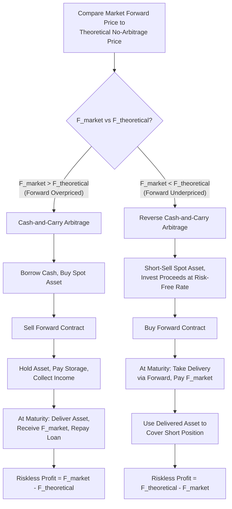

## Cost-of-Carry and No-Arbitrage Pricing

### Overview

The cost-of-carry model is the foundational framework for pricing forward and futures contracts under the principle of no-arbitrage. It establishes that the fair forward price of an asset must equal its spot price adjusted for the net cost of "carrying" (holding) that asset from today until the contract's delivery date. Any deviation from this fair price creates a riskless arbitrage opportunity, which market forces act to eliminate.

### The No-Arbitrage Principle

**Key Points**

- No-arbitrage pricing rests on the assumption that in a well-functioning, sufficiently liquid market, no risk-free profit opportunity can persist, since arbitrageurs will exploit and thereby eliminate it.
- The forward price is derived by constructing a replicating strategy — a combination of the spot asset and risk-free borrowing/lending — that produces the same payoff as the forward contract at maturity.
- If the actual market forward price differs from the no-arbitrage price, a cash-and-carry (or reverse cash-and-carry) arbitrage strategy can, in principle, lock in a riskless profit.

### The General Cost-of-Carry Formula

For an asset with spot price $S_0$, the no-arbitrage forward price $F_0$ for delivery at time $T$ is:

$$F_0 = S_0 \cdot e^{(r + c - y)T}$$

using continuous compounding, or equivalently in discrete form:

$$F_0 = S_0 (1+r+c-y)^T$$

where:

- $r$ = risk-free interest rate (the financing cost of holding the asset)
- $c$ = storage and other carrying costs, expressed as a rate (e.g., warehousing, insurance) — applicable mainly to physical commodities
- $y$ = income yield generated by the asset while held (e.g., dividend yield on equities, coupon yield on bonds, convenience yield on commodities)

**Key Points**

- The net cost of carry is $(r + c - y)$: the cost of financing and storing the asset, less any income or convenience benefit received from holding it.
- If the net cost of carry is positive, the forward price exceeds the spot price (**contango**); if negative, the forward price is below the spot price (**backwardation**).

### Cost-of-Carry for Different Asset Classes

**Financial assets with no storage costs (stocks, bonds, currencies)**

For a non-dividend-paying stock:

$$F_0 = S_0 \cdot e^{rT}$$

For a dividend-paying stock (continuous dividend yield $q$):

$$F_0 = S_0 \cdot e^{(r-q)T}$$

**Example**

A non-dividend stock trades at $100. The risk-free rate is 5% (continuously compounded), and the forward matures in 6 months.

$$F_0 = 100 \times e^{0.05 \times 0.5} = 100 \times e^{0.025} = 100 \times 1.0253 = \$102.53$$

If the stock pays a continuous dividend yield of 2%:

$$F_0 = 100 \times e^{(0.05-0.02) \times 0.5} = 100 \times e^{0.015} = \$101.51$$

The dividend yield reduces the forward price because the holder of the physical stock captures the dividend, a benefit the long forward position does not receive.

**Currency forwards (Covered Interest Rate Parity)**

For an exchange rate $S_0$ (domestic currency per unit of foreign currency), with domestic risk-free rate $r_d$ and foreign risk-free rate $r_f$:

$$F_0 = S_0 \cdot \frac{(1+r_d)^T}{(1+r_f)^T}$$

or in continuous form: $F_0 = S_0 \cdot e^{(r_d - r_f)T}$

**Key Points**

- This relationship is known as Covered Interest Rate Parity (CIRP) and is one of the most tightly enforced no-arbitrage conditions in global financial markets due to the depth and liquidity of currency and money markets.
- The foreign risk-free rate acts as the "yield" on holding the foreign currency (since it can be deposited to earn foreign interest), analogous to a dividend yield.

**Commodities (storage costs and convenience yield)**

$$F_0 = S_0 \cdot e^{(r+c-\delta)T}$$

where $\delta$ is the convenience yield — the non-monetary benefit of holding the physical commodity itself (e.g., avoiding stockout risk, flexibility in production scheduling), and $c$ represents storage/insurance costs.

**Key Points**

- Convenience yield is not directly observable and is typically inferred residually from observed futures prices relative to the cost-of-carry model.
- High convenience yield (e.g., during supply shortages) can push a commodity market into backwardation despite positive financing and storage costs, because the benefit of holding the physical asset outweighs the carrying costs.

**Interest rate/bond forwards**

For a coupon-bearing bond with spot price $S_0$ and known coupon income with present value $I$ during the life of the forward:

$$F_0 = (S_0 - I)(1+r)^T$$

The coupon income $I$ is subtracted because, analogous to a dividend, the holder of the physical bond receives the coupon, a benefit not passed to the forward's long position.

### Cash-and-Carry Arbitrage

If the observed market forward price $F_{market}$ exceeds the theoretical no-arbitrage price $F_0$, a cash-and-carry arbitrage is available:

**Key Points**

1. Borrow funds at the risk-free rate and buy the underlying asset in the spot market today.
2. Simultaneously sell (go short) the forward contract at the (overpriced) market forward price.
3. Hold the asset (paying any storage costs, collecting any income) until maturity.
4. Deliver the asset into the forward contract, receiving $F_{market}$; repay the loan plus interest.
5. The riskless profit equals $F_{market} - F_0$, since the borrowing cost, storage cost, and income exactly reconstruct the theoretical fair value $F_0$.

### Reverse Cash-and-Carry Arbitrage

If $F_{market} < F_0$ (the forward is underpriced), the reverse strategy applies:

**Key Points**

1. Short-sell the underlying asset spot and invest the proceeds at the risk-free rate.
2. Simultaneously buy (go long) the forward contract at the (underpriced) market forward price.
3. At maturity, take delivery of the asset via the forward contract, paying $F_{market}$.
4. Use the delivered asset to close out (cover) the short position; collect the accumulated risk-free investment proceeds.
5. The riskless profit equals $F_0 - F_{market}$.

**Key Points**

- Reverse cash-and-carry arbitrage requires the ability to short-sell the underlying asset, which is straightforward for financial assets (stocks, bonds) but often impractical or costly for physical commodities, meaning this direction of arbitrage is frequently constrained in commodity markets.
- This asymmetry (easy cash-and-carry, constrained reverse cash-and-carry) is one reason commodity forward curves can persistently deviate from the pure cost-of-carry model, particularly during backwardation driven by high convenience yield.

### Cash-and-Carry Arbitrage Mechanics

### Contango and Backwardation

**Contango**: The futures/forward price is above the expected future spot price (or, in the simple cost-of-carry sense, above the current spot price), typically arising when net carrying costs are positive.

**Backwardation**: The futures/forward price is below the current spot price, typically arising when convenience yield or income exceeds financing and storage costs.

**Key Points**

- Contango is the "normal" state for financial assets with no offsetting income and positive financing costs (e.g., non-dividend stocks, gold with no significant convenience yield).
- Backwardation is common in commodity markets during periods of scarcity or high near-term demand, when the convenience yield of holding physical inventory is elevated.
- The terms are sometimes also used relative to the *expected future spot price* rather than the *current spot price*, particularly in the context of the Keynesian theory of normal backwardation (relating to hedging pressure from producers), which is a related but distinct concept from the pure cost-of-carry contango/backwardation described here.

### Forward Price vs. Value of a Forward Contract

**Key Points**

- The **forward price** $F_0$ is the delivery price agreed upon at contract initiation, set such that the contract has zero value to either party at that moment.
- The **value of the forward contract** changes over time as the underlying spot price moves, even though the delivery price $F_0$ remains fixed for the life of the contract.
- At any time $t$ before maturity, the value of a long forward position entered at price $F_0$ is:

$$f_t = (F_t - F_0) \cdot e^{-r(T-t)}$$

where $F_t$ is the current no-arbitrage forward price for the same maturity $T$, computed from the spot price prevailing at time $t$.

**Example**

A long forward on a non-dividend stock was entered at $F_0 = \$102.53$ (6-month maturity, from the earlier example). Three months later, the stock spot price has risen to $108, and the risk-free rate remains 5%. The new 3-month forward price is:

$$F_t = 108 \times e^{0.05 \times 0.25} = 108 \times 1.0126 = \$109.36$$

The value of the original long forward position is:

$$f_t = (109.36 - 102.53) \times e^{-0.05 \times 0.25} = 6.83 \times 0.9876 = \$6.75$$

### Interest Rate Parity and Multi-Asset Extensions

**Key Points**

- The cost-of-carry framework generalizes naturally across asset classes by correctly identifying what constitutes the "financing cost" and the "yield/benefit" for each specific asset.
- For equity index futures, the relevant yield is the dividend yield on the index; for bond futures, it is the coupon income (net of any conversion factor adjustments used by the exchange); for currency forwards, it is the foreign interest rate.
- Departures from the theoretical cost-of-carry price in practice can arise from transaction costs, margin requirements, short-selling constraints, differential borrowing/lending rates, tax asymmetries, and liquidity premia — all of which create a band around the theoretical price within which arbitrage is not profitable after costs. [Inference: the width of this no-arbitrage band varies by market and asset class depending on the specific frictions present, and is generally narrower in highly liquid, well-developed markets.]

### Limitations and Real-World Frictions

**Key Points**

- **Transaction costs**: Bid-ask spreads, brokerage fees, and exchange fees reduce or eliminate the profitability of theoretically identified arbitrage opportunities.
- **Borrowing/lending rate asymmetry**: Real-world investors typically borrow at rates higher than they can lend (unlike the single risk-free rate assumed in the basic model), which widens the no-arbitrage band.
- **Short-selling constraints**: Not all assets can be shorted easily or cheaply, limiting the feasibility of reverse cash-and-carry strategies, especially for physical commodities.
- **Margin and collateral requirements**: Posting margin ties up capital and can itself carry an opportunity cost not captured in the simplest version of the model.
- **Convenience yield uncertainty**: For commodities, the convenience yield is not directly observable and must be inferred, which limits the model's precision as a forecasting or pricing tool for that asset class relative to financial assets. [Inference: because convenience yield is unobservable and inferred residually, its estimated value can be sensitive to the specific model and time period used, introducing model risk into commodity forward pricing.]

### Common Pitfalls

**Key Points**

- Applying the cost-of-carry formula to commodities without accounting for convenience yield, leading to systematically biased forward price estimates, particularly during periods of scarcity.
- Confusing the forward price (the delivery price fixed at initiation) with the ongoing value of the forward contract (which fluctuates with the underlying spot price after initiation).
- Ignoring dividend or coupon income when pricing equity or bond forwards, which overstates the theoretical forward price.
- Assuming symmetric borrowing and lending rates when constructing arbitrage strategies, which can make a theoretically profitable arbitrage unprofitable after realistic financing cost asymmetries.
- Treating the no-arbitrage price as an exact market price rather than the center of a no-arbitrage band bounded by transaction costs and other frictions.

### Related Topics

- Forward and futures contract mechanics (payoff structure, margining, settlement)
- Covered interest rate parity and currency forward pricing
- Convenience yield and commodity futures curve dynamics (contango/backwardation)
- Swaps as a portfolio of forward contracts
- Hedging strategies using forwards and futures
- Interest rate futures pricing (Eurodollar/SOFR futures, bond futures conversion factors)
- Arbitrage-free pricing theory in derivatives more broadly