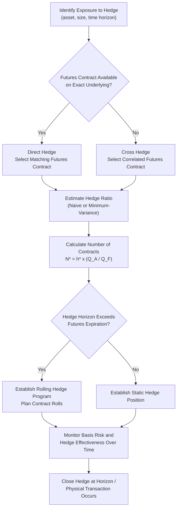

## Hedging Strategies Using Futures

### Overview

Hedging with futures involves taking a position in a futures contract that offsets the price risk of an existing or anticipated exposure in the underlying (or a related) asset. Rather than eliminating risk entirely, an effective futures hedge transforms uncertain price exposure into a more predictable outcome, at the cost of forgoing potential favorable price movements. The mechanics of hedge design — direction, sizing, and instrument selection — determine how closely the hedge tracks the underlying exposure.

### Long Hedge vs. Short Hedge

**Short hedge**: Selling (going short) futures contracts to protect against a decline in the price of an asset the hedger currently owns or will sell in the future.

**Key Points**

- Used by producers, holders of inventory, or investors planning to sell an asset at a future date.
- Example participants: a farmer who will harvest and sell wheat, an oil producer holding crude inventory, a portfolio manager planning to liquidate a bond position.
- If the spot price falls, the loss on the physical position is offset by a gain on the short futures position.

**Long hedge**: Buying (going long) futures contracts to protect against a rise in the price of an asset the hedger plans to purchase in the future.

**Key Points**

- Used by consumers or processors who need to acquire an asset in the future and want to lock in today's price.
- Example participants: an airline hedging future jet fuel purchases, a bread manufacturer hedging future wheat purchases, a bond issuer planning a future debt issuance who wants to lock in current rates.
- If the spot price rises, the higher cost of the physical purchase is offset by a gain on the long futures position.

**(svg_diagram) Long Hedge vs. Short Hedge Payoff Offsetting**

<svg xmlns="http://www.w3.org/2000/svg" viewBox="0 0 620 380">

<text x="310" y="24" text-anchor="middle" font-size="15" font-weight="bold" fill="`#1a1a2e`">Hedge Payoff Offsetting (svg_diagram)</text>

<text x="160" y="55" text-anchor="middle" font-size="13" font-weight="bold" fill="`#1a1a2e`">Short Hedge (Producer)</text>

<line x1="60" y1="160" x2="280" y2="160" stroke="#333" stroke-width="1" />

<line x1="170" y1="80" x2="170" y2="220" stroke="#333" stroke-width="1" />

<line x1="80" y1="220" x2="260" y2="100" stroke="`#2266cc`" stroke-width="2.5" />

<text x="200" y="95" font-size="10" fill="`#2266cc`">Physical Position</text>

<line x1="80" y1="100" x2="260" y2="220" stroke="`#cc3333`" stroke-width="2.5" />

<text x="200" y="230" font-size="10" fill="`#cc3333`">Short Futures</text>

<line x1="80" y1="160" x2="260" y2="160" stroke="`#33aa55`" stroke-width="3" stroke-dasharray="5,3" />

<text x="150" y="150" font-size="10" fill="`#33aa55`" font-weight="bold">Net Hedged Position (flat)</text>

<text x="340" y="55" text-anchor="middle" font-size="13" font-weight="bold" fill="`#1a1a2e`">Long Hedge (Consumer)</text>

<line x1="360" y1="160" x2="580" y2="160" stroke="#333" stroke-width="1" />

<line x1="470" y1="80" x2="470" y2="220" stroke="#333" stroke-width="1" />

<line x1="380" y1="100" x2="560" y2="220" stroke="`#2266cc`" stroke-width="2.5" />

<text x="500" y="230" font-size="10" fill="`#2266cc`">Future Purchase Cost</text>

<line x1="380" y1="220" x2="560" y2="100" stroke="`#cc3333`" stroke-width="2.5" />

<text x="500" y="95" font-size="10" fill="`#cc3333`">Long Futures</text>

<line x1="380" y1="160" x2="560" y2="160" stroke="`#33aa55`" stroke-width="3" stroke-dasharray="5,3" />

<text x="450" y="150" font-size="10" fill="`#33aa55`" font-weight="bold">Net Hedged Position (flat)</text>

</svg>

### The Hedge Ratio and Optimal Hedge Ratio

The **hedge ratio** determines the number of futures contracts needed relative to the size of the exposure being hedged.

**Naive hedge ratio**: Assumes the futures price moves one-for-one with the spot exposure, so the hedge ratio is simply 1 (a "unit hedge"), appropriate only when the futures contract's underlying exactly matches the hedged exposure.

**Minimum-variance (optimal) hedge ratio**: Accounts for the fact that spot and futures prices may not move perfectly together (basis risk), minimizing the variance of the combined hedged position:

$$h^* = \rho \cdot \frac{\sigma_S}{\sigma_F}$$

where $\rho$ is the correlation coefficient between changes in the spot price and changes in the futures price, $\sigma_S$ is the standard deviation of spot price changes, and $\sigma_F$ is the standard deviation of futures price changes.

**Key Points**

- $h^*$ is typically estimated empirically by regressing historical changes in the spot price on changes in the futures price; the resulting regression slope coefficient is the minimum-variance hedge ratio.
- The number of futures contracts needed is:

$$N^* = h^* \times \frac{Q_A}{Q_F}$$

where $Q_A$ is the size of the position being hedged and $Q_F$ is the size of one futures contract.

**Example**

An airline needs to hedge 1,500,000 gallons of anticipated jet fuel purchases. Heating oil futures (a commonly used proxy, since direct jet fuel futures are less liquid) are used, with each contract covering 42,000 gallons. Historical regression of jet fuel price changes on heating oil futures price changes yields a hedge ratio $h^* = 0.85$.

$$N^* = 0.85 \times \frac{1{,}500{,}000}{42{,}000} = 0.85 \times 35.71 = 30.4 \approx 30 \text{ contracts}$$

The airline buys approximately 30 heating oil futures contracts (rounding to the nearest whole contract) to hedge the anticipated fuel purchase.

### Hedge Effectiveness

**Key Points**

- Hedge effectiveness measures how much of the variance in the unhedged position is eliminated by the hedge, commonly expressed as $R^2$ from the regression used to estimate $h^*$.
- $R^2 = \rho^2$, the squared correlation coefficient between spot and futures price changes.
- A hedge effectiveness (or $R^2$) close to 1 indicates the futures contract closely tracks the hedged exposure; a lower value indicates greater residual basis risk after hedging.
- Higher hedge effectiveness is generally achieved when the futures underlying closely matches the hedged asset in type, grade, and location.

### Cross Hedging

**Key Points**

- Cross hedging occurs when a futures contract on an asset different from (but correlated with) the exposure being hedged is used, because no futures contract exists on the exact asset in question, or the exact-match contract lacks sufficient liquidity.
- Common examples: hedging jet fuel with heating oil or crude oil futures; hedging a corporate bond portfolio with Treasury futures; hedging a specific equity portfolio with a broad index future.
- Cross hedging introduces additional basis risk beyond the basis risk inherent even in a matched hedge, since the correlation between the two assets is imperfect and can change over time, particularly during periods of market stress. [Inference: correlations between related but distinct assets can be unstable, especially during periods of market stress, so a cross hedge's historical effectiveness is not guaranteed to persist.]

### Hedging with Stock Index Futures

Equity portfolio managers commonly use stock index futures to adjust market (beta) exposure without transacting in the underlying securities.

**Number of contracts to hedge a portfolio's full beta exposure:**

$$N^* = \beta_P \times \frac{V_P}{V_F}$$

where $\beta_P$ is the portfolio's beta, $V_P$ is the portfolio's value, and $V_F$ is the value of one futures contract (index level × multiplier).

**Adjusting portfolio beta to a target level $\beta^*$:**

$$N^* = (\beta^* - \beta_P) \times \frac{V_P}{V_F}$$

**Key Points**

- A negative $N^*$ indicates selling (shorting) futures contracts (reducing beta); a positive $N^*$ indicates buying futures contracts (increasing beta).
- This technique allows a manager to reduce market exposure quickly (e.g., ahead of anticipated volatility) without selling the underlying securities, which may be preferable for tax, transaction cost, or timing reasons.
- Fully hedging a portfolio's beta to zero using index futures ("equitizing to cash") leaves the portfolio's idiosyncratic (stock-specific) risk unhedged, since index futures only address systematic market risk.

**Example**

A $50 million equity portfolio has a beta of 1.2. The S&P 500 futures contract is trading at 4,500 with a $50 multiplier, so $V_F = 4{,}500 \times 50 = \$225{,}000$. The manager wants to reduce beta to 0.6.

$$N^* = (0.6 - 1.2) \times \frac{50{,}000{,}000}{225{,}000} = -0.6 \times 222.2 = -133.3 \approx -133 \text{ contracts}$$

The manager sells approximately 133 S&P 500 futures contracts to reduce the portfolio's effective beta to approximately 0.6.

### Hedging with Interest Rate Futures

**Key Points**

- Bond portfolio managers use interest rate futures (e.g., Treasury note/bond futures) to adjust portfolio duration without transacting in the underlying cash bonds.
- The number of contracts needed is generally based on matching dollar duration (or BPV) between the portfolio and the futures position, adjusted for the futures contract's own duration/BPV and any conversion factor applicable to the cheapest-to-deliver bond underlying the futures contract.
- This approach is commonly used for duration-adjustment overlays, tactical rate views, and liability-driven investing rebalancing, since futures offer lower transaction costs and greater liquidity than trading the underlying cash bonds directly for many maturities.

### Static vs. Dynamic (Rolling) Hedges

**Static hedge**: A single futures position is established and held unchanged until the hedge horizon or the exposure is realized.

**Dynamic (rolling) hedge**: The futures position is adjusted periodically — either because the hedge ratio itself changes over time (e.g., as correlations shift) or because the futures contract used must be "rolled" into a later-dated contract before the near contract expires.

**Key Points**

- Rolling is necessary when the hedge horizon extends beyond the maturity of available futures contracts, requiring the hedger to close the expiring contract and open a position in the next available contract month.
- Each roll incurs transaction costs and exposes the hedger to changes in the calendar spread (the difference between near and far contract prices) at the time of the roll.
- Dynamic hedging is more operationally intensive and costly than static hedging but can better track a hedge ratio that changes with market conditions or as the hedge horizon shortens.

### Basis Risk in Practice

**Key Points**

- Basis risk is the residual risk remaining after a hedge is established, arising because the futures price and the spot price of the hedged exposure do not move in perfect lockstep.
- Sources of basis risk include: mismatch in the underlying asset (cross hedging), mismatch in delivery/settlement location or grade, mismatch in the hedge horizon relative to the futures expiration, and mismatch in contract size relative to the exact exposure (rounding to whole contracts).
- Basis risk generally narrows as the futures contract approaches expiration (due to convergence) but can be substantial well before expiration, particularly for cross hedges.
- A hedger accepts basis risk as a trade-off for the greater liquidity, lower transaction costs, and lower counterparty risk typically available in standardized futures markets relative to a fully customized forward or OTC hedge.

### Hedge Design Process

### Perfect Hedge vs. Practical Hedge Limitations

**Key Points**

- A "perfect hedge" — one that completely eliminates price risk — is rare in practice, since it requires an exact match between the futures contract's underlying, size, and expiration and the hedged exposure's characteristics.
- Even matched hedges (e.g., hedging a specific Treasury bond with Treasury futures on the same maturity bucket) can retain residual basis risk due to factors like the cheapest-to-deliver mechanism in bond futures, which changes the effective underlying being tracked as rates move.
- Contract size indivisibility (whole-number contract rounding) introduces a small unhedged residual for exposures that do not divide evenly into standard contract sizes.
- Margin requirements and daily mark-to-market cash flows on the futures leg can create interim liquidity needs even when the hedge is expected to be effective over the full horizon, requiring the hedger to have sufficient working capital to meet margin calls during the hedge's life.

### Common Uses by Market Participant

**Key Points**

- **Commodity producers/consumers**: Lock in input costs or output revenues (e.g., farmers, refiners, airlines, food manufacturers).
- **Fixed income portfolio managers**: Adjust duration exposure or hedge anticipated bond issuance/purchase costs using interest rate futures.
- **Equity portfolio managers**: Adjust beta exposure, equitize cash, or hedge anticipated inflows/outflows using index futures.
- **Corporate treasurers**: Hedge foreign currency exposure from international operations using currency futures.
- **Financial institutions**: Hedge trading book exposures and manage balance sheet interest rate risk using a combination of interest rate and other financial futures.

### Common Pitfalls

**Key Points**

- Using a naive 1:1 hedge ratio in a cross-hedging situation without estimating the minimum-variance hedge ratio, leading to over- or under-hedging.
- Failing to account for the need to roll a hedge when the exposure horizon exceeds available futures contract maturities, leaving the hedge unintentionally lifted at expiration.
- Underestimating margin/liquidity requirements during the life of a futures hedge, which can create cash flow strain even when the hedge is ultimately effective at the horizon.
- Assuming historical correlation (and therefore historical hedge ratio) will remain stable going forward, particularly in cross-hedging relationships that can break down during market stress.
- Confusing hedge effectiveness ($R^2$) with the certainty of a specific dollar outcome; even a statistically well-fitted hedge leaves some residual variance unhedged.

### Related Topics

- Forward and futures contract mechanics (margining, marking-to-market, settlement)
- Cost-of-carry and no-arbitrage pricing (theoretical basis for futures pricing)
- Basis and convergence dynamics near contract expiration
- Duration and convexity (inputs to interest rate futures hedge sizing)
- Swaps as a portfolio of forward contracts (alternative hedging instrument)
- Cheapest-to-deliver mechanics in Treasury bond futures
- Portfolio beta management and equitization strategies using index futures