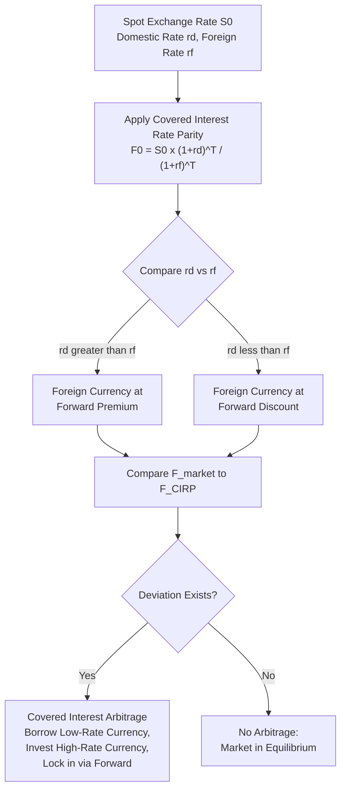

## Currency and Commodity Forward Pricing

### Overview

Currency and commodity forwards apply the general cost-of-carry framework, but each asset class carries distinct features that shape the pricing relationship. Currency forwards are governed by the tightly arbitraged Covered Interest Rate Parity (CIRP) relationship, since money markets in both currencies are typically deep and liquid. Commodity forwards, by contrast, are shaped by physical storage costs and convenience yield, which are harder to observe and can produce persistent, economically meaningful deviations from a pure financing-cost model.

### Currency Forward Pricing: Covered Interest Rate Parity

Covered Interest Rate Parity (CIRP) states that the forward exchange rate must be set so that borrowing in one currency, converting to the other, investing at the foreign risk-free rate, and converting back via the forward contract yields the same result as simply investing in the domestic currency — eliminating any riskless arbitrage.

**Formula (domestic currency per unit of foreign currency):**

$$F_0 = S_0 \cdot \frac{(1+r_d)^T}{(1+r_f)^T}$$

or in continuous compounding form:

$$F_0 = S_0 \cdot e^{(r_d - r_f)T}$$

where $S_0$ is the spot exchange rate, $r_d$ is the domestic risk-free rate, $r_f$ is the foreign risk-free rate, and $T$ is the time to maturity in years.

**Key Points**

- If the domestic interest rate exceeds the foreign interest rate ($r_d > r_f$), the foreign currency trades at a forward **premium** (the forward rate is higher than the spot rate, meaning more domestic currency is needed per unit of foreign currency in the future).
- If the domestic interest rate is below the foreign interest rate ($r_d < r_f$), the foreign currency trades at a forward **discount**.
- This relationship reflects a fundamental no-arbitrage constraint: a currency with a higher interest rate must trade at a forward discount (and vice versa), so that the interest rate advantage is exactly offset by the expected currency depreciation implied by the forward market.

**Example**

Spot USD/EUR rate: $S_0 = 1.10$ (i.e., 1.10 USD per EUR). Domestic (USD) risk-free rate $r_d = 5\%$; foreign (EUR) risk-free rate $r_f = 3\%$. Forward maturity: 1 year.

$$F_0 = 1.10 \times \frac{1.05}{1.03} = 1.10 \times 1.0194 = 1.1214$$

The euro trades at a forward premium of approximately 2.14 cents (from 1.10 to 1.1214), because USD interest rates exceed EUR interest rates by 2 percentage points, and CIRP requires the forward rate to compensate for this differential.

### Covered Interest Arbitrage

If the observed market forward rate deviates from the CIRP-implied rate, a covered interest arbitrage opportunity exists.

**Key Points**

- **If the market forward rate is higher than CIRP implies** (foreign currency's forward premium is too large): Borrow domestic currency, convert to foreign currency at spot, invest at the foreign rate, and simultaneously sell the foreign currency proceeds forward at the (overpriced) market forward rate — locking in a riskless profit.
- **If the market forward rate is lower than CIRP implies**: Borrow foreign currency, convert to domestic currency at spot, invest at the domestic rate, and simultaneously buy the foreign currency forward at the (underpriced) market forward rate to repay the foreign loan — again locking in a riskless profit.
- Because global currency and money markets are extremely deep and liquid, CIRP typically holds very closely in practice, with observed deviations generally small and often attributable to transaction costs, bid-ask spreads, and differential counterparty credit risk rather than genuine unexploited arbitrage. [Inference: the precise magnitude of CIRP deviations at any given time depends on prevailing market liquidity and stress conditions, and can widen temporarily during periods of funding market disruption.]

### Currency Forward Pricing Mechanism

### Commodity Forward Pricing: Storage Costs and Convenience Yield

For commodities, the cost-of-carry model must incorporate physical storage costs and the convenience yield of holding the physical asset:

$$F_0 = S_0 \cdot e^{(r+c-\delta)T}$$

where $c$ is the storage cost rate (including insurance) and $\delta$ is the convenience yield — the non-monetary benefit derived from holding the physical commodity.

**Key Points**

- Storage costs are a real, observable cash outflow for holding physical inventory (warehousing, insurance, spoilage risk for perishables) and always push the forward price upward relative to a pure financial asset.
- Convenience yield is not directly observable in the market; it is typically inferred residually by comparing the observed futures price to what the pure cost-of-carry formula (with only financing and storage costs) would predict.
- Convenience yield tends to rise when inventories are low or when there is elevated risk of supply disruption, since holders of physical inventory gain more flexibility and security in those conditions.

### Contango and Backwardation in Commodity Markets

**Contango**: Futures/forward price above the spot price, implying $(r + c) > \delta$ — carrying costs dominate convenience yield.

**Backwardation**: Futures/forward price below the spot price, implying $\delta > (r + c)$ — convenience yield dominates carrying costs.

**Key Points**

- Commodities with easy, cheap storage and low risk of near-term shortage (e.g., gold, which has minimal industrial consumption relative to above-ground stock) tend to trade in stable contango, closely tracking the pure financial cost-of-carry model.
- Commodities with difficult or costly storage, seasonal supply patterns, or frequent supply-demand imbalances (e.g., crude oil, natural gas, agricultural commodities) exhibit more variable convenience yield and can swing between contango and backwardation depending on current inventory conditions.
- Backwardation is often interpreted as a market signal of tight current supply relative to demand, since it indicates the benefit of holding physical inventory currently outweighs financing and storage costs. [Inference: while backwardation is frequently associated with tight near-term supply, the precise causal relationship and its strength can vary by commodity and market structure.]

### Example: Gold Forward Pricing

Gold spot price: $2,000/oz. Risk-free rate: 5%. Storage/insurance cost: 0.3% annually. Gold generally has negligible convenience yield since it is held primarily as an investment/store of value rather than consumed industrially in a way that creates scarcity-driven urgency.

$$F_0 = 2000 \times e^{(0.05+0.003) \times 1} = 2000 \times e^{0.053} = 2000 \times 1.0544 = \$2{,}108.80$$

Gold typically trades close to this cost-of-carry price because storage is relatively cheap, physical shorting/lending markets are reasonably developed, and convenience yield is generally low and stable, making gold one of the commodities that most closely follows the pure financial cost-of-carry model. [Inference: while gold generally tracks the cost-of-carry model closely under normal conditions, actual observed lease rates and convenience yield for gold can still fluctuate with market conditions.]

### Example: Crude Oil Forward Pricing with Convenience Yield

Crude oil spot price: $80/barrel. Risk-free rate: 5%. Storage cost: 3% annually (oil storage/tankage is considerably more expensive than gold storage). Suppose the observed 1-year futures price is $78/barrel (backwardation).

Solving for the implied convenience yield $\delta$:

$$78 = 80 \times e^{(0.05+0.03-\delta) \times 1}$$

$$\ln(78/80) = 0.08 - \delta \implies -0.0253 = 0.08 - \delta \implies \delta = 0.1053 = 10.53\%$$

The market is implying a convenience yield of approximately 10.5%, well above the combined financing and storage cost of 8%, indicating the market is pricing in significant near-term benefit (or scarcity value) to holding physical crude inventory.

### Interpreting Convenience Yield as an Implied Option

**Key Points**

- Convenience yield can be conceptually understood as an embedded option-like value: the holder of physical inventory retains the flexibility to respond to unexpected supply disruptions or demand surges without waiting for a futures contract to be delivered.
- This flexibility becomes more valuable precisely when inventories are low and the probability of a stockout (production disruption, unexpected demand spike) is higher, which is why convenience yield tends to be inversely related to inventory levels.
- Because convenience yield is inferred rather than directly observed, different models and estimation windows can produce somewhat different implied values for the same market conditions, introducing model risk into any analysis that relies on a precise convenience yield estimate. [Inference: the sensitivity of implied convenience yield estimates to model choice and estimation window is a recognized limitation, though the general inverse relationship with inventory levels is broadly supported.]

### Currency vs. Commodity Forward Pricing: Key Differences

| Feature | Currency Forwards | Commodity Forwards |
| --- | --- | --- |
| "Yield" component | Foreign risk-free interest rate | Convenience yield (unobservable, inferred) |
| Storage cost | None (currencies are not physically stored) | Can be significant (varies widely by commodity) |
| Arbitrage tightness | Very tight (CIRP holds closely) | Looser (short-selling physical commodities is often impractical) |
| Typical curve shape | Determined by interest rate differential | Can swing between contango and backwardation |
| Observability of carry inputs | Interest rates directly observable | Convenience yield not directly observable |

### Uncovered Interest Rate Parity (Contrast with CIRP)

**Key Points**

- Uncovered Interest Rate Parity (UIRP) is a related but distinct hypothesis stating that the *expected future spot exchange rate* should equal the current forward rate, implying that expected currency appreciation/depreciation offsets interest rate differentials without any forward contract being used to lock in the rate.
- Unlike CIRP (a no-arbitrage condition enforced by observable market mechanics), UIRP is a behavioral/expectations hypothesis about future spot rates and has considerably weaker empirical support, with numerous studies documenting the "forward premium puzzle," where high-interest-rate currencies have often tended to appreciate rather than depreciate as UIRP would predict. [Inference: the extent and consistency of UIRP failure documented in the academic literature varies across currency pairs, time periods, and market regimes studied.]
- CIRP should not be confused with UIRP: CIRP is a tight, mechanically enforced arbitrage relationship, while UIRP concerns unhedged expectations about future exchange rate movements and is far less reliably observed in practice.

### Practical Applications

**Key Points**

- **Corporate treasury**: Multinational companies use currency forwards to hedge foreign-currency-denominated receivables, payables, and anticipated transactions, locking in a known domestic currency value.
- **Commodity producers and consumers**: Use commodity forwards/futures to hedge input costs (manufacturers, airlines) or output revenues (miners, farmers, oil producers).
- **Carry trade strategies**: Speculative strategies that borrow in low-interest-rate currencies and invest in high-interest-rate currencies, implicitly betting against UIRP holding (i.e., betting that the high-rate currency will not depreciate by the full interest rate differential).
- **Commodity curve trading**: Traders analyze the shape of the futures curve (contango vs. backwardation, calendar spreads) to infer inventory conditions and construct relative-value trades across different maturities.

### Common Pitfalls

**Key Points**

- Confusing CIRP (an enforced no-arbitrage relationship) with UIRP (an expectations hypothesis with weaker empirical support), leading to incorrect conclusions about forward rates as unbiased predictors of future spot rates.
- Applying a pure financial cost-of-carry model to commodities without accounting for convenience yield, which can significantly misstate the theoretical forward price, particularly for commodities with high storage costs or supply volatility.
- Assuming a stable convenience yield over time, when in practice it fluctuates with inventory levels and can shift a commodity market between contango and backwardation.
- Overlooking the asymmetry in short-selling capability between currencies (relatively easy) and physical commodities (often impractical), which affects how tightly arbitrage forces enforce the cost-of-carry price in each market.
- Misinterpreting a currency's forward premium or discount as a market forecast of future spot rate direction, rather than as a mechanical consequence of the interest rate differential under CIRP.

### Related Topics

- Cost-of-carry and no-arbitrage pricing (general framework underlying both asset classes)
- Forward and futures contract mechanics
- Hedging strategies using futures (currency and commodity hedge applications)
- Uncovered interest rate parity and the forward premium puzzle
- Carry trade strategies in currency markets
- Convenience yield estimation and commodity inventory dynamics
- Interest rate parity conditions and international finance fundamentals