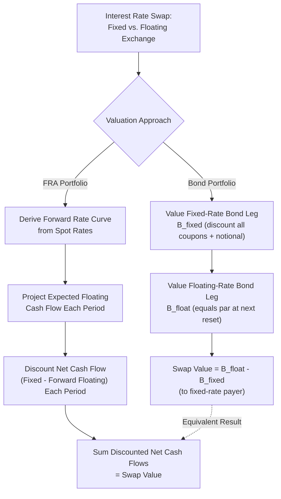
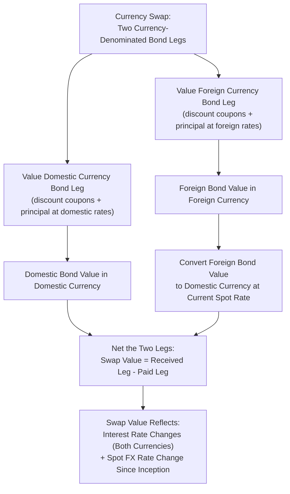

## Interest Rate and Currency Swap Valuation

### Overview

Swaps are agreements between two counterparties to exchange cash flows over time according to specified terms. The two most common types — interest rate swaps and currency swaps — can each be decomposed into simpler, already-familiar building blocks: interest rate swaps as portfolios of forward rate agreements or as the difference between two bonds, and currency swaps as an extension involving an additional exchange of notional principal in different currencies. This decomposition is the foundation for valuing both instrument types under a no-arbitrage framework.

### Interest Rate Swap Mechanics

A plain vanilla interest rate swap involves one counterparty paying a fixed rate and receiving a floating rate, while the other pays floating and receives fixed, both calculated on a common notional principal that is never actually exchanged.

**Key Points**

- **Fixed-rate payer (pay-fixed)**: Pays a predetermined fixed rate on the notional and receives a floating rate reset periodically (e.g., against SOFR).
- **Floating-rate payer (pay-floating)**: Pays the floating rate and receives the fixed rate.
- Only the net cash flow difference is typically exchanged at each payment date (netting), not the full fixed and floating amounts separately.
- The notional principal is used solely to calculate interest payments and is never exchanged between counterparties in a standard interest rate swap.

### Valuing an Interest Rate Swap as a Portfolio of Bonds

A pay-fixed, receive-floating swap can be valued as being long a floating-rate bond and short a fixed-rate bond (from the perspective of the fixed-rate payer):

$$V_{swap} = B_{float} - B_{fixed}$$

**Key Points**

- $B_{fixed}$ is valued as a standard coupon bond, discounting each fixed coupon payment and the (hypothetical) final notional repayment at the appropriate spot rates from the discount curve.
- $B_{float}$ is valued using the property that a floating-rate bond is worth exactly its notional value immediately after any reset date, since the coupon rate resets to match the current market rate, making the bond trade at par on each reset date.
- Between reset dates, $B_{float}$ is valued by discounting the next known floating coupon payment (set at the last reset) plus the assumed par redemption at that next payment date, back to the valuation date.

**Fixed bond leg formula:**

$$B_{fixed} = \sum_{i=1}^{n} \frac{C}{(1+z_i)^{t_i}} + \frac{F}{(1+z_n)^{t_n}}$$

**Floating bond leg formula (between reset dates):**

$$B_{float} = \frac{F + C_{float}^{next}}{(1+z_{t^*})^{t^*}}$$

where $t^*$ is the time to the next reset/payment date and $C_{float}^{next}$ is the floating coupon already fixed at the last reset.

**Example**

A 2-year swap with semiannual payments on $10 million notional, fixed rate = 5%, was entered 3 months ago (so the next payment is in 3 months, with 3 remaining payments after that). The floating rate fixed at the last reset was 4.8%, paid semiannually. Spot rates (annualized, continuously compounded) for the relevant dates: $z_{0.25} = 4.5\%$, $z_{0.75} = 4.7\%$, $z_{1.25} = 4.9\%$, $z_{1.75} = 5.0\%$.

**Fixed bond leg** (semiannual coupon of $10{,}000{,}000 \times 5\%/2 = \$250{,}000$, paid at $t = 0.25, 0.75, 1.25, 1.75$, with notional repaid at $t=1.75$):

$$B_{fixed} = 250{,}000 e^{-0.045(0.25)} + 250{,}000 e^{-0.047(0.75)} + 250{,}000 e^{-0.049(1.25)} + 10{,}250{,}000 e^{-0.050(1.75)}$$

$$B_{fixed} \approx 247{,}200 + 241{,}300 + 234{,}900 + 9{,}401{,}600 \approx \$10{,}125{,}000$$

**Floating bond leg** (next floating coupon fixed at 4.8%/2 = 2.4% of notional = $240,000, paid with notional at $t=0.25$):

$$B_{float} = (10{,}000{,}000 + 240{,}000) \times e^{-0.045(0.25)} = 10{,}240{,}000 \times 0.98883 \approx \$10{,}125{,}600$$

**Swap value to the fixed-rate payer:**

$$V_{swap} = B_{float} - B_{fixed} \approx 10{,}125{,}600 - 10{,}125{,}000 = \$600$$

The swap has a small positive value to the fixed-rate payer in this example, close to zero as would be expected shortly after inception when the swap rate was set near the prevailing market rate.

### Valuing an Interest Rate Swap as a Portfolio of FRAs

Alternatively, an interest rate swap can be valued as a series of forward rate agreements (FRAs), where each exchange of fixed for floating on a given payment date is treated as a separate FRA settled at that date.

**Key Points**

- Each net cash flow (fixed payment minus the floating payment implied by the forward rate for that period) is discounted back to the valuation date at the appropriate spot/discount rate for that maturity.
- This approach requires first deriving the forward rate curve (as covered in spot/forward rate term structure analysis) to project the expected floating rate for each future period, then computing the expected net cash flow for each period.

$$V_{swap} = \sum_{i=1}^{n} \frac{(C_{fixed} - C_{float,i}^{forward}) \times \text{Notional}}{(1+z_{t_i})^{t_i}}$$

**Key Points**

- This method and the bond-portfolio method are theoretically equivalent and should produce the same swap value when applied consistently with the same underlying discount and forward curves.
- The FRA-portfolio approach is often more intuitive for understanding swap risk exposures period-by-period and is commonly used in practice for building blocks of swap curve construction (bootstrapping swap rates from observed market swap quotes).

### The Swap Rate

The **swap rate** is the fixed rate that sets the initial value of the swap to zero at inception (i.e., the fixed rate at which $B_{fixed} = B_{float}$ at $t=0$, when the floating bond is worth exactly par).

$$C_{swap} = \frac{1 - \frac{1}{(1+z_n)^{t_n}}}{\sum_{i=1}^{n} \frac{1}{(1+z_i)^{t_i}}} \times \text{(annualized frequency adjustment)}$$

**Key Points**

- The swap rate is analogous to the par yield on a bond of the same maturity and payment frequency, since it is the coupon rate that makes the fixed leg worth exactly par given the current discount curve.
- Swap rates observed in the market for various maturities form the swap curve, which is widely used as a benchmark risk-free-like curve (particularly SOFR-based swap curves following LIBOR transition) for discounting a broad range of financial instruments. [Unverified: the specific conventions and precise construction methodology for benchmark swap curves can vary by market and continue to evolve, particularly regarding the choice of discounting curve post-LIBOR transition.]

### Interest Rate Swap Valuation Framework

### Currency Swap Mechanics

A currency swap involves exchanging interest payments (and typically principal) denominated in two different currencies.

**Key Points**

- Unlike interest rate swaps, currency swaps typically involve an actual exchange of notional principal at initiation (at the prevailing spot rate) and a re-exchange of the same principal amounts at maturity (at the original exchange rate, not the future spot rate).
- Common structures include: fixed-for-fixed (paying a fixed rate in one currency, receiving a fixed rate in another), fixed-for-floating, and floating-for-floating (cross-currency basis swaps).
- Currency swaps are used both to hedge currency and interest rate exposure simultaneously and to achieve effectively cheaper financing by exploiting comparative borrowing advantages across currencies and counterparties.

### Valuing a Currency Swap as a Portfolio of Bonds

A currency swap can be valued as being long a bond in one currency and short a bond in the other currency, with the value converted to a common currency using the current spot exchange rate:

$$V_{swap} = B_{domestic} - (S_0 \times B_{foreign})$$

(from the perspective of the party receiving the domestic currency bond and paying the foreign currency bond), where $S_0$ is the current spot exchange rate (domestic currency per unit of foreign currency).

**Key Points**

- Each bond leg ($B_{domestic}$ and $B_{foreign}$) is valued independently using the appropriate discount curve (spot rates) in its own currency, including the final notional principal repayment, since currency swaps typically do exchange principal at maturity (unlike standard interest rate swaps).
- The current spot exchange rate is used to convert the foreign currency bond's value into domestic currency terms for direct comparison.
- Both legs' present values change over time as their respective yield curves shift and as the spot exchange rate moves, meaning currency swaps carry both interest rate risk in two currencies and foreign exchange risk simultaneously.

**Example**

A fixed-for-fixed currency swap: Party A pays 4% fixed in USD and receives 3% fixed in EUR, on notional principals of $10,000,000 (USD) and €9,090,909 (EUR), based on an initial spot rate of 1.10 USD/EUR. The swap has 2 years remaining with annual payments. Current spot rate: $S_0 = 1.08$. USD discount rates: $z_1=4.5\%, z_2=4.7\%$. EUR discount rates: $z_1=2.8\%, z_2=3.0\%$.

**USD bond leg (what Party A pays, valued as a bond):**

$$B_{USD} = \frac{400{,}000}{1.045} + \frac{10{,}400{,}000}{1.047^2} = 382{,}775 + 9{,}487{,}500 = \$9{,}870{,}275$$

**EUR bond leg (what Party A receives, valued in EUR):**

$$B_{EUR} = \frac{272{,}727}{1.028} + \frac{9{,}363{,}636}{1.030^2} = 265{,}299 + 8{,}827{,}000 = €9{,}092{,}299$$

**Convert EUR leg to USD at current spot rate and net:**

$$V_{swap,A} = (S_0 \times B_{EUR}) - B_{USD} = (1.08 \times 9{,}092{,}299) - 9{,}870{,}275 = 9{,}819{,}683 - 9{,}870{,}275 = -\$50{,}592$$

The swap has a slightly negative value to Party A, reflecting the combined effect of interest rate movements in both currencies and the change in spot exchange rate since inception (from 1.10 to 1.08).

### Currency Swap Valuation Framework

### Swap Value Between Payment Dates and Over Time

**Key Points**

- Both interest rate and currency swaps are typically structured to have zero value at inception (the fixed rate or swap terms are set precisely to achieve this), meaning no upfront payment changes hands between counterparties at initiation.
- As market interest rates (and, for currency swaps, exchange rates) move after inception, the swap accrues positive value to one counterparty and an equal and offsetting negative value to the other, since a swap is a zero-sum contract between the two parties (ignoring any counterparty credit risk differences).
- This changing value is the basis for counterparty credit exposure management: the party for whom the swap has positive value bears counterparty (credit) risk on the other party, motivating the widespread use of collateral posting (variation margin) under credit support annexes (CSAs) for OTC swaps, a practice reinforced by post-2008 regulatory reforms mandating margin for many non-cleared derivatives.

### Comparative Advantage Motivation for Swaps

**Key Points**

- Interest rate and currency swaps are often motivated by comparative advantage: two counterparties with different relative borrowing costs in fixed vs. floating markets (or in different currencies) can each borrow where they have a comparative advantage and then swap the resulting cash flows to achieve their actually desired exposure, at an effectively lower combined cost than if each had borrowed directly in their desired form.
- This comparative advantage rationale, while a classic pedagogical explanation for the existence of the swap market, is understood by many market participants to be only a partial explanation in modern, highly developed swap markets; other motivations include hedging, balance sheet management, regulatory capital optimization, and access to funding markets not otherwise available to a given counterparty. [Inference: the relative importance of comparative advantage versus these other motivations in explaining the overall volume of swap market activity is difficult to measure precisely and is a matter of some debate among market observers.]

### Swap Curve and Discounting Practice

**Key Points**

- The swap curve (built from observed market swap rates across maturities) is widely used as a benchmark discounting curve for a broad range of derivative and fixed-income valuation, particularly following the transition from LIBOR to overnight risk-free rates such as SOFR.
- Since the 2008 financial crisis, market practice has generally shifted toward using overnight indexed swap (OIS) rates for discounting collateralized derivative cash flows, reflecting the funding cost implied by daily variation margin exchange, rather than using the swap's own floating reference rate curve for discounting. [Unverified: the specific discounting curve conventions used can vary across institutions, jurisdictions, and collateral arrangements, and industry practice has continued to evolve since the initial post-crisis shift.]

### Common Uses

**Key Points**

- **Interest rate swaps**: Convert floating-rate debt to fixed (or vice versa) to manage interest rate exposure; used extensively by corporations, financial institutions, and governments to manage borrowing cost volatility.
- **Currency swaps**: Convert debt or cash flows from one currency to another, commonly used by multinational corporations to raise financing in a preferred market and swap the proceeds into the currency actually needed for operations.
- **Asset swaps**: Combine a fixed-rate bond purchase with an interest rate swap to convert the bond's fixed coupon into a floating-rate cash flow, isolating credit spread exposure from interest rate exposure.
- **Cross-currency basis swaps**: Floating-for-floating currency swaps used to manage currency funding costs and exploit or hedge cross-currency basis (the spread reflecting relative currency funding market conditions).

### Common Pitfalls

**Key Points**

- Valuing a floating-rate bond leg as if its coupon were fixed for the full remaining life, rather than recognizing that it resets to par value at each reset date.
- Forgetting that currency swaps typically exchange principal at both initiation and maturity (unlike standard interest rate swaps), which materially changes the valuation formula.
- Confusing the swap rate (the par-equivalent fixed rate for a given maturity) with a generic market interest rate; the swap rate is specific to the swap's payment frequency and day-count conventions.
- Ignoring the compounding effect of both interest rate and exchange rate movements when valuing currency swaps over time, since both factors simultaneously affect the mark-to-market value.
- Assuming a swap's value remains zero after inception; swap values fluctuate continuously with market rates and, for currency swaps, exchange rates, creating ongoing counterparty credit exposure that requires active management.

### Related Topics

- Forward and futures contract mechanics (swaps as portfolios of forward-like exchanges)
- Spot rates, forward rates, and the yield curve (curve construction inputs to swap valuation)
- Covered interest rate parity and currency forward pricing
- Duration and convexity (interest rate risk of the fixed leg)
- Collateralization, CSAs, and counterparty credit risk management in OTC derivatives
- SOFR transition and OIS discounting conventions
- Cross-currency basis swaps and comparative advantage financing strategies