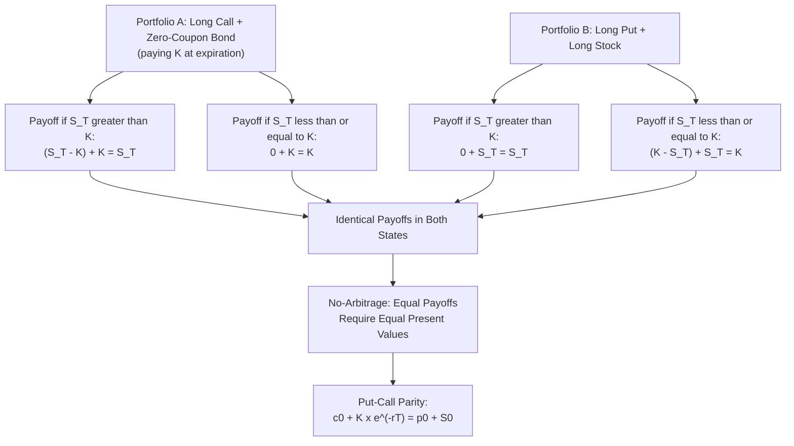

## Option Payoff Structures and Put-Call Parity

### Overview

Options grant the holder a right, but not an obligation, to buy or sell an underlying asset at a predetermined price. This asymmetry — the holder can walk away from an unfavorable outcome while the writer cannot — produces a fundamentally different payoff shape than the linear, symmetric payoffs of forwards and futures. Put-call parity is the no-arbitrage relationship that links call and put prices on the same underlying, strike, and expiration, and serves as one of the most important foundational identities in options theory.

### Option Terminology and Contract Types

**Key Points**

- **Call option**: Grants the holder the right to buy the underlying asset at the strike price $K$ on or before expiration.
- **Put option**: Grants the holder the right to sell the underlying asset at the strike price $K$ on or before expiration.
- **European option**: Can only be exercised at expiration.
- **American option**: Can be exercised at any time up to and including expiration.
- **Premium**: The price paid by the option buyer to the option writer (seller) at initiation, compensating the writer for accepting the obligation.
- **In-the-money (ITM), at-the-money (ATM), out-of-the-money (OTM)**: Describe the relationship between the current underlying price and the strike price; a call is ITM when $S > K$, a put is ITM when $S < K$.

### Long Call Payoff and Profit

**Payoff at expiration:**

$$\text{Payoff}_{Long Call} = \max(S_T - K, 0)$$

**Profit (net of premium paid, $c_0$):**

$$\text{Profit}_{Long Call} = \max(S_T - K, 0) - c_0$$

**Key Points**

- Maximum loss is limited to the premium paid, occurring when $S_T \leq K$ at expiration.
- Profit potential is theoretically unlimited as $S_T$ rises, since there is no cap on how high the underlying price can go.
- Breakeven point: $S_T = K + c_0$.

### Short Call Payoff and Profit

**Payoff at expiration:**

$$\text{Payoff}_{Short Call} = -\max(S_T - K, 0)$$

**Profit (net of premium received, $c_0$):**

$$\text{Profit}_{Short Call} = c_0 - \max(S_T - K, 0)$$

**Key Points**

- Maximum gain is limited to the premium received, occurring when $S_T \leq K$.
- Loss potential is theoretically unlimited as $S_T$ rises, making short (uncovered/"naked") calls one of the highest-risk basic option positions.
- Breakeven point: $S_T = K + c_0$ (same as the long call, since the two positions are mirror images).

### Long Put Payoff and Profit

**Payoff at expiration:**

$$\text{Payoff}_{Long Put} = \max(K - S_T, 0)$$

**Profit (net of premium paid, $p_0$):**

$$\text{Profit}_{Long Put} = \max(K - S_T, 0) - p_0$$

**Key Points**

- Maximum loss is limited to the premium paid, occurring when $S_T \geq K$.
- Maximum profit is capped at $K - p_0$, since the underlying price cannot fall below zero.
- Breakeven point: $S_T = K - p_0$.

### Short Put Payoff and Profit

**Payoff at expiration:**

$$\text{Payoff}_{Short Put} = -\max(K - S_T, 0)$$

**Profit (net of premium received, $p_0$):**

$$\text{Profit}_{Short Put} = p_0 - \max(K - S_T, 0)$$

**Key Points**

- Maximum gain is limited to the premium received, occurring when $S_T \geq K$.
- Maximum loss is capped at $K - p_0$ (since $S_T$ cannot go below zero), but this can still represent a very large loss in absolute terms for a deep price decline.
- Breakeven point: $S_T = K - p_0$ (same as the long put).

**(svg_diagram) Four Basic Option Payoff Diagrams**

<svg xmlns="http://www.w3.org/2000/svg" viewBox="0 0 640 480">

<text x="320" y="24" text-anchor="middle" font-size="15" font-weight="bold" fill="`#1a1a2e`">Basic Option Payoffs (svg_diagram)</text>

<text x="140" y="55" text-anchor="middle" font-size="12" font-weight="bold" fill="`#1a1a2e`">Long Call</text>

<line x1="40" y1="140" x2="260" y2="140" stroke="#333" stroke-width="1" />

<line x1="150" y1="90" x2="150" y2="180" stroke="#999" stroke-width="1" stroke-dasharray="3,3" />

<path d="M 40 140 L 150 140 L 250 65" fill="none" stroke="`#2266cc`" stroke-width="3" />

<text x="150" y="195" text-anchor="middle" font-size="10" fill="#333">K</text>

<text x="480" y="55" text-anchor="middle" font-size="12" font-weight="bold" fill="`#1a1a2e`">Short Call</text>

<line x1="380" y1="110" x2="600" y2="110" stroke="#333" stroke-width="1" />

<line x1="490" y1="90" x2="490" y2="180" stroke="#999" stroke-width="1" stroke-dasharray="3,3" />

<path d="M 380 110 L 490 110 L 590 185" fill="none" stroke="`#cc3333`" stroke-width="3" />

<text x="490" y="195" text-anchor="middle" font-size="10" fill="#333">K</text>

<text x="140" y="255" text-anchor="middle" font-size="12" font-weight="bold" fill="`#1a1a2e`">Long Put</text>

<line x1="40" y1="340" x2="260" y2="340" stroke="#333" stroke-width="1" />

<line x1="150" y1="290" x2="150" y2="380" stroke="#999" stroke-width="1" stroke-dasharray="3,3" />

<path d="M 40 265 L 150 340 L 250 340" fill="none" stroke="`#2266cc`" stroke-width="3" />

<text x="150" y="395" text-anchor="middle" font-size="10" fill="#333">K</text>

<text x="480" y="255" text-anchor="middle" font-size="12" font-weight="bold" fill="`#1a1a2e`">Short Put</text>

<line x1="380" y1="310" x2="600" y2="310" stroke="#333" stroke-width="1" />

<line x1="490" y1="260" x2="490" y2="350" stroke="#999" stroke-width="1" stroke-dasharray="3,3" />

<path d="M 380 385 L 490 310 L 590 310" fill="none" stroke="`#cc3333`" stroke-width="3" />

<text x="490" y="400" text-anchor="middle" font-size="10" fill="#333">K</text>

<text x="320" y="440" text-anchor="middle" font-size="11" fill="#333">Blue = long (buyer) position; Red = short (writer) position</text>

</svg>

### Intrinsic Value and Time Value

An option's premium decomposes into two components:

$$\text{Premium} = \text{Intrinsic Value} + \text{Time Value}$$

**Key Points**

- **Intrinsic value**: The value the option would have if exercised immediately: $\max(S_t - K, 0)$ for a call, $\max(K - S_t, 0)$ for a put. Always non-negative.
- **Time value**: The remainder of the premium above intrinsic value, reflecting the possibility that the option could become more valuable before expiration due to future price movement, volatility, and remaining time.
- Time value is generally highest for at-the-money options and decays toward zero as expiration approaches (time decay, or "theta"), reaching exactly zero at expiration when only intrinsic value remains.

### Example: Long Call Profit Calculation

An investor buys a call option with strike $K = \$50$ for a premium of $c_0 = \$3$. At expiration, the stock price is $S_T = \$58$.

$$\text{Payoff} = \max(58 - 50, 0) = \$8$$

$$\text{Profit} = 8 - 3 = \$5 \text{ per share}$$

If instead $S_T = \$47$ (below the strike), the option expires worthless:

$$\text{Payoff} = \max(47 - 50, 0) = \$0, \quad \text{Profit} = 0 - 3 = -\$3 \text{ per share (the maximum loss)}$$

### Put-Call Parity: Derivation

Put-call parity is derived by constructing two portfolios that produce identical payoffs at expiration, meaning they must have identical values today under no-arbitrage.

**Portfolio A**: A European call option (strike $K$, expiration $T$) plus a zero-coupon bond that pays $K$ at time $T$.

**Portfolio B**: A European put option (same strike and expiration) plus one share of the underlying stock.

At expiration, comparing payoffs:

- If $S_T > K$: Portfolio A pays $(S_T - K) + K = S_T$. Portfolio B pays $0 + S_T = S_T$. Equal.
- If $S_T \leq K$: Portfolio A pays $0 + K = K$. Portfolio B pays $(K - S_T) + S_T = K$. Equal.

Since both portfolios have identical payoffs in every possible future state, they must have equal value today (no-arbitrage), giving put-call parity:

$$c_0 + K e^{-rT} = p_0 + S_0$$

(for a non-dividend-paying underlying, with $r$ the risk-free rate)

**With continuous dividend yield $q$:**

$$c_0 + K e^{-rT} = p_0 + S_0 e^{-qT}$$

**Key Points**

- Put-call parity holds strictly only for European options; American options can be exercised early, which breaks the exact equality (though a related inequality version still applies).
- This relationship allows any one of the four variables ($c_0$, $p_0$, $S_0$, or the discounted strike) to be derived if the other three are known, and provides a powerful tool for detecting mispricing or constructing synthetic positions.

### Put-Call Parity Derivation

### Example: Applying Put-Call Parity

A non-dividend stock trades at $S_0 = \$100$. A 1-year European call with strike $K = \$100$ trades at $c_0 = \$8.50$. The risk-free rate is 5% (continuously compounded). What should the corresponding put be worth?

$$p_0 = c_0 + K e^{-rT} - S_0 = 8.50 + 100 \times e^{-0.05} - 100$$

$$p_0 = 8.50 + 100 \times 0.9512 - 100 = 8.50 + 95.12 - 100 = \$3.62$$

If the market-observed put price differs materially from $3.62, an arbitrage opportunity exists via constructing the appropriate combination of the mispriced option, the correctly priced option, the underlying stock, and a risk-free bond.

### Constructing Synthetic Positions Using Put-Call Parity

Rearranging put-call parity allows the construction of synthetic equivalents of any of the four core positions:

**Key Points**

- **Synthetic long call**: $c_0 = p_0 + S_0 - K e^{-rT}$ → Long put + long stock + short the discounted strike (borrow).
- **Synthetic long put**: $p_0 = c_0 - S_0 + K e^{-rT}$ → Long call + short stock + long the discounted strike (lend/invest).
- **Synthetic long stock**: $S_0 = c_0 - p_0 + K e^{-rT}$ → Long call + short put + long the discounted strike.
- **Synthetic risk-free bond**: $K e^{-rT} = p_0 - c_0 + S_0$ → Long put + short call + long stock (this combination, known as a conversion when constructed from an existing long stock position, replicates a risk-free return).
- These synthetic relationships are widely used by market makers and arbitrageurs to exploit temporary mispricing between the options market and the underlying/financing markets, and by traders seeking to replicate an exposure using a different combination of instruments (e.g., for margin, tax, or liquidity reasons).

### Arbitrage Strategies: Conversion and Reversal

**Conversion**: If the observed call price is too high relative to put-call parity (or the put too low), an arbitrageur can sell the call, buy the put, buy the stock, and borrow the discounted strike amount, locking in a riskless profit.

**Reversal (reverse conversion)**: If the observed call price is too low relative to parity (or the put too high), the arbitrageur buys the call, sells the put, sells the stock short, and invests the discounted strike amount, again locking in a riskless profit.

**Key Points**

- In liquid options markets, conversion/reversal arbitrage is generally executed by market makers with very low transaction costs, which keeps observed option prices closely aligned with put-call parity in practice. [Inference: the tightness of this arbitrage enforcement can vary for less liquid underlyings or during periods of market stress, when transaction costs and financing constraints may widen more than in normal conditions.]

### American Options and Put-Call Parity (Inequality Form)

Because American options permit early exercise, exact put-call parity does not hold; instead, a bounded inequality relationship applies for American options on a non-dividend-paying stock:

$$S_0 - K \leq C_0 - P_0 \leq S_0 - K e^{-rT}$$

**Key Points**

- It can be shown that it is never optimal to exercise an American call on a non-dividend-paying stock early, meaning an American call on such a stock is worth the same as its European counterpart. [Inference: this well-established result relies on the assumption of no dividends; the presence of dividends can make early exercise of an American call optimal shortly before an ex-dividend date.]
- American puts, by contrast, can have early exercise value even without dividends (particularly when deep in-the-money and interest rates are high, since exercising early allows the holder to invest the strike proceeds sooner), so American put prices are generally greater than or equal to otherwise identical European put prices.

### Combined Option Strategies Built on Basic Payoffs

**Key Points**

- **Covered call**: Long stock + short call, capping upside in exchange for premium income; commonly used to generate income on a stock position the holder is willing to sell at the strike.
- **Protective put**: Long stock + long put, providing downside insurance at the cost of the put premium; economically equivalent (via put-call parity) to holding a synthetic long call plus a risk-free bond.
- **Straddle**: Long call + long put at the same strike, profiting from large moves in either direction, at the cost of paying two premiums.
- **Bull/bear spreads**: Combinations of calls (or puts) at different strikes to create capped-risk, capped-reward directional positions at lower net premium cost than an outright option purchase.
- These combined strategies are all constructible and analyzable using the basic payoff diagrams and put-call parity as foundational building blocks.

### Common Pitfalls

**Key Points**

- Confusing payoff (the gross value at expiration) with profit (payoff net of the premium originally paid or received), which produces different breakeven points and shifts the profit diagram relative to the payoff diagram.
- Applying strict put-call parity to American options without adjusting for the early exercise premium, which can lead to incorrectly identifying arbitrage where none exists.
- Forgetting to adjust put-call parity for dividends (or foreign interest rates, for currency options) when the underlying pays income during the option's life.
- Assuming unlimited loss potential applies to both short calls and short puts symmetrically; short call losses are theoretically unlimited (upside), while short put losses are large but bounded by the strike price (since the underlying cannot go below zero).
- Treating time value as constant; time value decays non-linearly and accelerates as expiration approaches, particularly for at-the-money options.

### Related Topics

- Black-Scholes-Merton option pricing model
- The Greeks (delta, gamma, theta, vega, rho) and option risk sensitivities
- Binomial option pricing model and risk-neutral valuation
- Option trading strategies (spreads, straddles, collars, covered calls)
- American option early exercise conditions and boundary conditions
- Volatility and its role in option pricing (implied vs. historical volatility)
- Dividend adjustments in option pricing models