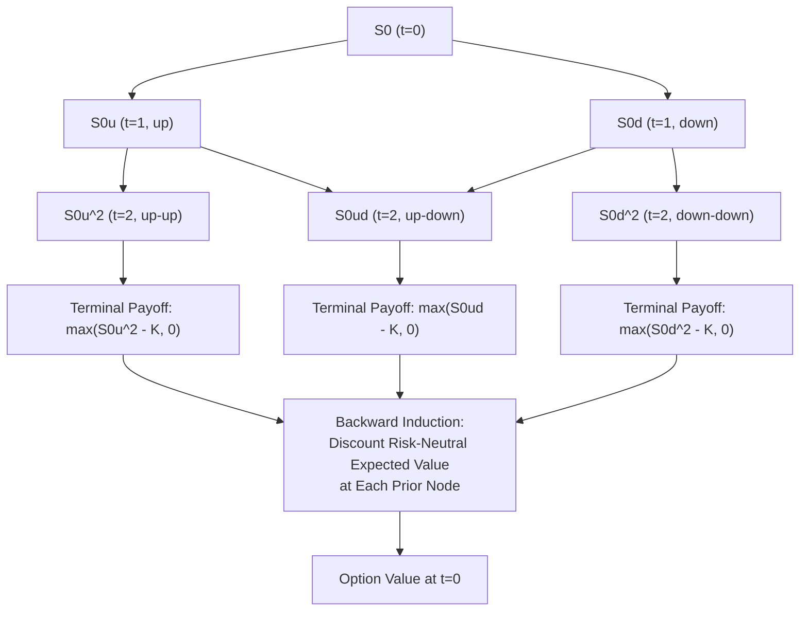

## The Binomial Option Pricing Model

### Overview

The binomial option pricing model values options by representing the possible future paths of the underlying asset's price as a discrete tree of up and down movements over successive time steps. At each node, the option's value is derived by working backward from expiration, using a risk-neutral valuation approach that avoids the need to estimate the underlying asset's actual expected return. The model's flexibility in handling American-style early exercise and its intuitive, step-by-step construction make it a foundational tool in options theory, complementary to the continuous-time Black-Scholes-Merton model.

### The Single-Period Binomial Model

Consider a single time step of length $\Delta t$. The underlying asset, currently priced at $S_0$, can move to one of two possible prices at the end of the period: an "up" state $S_0 u$ or a "down" state $S_0 d$, where $u > 1 > d$.

**Key Points**

- $u$ = up factor (gross return if the price rises), $d$ = down factor (gross return if the price falls), with $d < 1 < u$.
- The option's payoff in the up state is $f_u$ and in the down state is $f_d$ (e.g., for a call, $f_u = \max(S_0 u - K, 0)$ and $f_d = \max(S_0 d - K, 0)$).
- The model constructs a portfolio of the underlying stock and a risk-free bond that exactly replicates the option's payoff in both states, then prices the option as the cost of that replicating portfolio (no-arbitrage pricing).

### Risk-Neutral Valuation

Rather than explicitly constructing the replicating portfolio each time, the model uses a shortcut: pricing the option as if investors were risk-neutral, using a **risk-neutral probability** $p$ rather than the true real-world probability of the up/down move.

**Risk-neutral probability:**

$$p = \frac{e^{r\Delta t} - d}{u - d}$$

(for a non-dividend-paying underlying, using continuous compounding at risk-free rate $r$)

**Option value (single period):**

$$f_0 = e^{-r\Delta t} \left[ p \cdot f_u + (1-p) \cdot f_d \right]$$

**Key Points**

- $p$ is not the actual market-implied or forecast probability of the stock rising; it is a mathematical construct derived purely from $u$, $d$, and $r$ that makes the discounted expected stock price under $p$ equal to today's stock price.
- This risk-neutral pricing approach works because, under no-arbitrage, the option's price can be found from the replicating portfolio without needing to know the true probability of the up or down move or the true required return on the underlying — a profound simplification.
- The result is identical to what would be obtained by explicitly constructing and pricing the replicating (stock + bond) portfolio; risk-neutral valuation is a computational shortcut, not a different assumption about the world.

### Derivation via Replicating Portfolio

To derive the risk-neutral formula, construct a portfolio of $\Delta$ shares of stock and a risk-free bond position $B$ (borrowing if negative) that replicates the option's payoff in both states:

$$\Delta S_0 u + B e^{r\Delta t} = f_u$$

$$\Delta S_0 d + B e^{r\Delta t} = f_d$$

Solving these two equations simultaneously:

$$\Delta = \frac{f_u - f_d}{S_0(u-d)}$$

$$B = e^{-r\Delta t} \left[ \frac{u \cdot f_d - d \cdot f_u}{u-d} \right]$$

The option's fair value equals the cost of this replicating portfolio:

$$f_0 = \Delta S_0 + B$$

**Key Points**

- $\Delta$ (the hedge ratio) represents the number of shares of stock needed to replicate one option, and is identical in concept to the option's delta, the first derivative of option price with respect to the underlying price.
- Substituting the replicating portfolio values back algebraically produces exactly the risk-neutral valuation formula above, confirming the two approaches are equivalent.

### Example: Single-Period Binomial Call Valuation

A stock currently trades at $S_0 = \$50$. Over the next 3 months ($\Delta t = 0.25$), the stock will either rise to $u = 1.10$ (i.e., $55) or fall to $d = 0.95$ (i.e., $47.50). The risk-free rate is 6% (continuously compounded). Value a call option with strike $K = \$50$.

**Payoffs:**

$$f_u = \max(55-50, 0) = 5, \qquad f_d = \max(47.50-50, 0) = 0$$

**Risk-neutral probability:**

$$p = \frac{e^{0.06 \times 0.25} - 0.95}{1.10 - 0.95} = \frac{1.01511 - 0.95}{0.15} = \frac{0.06511}{0.15} = 0.4341$$

**Option value:**

$$f_0 = e^{-0.06 \times 0.25} \left[ 0.4341 \times 5 + 0.5659 \times 0 \right] = 0.98511 \times 2.1705 = \$2.14$$

**Replicating portfolio check:**

$$\Delta = \frac{5-0}{50 \times 0.15} = \frac{5}{7.5} = 0.6667$$

$$B = e^{-0.06 \times 0.25}\left[\frac{1.10 \times 0 - 0.95 \times 5}{0.15}\right] = 0.98511 \times (-31.667) = -\$31.20$$

$$f_0 = 0.6667 \times 50 - 31.20 = 33.33 - 31.20 = \$2.14$$

Both methods agree, confirming that buying 0.6667 shares and borrowing $31.20 exactly replicates the call option's payoff in both future states.

### Multi-Period Binomial Trees

For greater accuracy, a single period is subdivided into multiple smaller time steps, each following the same up/down structure, building out a full price tree (a "lattice" or "recombining tree" when $u \times d = 1$, so an up-then-down move returns to the same price as a down-then-up move).

**Key Points**

- The tree is built forward from $S_0$ to expiration, generating all possible terminal stock prices and their corresponding option payoffs.
- The valuation then proceeds by backward induction: starting at the terminal nodes (where the option value equals the known payoff), the model works backward one time step at a time, applying the single-period risk-neutral valuation formula at each node until reaching the initial node at $t=0$.
- As the number of time steps increases (with $\Delta t \to 0$), the binomial model's output converges toward the continuous-time Black-Scholes-Merton price for European options with matching assumptions, since the discrete binomial process approximates the continuous lognormal diffusion process assumed in Black-Scholes.

### Multi-Period Binomial Tree Structure

### Choosing Up/Down Factors: The Cox-Ross-Rubinstein (CRR) Parameterization

A common and widely used specification for $u$ and $d$, developed by Cox, Ross, and Rubinstein, ensures the tree recombines and converges to a lognormal distribution of terminal stock prices as the number of steps increases:

$$u = e^{\sigma\sqrt{\Delta t}}, \qquad d = e^{-\sigma\sqrt{\Delta t}} = \frac{1}{u}$$

where $\sigma$ is the annualized volatility of the underlying asset's returns.

**Key Points**

- This parameterization directly incorporates the underlying's volatility, linking the discrete binomial model to the same volatility input used in the Black-Scholes-Merton model.
- Because $d = 1/u$ under this specification, the tree recombines (an up move followed by a down move returns to the same price as a down move followed by an up move), which keeps the number of distinct nodes manageable ($n+1$ terminal nodes for an $n$-step tree, rather than $2^n$).
- Other parameterizations (e.g., the Jarrow-Rudd model) exist and can produce slightly different convergence properties, though CRR remains the most commonly taught and widely used specification in introductory treatments. [Inference: the choice of parameterization can affect convergence speed and accuracy for a given number of time steps, and different parameterizations may be preferred in specific numerical contexts.]

### Valuing American Options with the Binomial Model

The binomial model's principal practical advantage over the closed-form Black-Scholes-Merton formula is its natural ability to handle American-style early exercise.

**Key Points**

- At each node during the backward induction process, the model compares the value of holding the option (the discounted risk-neutral expected value from continuing to the next period) against the value of exercising immediately (the intrinsic value at that node).
- The node's value is set to the greater of these two amounts: $f = \max(\text{intrinsic value}, \text{discounted continuation value})$.
- This node-by-node comparison allows the binomial model to correctly capture early exercise premium for American puts (and for American calls on dividend-paying stocks, where early exercise can be optimal shortly before an ex-dividend date), which the standard European Black-Scholes-Merton formula cannot directly accommodate.

**Example: American Put Early Exercise Check**

At a given node, the underlying price is $40, the strike is $45, and the discounted risk-neutral continuation value (holding the option) is calculated as $4.80.

Intrinsic value if exercised immediately: $\max(45-40, 0) = \$5.00$

Since intrinsic value ($5.00) exceeds the continuation value ($4.80), early exercise is optimal at this node, and the node's option value is set to $5.00 rather than $4.80.

### Incorporating Dividends

**Key Points**

- **Known discrete dividends**: The stock price tree can be adjusted by subtracting the present value of expected dividends from the initial stock price before constructing the tree, or by adjusting the tree at the specific node/time corresponding to the ex-dividend date.
- **Continuous dividend yield**: The risk-neutral probability formula is adjusted to account for the yield, analogous to the Black-Scholes-Merton adjustment: $p = \dfrac{e^{(r-q)\Delta t} - d}{u-d}$, where $q$ is the continuous dividend yield.
- Properly incorporating dividends is essential for accurately capturing the possibility of optimal early exercise of American calls, since dividends are the primary economic reason early exercise of a call can become advantageous.

### Extending the Model to Other Underlyings

**Key Points**

- **Currency options**: The risk-neutral probability formula is adjusted to replace the dividend yield with the foreign risk-free interest rate, analogous to the currency forward pricing relationship (covered interest rate parity).
- **Futures options**: Since a futures contract requires no upfront investment, the risk-neutral probability for options on futures simplifies to $p = \dfrac{1-d}{u-d}$ (no explicit $r$ term inside, since the futures price itself already reflects the cost-of-carry).
- **Options on dividend-paying stocks, bonds, and other assets**: The general framework extends readily by adjusting the risk-neutral probability formula to reflect the appropriate "yield" earned by holding the underlying asset during each period, mirroring the same cost-of-carry logic used in forward pricing.

### Advantages and Limitations of the Binomial Model

**Key Points**

- **Advantages**: Intuitive and transparent construction; naturally handles American-style early exercise; easily adapted to path-dependent features, changing volatility, dividends, and other complexities that are difficult to incorporate into closed-form models; useful as a teaching and numerical-verification tool for closed-form results.
- **Limitations**: Computationally more intensive than closed-form solutions for simple European options, particularly as the number of time steps needed for accuracy increases; results are only approximate for a finite number of steps, converging to the true continuous-time value only in the limit; constructing an accurate tree for complex volatility structures (e.g., stochastic or local volatility models) requires more sophisticated tree-building techniques beyond the basic CRR framework.
- As computational power has increased, the binomial model remains widely used in practice for American-style and other early-exercise-sensitive instruments, despite the availability of faster closed-form approximations for many cases. [Inference: the specific choice between binomial trees, other numerical methods (e.g., finite difference, Monte Carlo), and closed-form approximations in practice depends on the specific instrument's features and the required speed/accuracy trade-off for a given application.]

### Convergence to Black-Scholes-Merton

**Key Points**

- As the number of time steps $n$ increases (with $\Delta t = T/n \to 0$) while holding the CRR parameterization's underlying volatility $\sigma$ fixed, the binomial model's European option value converges to the Black-Scholes-Merton closed-form price.
- This convergence provides an important theoretical link between the discrete-time and continuous-time option pricing frameworks and is often used pedagogically to build intuition for how the continuous lognormal diffusion assumption underlying Black-Scholes-Merton arises as a limiting case of a simpler discrete process.
- In practice, a moderate number of time steps (e.g., 50-500, depending on the specific option and required precision) is often sufficient to achieve reasonably close approximation to the closed-form value for European options, though the number needed for a target level of accuracy depends on the specific option's characteristics. [Inference: the exact number of steps required for a given accuracy tolerance varies with the option's moneyness, time to expiration, and volatility, and is typically determined empirically for a given application.]

### Common Pitfalls

**Key Points**

- Confusing the risk-neutral probability $p$ with the true, real-world probability of the underlying rising; using $p$ to estimate actual expected returns or real-world probabilities of specific outcomes is a fundamental misapplication of the model.
- Forgetting to check for early exercise at each node when valuing American options, which would incorrectly reduce the model to European-style valuation despite the American-style tree construction.
- Using an insufficient number of time steps for the required precision, leading to a binomial price that has not adequately converged to the true theoretical value.
- Neglecting to adjust the risk-neutral probability formula for dividends, foreign interest rates, or futures-style underlying assets, which produces systematically biased option values for these cases.
- Assuming the binomial tree must always recombine; while the CRR parameterization (and similar specifications) produces a recombining tree, other tree constructions (e.g., certain implied trees calibrated to a volatility smile) may not recombine and require different computational handling.

### Related Topics

- Black-Scholes-Merton option pricing model and its assumptions
- Risk-neutral valuation and the fundamental theorem of asset pricing
- Option payoff structures and put-call parity
- American option early exercise conditions
- The Greeks (delta, gamma, theta, vega, rho) and their relation to the replicating portfolio
- Volatility estimation and the volatility smile/skew
- Monte Carlo simulation methods for option pricing