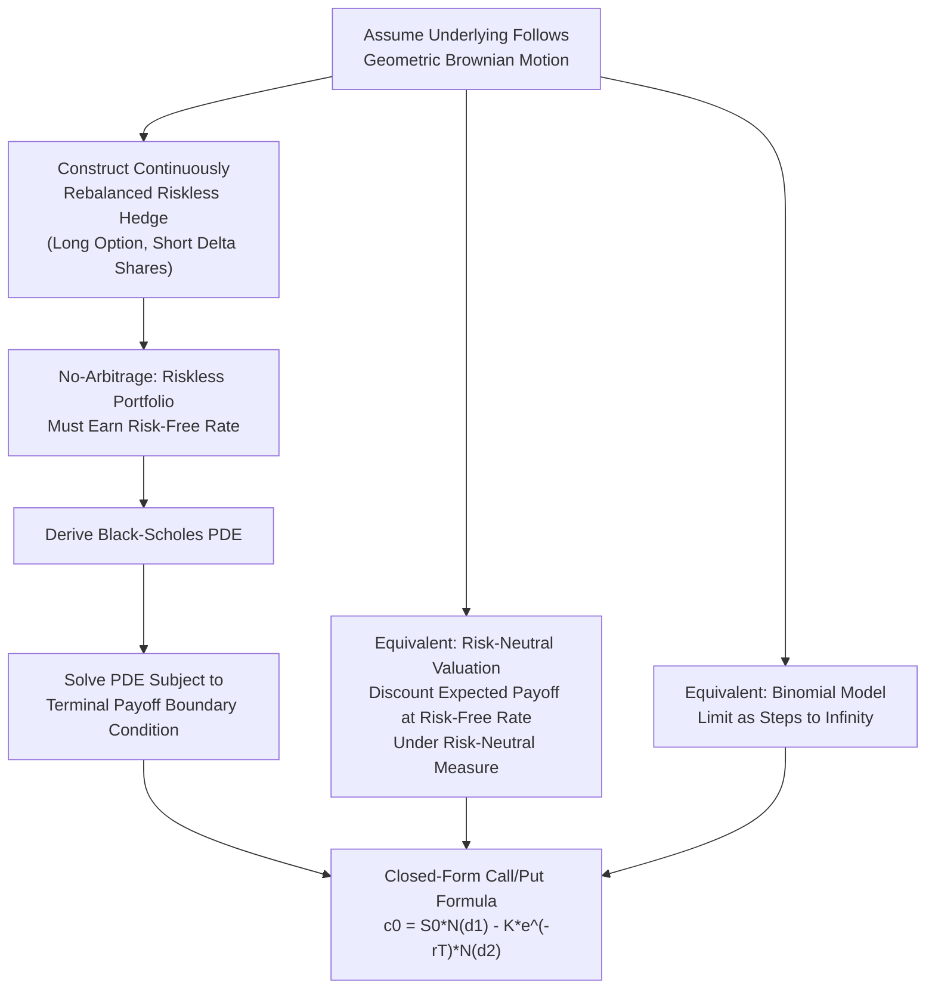

## The Black-Scholes-Merton Model

### Overview

The Black-Scholes-Merton (BSM) model provides a closed-form solution for pricing European options, derived under the assumption that the underlying asset's price follows a continuous-time stochastic process known as geometric Brownian motion. Published in 1973 by Fischer Black and Myron Scholes, with foundational contributions from Robert Merton, the model transformed derivatives markets by providing a tractable, widely applicable pricing framework and remains the reference point against which most other option pricing approaches are compared.

### Assumptions Underlying the Model

**Key Points**

- The underlying asset's price follows geometric Brownian motion with constant volatility $\sigma$ and constant expected return (drift), meaning returns are lognormally distributed.
- The risk-free interest rate $r$ is constant and known over the option's life.
- No transaction costs or taxes; markets are frictionless and perfectly liquid.
- The underlying asset can be freely bought, sold, and short-sold, with full use of proceeds.
- No dividends are paid during the option's life (in the original formulation; later extensions relax this assumption).
- The option is European-style (exercisable only at expiration).
- Trading is continuous, and there are no arbitrage opportunities in the market.

**Key Points**

- Several of these assumptions are known to be violated in real markets (e.g., volatility is not actually constant, transaction costs exist, and many underlyings pay dividends), which is why the model is understood as a tractable approximation rather than an exact description of market dynamics. [Inference: the practical significance of each assumption's violation varies by market and instrument, and has motivated numerous model extensions discussed below.]

### The Black-Scholes-Merton Formula

For a European call option on a non-dividend-paying stock:

$$c_0 = S_0 N(d_1) - K e^{-rT} N(d_2)$$

For the corresponding European put option:

$$p_0 = K e^{-rT} N(-d_2) - S_0 N(-d_1)$$

where:

$$d_1 = \frac{\ln(S_0/K) + (r + \sigma^2/2)T}{\sigma\sqrt{T}}, \qquad d_2 = d_1 - \sigma\sqrt{T}$$

and $N(\cdot)$ denotes the cumulative standard normal distribution function.

**Key Points**

- $N(d_1)$ and $N(d_2)$ can be interpreted, respectively, as (loosely) the option's delta-related sensitivity term and the risk-neutral probability that the option finishes in-the-money at expiration.
- $S_0$ is the current underlying price, $K$ is the strike price, $r$ is the continuously compounded risk-free rate, $T$ is time to expiration in years, and $\sigma$ is the annualized volatility of the underlying's returns.

### Interpreting $d_1$ and $d_2$

**Key Points**

- $N(d_2)$ represents the risk-neutral probability that the call option will be exercised (i.e., that $S_T > K$ at expiration), under the risk-neutral measure.
- $N(d_1)$ is closely related to the option's delta ($\Delta_{call} = N(d_1)$ for a non-dividend-paying stock), representing the hedge ratio — the number of shares needed to replicate the call in a continuously rebalanced hedge.
- The formula can be interpreted as: the call's value equals the present value of receiving the stock conditional on exercise, $S_0 N(d_1)$, minus the present value of paying the strike conditional on exercise, $K e^{-rT} N(d_2)$.

### Example: Black-Scholes-Merton Call Valuation

A non-dividend stock trades at $S_0 = \$100$. Strike $K = \$105$. Time to expiration $T = 0.5$ years. Risk-free rate $r = 4\%$. Volatility $\sigma = 25\%$.

**Calculate $d_1$ and $d_2$:**

$$d_1 = \frac{\ln(100/105) + (0.04 + 0.25^2/2)(0.5)}{0.25\sqrt{0.5}} = \frac{-0.04879 + 0.03625}{0.17678} = \frac{-0.01254}{0.17678} = -0.0709$$

$$d_2 = -0.0709 - 0.17678 = -0.2477$$

**Look up cumulative normal values:**

$$N(d_1) = N(-0.0709) \approx 0.4717, \qquad N(d_2) = N(-0.2477) \approx 0.4022$$

**Call price:**

$$c_0 = 100 \times 0.4717 - 105 \times e^{-0.04 \times 0.5} \times 0.4022$$

$$c_0 = 47.17 - 105 \times 0.9802 \times 0.4022 = 47.17 - 41.40 = \$5.77$$

**Corresponding put price via put-call parity:**

$$p_0 = c_0 + K e^{-rT} - S_0 = 5.77 + 102.92 - 100 = \$8.69$$

### Adjustments for Dividends

For a stock paying a continuous dividend yield $q$:

$$c_0 = S_0 e^{-qT} N(d_1) - K e^{-rT} N(d_2)$$

$$d_1 = \frac{\ln(S_0/K) + (r - q + \sigma^2/2)T}{\sigma\sqrt{T}}$$

**Key Points**

- This is the Merton (1973) extension of the original Black-Scholes model, adjusting the formula to account for income earned by holders of the physical underlying asset that option holders do not receive.
- For known discrete dividends (rather than a continuous yield), a common approximation is to subtract the present value of expected dividends during the option's life from $S_0$ before applying the standard (non-dividend) formula.

### Extensions for Currency and Futures Options

**Currency options (Garman-Kohlhagen model)**: Replace the dividend yield $q$ with the foreign risk-free rate $r_f$:

$$c_0 = S_0 e^{-r_f T} N(d_1) - K e^{-rT} N(d_2)$$

**Options on futures (Black model)**: Since a futures position requires no upfront investment, the formula simplifies:

$$c_0 = e^{-rT}\left[F_0 N(d_1) - K N(d_2)\right], \qquad d_1 = \frac{\ln(F_0/K) + (\sigma^2/2)T}{\sigma\sqrt{T}}$$

**Key Points**

- These extensions preserve the same underlying risk-neutral valuation logic as the original model, adapting only the treatment of the "carry" or yield term specific to the underlying asset class, directly paralleling the cost-of-carry adjustments used in forward and futures pricing.

### The Black-Scholes-Merton Partial Differential Equation

The option pricing formula can also be derived by showing that the option's price, as a function of the underlying price and time, must satisfy a specific partial differential equation (PDE) under a continuously rebalanced, riskless hedge:

$$\frac{\partial f}{\partial t} + rS\frac{\partial f}{\partial S} + \frac{1}{2}\sigma^2 S^2 \frac{\partial^2 f}{\partial S^2} = rf$$

**Key Points**

- This PDE is derived by constructing a riskless portfolio (long the option, short $\Delta$ shares of stock) and requiring, under no-arbitrage, that this riskless portfolio earn exactly the risk-free rate.
- The closed-form call and put pricing formulas are the specific solutions to this PDE subject to the relevant boundary conditions (the known payoff at expiration, $\max(S_T-K,0)$ for a call).
- This PDE-based derivation is mathematically equivalent to the risk-neutral valuation approach and to the continuous-time limit of the binomial model, providing three complementary lenses on the same underlying result.

### Black-Scholes-Merton Derivation Logic

### Volatility: The Model's Key Unobservable Input

**Key Points**

- Volatility $\sigma$ is the only input to the BSM formula that is not directly observable in the market (unlike $S_0$, $K$, $r$, and $T$), making it the central focus of practical option pricing and trading.
- **Historical volatility**: Estimated from the standard deviation of the underlying's past log returns over a chosen lookback window; a backward-looking measure.
- **Implied volatility**: The volatility value that, when input into the BSM formula, produces a theoretical price equal to the option's observed market price; a forward-looking, market-derived measure obtained by numerically inverting the pricing formula (since no closed-form solution for $\sigma$ exists given a price).
- Implied volatility is widely used in practice as the market's quoted "price" for options (options are frequently quoted directly in terms of their implied volatility rather than dollar premium), reflecting the market's collective view of expected future volatility over the option's remaining life.

### The Volatility Smile and Skew

**Key Points**

- If the BSM model's assumptions held exactly, options on the same underlying and expiration but different strikes would all imply the same volatility. In practice, implied volatility typically varies systematically across strikes, a pattern known as the volatility smile (higher implied volatility for both deep out-of-the-money and deep in-the-money options relative to at-the-money) or volatility skew (a consistent tilt, commonly higher implied volatility for out-of-the-money puts than out-of-the-money calls in equity markets).
- This pattern is widely interpreted as evidence that the market does not believe the underlying's returns are perfectly lognormally distributed as BSM assumes — for instance, market prices often embed a greater perceived probability of large downward price moves (crash risk) than a lognormal distribution would suggest. [Inference: the specific shape and persistence of the volatility smile/skew vary by asset class, market regime, and time period, and remain an active area of empirical and modeling research.]
- The existence of the volatility smile/skew is one of the most direct pieces of market evidence that the constant-volatility assumption of the basic BSM model is a simplification, motivating extensions such as local volatility, stochastic volatility (e.g., Heston model), and jump-diffusion models.

### The Greeks: Option Price Sensitivities

The BSM formula's differentiability allows closed-form expressions for the option's sensitivities to its various inputs, collectively known as the Greeks:

**Key Points**

- **Delta ($\Delta$)**: Sensitivity of option price to a small change in the underlying price; $\Delta_{call} = N(d_1)$, $\Delta_{put} = N(d_1) - 1$.
- **Gamma ($\Gamma$)**: Sensitivity of delta to a small change in the underlying price (the option price's curvature with respect to the underlying); identical for calls and puts at the same strike/expiration.
- **Theta ($\Theta$)**: Sensitivity of option price to the passage of time (time decay); generally negative for long option positions, reflecting the erosion of time value as expiration approaches.
- **Vega ($\nu$)**: Sensitivity of option price to a change in volatility; always positive for both long calls and long puts, since higher volatility increases the value of optionality in both directions.
- **Rho ($\rho$)**: Sensitivity of option price to a change in the risk-free interest rate; generally positive for calls and negative for puts.
- These sensitivities are essential tools for options market makers and traders to manage the risk of an options position or portfolio (delta-hedging, gamma scalping, vega exposure management).

### Limitations of the Black-Scholes-Merton Model

**Key Points**

- **Constant volatility assumption**: Empirically, volatility is not constant — it clusters, exhibits mean reversion, and varies across strikes and expirations (the volatility smile/skew), all of which are inconsistent with the model's core assumption.
- **Continuous trading assumption**: Real markets have trading hours, liquidity constraints, and transaction costs that prevent the continuous, costless rebalancing the model's derivation assumes.
- **Lognormal returns assumption**: Actual asset returns often exhibit fatter tails (more extreme moves) and negative skewness (larger, more frequent downward jumps) than a lognormal distribution predicts, particularly evident during market crises.
- **European-only applicability**: The basic closed-form formula does not directly handle American-style early exercise, requiring numerical methods (e.g., the binomial model) or specialized approximations for American options.
- **Constant interest rate assumption**: Real interest rates fluctuate over an option's life, though this assumption is generally considered less significant than the volatility assumption for most equity and short-to-medium-dated options. [Inference: the materiality of the constant-rate assumption's violation depends on the option's maturity and the interest rate environment, and can become more significant for longer-dated options or during periods of high rate volatility.]

### Practical Use Despite Limitations

**Key Points**

- Despite its known limitations, the BSM model remains the dominant reference framework in options markets, both as a direct pricing tool for European-style instruments and, more broadly, as the common language (via implied volatility quoting) through which market participants communicate and compare option prices across strikes, expirations, and underlyings.
- Many practical extensions and alternative models (local volatility, stochastic volatility, jump-diffusion, and numerical methods like the binomial tree or Monte Carlo simulation) are understood as refinements addressing specific known limitations of the basic BSM framework, rather than wholesale replacements of its underlying no-arbitrage, risk-neutral valuation logic.
- The model's continued centrality reflects both its analytical tractability and the fact that, for many practical purposes and with appropriate volatility inputs (e.g., using implied volatility from liquid nearby strikes), it provides a reasonably serviceable approximation. [Inference: the degree to which BSM-derived prices and hedges remain serviceable in practice depends on the specific market, instrument, and stress conditions, and practitioners often supplement it with the extensions noted above.]

### Common Pitfalls

**Key Points**

- Applying the unmodified (non-dividend) BSM formula to a dividend-paying stock without incorporating the dividend yield adjustment, which overstates call values and understates put values.
- Using the basic European BSM formula to price American options without accounting for early exercise value, particularly for American puts or dividend-paying American calls.
- Treating a single volatility input as applicable across all strikes and expirations, ignoring the well-documented volatility smile/skew observed in most options markets.
- Confusing historical volatility (backward-looking, computed from past returns) with implied volatility (forward-looking, backed out from current option prices); using the wrong one for a given purpose (e.g., using historical volatility as a market-consistent pricing input) can materially mis-price an option relative to observed market prices.
- Assuming the Greeks (delta, gamma, vega, etc.) remain constant over time or as the underlying price moves; these sensitivities themselves change continuously and require ongoing recalculation for effective risk management (dynamic hedging).

### Related Topics

- Option payoff structures and put-call parity
- The binomial option pricing model and its convergence to Black-Scholes-Merton
- The Greeks and dynamic delta hedging
- Implied volatility, the volatility smile, and volatility skew
- Stochastic volatility and jump-diffusion model extensions (Heston, Merton jump-diffusion)
- Risk-neutral valuation and the fundamental theorem of asset pricing
- American option early exercise and numerical pricing methods