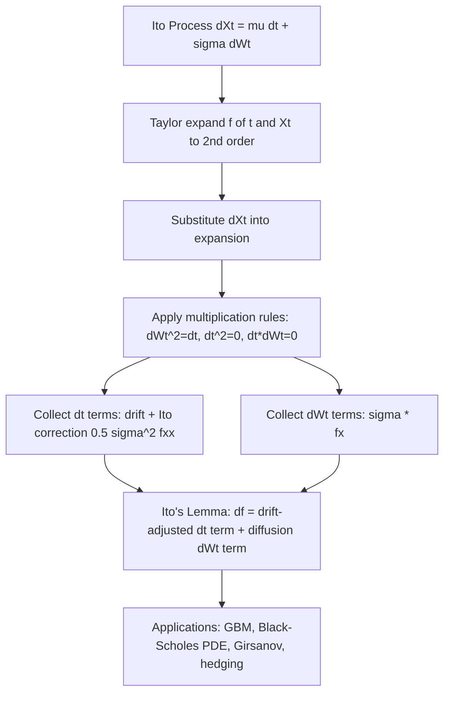

## Ito's Lemma and Stochastic Integration

### Overview

Stochastic calculus extends classical calculus to functions of stochastic processes, primarily Brownian motion. Ito's lemma is the stochastic analogue of the chain rule and is the single most important tool for derivative pricing, dynamic hedging, and continuous-time asset pricing models.

### Brownian Motion: The Building Block

A standard Brownian motion (Wiener process) $W_t$ satisfies:

- $W_0 = 0$
- Independent increments: $W_t - W_s$ is independent of $\mathcal{F}_s$ for $t > s$
- Gaussian increments: $W_t - W_s \sim N(0, t-s)$
- Continuous sample paths (almost surely nowhere differentiable)

**Key Points**

- Quadratic variation: $[W,W]_t = t$, formally written $(dW_t)^2 = dt$
- $dW_t \cdot dt = 0$ and $(dt)^2 = 0$ (these multiplication rules drive Ito's lemma)
- Brownian paths have infinite total variation but finite quadratic variation on any interval

### The Ito Integral

Because Brownian paths have unbounded variation, the Riemann-Stieltjes integral $\int_0^t f(s) \, dW_s$ cannot be defined pathwise in the classical sense. The Ito integral is constructed instead as an $L^2$-limit of left-endpoint (non-anticipating) Riemann sums:

$$\int_0^t \sigma_s \, dW_s = \lim_{n \to \infty} \sum_{i=0}^{n-1} \sigma_{t_i} (W_{t_{i+1}} - W_{t_i})$$

**Key Points**

- The integrand $\sigma_s$ must be evaluated at the *left* endpoint $t_i$ (non-anticipating/adapted), not the midpoint or right endpoint — this choice is what makes the Ito integral a martingale
- The Ito isometry: $E\left[\left(\int_0^t \sigma_s \, dW_s\right)^2\right] = E\left[\int_0^t \sigma_s^2 \, ds\right]$
- Ito integrals are martingales: $E\left[\int_0^t \sigma_s \, dW_s \mid \mathcal{F}_u\right] = \int_0^u \sigma_s \, dW_s$ for $u < t$
- Contrast with the **Stratonovich integral**, which uses midpoint evaluation, obeys the ordinary chain rule, but sacrifices the martingale property — used in physics more than finance

### Ito Processes and Stochastic Differential Equations

A general Ito process is written as:

$$dX_t = \mu_t \, dt + \sigma_t \, dW_t$$

equivalently in integral form:

$$X_t = X_0 + \int_0^t \mu_s \, ds + \int_0^t \sigma_s \, dW_s$$

where $\mu_t$ is the drift and $\sigma_t$ is the diffusion (volatility) coefficient.

### Ito's Lemma: Statement

For a function $f(t, X_t)$ that is $C^1$ in $t$ and $C^2$ in $x$, applied to an Ito process $dX_t = \mu_t \, dt + \sigma_t \, dW_t$:

$$df(t, X_t) = \left(\frac{\partial f}{\partial t} + \mu_t \frac{\partial f}{\partial x} + \frac{1}{2}\sigma_t^2 \frac{\partial^2 f}{\partial x^2}\right) dt + \sigma_t \frac{\partial f}{\partial x} \, dW_t$$

**Derivation intuition**

Taylor-expand $f(t + dt, X_t + dX_t)$ to second order:

$$df = \frac{\partial f}{\partial t} dt + \frac{\partial f}{\partial x} dX_t + \frac{1}{2}\frac{\partial^2 f}{\partial x^2} (dX_t)^2 + \dots$$

Substitute $dX_t = \mu_t dt + \sigma_t dW_t$ and apply the multiplication table:

| Term | Value |
| --- | --- |
| $dt \cdot dt$ | $0$ |
| $dt \cdot dW_t$ | $0$ |
| $dW_t \cdot dW_t$ | $dt$ |

This gives $(dX_t)^2 = \sigma_t^2 \, dt + o(dt)$, which is the extra term absent from ordinary calculus — the **Ito correction term** $\frac{1}{2}\sigma_t^2 f_{xx}$.

### Multivariate Ito's Lemma

For $f(t, X_t, Y_t)$ driven by two correlated Brownian motions with $dX_t dY_t = \rho_t \sigma_t^X \sigma_t^Y \, dt$:

$$df = f_t \, dt + f_x \, dX_t + f_y \, dY_t + \frac{1}{2}f_{xx}(dX_t)^2 + \frac{1}{2}f_{yy}(dY_t)^2 + f_{xy} \, dX_t \, dY_t$$

This is essential for multi-asset models (basket options, correlation trading, hedging with multiple risk factors).

### Canonical Example: Geometric Brownian Motion

Stock price dynamics:

$$dS_t = \mu S_t \, dt + \sigma S_t \, dW_t$$

**Example**

Apply Ito's lemma to $f(S_t) = \ln S_t$:

- $f_S = 1/S_t$, $f_{SS} = -1/S_t^2$, $f_t = 0$

$$d(\ln S_t) = \left(\mu - \frac{1}{2}\sigma^2\right) dt + \sigma \, dW_t$$

Integrating:

$$S_t = S_0 \exp\left[\left(\mu - \frac{1}{2}\sigma^2\right)t + \sigma W_t\right]$$

This is the closed-form solution underlying the Black-Scholes-Merton framework. Note the drift adjustment $-\frac{1}{2}\sigma^2$: the arithmetic mean return $\mu$ differs from the geometric (compounded) growth rate precisely because of Jensen's inequality applied to the log transform — a direct consequence of the Ito correction term.

### Application: Deriving the Black-Scholes PDE

Let $V(t, S_t)$ be the price of a derivative on $S_t$ following GBM. Ito's lemma gives:

$$dV = \left(V_t + \mu S V_S + \frac{1}{2}\sigma^2 S^2 V_{SS}\right)dt + \sigma S V_S \, dW_t$$

Constructing a self-financing, delta-hedged portfolio $\Pi = V - \Delta S$ with $\Delta = V_S$ eliminates the $dW_t$ term (removes randomness). Under no-arbitrage, the hedged portfolio must earn the risk-free rate $r$, yielding:

$$\frac{\partial V}{\partial t} + rS\frac{\partial V}{\partial S} + \frac{1}{2}\sigma^2 S^2 \frac{\partial^2 V}{\partial S^2} - rV = 0$$

**Key Points**

- The drift $\mu$ vanishes entirely from the PDE — this is the origin of risk-neutral pricing
- The second-derivative (convexity/gamma) term is a direct legacy of the Ito correction term; without it, no-arbitrage hedging arguments in continuous time would fail
- [Inference] Practitioners often describe this cancellation as "the market doesn't need to know $\mu$," which is a useful pricing intuition though not a rigorous restatement of the derivation

### Ito's Lemma for Jump-Diffusion Processes

When $X_t$ has jumps (e.g., Merton's jump-diffusion model), Ito's lemma requires an additional term for the jump component:

$$df = \left(f_t + \mu f_x + \frac{1}{2}\sigma^2 f_{xx}\right)dt + \sigma f_x \, dW_t + \left[f(X_{t^-} + J_t) - f(X_{t^-})\right] dN_t$$

where $N_t$ is a Poisson process and $J_t$ is the jump size. This is used in models capturing fat tails and volatility smiles that pure diffusion cannot replicate.

### Stochastic Integration by Parts (Ito Product Rule)

For two Ito processes $X_t, Y_t$:

$$d(X_t Y_t) = X_t \, dY_t + Y_t \, dX_t + dX_t \, dY_t$$

The cross-variation term $dX_t \, dY_t$ has no classical-calculus counterpart and is essential in deriving forward/futures price relationships and quanto adjustments.

### Girsanov's Theorem (Connection to Ito Calculus)

Girsanov's theorem shows how the drift of an Ito process changes under an equivalent change of measure (e.g., moving from the physical measure $P$ to the risk-neutral measure $Q$):

$$dW_t^P = dW_t^Q + \theta_t \, dt$$

where $\theta_t$ is the market price of risk. This is what formally justifies replacing $\mu$ with $r$ in derivative pricing and is proven using stochastic integrals and the Ito isometry.

### Diagram: Ito's Lemma Derivation Flow



### Diagram: Ito vs Stratonovich Integration (svg_diagram)

<svg xmlns="http://www.w3.org/2000/svg" viewBox="0 0 640 260">
<text x="320" y="24" text-anchor="middle" font-size="16" font-weight="bold" fill="#1a1a2e">Ito vs Stratonovich Integration (svg_diagram)</text>
<rect x="30" y="50" width="260" height="170" rx="8" fill="#eef2ff" stroke="#4338ca" stroke-width="1.5" />
<text x="160" y="75" text-anchor="middle" font-size="13" font-weight="bold" fill="#4338ca">Ito Integral</text>
<text x="45" y="100" font-size="11" fill="#1a1a2e">Evaluation point: left endpoint</text>
<text x="45" y="120" font-size="11" fill="#1a1a2e">sum of sigma(t_i) * (W_i+1 - W_i)</text>
<text x="45" y="145" font-size="11" fill="#1a1a2e">Property: Martingale</text>
<text x="45" y="165" font-size="11" fill="#1a1a2e">Chain rule: modified (correction term)</text>
<text x="45" y="190" font-size="11" fill="#1a1a2e">Use case: derivative pricing,</text>
<text x="45" y="205" font-size="11" fill="#1a1a2e">finance (non-anticipating)</text>
<rect x="350" y="50" width="260" height="170" rx="8" fill="#fef3c7" stroke="#b45309" stroke-width="1.5" />
<text x="480" y="75" text-anchor="middle" font-size="13" font-weight="bold" fill="#b45309">Stratonovich Integral</text>
<text x="365" y="100" font-size="11" fill="#1a1a2e">Evaluation point: midpoint</text>
<text x="365" y="120" font-size="11" fill="#1a1a2e">sum of sigma(mid) * (W_i+1 - W_i)</text>
<text x="365" y="145" font-size="11" fill="#1a1a2e">Property: Not a martingale</text>
<text x="365" y="165" font-size="11" fill="#1a1a2e">Chain rule: ordinary (classical)</text>
<text x="365" y="190" font-size="11" fill="#1a1a2e">Use case: physics, engineering,</text>
<text x="365" y="205" font-size="11" fill="#1a1a2e">Langevin-type SDEs</text>
</svg>

### Common Pitfalls

**Key Points**

- Forgetting the Ito correction term when transforming variables (e.g., computing $d(\ln S_t)$) is the single most frequent error in applied derivations
- Treating $dW_t$ as though $(dW_t)^2 = 0$ (classical calculus intuition) invalidates all subsequent algebra
- Confusing Ito and Stratonovich conventions when translating between finance and physics/engineering literature leads to sign/drift errors
- [Unverified] Numerical SDE solvers (e.g., Euler-Maruyama vs Milstein schemes) exhibit different convergence rates in practice; exact performance depends on the specific SDE, step size, and implementation, so no single scheme is universally superior

### Numerical Simulation (Euler-Maruyama Scheme)

For $dX_t = \mu(X_t) dt + \sigma(X_t) dW_t$, the discretized approximation:

$$X_{t+\Delta t} \approx X_t + \mu(X_t)\Delta t + \sigma(X_t)\sqrt{\Delta t} \, Z, \quad Z \sim N(0,1)$$

**Output**

```python
import numpy as np

def simulate_gbm(S0, mu, sigma, T, n_steps, n_paths=1):
    dt = T / n_steps
    paths = np.zeros((n_paths, n_steps + 1))
    paths[:, 0] = S0
    for t in range(1, n_steps + 1):
        Z = np.random.standard_normal(n_paths)
        paths[:, t] = paths[:, t-1] * np.exp(
            (mu - 0.5 * sigma**2) * dt + sigma * np.sqrt(dt) * Z
        )
    return paths
```

This uses the exact log-Euler solution derived above (via Ito's lemma on $\ln S_t$) rather than the raw Euler-Maruyama discretization, since GBM admits a closed-form transform that eliminates discretization bias in the drift term.

### Conclusion

Ito's lemma is the structural bridge between stochastic processes and deterministic PDEs in finance. Every major continuous-time model — Black-Scholes-Merton, Vasicek, CIR, Heston — is derived by applying Ito's lemma to a proposed SDE and exploiting the resulting correction term to build hedging arguments or closed-form transforms. Mastery of the multiplication table ($dW_t^2 = dt$) and the Taylor-expansion derivation is prerequisite to nearly all subsequent continuous-time asset pricing theory.

**Related Topics**

- Feynman-Kac theorem (connecting SDEs to PDEs via conditional expectations)
- Girsanov's theorem and change of measure
- Stochastic differential equations: Vasicek, CIR, and Heston models
- Martingale representation theorem
- Numerical schemes for SDEs (Milstein, higher-order methods)
- Levy processes and jump-diffusion models
- Malliavin calculus (for Greeks computation)
- Local volatility and stochastic volatility models