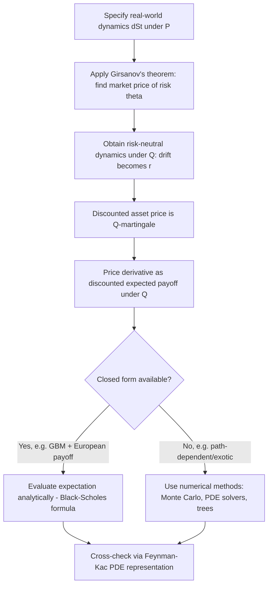

## Risk-Neutral Valuation


### Overview

Risk-neutral valuation is the principle that any derivative security can be priced as the discounted expected value of its future payoff, computed under a probability measure — the risk-neutral (equivalent martingale) measure — in which every traded asset's discounted price process is a martingale. This transforms derivative pricing from a utility-dependent economic problem into an expectation-computation problem, independent of investors' risk preferences.

### Core Idea and Intuition

Under the physical (real-world) measure $P$, assets earn risk premiums reflecting investor risk aversion. Under the risk-neutral measure $Q$, all assets are priced as though investors were indifferent to risk — every asset's expected return equals the risk-free rate.

**Key Points**

- Risk-neutral valuation does not assume investors are actually risk-neutral; it is a pricing technique, not a behavioral claim
- The technique works because, under no-arbitrage, a derivative's price can be replicated by a dynamically rebalanced portfolio of the underlying and a risk-free asset — replication removes the need to know investors' true risk preferences
- [Inference] This is often summarized as "the price is preference-free" — accurate for the pricing formula itself, though the *existence* of the risk-neutral measure still relies on no-arbitrage and market completeness assumptions

### Fundamental Theorems of Asset Pricing

**First Fundamental Theorem of Asset Pricing (FFTAP):** A market is arbitrage-free if and only if there exists at least one equivalent martingale measure (EMM) $Q$.

**Second Fundamental Theorem of Asset Pricing (SFTAP):** An arbitrage-free market is complete if and only if the equivalent martingale measure is unique.

**Key Points**

- "Equivalent" means $Q$ and $P$ agree on which events have zero probability (see Girsanov's theorem for the mechanics of constructing $Q$ from $P$)
- "Martingale" means asset prices, once discounted by the numeraire, have no drift under $Q$
- In incomplete markets (e.g., stochastic volatility, jump-diffusion models), multiple EMMs can exist, and prices are only pinned down up to a range absent further assumptions (e.g., utility indifference pricing, minimal martingale measure)

### The Risk-Neutral Pricing Formula

For a derivative with payoff $V_T$ at maturity $T$, and money-market numeraire $B_t = e^{rt}$ (constant risk-free rate $r$):

$$V_t = E^Q\left[e^{-r(T-t)} V_T \,\middle|\, \mathcal{F}_t\right]$$

More generally, with a stochastic short rate $r_s$:

$$V_t = E^Q\left[\exp\left(-\int_t^T r_s \, ds\right) V_T \,\middle|\, \mathcal{F}_t\right]$$

**Key Points**

- This is a direct consequence of the discounted price process $\tilde{V}_t = e^{-rt}V_t$ being a $Q$-martingale, combined with the martingale property $\tilde{V}_t = E^Q[\tilde{V}_T \mid \mathcal{F}_t]$
- The formula requires no knowledge of $\mu$ (the real-world drift) — this is precisely what Girsanov's theorem's drift-shifting machinery achieves

### Derivation via Replication and No-Arbitrage

**Example**

Consider a stock following $dS_t = \mu S_t \, dt + \sigma S_t \, dW_t^P$ and a derivative $V(t, S_t)$. Applying Ito's lemma:

$$dV = \left(V_t + \mu S V_S + \tfrac{1}{2}\sigma^2 S^2 V_{SS}\right) dt + \sigma S V_S \, dW_t^P$$

Form a hedged portfolio $\Pi_t = V_t - \Delta_t S_t$ with $\Delta_t = V_S$ to eliminate the random $dW_t^P$ term. No-arbitrage requires $\Pi_t$ to earn the risk-free rate $r$:

$$d\Pi_t = r \Pi_t \, dt$$

This produces the Black-Scholes PDE:

$$V_t + rS V_S + \tfrac{1}{2}\sigma^2 S^2 V_{SS} - rV = 0$$

By the **Feynman-Kac theorem**, this PDE has the probabilistic representation:

$$V(t, S_t) = e^{-r(T-t)} E^Q[V(T, S_T) \mid \mathcal{F}_t]$$

where under $Q$, $dS_t = rS_t \, dt + \sigma S_t \, dW_t^Q$.

**Key Points**

- The PDE and the expectation formula are two equivalent representations of the same pricing problem — this PDE-martingale duality is the Feynman-Kac connection
- Both derivations arrive at the same conclusion: $\mu$ drops out and is replaced by $r$

### Feynman-Kac Theorem (Formal Statement)

For a diffusion $dX_t = \mu(X_t, t)\,dt + \sigma(X_t, t)\,dW_t$ and a function $u(t,x)$ solving the PDE:

$$\frac{\partial u}{\partial t} + \mu(x,t)\frac{\partial u}{\partial x} + \frac{1}{2}\sigma^2(x,t)\frac{\partial^2 u}{\partial x^2} - r u = 0, \quad u(T,x) = h(x)$$

the solution admits the representation:

$$u(t,x) = E\left[e^{-r(T-t)} h(X_T) \,\middle|\, X_t = x\right]$$

This theorem is the rigorous bridge connecting the PDE approach (Black-Scholes) and the probabilistic/expectation approach (risk-neutral valuation) — they are two computational routes to the identical price.

### Worked Example: European Call Option

**Example**

Under $Q$: $S_T = S_0 \exp\left[(r - \tfrac{1}{2}\sigma^2)T + \sigma W_T^Q\right]$, with $W_T^Q \sim N(0,T)$.

$$C_0 = e^{-rT} E^Q[\max(S_T - K, 0)]$$

Evaluating this expectation (via the log-normal distribution of $S_T$) yields the Black-Scholes formula:

$$C_0 = S_0 N(d_1) - Ke^{-rT}N(d_2)$$


$$d_1 = \frac{\ln(S_0/K) + (r + \tfrac{1}{2}\sigma^2)T}{\sigma\sqrt{T}}, \quad d_2 = d_1 - \sigma\sqrt{T}$$

**Key Points**

- $N(d_2)$ is the risk-neutral probability that the option finishes in-the-money
- $N(d_1)$ arises from a further change of measure (the "stock measure" or "share measure," using $S_t$ itself as numeraire) — a common technique to simplify the expectation
- [Inference] Traders often interpret $S_0 N(d_1)$ as "the expected value of receiving the stock conditional on exercise," which is a useful heuristic though the rigorous justification is the numeraire-change argument

### Choice of Numeraire and Associated Martingale Measures

Risk-neutral valuation is a special case of the broader **numeraire-invariance** principle: any strictly positive traded asset $N_t$ can serve as numeraire, with an associated EMM $Q^N$ under which all numeraire-deflated asset prices are martingales.

| Numeraire | Measure | Common Use |
| --- | --- | --- |
| Money-market account $B_t = e^{\int_0^t r_s ds}$ | Risk-neutral measure $Q$ | Standard equity/FX derivative pricing |
| Zero-coupon bond $P(t,T)$ | T-forward measure $Q^T$ | Interest-rate derivatives, bond options |
| Annuity/PVBP | Swap measure $Q^{swap}$ | Swaptions, CMS products |
| Underlying asset $S_t$ | Stock/share measure $Q^S$ | Simplifying $N(d_1)$ term, exchange options |

**Key Points**

- Changing numeraire is executed via Girsanov's theorem, with the Radon-Nikodym derivative determined by the ratio of numeraires
- The pricing formula under any numeraire $N_t$: $\frac{V_t}{N_t} = E^{Q^N}\left[\frac{V_T}{N_T} \,\middle|\, \mathcal{F}_t\right]$
- Choosing the "right" numeraire for a given payoff (e.g., forward measure for rate products) can reduce a pricing problem from a complex joint distribution to a single Gaussian expectation

### Diagram: Risk-Neutral Valuation Workflow



### Diagram: Real-World vs Risk-Neutral Measure (svg_diagram)

<svg xmlns="http://www.w3.org/2000/svg" viewBox="0 0 640 260">
<text x="320" y="24" text-anchor="middle" font-size="16" font-weight="bold" fill="#1a1a2e">Real-World vs Risk-Neutral Measure (svg_diagram)</text>
<rect x="30" y="50" width="260" height="180" rx="8" fill="#eef2ff" stroke="#4338ca" stroke-width="1.5" />
<text x="160" y="75" text-anchor="middle" font-size="13" font-weight="bold" fill="#4338ca">Physical Measure P</text>
<text x="45" y="100" font-size="11" fill="#1a1a2e">Drift: mu (includes risk premium)</text>
<text x="45" y="120" font-size="11" fill="#1a1a2e">Used for: forecasting, risk</text>
<text x="45" y="138" font-size="11" fill="#1a1a2e">management, VaR, real-world</text>
<text x="45" y="156" font-size="11" fill="#1a1a2e">scenario simulation</text>
<text x="45" y="184" font-size="11" fill="#1a1a2e">Discounted price: NOT a</text>
<text x="45" y="202" font-size="11" fill="#1a1a2e">martingale (has drift mu-r)</text>
<rect x="350" y="50" width="260" height="180" rx="8" fill="#dcfce7" stroke="#15803d" stroke-width="1.5" />
<text x="480" y="75" text-anchor="middle" font-size="13" font-weight="bold" fill="#15803d">Risk-Neutral Measure Q</text>
<text x="365" y="100" font-size="11" fill="#1a1a2e">Drift: r (risk-free rate)</text>
<text x="365" y="120" font-size="11" fill="#1a1a2e">Used for: derivative pricing,</text>
<text x="365" y="138" font-size="11" fill="#1a1a2e">hedging, no-arbitrage valuation</text>

<text x="365" y="166" font-size="11" fill="`#1a1a2e`">Discounted price: IS a</text>

<text x="365" y="184" font-size="11" fill="`#1a1a2e`">martingale (zero drift)</text>

<path d="M290 140 L350 140" stroke="#b45309" stroke-width="2" marker-end="url(#arrow)" />
<text x="270" y="130" font-size="10" fill="#b45309">Girsanov</text>
</svg>

### Risk-Neutral Valuation in Incomplete Markets

When markets are incomplete (stochastic volatility, jumps, unhedgeable risk factors), the EMM is not unique.

**Key Points**

- Common resolution approaches: minimal martingale measure, minimal entropy martingale measure, utility indifference pricing, or calibrating $Q$-parameters directly to observed option prices (the standard industry practice)
- In practice, quants typically do not derive $Q$ from a utility-based equilibrium argument; instead they parametrize $Q$-dynamics directly (e.g., Heston, SABR) and calibrate to the volatility surface — [Inference] this reflects a pragmatic shift from "derive Q from P" to "specify Q directly and validate against market prices," which is standard industry practice though it sidesteps the equilibrium interpretation of $Q$

### Monte Carlo and Numerical Risk-Neutral Pricing

For payoffs without closed-form solutions:

**Output**

```python
import numpy as np

def price_european_call_mc(S0, K, r, sigma, T, n_paths=100_000, n_steps=252):
    dt = T / n_steps
    Z = np.random.standard_normal((n_paths, n_steps))
    log_returns = (r - 0.5 * sigma**2) * dt + sigma * np.sqrt(dt) * Z
    log_paths = np.cumsum(log_returns, axis=1)
    S_T = S0 * np.exp(log_paths[:, -1])
    payoff = np.maximum(S_T - K, 0)
    price = np.exp(-r * T) * np.mean(payoff)
    std_error = np.exp(-r * T) * np.std(payoff) / np.sqrt(n_paths)
    return price, std_error
```

**Key Points**

- Simulating under $Q$ (not $P$) is essential — the risk-neutral drift $r$ is used, not any estimate of the real-world $\mu$
- [Unverified] Convergence rates and standard error reduction techniques (antithetic variates, control variates, quasi-Monte Carlo) vary by payoff structure and are typically chosen based on the specific pricing problem rather than a universal default

### Common Pitfalls

**Key Points**

- Confusing risk-neutral probabilities with real-world (physical) probabilities — $Q$-probabilities should never be interpreted as actual likelihoods of outcomes; they are pricing weights
- Using historical/real-world drift $\mu$ in a pricing formula instead of $r$ (or the appropriate forward rate) is a common practitioner error, particularly among those newer to derivatives
- Assuming a unique risk-neutral measure exists in incomplete-market models without justification
- Forgetting that risk-neutral valuation prices *relative* to traded instruments — it does not produce an "absolute" price independent of market inputs (volatility, rates) which must themselves be calibrated or estimated

### Conclusion

Risk-neutral valuation reframes derivative pricing as an expectation problem under a measure engineered (via Girsanov's theorem) so that discounted asset prices are martingales. It is justified by the no-arbitrage/replication argument (First Fundamental Theorem) and connected to PDE methods via the Feynman-Kac theorem. While originally developed for complete markets like Black-Scholes, its numeraire-invariance extensions underpin virtually all modern derivatives pricing across asset classes.

**Related Topics**

- Ito's lemma and stochastic integration
- Girsanov's theorem and change of measure
- Feynman-Kac theorem
- Numeraire changes: forward measure, swap measure
- Market completeness and hedging in incomplete markets
- Monte Carlo methods for derivative pricing
- Volatility surface calibration (local vol, stochastic vol, SABR)
- Fundamental Theorems of Asset Pricing