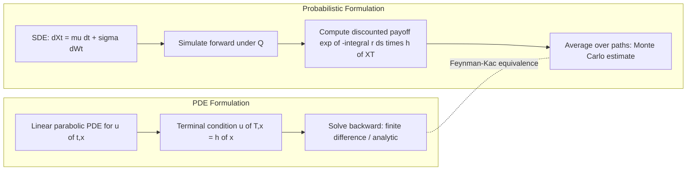

## The Feynman-Kac Formula

### Overview

The Feynman-Kac formula establishes a rigorous correspondence between linear parabolic partial differential equations (PDEs) and conditional expectations of functionals of stochastic processes. In financial economics, it is the theorem that formally justifies why derivative prices computed by solving a PDE (e.g., Black-Scholes) are identical to prices computed as discounted expected payoffs under a risk-neutral measure. It converts an analytic (PDE) problem into a probabilistic (expectation/simulation) problem and vice versa.

### Statement of the Theorem

Let $X_t$ follow the Ito diffusion:

$$dX_t = \mu(t, X_t)\, dt + \sigma(t, X_t)\, dW_t$$

Let $u(t,x)$ solve the terminal-value PDE problem on $[0,T] \times \mathbb{R}$:

$$\frac{\partial u}{\partial t} + \mu(t,x)\frac{\partial u}{\partial x} + \frac{1}{2}\sigma^2(t,x)\frac{\partial^2 u}{\partial x^2} - r(t,x)\, u = 0$$

with terminal condition $u(T, x) = h(x)$.

Then, subject to suitable regularity and integrability conditions, $u$ admits the probabilistic representation:

$$u(t,x) = E\left[\exp\left(-\int_t^T r(s, X_s)\, ds\right) h(X_T) \,\middle|\, X_t = x\right]$$

**Key Points**

- The PDE's second-order term $\frac{1}{2}\sigma^2 u_{xx}$ corresponds to the diffusion (Ito correction) term; the first-order term $\mu u_x$ corresponds to the drift of $X_t$; the term $-ru$ corresponds to discounting inside the expectation
- The expectation is taken under whatever measure makes $X_t$ evolve with drift $\mu(t,x)$ and diffusion $\sigma(t,x)$ — in derivatives pricing this is the risk-neutral measure $Q$
- The regularity conditions typically required include $\mu, \sigma$ satisfying Lipschitz and linear growth conditions (ensuring a unique strong solution to the SDE) and $h$ having at most polynomial growth (ensuring the expectation is finite)

### Intuition via Ito's Lemma

**Example**

Apply Ito's lemma to $Y_t = e^{-\int_0^t r(s,X_s)ds} u(t, X_t)$:

$$dY_t = e^{-\int_0^t r\,ds}\left[\left(u_t + \mu u_x + \tfrac{1}{2}\sigma^2 u_{xx} - ru\right)dt + \sigma u_x \, dW_t\right]$$

If $u$ solves the PDE, the drift (dt) term vanishes identically, leaving:

$$dY_t = e^{-\int_0^t r\,ds}\, \sigma u_x \, dW_t$$

This means $Y_t$ is a (local) martingale. Under sufficient regularity making it a true martingale, $E[Y_T \mid \mathcal{F}_t] = Y_t$, i.e.:

$$e^{-\int_0^t r\,ds}\,u(t,X_t) = E\left[e^{-\int_0^T r\,ds}\,h(X_T) \,\middle|\, \mathcal{F}_t\right]$$

Rearranging gives the Feynman-Kac representation. This derivation is the precise mechanism connecting the PDE and expectation formulations.

**Key Points**

- The "PDE terms cancel the drift of $Y_t$" step is the crux of the proof — the PDE is, by construction, exactly the condition needed to make $Y_t$ driftless
- Verifying $Y_t$ is a *true* martingale (not just a local martingale) generally requires additional boundedness or integrability conditions on $u_x$, $\sigma$; this is a standard but non-trivial technical step in rigorous treatments

### Connection to Black-Scholes

**Example**

The Black-Scholes PDE for $V(t, S_t)$ under constant risk-free rate $r$ and volatility $\sigma$:

$$V_t + rS V_S + \tfrac{1}{2}\sigma^2 S^2 V_{SS} - rV = 0, \quad V(T,S) = h(S)$$

matches the Feynman-Kac PDE with $\mu(t,x) = rx$, $\sigma(t,x) = \sigma x$, and constant discount rate $r$. Feynman-Kac gives directly:

$$V(t, S_t) = e^{-r(T-t)} E^Q[h(S_T) \mid \mathcal{F}_t]$$

where under $Q$, $S_t$ follows $dS_t = rS_t\,dt + \sigma S_t\,dW_t^Q$ (geometric Brownian motion with risk-free drift).

**Key Points**

- This is precisely the risk-neutral valuation formula — Feynman-Kac is what proves the equivalence between "solve the PDE" and "compute the discounted risk-neutral expectation" rigorously, rather than as a heuristic
- Since $S_T$ is log-normal under GBM, this expectation can be evaluated in closed form, yielding the Black-Scholes formula for European calls/puts

### General Form with State-Dependent Discounting

The most general single-factor version allows the discount rate to depend on the state variable itself — critical for interest-rate modeling where $r_t$ is stochastic:

$$P(t,T) = E^Q\left[\exp\left(-\int_t^T r_s\, ds\right) \,\middle|\, \mathcal{F}_t\right]$$

This is the Feynman-Kac representation of a zero-coupon bond price, where $h(X_T) = 1$ (the bond pays $1 at maturity with certainty) and the "payoff function" is trivial but the discounting is stochastic.

**Key Points**

- Short-rate models (Vasicek, CIR, Hull-White) all rely on Feynman-Kac to convert the bond-pricing PDE into this expectation, which is then evaluated in closed form (Vasicek, CIR) or numerically (general Hull-White extensions, multi-factor models)
- In the Vasicek model, $dr_t = a(b - r_t)dt + \sigma\, dW_t$, the corresponding PDE admits an affine solution $P(t,T) = A(t,T)e^{-B(t,T)r_t}$, derivable either directly from the PDE or from evaluating the Feynman-Kac expectation via the Gaussian distribution of integrated $r_t$

### Multivariate Feynman-Kac

For a vector process $\mathbf{X}_t \in \mathbb{R}^n$ with drift vector $\boldsymbol{\mu}(t,\mathbf{x})$ and diffusion matrix $\Sigma(t,\mathbf{x})$ (covariance $\Sigma\Sigma^\top$), the PDE becomes:

$$u_t + \boldsymbol{\mu}^\top \nabla_x u + \tfrac{1}{2}\text{Tr}\left(\Sigma\Sigma^\top \nabla_x^2 u\right) - r\,u = 0$$

with representation:

$$u(t,\mathbf{x}) = E\left[e^{-\int_t^T r\,ds}\, h(\mathbf{X}_T) \,\middle|\, \mathbf{X}_t = \mathbf{x}\right]$$

**Key Points**

- Essential for multi-asset derivatives (basket options, spread options), multi-factor interest rate models, and stochastic volatility models (Heston) where the state vector includes both the asset price and its variance
- The trace term $\text{Tr}(\Sigma\Sigma^\top \nabla_x^2 u)$ generalizes the single-factor $\tfrac{1}{2}\sigma^2 u_{xx}$ term and encodes all cross-partial (correlation) effects

### Numerical Use: PDE Solvers vs Monte Carlo

Feynman-Kac provides two computationally distinct but theoretically equivalent routes to the same price:

| Method | Approach | Best suited for |
| --- | --- | --- |
| PDE (finite difference) | Solve the PDE backward from $T$ to $t$ | Low-dimensional problems (1-3 factors), American/early-exercise features |
| Monte Carlo | Simulate $X_t$ forward under $Q$, average discounted payoffs | High-dimensional problems (many factors/assets), path-dependent payoffs |

**Key Points**

- The "curse of dimensionality" makes PDE grid methods impractical beyond roughly 3-4 state variables, while Monte Carlo's convergence rate ($O(1/\sqrt{n})$) is dimension-independent — this is the primary practical reason Feynman-Kac's dual representation matters operationally
- Reduced Monte Carlo variance techniques (control variates, importance sampling) often use a related, analytically tractable PDE solution as the control variate — a direct practical exploitation of the Feynman-Kac duality
- [Unverified] The relative computational efficiency of PDE vs Monte Carlo methods for any specific product depends on dimensionality, path-dependency, and implementation details; general dimensionality guidance is standard, but exact performance crossover points vary by implementation

### Diagram: Feynman-Kac Duality



### Diagram: PDE-Expectation Correspondence (svg_diagram)

<svg xmlns="http://www.w3.org/2000/svg" viewBox="0 0 640 260">
<text x="320" y="24" text-anchor="middle" font-size="16" font-weight="bold" fill="#1a1a2e">PDE-Expectation Correspondence (svg_diagram)</text>
<rect x="30" y="50" width="260" height="170" rx="8" fill="#eef2ff" stroke="#4338ca" stroke-width="1.5" />
<text x="160" y="75" text-anchor="middle" font-size="13" font-weight="bold" fill="#4338ca">PDE Terms</text>
<text x="45" y="100" font-size="11" fill="#1a1a2e">du/dt (time decay)</text>
<text x="45" y="120" font-size="11" fill="#1a1a2e">mu * du/dx (drift term)</text>
<text x="45" y="140" font-size="11" fill="#1a1a2e">0.5 sigma^2 * d2u/dx2 (diffusion)</text>
<text x="45" y="160" font-size="11" fill="#1a1a2e">-r * u (discounting)</text>
<text x="45" y="190" font-size="11" fill="#1a1a2e">Terminal: u(T,x) = h(x)</text>
<rect x="350" y="50" width="260" height="170" rx="8" fill="#dcfce7" stroke="#15803d" stroke-width="1.5" />
<text x="480" y="75" text-anchor="middle" font-size="13" font-weight="bold" fill="#15803d">Probabilistic Terms</text>
<text x="365" y="100" font-size="11" fill="#1a1a2e">Underlying SDE dynamics</text>
<text x="365" y="120" font-size="11" fill="#1a1a2e">of Xt (matches mu, sigma)</text>
<text x="365" y="145" font-size="11" fill="#1a1a2e">Discount factor</text>
<text x="365" y="163" font-size="11" fill="#1a1a2e">exp(-integral of r ds)</text>
<text x="365" y="190" font-size="11" fill="#1a1a2e">Payoff: E[h(XT) | Ft]</text>
<line x1="290" y1="135" x2="350" y2="135" stroke="#b45309" stroke-width="2" />
<text x="295" y="128" font-size="10" fill="#b45309">equals</text>
</svg>

### Worked Numerical Example: Zero-Coupon Bond under Vasicek

**Example**

Vasicek short-rate model: $dr_t = a(b - r_t)dt + \sigma\, dW_t$. The Feynman-Kac PDE for the bond price $P(t,r,T)$:

$$P_t + a(b-r)P_r + \tfrac{1}{2}\sigma^2 P_{rr} - rP = 0, \quad P(T,r,T) = 1$$

**Output**

Guessing an affine solution $P(t,r,T) = A(t,T)e^{-B(t,T)r}$ and substituting into the PDE yields the ODEs:

$$B(t,T) = \frac{1 - e^{-a(T-t)}}{a}$$


$$A(t,T) = \exp\left[\left(b - \frac{\sigma^2}{2a^2}\right)(B(t,T) - (T-t)) - \frac{\sigma^2}{4a}B(t,T)^2\right]$$

```python
import numpy as np

def vasicek_zcb_price(r0, a, b, sigma, T):
    B = (1 - np.exp(-a * T)) / a
    A = np.exp((b - sigma**2 / (2 * a**2)) * (B - T) - (sigma**2 / (4 * a)) * B**2)
    return A * np.exp(-B * r0)
```

This closed form can be verified two ways — by directly solving the PDE (as above) or by evaluating the Feynman-Kac expectation $E^Q[\exp(-\int_0^T r_s ds)]$ using the known Gaussian distribution of $\int_0^T r_s\,ds$ under Vasicek dynamics. Both routes agree, illustrating the theorem in practice.

### Common Pitfalls

**Key Points**

- Applying Feynman-Kac without verifying regularity/growth conditions on $\mu$, $\sigma$, and $h$ — in most textbook finance models (GBM, Vasicek, CIR with Feller condition) these are satisfied, but exotic or poorly-specified models can violate them, producing a PDE solution that does not correspond to a valid expectation (or vice versa)
- Forgetting that the discount rate $r(t,x)$ can be state-dependent (stochastic), not merely a constant — a common simplification error when moving from equity to fixed-income applications
- Confusing the PDE terminal condition (specified at $T$) with an initial condition — Feynman-Kac PDEs for finance are solved *backward* in time from the terminal payoff
- Assuming the local martingale $Y_t$ constructed in the derivation is automatically a true martingale; this generally requires additional verification (e.g., Novikov-type conditions or explicit boundedness)

### Conclusion

The Feynman-Kac formula is the theorem that mathematically certifies the equivalence between solving a pricing PDE and computing a discounted risk-neutral expectation. It is the rigorous foundation beneath the informal claim "the derivative price is the expected discounted payoff under $Q$," and it enables practitioners to move fluidly between PDE-based numerical methods (finite differences, trees) and simulation-based methods (Monte Carlo) depending on which is computationally more tractable for a given problem's dimensionality and payoff structure.

**Related Topics**

- Ito's lemma and stochastic integration
- Girsanov's theorem and change of measure
- Risk-neutral valuation
- Short-rate models: Vasicek, CIR, Hull-White
- Finite difference methods for PDEs in finance
- Monte Carlo methods and variance reduction techniques
- Affine term structure models
- American option pricing and free-boundary PDE problems