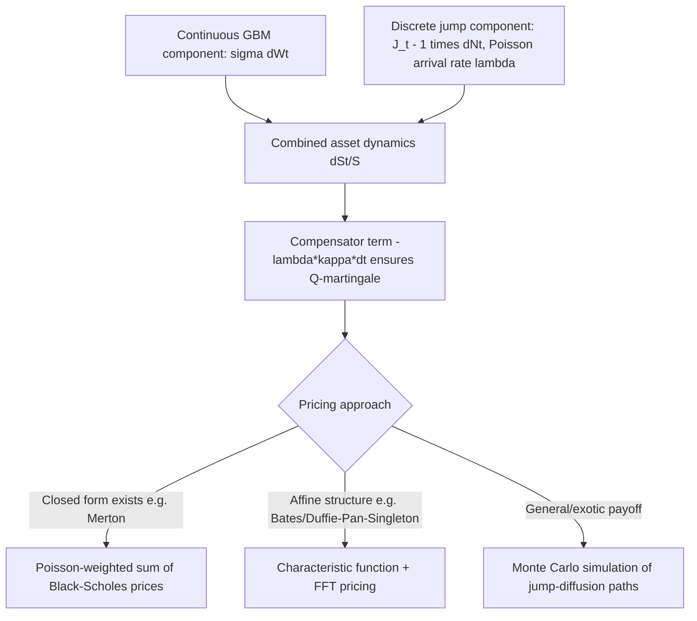

## Jump-Diffusion Processes in Asset Pricing

### Overview

Jump-diffusion processes augment continuous Brownian-motion-driven models with discontinuous jumps, capturing sudden, discrete price movements (earnings surprises, defaults, macro shocks) that pure diffusion models cannot reproduce. These models generate fat-tailed return distributions and volatility smiles/skews consistent with observed option markets, addressing well-documented empirical shortcomings of the Black-Scholes-Merton framework.

### Motivation: Limitations of Pure Diffusion Models

**Key Points**

- Geometric Brownian motion (GBM) produces log-normal returns with thin tails, but empirical asset returns exhibit excess kurtosis (fat tails) and negative skewness
- GBM-based models (Black-Scholes) imply a flat implied volatility surface across strikes; observed markets show a pronounced "smile" or "skew" that pure diffusion cannot generate
- Continuous-path diffusions cannot produce sudden large moves over infinitesimally short time intervals — a mathematical property called path continuity — whereas real markets exhibit gaps (e.g., overnight jumps, flash crashes)
- Jump-diffusion models address these issues by adding a compound Poisson jump component to the diffusion, directly injecting discontinuities and heavier tails into the return distribution

### The Poisson Process: Modeling Jump Arrivals

A Poisson process $N_t$ counts the number of jump events up to time $t$, with intensity (rate) $\lambda$:

$$P(N_{t+\Delta t} - N_t = 1) = \lambda \Delta t + o(\Delta t), \quad P(N_{t+\Delta t} - N_t \geq 2) = o(\Delta t)$$

**Key Points**

- $E[N_t] = \lambda t$; jump arrival times are exponentially distributed with mean $1/\lambda$ between jumps
- $dN_t$ takes value $1$ with probability $\lambda\,dt$ and $0$ otherwise (in the infinitesimal limit), analogous to how $dW_t$ characterizes Brownian increments
- The compensated Poisson process $\tilde{N}_t = N_t - \lambda t$ is a martingale — this compensation is essential for constructing valid jump-diffusion SDEs and pricing formulas

### Merton's Jump-Diffusion Model (1976)

The canonical jump-diffusion model for the underlying asset:

$$\frac{dS_t}{S_{t^-}} = (\mu - \lambda \kappa)\, dt + \sigma\, dW_t + (J_t - 1)\, dN_t$$

or in log form:

$$d\ln S_t = \left(\mu - \tfrac{1}{2}\sigma^2 - \lambda\kappa\right) dt + \sigma\, dW_t + \ln J_t \, dN_t$$

where:

- $N_t$ is a Poisson process with intensity $\lambda$
- $J_t$ is the (random) jump multiplier, typically $\ln J_t \sim N(\mu_J, \sigma_J^2)$ (log-normal jump sizes)
- $\kappa = E[J_t - 1] = e^{\mu_J + \sigma_J^2/2} - 1$ (expected percentage jump size)
- $S_{t^-}$ denotes the price just before a potential jump

**Key Points**

- The term $-\lambda\kappa\, dt$ is the **compensator**, ensuring the discounted asset price remains a martingale under the risk-neutral measure despite the added jump component
- Between jumps, $S_t$ behaves exactly like GBM; at each jump arrival, $S_t$ multiplies discontinuously by $J_t$
- Merton's original specification assumes jump risk is diversifiable/idiosyncratic, allowing the jump component to retain its physical-measure distribution even under the risk-neutral measure — a simplifying (and debated) assumption

### Ito's Lemma for Jump-Diffusion Processes

For a jump-diffusion $X_t$ and twice-differentiable function $f$, the extended Ito's lemma includes both the continuous Ito correction and a discrete jump term:

$$df(X_t) = \left(f_t + \mu f_x + \tfrac{1}{2}\sigma^2 f_{xx}\right) dt + \sigma f_x\, dW_t + \left[f(X_{t^-} + \Delta X_t) - f(X_{t^-})\right] dN_t$$

**Key Points**

- The jump term captures the *actual* change in $f$ across the discontinuity, not a linearized (Taylor) approximation — this distinguishes it fundamentally from the continuous diffusion terms
- This extended lemma is essential for deriving the PDE (more precisely, the partial integro-differential equation, PIDE) governing derivative prices under jump-diffusion dynamics

### Partial Integro-Differential Equation (PIDE) for Option Pricing

Under Merton's model, the option price $V(t,S)$ satisfies a PIDE rather than a pure PDE:

$$V_t + (r - \lambda\kappa)S V_S + \tfrac{1}{2}\sigma^2 S^2 V_{SS} - rV + \lambda \int_{-\infty}^{\infty} \left[V(t, Se^y) - V(t,S)\right] f_J(y)\, dy = 0$$

where $f_J(y)$ is the density of the log-jump size.

**Key Points**

- The integral term accounts for the expected change in option value due to a potential jump, weighted by jump probability and jump-size distribution
- This is a **non-local** equation: the option value at $S$ depends on option values at *all* other price levels $Se^y$ reachable by a jump, not just infinitesimally nearby prices as in the diffusion-only PDE
- Numerically solving PIDEs requires specialized methods (e.g., Fourier/FFT-based approaches, or finite-difference schemes with jump-integral discretization) — noticeably more complex than standard finite-difference PDE solvers

### Merton's Closed-Form Option Pricing Formula

Under the assumption that jump risk is diversifiable (zero jump risk premium), Merton derived a closed-form solution as a Poisson-weighted mixture of Black-Scholes prices:

$$C_{JD} = \sum_{n=0}^{\infty} \frac{e^{-\lambda' T}(\lambda' T)^n}{n!} \, C_{BS}(S_0, K, T, r_n, \sigma_n)$$

where $\lambda' = \lambda(1+\kappa)$, and the adjusted rate and volatility for $n$ jumps are:

$$\sigma_n^2 = \sigma^2 + \frac{n\sigma_J^2}{T}, \quad r_n = r - \lambda\kappa + \frac{n\ln(1+\kappa)}{T}$$

**Example**

```python
import numpy as np
from scipy.stats import norm

def bs_call(S, K, T, r, sigma):
    d1 = (np.log(S/K) + (r + 0.5*sigma**2)*T) / (sigma*np.sqrt(T))
    d2 = d1 - sigma*np.sqrt(T)
    return S*norm.cdf(d1) - K*np.exp(-r*T)*norm.cdf(d2)

def merton_jump_diffusion_call(S0, K, T, r, sigma, lam, mu_j, sigma_j, n_terms=50):
    kappa = np.exp(mu_j + 0.5*sigma_j**2) - 1
    lam_prime = lam * (1 + kappa)
    price = 0.0
    for n in range(n_terms):
        poisson_weight = np.exp(-lam_prime*T) * (lam_prime*T)**n / np.math.factorial(n)
        sigma_n = np.sqrt(sigma**2 + n*sigma_j**2/T)
        r_n = r - lam*kappa + n*np.log(1+kappa)/T
        price += poisson_weight * bs_call(S0, K, T, r_n, sigma_n)
    return price
```

**Key Points**

- The series converges rapidly in practice because Poisson weights decay factorially, so truncating at 30-50 terms is standard
- This formula is a rare instance of a closed-form solution for a jump-diffusion model — most extensions (stochastic volatility with jumps, correlated jumps) require numerical methods (Fourier transform pricing, Monte Carlo)

### Risk-Neutral Pricing with Jump Risk: Incomplete Markets

**Key Points**

- Jump-diffusion models are generically **incomplete markets** — jump risk cannot be perfectly hedged using only the underlying and a risk-free bond, because a discrete jump cannot be replicated by continuous trading (unlike diffusion risk, which delta-hedging eliminates)
- By the Second Fundamental Theorem of Asset Pricing, incompleteness implies the risk-neutral measure is not unique — there are infinitely many EMMs consistent with no-arbitrage, differing in how they price jump risk
- Merton's original assumption (jump risk is diversifiable, earns no risk premium) is one particular, economically restrictive choice among many valid EMMs
- More general approaches (Esscher transform, minimal entropy martingale measure, utility-indifference pricing) select a specific EMM based on additional economic criteria, and typically calibrate the jump risk premium to match observed option prices rather than deriving it from equilibrium

### Kou's Double-Exponential Jump-Diffusion Model

An alternative, widely used specification replaces Merton's Gaussian jump-size distribution with an asymmetric double-exponential distribution:

$$f_J(y) = p\cdot \eta_1 e^{-\eta_1 y}\mathbb{1}_{y \geq 0} + (1-p)\cdot \eta_2 e^{\eta_2 y}\mathbb{1}_{y < 0}$$

**Key Points**

- Allows different magnitudes and probabilities for upward vs downward jumps — useful for capturing the empirically observed asymmetry (larger, more frequent negative jumps in equity indices, e.g., crash risk)
- Retains analytical tractability for pricing certain path-dependent options (barrier, lookback) via the memoryless property of the exponential distribution — a key advantage over Merton's Gaussian-jump specification
- Widely used in credit risk and equity derivatives modeling where downside jump asymmetry matters

### Affine Jump-Diffusion Models (Bates, Duffie-Pan-Singleton)

Combining stochastic volatility (Heston-style) with jumps produces affine jump-diffusion (AJD) models, e.g., the **Bates model**:

$$dS_t = (r - \lambda\kappa) S_t\, dt + \sqrt{v_t}\, S_t\, dW_t^S + (J_t - 1)S_{t^-}\, dN_t$$


$$dv_t = \kappa_v(\theta - v_t)\, dt + \sigma_v \sqrt{v_t}\, dW_t^v$$

**Key Points**

- "Affine" refers to the model structure permitting closed-form (or semi-closed-form, via characteristic functions and Fourier inversion) option pricing despite the added complexity
- These models jointly address two separate empirical failures of Black-Scholes: volatility clustering/smile dynamics (via stochastic volatility) and sudden discontinuous moves (via jumps)
- Characteristic-function-based pricing (Carr-Madan FFT method) is the standard computational approach for AJD models, since direct PDE/PIDE solution becomes intractable with multiple state variables

### Diagram: Jump-Diffusion Path Structure



### Diagram: Continuous Diffusion vs Jump-Diffusion Path (svg_diagram)

<svg xmlns="http://www.w3.org/2000/svg" viewBox="0 0 640 260">
<text x="320" y="24" text-anchor="middle" font-size="16" font-weight="bold" fill="#1a1a2e">Continuous Diffusion vs Jump-Diffusion Path (svg_diagram)</text>
<line x1="50" y1="230" x2="600" y2="230" stroke="#333" stroke-width="1" />
<text x="600" y="245" font-size="10" fill="#333">time</text>

<path d="M 50 150 C 100 140, 150 130, 200 135 S 300 120, 350 128 S 450 110, 500 115 S 570 100, 600 105" fill="none" stroke="`#4338ca`" stroke-width="2.5" />

<text x="420" y="90" font-size="11" fill="`#4338ca`" font-weight="bold">Pure diffusion (GBM): continuous path</text>

<path d="M 50 200 C 100 195, 150 190, 200 192" fill="none" stroke="#b45309" stroke-width="2.5" />
<line x1="200" y1="192" x2="200" y2="150" stroke="#b45309" stroke-width="2.5" stroke-dasharray="3,2" />
<path d="M 200 150 C 250 145, 300 148, 350 150" fill="none" stroke="#b45309" stroke-width="2.5" />
<line x1="350" y1="150" x2="350" y2="190" stroke="#b45309" stroke-width="2.5" stroke-dasharray="3,2" />
<path d="M 350 190 C 420 185, 480 175, 540 178" fill="none" stroke="#b45309" stroke-width="2.5" />
<text x="420" y="205" font-size="11" fill="#b45309" font-weight="bold">Jump-diffusion: discontinuous jumps at random times</text>
<circle cx="200" cy="150" r="4" fill="#b45309" />
<circle cx="350" cy="190" r="4" fill="#b45309" />
</svg>

### Calibration Considerations

**Key Points**

- Jump-diffusion parameters ($\lambda$, $\mu_J$, $\sigma_J$) are typically calibrated jointly to the implied volatility surface (short-dated options are especially informative about jump risk, since diffusion alone struggles to fit short-maturity smile steepness)
- [Inference] Short-maturity smile behavior is often the primary calibration target for jump parameters because diffusion-only models generate implied volatility surfaces that flatten too quickly at short maturities relative to what's observed empirically — though the exact calibration weighting scheme varies by practitioner and desk
- Historical (physical-measure) jump estimation via return time-series (e.g., threshold-based jump detection, bipower variation) generally yields different parameter estimates than risk-neutral (option-implied) calibration, reflecting the jump risk premium

### Common Pitfalls

**Key Points**

- Forgetting the compensator term $-\lambda\kappa\,dt$ when specifying jump-diffusion dynamics under $Q$ — omitting it breaks the martingale property of the discounted price process
- Treating jump-diffusion markets as complete and attempting perfect delta-hedging — jump risk is fundamentally unhedgeable with the underlying alone, a structurally different situation from Black-Scholes
- Using Merton's Gaussian jump-size assumption in contexts with clear jump asymmetry (crash risk) without checking whether an asymmetric specification (Kou model) fits better
- Applying standard finite-difference PDE solvers designed for pure diffusion directly to jump-diffusion PIDEs without accounting for the non-local integral term, which requires materially different numerical treatment

### Conclusion

Jump-diffusion processes extend continuous-time asset pricing models to capture discontinuous price movements and fat-tailed, skewed return distributions that pure diffusion models cannot replicate. Merton's foundational model provides tractable closed-form pricing under a simplifying diversifiable-jump-risk assumption, while later extensions (Kou, Bates, affine jump-diffusion frameworks) address asymmetry, stochastic volatility, and market incompleteness more realistically at the cost of requiring more sophisticated numerical machinery (PIDEs, Fourier/FFT methods, Monte Carlo simulation).

**Related Topics**

- Ito's lemma and stochastic integration
- Risk-neutral valuation and market incompleteness
- Stochastic volatility models (Heston)
- Characteristic function methods and Fourier-based option pricing (Carr-Madan)
- Volatility smile and skew modeling
- Levy processes (variance gamma, CGMY models)
- Credit risk modeling via jump processes (structural and reduced-form models)
- Monte Carlo simulation of jump-diffusion paths