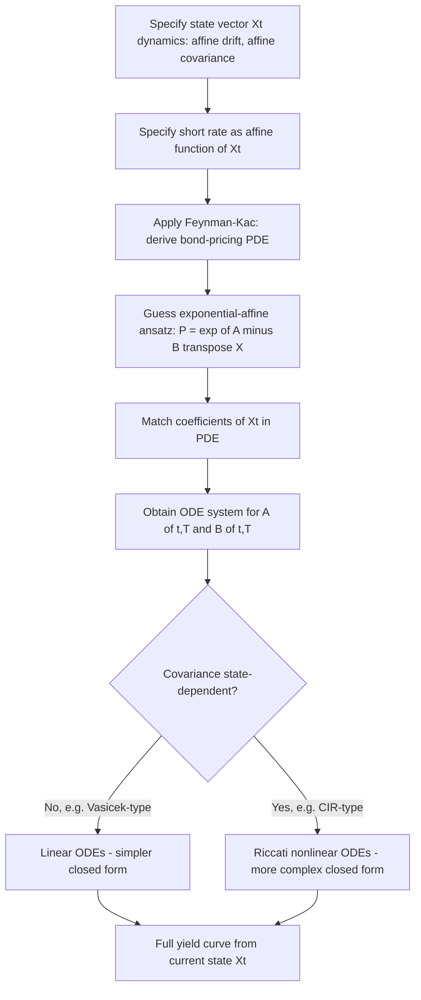

## Affine Term Structure Models

### Overview

Affine term structure models (ATSMs) are a general class of interest rate models in which bond yields are affine (linear plus constant) functions of a set of underlying state variables (factors), and the short rate itself is an affine function of those same factors. This structure guarantees closed-form or semi-closed-form solutions for zero-coupon bond prices via systems of ordinary differential equations, making ATSMs the dominant analytical framework for term structure modeling. Vasicek and CIR are the canonical single-factor special cases; the general framework, formalized by Duffie and Kan (1996), extends to multi-factor models widely used in both academia and practice.

### The Defining Affine Structure

A model is affine if the short rate is an affine function of an $n$-dimensional state vector $\mathbf{X}_t$:

$$r_t = \delta_0 + \boldsymbol{\delta}_1^\top \mathbf{X}_t$$

and zero-coupon bond prices take the exponential-affine form:

$$P(t,T) = \exp\left[A(t,T) - \mathbf{B}(t,T)^\top \mathbf{X}_t\right]$$

**Key Points**

- "Affine" refers to the *log* bond price being linear in the state variables — the bond price itself is exponential-affine, not linear
- $A(t,T)$ is a scalar function and $\mathbf{B}(t,T)$ is an $n$-vector, both depending only on time-to-maturity and model parameters, not on the current state $\mathbf{X}_t$
- Once $A(t,T)$ and $\mathbf{B}(t,T)$ are known (from solving a system of ODEs), the entire yield curve at any date can be computed by simply plugging in the current state vector — this is the source of the framework's computational power

### Duffie-Kan Characterization

Duffie and Kan (1996) formally characterized which state-variable dynamics are consistent with an affine term structure. The state vector must follow an affine diffusion:

$$d\mathbf{X}_t = \boldsymbol{\mu}(\mathbf{X}_t)\, dt + \Sigma(\mathbf{X}_t)\, d\mathbf{W}_t$$

where the drift $\boldsymbol{\mu}(\mathbf{X}_t)$ is affine in $\mathbf{X}_t$, and the instantaneous covariance $\Sigma(\mathbf{X}_t)\Sigma(\mathbf{X}_t)^\top$ is affine in $\mathbf{X}_t$ (i.e., linear in the state plus a constant matrix).

**Key Points**

- This dual affine requirement (affine drift AND affine covariance) is the precise mathematical condition ensuring the bond-pricing PDE reduces to a solvable system of Riccati ODEs for $A(t,T)$ and $\mathbf{B}(t,T)$
- Vasicek satisfies this with constant covariance $\sigma^2$ (affine trivially, since it doesn't depend on $\mathbf{X}_t$ at all)
- CIR satisfies this with covariance $\sigma^2 r_t$ — linear in the state, hence affine
- Models violating this condition (e.g., volatility proportional to $r_t^{3/2}$ or $r_t^2$) do not admit closed-form affine solutions and require fundamentally different (typically purely numerical) pricing approaches

### The General ODE System

Applying the Feynman-Kac formula to the bond-pricing problem under the affine dynamics yields a system of ODEs (via matching coefficients of the affine ansatz into the PDE):

$$\frac{\partial B_i}{\partial t} = -\delta_{1,i} + (\text{terms linear and quadratic in } \mathbf{B})$$

$$\frac{\partial A}{\partial t} = -\delta_0 + (\text{terms involving } \mathbf{B})$$

with boundary conditions $A(T,T) = 0$, $\mathbf{B}(T,T) = \mathbf{0}$.

**Key Points**

- The ODEs for $\mathbf{B}(t,T)$ are generally **Riccati equations** (containing quadratic terms in $B_i$) whenever the covariance structure depends on the state — this is exactly the CIR case
- When covariance is constant (no state-dependence, as in Vasicek), the Riccati quadratic term vanishes and the ODE for $B$ becomes linear — explaining why Vasicek's solution is comparatively simpler than CIR's
- These ODEs typically admit closed-form solutions for one- and two-factor models but may require numerical ODE solving for higher-dimensional or more complex specifications — still vastly cheaper than solving the original PDE directly

### Classification: Completely Affine vs Essentially Affine

**Key Points**

- **Completely affine models** (Duffie-Kan's original framework) restrict the market price of risk to be proportional to $\sqrt{\mathbf{X}_t}$ (or the relevant volatility structure), preserving affine dynamics under both the physical measure $P$ and risk-neutral measure $Q$
- **Essentially affine models** (Duffee, 2002) relax this restriction, allowing more flexible market price of risk specifications while still preserving affine bond pricing under $Q$ — this materially improves empirical fit to historical bond risk premia, which completely affine models struggled to replicate
- [Inference] The shift from completely affine to essentially affine specifications is generally considered a significant empirical improvement in the term structure literature, primarily because it allows the sign and magnitude of risk premia to vary more flexibly across the yield curve and over time, addressing well-documented failures of completely affine models in explaining expectations-hypothesis violations

### Multi-Factor Affine Models

Extending to $n$ factors allows richer yield curve dynamics (level, slope, curvature shifts) that single-factor models cannot capture.

**Example**

A two-factor Gaussian affine model (a generalization of Vasicek):

$$r_t = \delta_0 + X_{1,t} + X_{2,t}$$

$$dX_{1,t} = -a_1 X_{1,t}\, dt + \sigma_1\, dW_{1,t}$$

$$dX_{2,t} = -a_2 X_{2,t}\, dt + \sigma_2\, dW_{2,t}, \quad dW_1 dW_2 = \rho\, dt$$

**Key Points**

- Two factors with different mean-reversion speeds can jointly generate realistic level and slope dynamics — a single-factor model (Vasicek/CIR) forces perfect correlation across all points of the curve, which multi-factor models relax
- Three-factor models are common in practice (often interpreted, post-estimation, as level/slope/curvature factors analogous to principal components of yield curve movements)
- Correlation structure $\rho$ between factors adds additional flexibility but also additional parameters to estimate/calibrate

### Diagram: Affine Model Construction Pipeline

### Diagram: Single-Factor vs Multi-Factor Yield Curve Flexibility (svg_diagram)

<svg xmlns="http://www.w3.org/2000/svg" viewBox="0 0 640 280">
<text x="320" y="24" text-anchor="middle" font-size="16" font-weight="bold" fill="#1a1a2e">Single-Factor vs Multi-Factor Yield Curve Flexibility (svg_diagram)</text>
<line x1="50" y1="240" x2="290" y2="240" stroke="#333" stroke-width="1" />
<line x1="50" y1="60" x2="50" y2="240" stroke="#333" stroke-width="1" />
<text x="150" y="255" font-size="10" fill="#333">maturity</text>
<text x="480" y="255" font-size="10" fill="#333">maturity</text>
<path d="M 50 200 C 100 170, 180 130, 290 100" fill="none" stroke="#4338ca" stroke-width="2.5" />
<path d="M 50 180 C 100 155, 180 120, 290 95" fill="none" stroke="#4338ca" stroke-width="2" stroke-dasharray="4,3" opacity="0.6" />
<path d="M 50 220 C 100 185, 180 140, 290 105" fill="none" stroke="#4338ca" stroke-width="2" stroke-dasharray="4,3" opacity="0.6" />
<text x="90" y="80" font-size="11" fill="#4338ca" font-weight="bold">Single-factor: shifts move</text>
<text x="90" y="94" font-size="11" fill="#4338ca" font-weight="bold">curve almost in parallel</text>
<line x1="380" y1="240" x2="620" y2="240" stroke="#333" stroke-width="1" />
<line x1="380" y1="60" x2="380" y2="240" stroke="#333" stroke-width="1" />
<path d="M 380 200 C 430 175, 500 140, 620 100" fill="none" stroke="#b45309" stroke-width="2.5" />
<path d="M 380 180 C 430 190, 500 130, 620 80" fill="none" stroke="#b45309" stroke-width="2" stroke-dasharray="4,3" opacity="0.7" />
<path d="M 380 210 C 430 160, 500 165, 620 140" fill="none" stroke="#b45309" stroke-width="2" stroke-dasharray="4,3" opacity="0.7" />
<text x="410" y="80" font-size="11" fill="#b45309" font-weight="bold">Multi-factor: level, slope,</text>
<text x="410" y="94" font-size="11" fill="#b45309" font-weight="bold">curvature move independently</text>
</svg>

### Affine Term Structure Models Beyond Interest Rates

**Key Points**

- The affine framework extends naturally to **affine jump-diffusions (AJDs)**, adding jump components while preserving closed-form (or characteristic-function-based) pricing — Duffie, Pan, and Singleton (2000) generalized the Duffie-Kan framework to include jumps
- Affine structures underpin much of modern derivatives pricing beyond fixed income: the Heston stochastic volatility model, the Bates model (Heston plus jumps), and various credit risk models (affine intensity-based default models) all exploit the same "state variable is affine, transform is exponential-affine" machinery
- Pricing under AJDs typically uses the **characteristic function** (available in closed form for affine models) combined with Fourier inversion techniques (e.g., Carr-Madan FFT method) rather than direct PDE solution, especially for European-style payoffs

### Estimation of Affine Term Structure Models

**Key Points**

- Common estimation approaches: Kalman filtering (when factors are treated as latent/unobserved state variables, exploiting the model's linear-Gaussian or approximately linear-Gaussian structure), Generalized Method of Moments (GMM), and Efficient Method of Moments (EMM)
- Cross-sectional fitting (matching the model to an entire observed yield curve at a point in time) versus time-series estimation (matching historical dynamics) can produce different parameter estimates, analogous to the physical-vs-risk-neutral parameter distinction seen in Vasicek/CIR estimation
- [Unverified] Identification issues (multiple parameter combinations producing very similar fitted yield curves) are a well-documented challenge in estimating multi-factor affine models; the specific severity depends on the number of factors, data frequency, and estimation method used, and is an active area of methodological research

### Common Pitfalls

**Key Points**

- Assuming any nonlinear-volatility short-rate model can be forced into affine form — the Duffie-Kan conditions (affine drift AND affine covariance) are necessary; models with genuinely nonlinear covariance structure (e.g., certain quadratic-volatility specifications) fall outside the affine class entirely and require different techniques (quadratic term structure models, purely numerical methods)
- Confusing completely affine and essentially affine specifications when interpreting estimated risk premia — using a completely affine model's restrictive risk-premium structure to draw conclusions about the shape/sign of the term premium can produce misleading results relative to essentially affine specifications
- Treating single-factor affine models as adequate for products sensitive to yield curve *shape* changes (e.g., curve steepener trades, butterfly spreads) — these require multi-factor models to be priced/hedged sensibly
- Overlooking negative-rate constraints when combining CIR-type (non-negative) and Vasicek-type (unrestricted) factors within the same multi-factor affine model — the aggregate short rate's sign properties depend on how factors combine, not just on any single factor's properties

### Conclusion

Affine term structure models provide the unifying mathematical framework beneath Vasicek, CIR, Hull-White, and their multi-factor generalizations, characterized by the Duffie-Kan conditions on drift and covariance affinity. This structure guarantees that bond prices remain exponential-affine functions of the state vector, reducing the term structure pricing problem to solving a tractable system of ODEs rather than a full PDE or high-dimensional numerical scheme. The framework's extensions — essentially affine risk premia, affine jump-diffusions, and multi-factor specifications — address the empirical and structural limitations of the original single-factor models while preserving the core computational tractability that makes affine models the dominant paradigm in both academic term structure research and practical fixed-income derivatives pricing.

**Related Topics**

- The Vasicek model
- The Cox-Ingersoll-Ross model
- The Feynman-Kac formula
- Hull-White model and initial curve fitting
- Duffie-Pan-Singleton affine jump-diffusion framework
- Heston stochastic volatility model
- Quadratic term structure models
- Kalman filtering for latent factor estimation