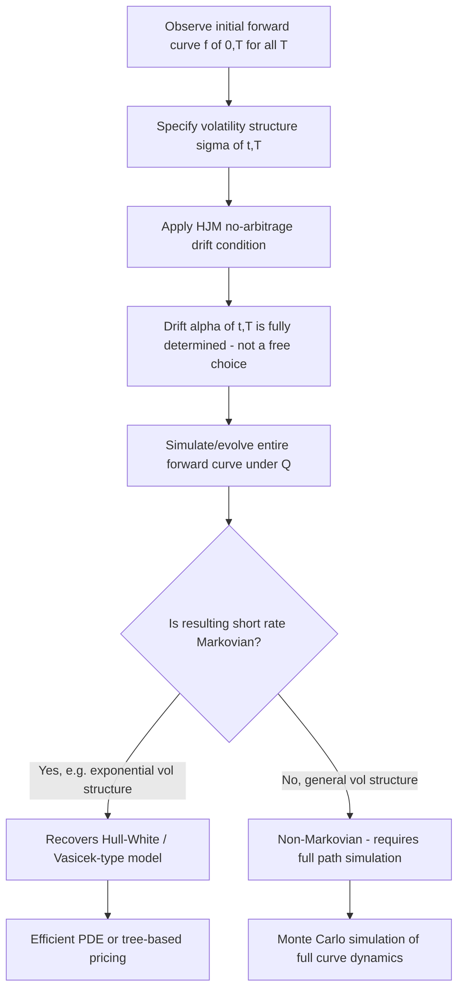

## The Heath-Jarrow-Morton Framework

### Overview

The Heath-Jarrow-Morton (HJM) framework, introduced in 1992, models the entire forward-rate curve directly as an infinite-dimensional stochastic process, rather than modeling a single short rate and deriving the curve from it. Its central result — the HJM drift condition — shows that under the risk-neutral measure, the drift of every forward rate is fully determined by its volatility structure, eliminating drift as a free modeling choice. This makes HJM not a single model but a unifying framework: essentially all short-rate models (Vasicek, CIR, Hull-White) can be recovered as special cases, and the framework is, by construction, automatically consistent with any initial observed yield curve.

### Motivation: Limitations of Short-Rate Models

**Key Points**

- Short-rate models (Vasicek, CIR) specify dynamics for $r_t$ alone and derive the entire term structure from it — this can force restrictive relationships between rates of different maturities and generally cannot fit an arbitrary initial yield curve exactly without extensions (e.g., Hull-White's time-dependent drift)
- HJM instead takes the entire initial forward-rate curve $f(0,T)$ for all $T$ as a direct, exogenous input — so the model matches the initial term structure **by construction**, with no fitting step required
- This shifts the modeling problem from "what is the risk-neutral short-rate process?" to "what is the risk-neutral dynamics of every forward rate, and how must these dynamics be linked?"

### Forward Rate Dynamics

Define $f(t,T)$ as the instantaneous forward rate at time $t$ for borrowing at future time $T$. HJM postulates that under the real-world (or risk-neutral) measure, each forward rate evolves as an Ito process:

$$df(t,T) = \alpha(t,T)\, dt + \sigma(t,T)\, dW_t$$

where $\alpha(t,T)$ is the drift and $\sigma(t,T)$ is the volatility, both potentially depending on the entire path of rates up to $t$, and $T$ is a fixed future maturity (so $t$ is the only "moving" time variable).

**Key Points**

- This is a curve of infinitely many correlated stochastic processes — one $f(t,T)$ for every maturity $T$ — all driven by the same (possibly multi-dimensional) Brownian motion(s)
- The short rate is recovered as the special case $r_t = f(t,t)$ — the instantaneous forward rate for immediate borrowing
- Zero-coupon bond prices relate to forward rates via $P(t,T) = \exp\left(-\int_t^T f(t,s)\, ds\right)$

### The HJM Drift Condition

**Key Points**

- This is the central and most important result of the framework: under the risk-neutral measure $Q$, the drift $\alpha(t,T)$ of each forward rate is **not a free parameter** — it is uniquely determined by the volatility function $\sigma(t,T)$
- This mirrors, at the level of an entire curve, the same phenomenon Girsanov's theorem produces for a single asset: absence of arbitrage pins down the risk-neutral drift once volatility is specified

The HJM no-arbitrage drift restriction under $Q$ (single-factor case):

$$\alpha(t,T) = \sigma(t,T) \int_t^T \sigma(t,s)\, ds$$

**Example**

Derivation sketch: since $P(t,T) = \exp\left(-\int_t^T f(t,s)ds\right)$ must have $e^{-\int_0^t r_u du}P(t,T)$ as a $Q$-martingale (standard no-arbitrage requirement), applying Ito's lemma to $\ln P(t,T)$ and matching the drift to zero (after discounting) forces $\alpha(t,T)$ into the integral form above — a direct consequence of the same no-arbitrage replication logic used to derive the Black-Scholes PDE, applied here to the entire forward curve simultaneously.

**Key Points**

- Once $\sigma(t,T)$ is specified (the volatility structure — how volatile each forward-rate maturity is, and how they correlate), the entire risk-neutral drift structure for the whole curve is determined; there is no additional freedom to specify drift independently
- This means **calibrating an HJM model reduces to specifying a volatility function**, since the drift is derived, not chosen
- The multi-factor extension replaces the single integral with a sum/integral over $n$ independent Brownian motions, each with its own volatility function $\sigma_i(t,T)$

### Recovering Short-Rate Models as HJM Special Cases

**Example**

Choosing a deterministic, maturity-independent volatility $\sigma(t,T) = \sigma$ (constant) in the HJM framework recovers a Ho-Lee-type model for the short rate. Choosing an exponentially decaying volatility structure:

$$\sigma(t,T) = \sigma\, e^{-a(T-t)}$$

recovers exactly the **Hull-White (extended Vasicek) model** for the short rate, with the same mean-reversion parameter $a$ appearing in the exponential decay of forward-rate volatility.

**Key Points**

- This demonstrates HJM's role as a unifying meta-framework: Vasicek, Hull-White, and Ho-Lee are not competitors to HJM but specific volatility-structure choices within it
- The correspondence works in both directions: any Markovian short-rate model with a given volatility structure can, in principle, be re-derived as an HJM model with a matching $\sigma(t,T)$ specification
- Recovering short-rate Markovian dynamics from a general HJM specification is non-trivial in general — most volatility structures produce **non-Markovian** forward-rate dynamics, meaning the future evolution depends on the entire path history, not just the current short rate

### The Non-Markovian Problem and Practical Implementation

**Key Points**

- For general volatility specifications $\sigma(t,T)$, the resulting short-rate process is non-Markovian — the future distribution of $f(t,T)$ depends on the entire history of the process, not merely its current value
- This makes naive Monte Carlo simulation of general HJM models computationally expensive: since the process isn't Markovian in a low-dimensional state, one typically must simulate and store the entire forward curve at each time step (or use path-dependent state variables), rather than a small number of state variables
- Specific volatility structures (e.g., separable/exponential forms, as in Hull-White) restore Markovian behavior in a finite-dimensional state — this is precisely why such specifications are preferred for computational tractability despite HJM's general framework allowing far richer volatility structures
- The **Libor Market Model (LMM/BGM model)** is a related, closely connected framework that models discrete forward LIBOR/SOFR rates (rather than instantaneous forward rates) and is often preferred in practice partly because market-observed volatilities (caplet/floorlet vols) map more directly onto discrete forward rates

### Diagram: HJM Framework Logic

### Diagram: Forward Rate Curve Evolution Under HJM (svg_diagram)

<svg xmlns="http://www.w3.org/2000/svg" viewBox="0 0 640 280">
<text x="320" y="24" text-anchor="middle" font-size="16" font-weight="bold" fill="#1a1a2e">Forward Rate Curve Evolution Under HJM (svg_diagram)</text>
<line x1="60" y1="240" x2="600" y2="240" stroke="#333" stroke-width="1" />
<line x1="60" y1="40" x2="60" y2="240" stroke="#333" stroke-width="1" />
<text x="600" y="255" font-size="10" fill="#333">maturity T</text>
<text x="30" y="35" font-size="10" fill="#333">f(t,T)</text>
<path d="M 60 190 C 150 150, 250 120, 350 110 S 500 100, 600 95" fill="none" stroke="#4338ca" stroke-width="2.5" />
<text x="420" y="80" font-size="11" fill="#4338ca" font-weight="bold">Curve at t=0 (observed, exogenous)</text>
<path d="M 60 175 C 150 160, 250 135, 350 130 S 500 128, 600 120" fill="none" stroke="#b45309" stroke-width="2.5" stroke-dasharray="5,3" />
<text x="420" y="155" font-size="11" fill="#b45309" font-weight="bold">Curve at t=1 (evolved via drift + vol)</text>
<path d="M 60 200 C 150 190, 250 165, 350 175 S 500 190, 600 155" fill="none" stroke="#15803d" stroke-width="2" stroke-dasharray="2,2" opacity="0.7" />
<text x="420" y="200" font-size="11" fill="#15803d">Curve at t=2 (each maturity shifts</text>
<text x="420" y="214" font-size="11" fill="#15803d">per its own vol + no-arb drift)</text>
</svg>

### Multi-Factor HJM Models

Realistic implementations typically use multiple independent Brownian motions, each with its own volatility function, to capture level, slope, and curvature dynamics:

$$df(t,T) = \alpha(t,T)\, dt + \sum_{i=1}^{n} \sigma_i(t,T)\, dW_t^i$$

with the drift condition generalizing to:

$$\alpha(t,T) = \sum_{i=1}^{n} \sigma_i(t,T) \int_t^T \sigma_i(t,s)\, ds$$

**Key Points**

- Common practical choices include a level factor (roughly parallel-shift volatility), a slope factor (volatility that differs in sign/magnitude between short and long maturities), and sometimes a curvature factor
- Principal component analysis (PCA) of historical yield curve changes is a standard technique for choosing empirically motivated volatility function shapes for each factor
- More factors improve fit to observed cap/swaption volatility surfaces (across strikes and maturities) at the cost of increased calibration and computational complexity

### Relationship to the LIBOR Market Model

**Key Points**

- The Libor Market Model (LMM), also known as the BGM model (Brace-Gatarek-Musiela), can be viewed as a discrete-tenor analogue of HJM applied directly to observable forward LIBOR/SOFR rates rather than instantaneous forward rates
- LMM's key practical advantage: forward rate volatilities in LMM correspond directly to market-quoted caplet volatilities (Black's formula), making calibration to the cap/floor market more direct than in continuous-time HJM
- Since the 2021-2023 LIBOR transition, LMM-type frameworks have been adapted to SOFR and other risk-free rates (RFRs), typically modeling compounded or term SOFR rates rather than LIBOR directly — the underlying HJM-style no-arbitrage machinery carries over with adjustments for the different rate-fixing conventions
- [Unverified] The specific market-standard conventions for post-LIBOR term rate modeling continue to evolve, and implementation details vary by institution; practitioners should verify current conventions against up-to-date market documentation rather than assuming older LIBOR-era conventions apply unchanged

### Calibration in Practice

**Key Points**

- Because HJM automatically fits the initial curve, calibration effort focuses entirely on the volatility structure — matching model-implied cap, floor, and swaption prices/volatilities to observed market quotes
- Parametric volatility function choices (e.g., $\sigma(t,T) = \sigma e^{-a(T-t)}$, or more flexible piecewise/parametric forms) trade off calibration flexibility against the risk of overfitting or producing implausible forward volatility term structures
- [Inference] A common practical approach separates calibration into a "term structure of volatility" component (fit to at-the-money instruments across maturities) and a "smile/skew" component (fit to away-from-the-money strikes), though the precise calibration methodology is desk-and-product-specific rather than a single universal standard

### Common Pitfalls

**Key Points**

- Attempting to specify both drift and volatility independently for forward rates under $Q$ — this violates the HJM no-arbitrage drift condition and produces internally inconsistent (arbitrageable) dynamics
- Assuming an arbitrary volatility structure will produce tractable, Markovian short-rate dynamics — most choices do not, and naive implementation can lead to computationally expensive full-curve simulation where a simpler Markovian model would have sufficed
- Confusing HJM (a framework for modeling forward-rate/short-rate dynamics under no-arbitrage) with a single specific model — practitioners sometimes use "the HJM model" imprecisely when they mean a specific volatility-structure instance (e.g., Ho-Lee or an exponential-decay specification)
- Overlooking that fitting the *initial* curve automatically (HJM's key advantage) does not by itself guarantee good fit to the *volatility* surface (caps, floors, swaptions) — that still requires careful choice and calibration of $\sigma(t,T)$

### Conclusion

The Heath-Jarrow-Morton framework represents a paradigm shift from modeling a single short rate to modeling the entire forward-rate curve directly, with the profound theoretical result that no-arbitrage fully determines drift once volatility is specified. This makes HJM a unifying meta-framework encompassing Vasicek, Hull-White, and Ho-Lee as special cases distinguished only by their volatility function choices, while automatically guaranteeing consistency with any observed initial term structure — at the cost of generally non-Markovian dynamics that complicate numerical implementation unless volatility structures are chosen carefully.

**Related Topics**

- The Vasicek model
- The Cox-Ingersoll-Ross model
- Affine term structure models
- Hull-White model as an HJM special case
- LIBOR Market Model (LMM/BGM) and SOFR term rate models
- Girsanov's theorem and no-arbitrage drift restrictions
- Principal component analysis of yield curve dynamics
- Calibration to caps, floors, and swaptions