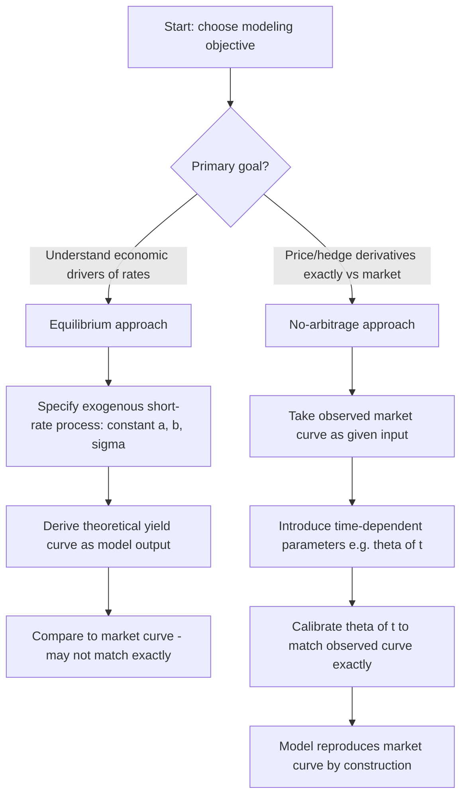

## No-Arbitrage versus Equilibrium Term Structure Models

### Overview

Term structure models divide into two philosophically distinct families based on how they treat the initial yield curve: **equilibrium models** derive the term structure endogenously from assumptions about economic fundamentals (short-rate dynamics, risk preferences), typically producing a curve that may not match observed market prices exactly; **no-arbitrage models** instead take the initial observed curve as a given input and construct dynamics that are automatically consistent with it, prioritizing exact pricing consistency over economic derivation. Understanding this distinction clarifies why models like Vasicek and CIR differ fundamentally in purpose from models like Hull-White and HJM, despite sharing similar mathematical machinery.

### Equilibrium Models: Philosophy and Structure

**Key Points**

- Equilibrium models start from assumptions about the economy — investor preferences, production technology, or exogenously specified short-rate dynamics — and *derive* the term structure as an output
- The short rate (and sometimes the market price of risk) is specified directly as an exogenous stochastic process, typically with a small, fixed, time-homogeneous set of parameters (e.g., $a$, $b$, $\sigma$ in Vasicek)
- Because the model is fully specified by a handful of constant parameters, it generally **cannot exactly reproduce an arbitrary observed initial yield curve** — the model-implied curve is what it is, and market curves that don't match represent either model misspecification or (in some interpretations) genuine market inefficiency relative to the model
- Vasicek and CIR are the canonical equilibrium short-rate models

### No-Arbitrage Models: Philosophy and Structure

**Key Points**

- No-arbitrage models take the current observed term structure (and often additional market data like cap/floor or swaption volatilities) as a direct, exogenous **input**, and construct a stochastic process for future rates that is, by construction, consistent with that input
- Time-dependent parameters (e.g., Hull-White's time-varying mean-reversion level $\theta(t)$) are the standard mechanism for achieving this exact fit — the model has enough flexibility to match the observed curve exactly, at the cost of parameters that vary with calendar time rather than remaining constant
- Hull-White, Ho-Lee, and the general HJM framework are the canonical no-arbitrage approaches
- The term "no-arbitrage model" reflects that these models are constructed specifically to preclude arbitrage *relative to currently traded instruments* (bonds, caps, swaptions) — not that equilibrium models permit arbitrage (they don't, under their own assumptions); rather, no-arbitrage models are calibrated to guarantee consistency with a specific, given market snapshot

### Side-by-Side Comparison

| Dimension | Equilibrium Models | No-Arbitrage Models |
| --- | --- | --- |
| Starting point | Economic assumptions / exogenous short-rate process | Observed market curve (and often vol surface) |
| Initial curve fit | Approximate (model-implied) | Exact (by construction) |
| Parameters | Constant, time-homogeneous | Often time-dependent (e.g., $\theta(t)$) |
| Primary use case | Understanding rate dynamics, economic interpretation, long-horizon forecasting | Pricing and hedging derivatives relative to today's market |
| Examples | Vasicek, CIR | Hull-White, Ho-Lee, HJM framework, LMM |
| Re-calibration | Parameters relatively stable over time (if model well-specified) | Recalibrated routinely (e.g., daily) as market curve moves |

### Illustrative Example: Vasicek versus Hull-White

**Example**

Vasicek's SDE: $dr_t = a(b - r_t)\,dt + \sigma\,dW_t$, with constant $a, b, \sigma$. Given a specific $(a, b, \sigma, r_0)$, the model produces a single, fully determined theoretical yield curve at $t=0$. If the actual observed market curve differs from this theoretical curve (which it almost always will, since real curves reflect complex supply/demand and policy factors a three-parameter model cannot capture), Vasicek simply does not match the market exactly.

Hull-White's SDE: $dr_t = a(\theta(t) - r_t)\,dt + \sigma\,dW_t$, where $\theta(t)$ is a deterministic function chosen specifically so that the model's theoretical curve at $t=0$ matches the observed market curve exactly, maturity by maturity.

**Key Points**

- $\theta(t)$ is derived directly from the observed forward-rate curve: $\theta(t) = \frac{1}{a}\frac{\partial f(0,t)}{\partial t} + f(0,t) + \frac{\sigma^2}{2a^2}(1-e^{-2at})$, where $f(0,t)$ is today's observed instantaneous forward rate
- This transforms Vasicek from an equilibrium model into a no-arbitrage model with essentially one small structural change (replacing constant $b$ with time-varying $\theta(t)$) — illustrating that the equilibrium/no-arbitrage distinction is often more about *calibration philosophy* than about a fundamentally different mathematical structure
- The same technique (CIR++) extends CIR similarly, and the general principle extends to any equilibrium model via a deterministic shift

### Trade-offs: What Each Approach Sacrifices

**Key Points**

- **Equilibrium models sacrifice exact market consistency** for economic interpretability and structural parsimony — useful for understanding *why* rates behave as they do, testing economic hypotheses (e.g., expectations hypothesis, term premium theories), and long-horizon scenario generation where exact current-curve fit matters less than plausible dynamics
- **No-arbitrage models sacrifice economic interpretability and time-homogeneity** for exact pricing consistency — the time-dependent parameters $\theta(t)$ have no clean economic interpretation (they partly reflect model mechanics needed to fit the curve, not a genuine time-varying economic quantity) and must be recalibrated whenever the market curve shifts
- [Inference] This trade-off is often summarized in the literature as "equilibrium models answer 'why', no-arbitrage models answer 'how much'" — a useful pedagogical framing, though it simplifies a more nuanced reality where the choice also depends heavily on the specific application (risk management vs. trading desk pricing)
- A known practical criticism of no-arbitrage models is that daily recalibration of $\theta(t)$ can implicitly assume time-varying dynamics that aren't economically grounded, potentially leading to inconsistent hedging behavior over time — since the model "resets" its economic story each time it's recalibrated

### Which Approach for Which Purpose

**Key Points**

- **Derivatives trading desks pricing and hedging relative to observed market instruments** (bonds, caps, floors, swaptions) overwhelmingly favor no-arbitrage models — exact consistency with quoted prices is operationally essential, since mispricing relative to liquid instruments creates immediate, exploitable arbitrage against the desk's own book
- **Risk management, economic research, and long-horizon scenario analysis** (e.g., stress testing, asset-liability management, macro-finance research linking rates to the business cycle) more often favor equilibrium models, where structural, economically interpretable parameters support scenario generation and hypothesis testing
- Academic macro-finance research (linking term structure movements to macroeconomic variables, risk premia, and monetary policy) predominantly uses equilibrium-style affine models (often the "essentially affine" class), since the goal is economic understanding rather than exact pricing consistency with any single day's market snapshot

### Diagram: Equilibrium vs No-Arbitrage Model Construction

### Diagram: Curve-Fitting Philosophy Comparison (svg_diagram)

<svg xmlns="http://www.w3.org/2000/svg" viewBox="0 0 640 280">
<text x="320" y="24" text-anchor="middle" font-size="16" font-weight="bold" fill="#1a1a2e">Curve-Fitting Philosophy Comparison (svg_diagram)</text>
<line x1="60" y1="240" x2="290" y2="240" stroke="#333" stroke-width="1" />
<line x1="60" y1="60" x2="60" y2="240" stroke="#333" stroke-width="1" />
<text x="170" y="255" font-size="10" fill="#333">Equilibrium (Vasicek)</text>

<path d="M 60 140 C 100 130, 150 145, 200 135 S 260 150, 290 140" fill="none" stroke="`#4338ca`" stroke-width="2" stroke-dasharray="6,3" />

<text x="70" y="120" font-size="10" fill="`#4338ca`">Market curve (observed)</text>

<path d="M 60 200 C 100 180, 150 160, 200 155 S 260 150, 290 145" fill="none" stroke="`#dc2626`" stroke-width="2.5" />

<text x="70" y="210" font-size="10" fill="`#dc2626`">Model curve (approximate fit)</text>

<line x1="380" y1="240" x2="610" y2="240" stroke="#333" stroke-width="1" />
<line x1="380" y1="60" x2="380" y2="240" stroke="#333" stroke-width="1" />
<text x="470" y="255" font-size="10" fill="#333">No-Arbitrage (Hull-White)</text>

<path d="M 380 140 C 420 130, 470 145, 520 135 S 580 150, 610 140" fill="none" stroke="`#4338ca`" stroke-width="2" stroke-dasharray="6,3" />

<text x="390" y="120" font-size="10" fill="`#4338ca`">Market curve (observed)</text>

<path d="M 380 140 C 420 130, 470 145, 520 135 S 580 150, 610 140" fill="none" stroke="`#15803d`" stroke-width="2.5" stroke-dasharray="1,4" />

<text x="390" y="210" font-size="10" fill="`#15803d`">Model curve: exact overlay (theta(t) fitted)</text>

</svg>

### The Convergence in Practice: Hybrid Perspectives

**Key Points**

- The equilibrium/no-arbitrage distinction is not a strict dichotomy in modern practice — many models blend both philosophies (e.g., CIR++ retains CIR's economically motivated non-negativity mechanism while adding a no-arbitrage-style deterministic shift for exact curve fitting)
- The affine term structure framework (Duffie-Kan) accommodates both philosophies: "essentially affine" specifications used in macro-finance research are typically equilibrium-style (constant structural parameters, focus on risk premia), while the same affine machinery underlies no-arbitrage HJM-consistent models used for derivatives pricing
- [Unverified] The relative popularity of purely equilibrium versus purely no-arbitrage approaches varies by institution, application, and era; no single approach has universally displaced the other, and the choice generally reflects the specific modeling objective rather than a field-wide consensus on which philosophy is "better"

### Common Pitfalls

**Key Points**

- Using a pure equilibrium model (e.g., plain Vasicek without a fitting extension) for pricing and hedging exotic interest-rate derivatives relative to the current market — this can generate apparent arbitrage opportunities against the desk's own book, since the model curve may not match observable bond/option prices
- Interpreting a no-arbitrage model's time-dependent parameters (e.g., $\theta(t)$ in Hull-White) as genuine economic quantities describing expected future short-rate levels — they are, in part, model-fitting artifacts and should not be over-interpreted economically
- Assuming equilibrium models are "wrong" simply because they don't match today's curve exactly — this misunderstands their purpose, which is typically economic interpretation or long-horizon scenario generation rather than exact current-market pricing
- Treating the equilibrium/no-arbitrage distinction as implying different levels of rigor or "arbitrage-freeness" — both model families are internally arbitrage-free under their own assumptions; the difference lies in whether that internal consistency is checked against today's observed market prices or left as a model-implied output

### Conclusion

The equilibrium versus no-arbitrage distinction reflects two different modeling objectives rather than competing claims about correctness: equilibrium models (Vasicek, CIR) prioritize economically interpretable, time-homogeneous dynamics useful for understanding rate behavior and long-horizon analysis, while no-arbitrage models (Hull-White, Ho-Lee, HJM) prioritize exact consistency with observed market prices via time-dependent parameters, making them the standard choice for derivatives pricing and hedging. In practice, the line between the two blurs considerably — many widely used models are equilibrium structures extended with no-arbitrage-style fitting mechanisms, reflecting that the choice is ultimately about which trade-off (economic parsimony vs. market consistency) best serves the task at hand.

**Related Topics**

- The Vasicek model
- The Cox-Ingersoll-Ross model
- Hull-White model and initial curve fitting
- The Heath-Jarrow-Morton framework
- Affine term structure models
- Market price of risk and Girsanov's theorem
- Term premium and expectations hypothesis
- Model calibration methodologies in fixed income