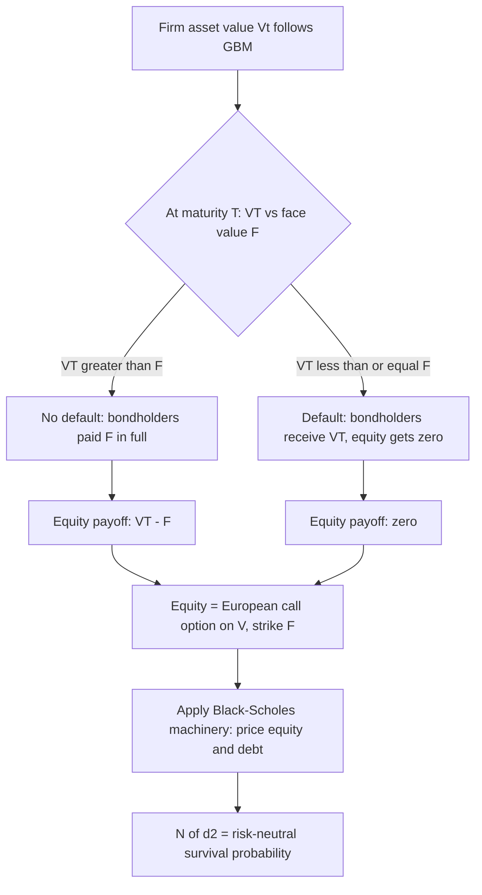

## Structural Models of Corporate Default

### Overview

Structural models of corporate default treat a firm's equity and debt as contingent claims on the firm's underlying asset value, with default triggered when firm value falls below a specified threshold relative to its liabilities. Originating with Merton (1974), these models apply option-pricing theory directly to credit risk: equity is modeled as a call option on firm assets, and default probability, credit spreads, and recovery rates emerge endogenously from the firm's capital structure and asset volatility, rather than being specified as exogenous inputs (as in reduced-form models).

### The Merton (1974) Model

**Core Setup**

The firm's asset value $V_t$ is assumed to follow geometric Brownian motion:

$$dV_t = \mu V_t\, dt + \sigma_V V_t\, dW_t$$

The firm has a simple capital structure: equity $E_t$ and a single zero-coupon bond with face value $F$ maturing at time $T$. At maturity:

- If $V_T > F$: bondholders are repaid $F$ in full; equity holders receive the residual $V_T - F$
- If $V_T \leq F$: the firm defaults; bondholders receive $V_T$ (all firm assets); equity holders receive nothing

**Key Points**

- Equity payoff at $T$: $E_T = \max(V_T - F, 0)$ — structurally identical to a **European call option** on the firm's assets with strike $F$
- Debt payoff at $T$: $D_T = \min(V_T, F) = F - \max(F - V_T, 0)$ — equivalent to a risk-free bond minus a **European put option** on firm assets with strike $F$
- This equivalence allows the full Black-Scholes-Merton apparatus to be applied directly to corporate liabilities, treating $V_t$ (firm value) as the "underlying asset" and $\sigma_V$ (asset volatility) as the relevant volatility parameter

### Merton Model: Pricing Equity and Debt

Applying the Black-Scholes formula directly (with $V_0$ replacing $S_0$ and $F$ replacing $K$):

$$E_0 = V_0 N(d_1) - Fe^{-rT}N(d_2)$$

$$d_1 = \frac{\ln(V_0/F) + (r + \tfrac{1}{2}\sigma_V^2)T}{\sigma_V\sqrt{T}}, \quad d_2 = d_1 - \sigma_V\sqrt{T}$$

Debt value: $D_0 = V_0 - E_0 = Fe^{-rT}N(d_2) + V_0 N(-d_1)$

**Key Points**

- $N(d_2)$ has a direct credit interpretation: it is the **risk-neutral probability that the firm does NOT default** (i.e., $V_T > F$) — so $1 - N(d_2) = N(-d_2)$ is the risk-neutral default probability
- The **credit spread** implied by the model is the difference between the yield on the risky debt and the risk-free rate: $s = -\frac{1}{T}\ln\left(\frac{D_0}{Fe^{-rT}}\right)$
- Since $V_t$ is unobservable directly (unlike a traded stock price), $V_0$ and $\sigma_V$ must typically be inferred jointly from observed equity value $E_0$ and equity volatility $\sigma_E$ via a system of two equations — a well-known practical implementation challenge

### Estimating Unobservable Asset Value and Volatility

**Example**

Since $E_t = V_t N(d_1) - Fe^{-r(T-t)}N(d_2)$ (Black-Scholes call formula) and by Ito's lemma $\sigma_E E_t = N(d_1)\sigma_V V_t$ (delta-based volatility relationship), these two equations are solved simultaneously (typically iteratively) for the unknowns $V_t$ and $\sigma_V$, given observed $E_t$, $\sigma_E$, $F$, $r$, and $T$.

**Key Points**

- This iterative estimation procedure (sometimes called the "KMV approach," after the commercial implementation by KMV Corporation, later acquired by Moody's) is the standard practical method for implementing Merton-style models using publicly available equity data
- [Unverified] Estimation quality can be sensitive to the choice of "distance to default" horizon, the definition of the default barrier from complex real-world capital structures, and numerical convergence of the iterative solution; specific implementation choices vary across commercial and academic applications

### Distance to Default

A widely used practical output of the Merton framework:

$$\text{DD} = \frac{\ln(V_0/F) + (\mu - \tfrac{1}{2}\sigma_V^2)T}{\sigma_V\sqrt{T}}$$

**Key Points**

- DD measures (in standard deviations) how far the firm's expected asset value at $T$ is from the default threshold — a higher DD indicates lower default risk
- Note that DD uses the **physical-measure drift $\mu$** (not the risk-free rate $r$), since the goal here is estimating actual default probability, not risk-neutral pricing — this is a subtle but important distinction from the pricing formulas above
- KMV's commercial "Expected Default Frequency" (EDF) methodology maps DD to historical default frequencies empirically, rather than relying on the Merton model's theoretical normal-distribution-based default probability, since actual default rates deviate substantially from Merton's theoretical predictions at very low/high DD values

### Key Limitations of the Basic Merton Model

**Key Points**

- **Default only at maturity**: the original model only allows default to be triggered by checking $V_T$ vs $F$ at the single terminal date $T$ — it cannot capture default occurring at any point before maturity, which is unrealistic for most real-world default events
- **Simple capital structure**: assumes a single zero-coupon debt tranche; real firms have multiple debt instruments with different seniorities, coupons, and maturities
- **Underestimates short-term credit spreads**: because default can only occur at $T$, and asset value paths are continuous, the model predicts near-zero default probability (and hence near-zero credit spreads) for very short maturities — a well-documented empirical failure, since observed short-maturity credit spreads are typically much higher than the model predicts
- **Constant asset volatility and interest rates**: unrealistic simplifications relative to observed market dynamics

### Black-Cox (1976) Model: First-Passage Time Extension

The Black-Cox model addresses the "default only at maturity" limitation by allowing default to be triggered the first time firm value hits a barrier $B$ at *any* time before $T$, not just at maturity:

$$\tau = \inf\{t \geq 0 : V_t \leq B(t)\}$$

**Key Points**

- This is a **first-passage-time** model — default is triggered by a continuous barrier-crossing condition, analogous to pricing a barrier option
- The barrier $B(t)$ can be constant or deterministically time-varying (e.g., growing over time to reflect an accreting bond covenant or a safety covenant structure)
- Closed-form solutions exist for constant or exponentially growing barriers, using reflection-principle techniques from the theory of Brownian motion first-passage times
- This structural improvement addresses the near-term credit spread underestimation somewhat, though empirical fit issues persist in many implementations

### Diagram: Merton Model Payoff Structure

### Diagram: Merton Model Equity/Debt Payoff at Maturity (svg_diagram)

<svg xmlns="http://www.w3.org/2000/svg" viewBox="0 0 640 280">
<text x="320" y="24" text-anchor="middle" font-size="16" font-weight="bold" fill="#1a1a2e">Merton Model Equity/Debt Payoff at Maturity (svg_diagram)</text>
<line x1="60" y1="230" x2="600" y2="230" stroke="#333" stroke-width="1" />
<line x1="60" y1="40" x2="60" y2="230" stroke="#333" stroke-width="1" />
<text x="600" y="245" font-size="10" fill="#333">Firm value VT</text>
<text x="30" y="35" font-size="10" fill="#333">Payoff</text>
<line x1="320" y1="40" x2="320" y2="230" stroke="#666" stroke-width="1" stroke-dasharray="3,3" />
<text x="325" y="240" font-size="10" fill="#666">F (face value)</text>
<path d="M 60 230 L 320 230 L 600 90" fill="none" stroke="#4338ca" stroke-width="2.5" />
<text x="420" y="80" font-size="11" fill="#4338ca" font-weight="bold">Equity: max(VT - F, 0)</text>
<path d="M 60 60 L 320 230 L 600 230" fill="none" stroke="#b45309" stroke-width="2.5" />
<text x="80" y="55" font-size="11" fill="#b45309" font-weight="bold">Debt: min(VT, F)</text>
</svg>

### Extensions: Multiple Debt Tranches and Coupon Bonds

**Key Points**

- Extensions with multiple debt seniorities require specifying an absolute priority rule (senior debt paid before junior debt, junior debt before equity) and pricing each tranche as a spread or compound option on firm value
- Geske's (1977) **compound option model** treats coupon-paying debt as a sequence of compound options, since each coupon payment date represents a potential decision point where equity holders may choose to "exercise" (pay the coupon, keeping the option to continue) or default
- These extensions substantially increase mathematical complexity relative to the basic single zero-coupon-bond Merton setup but improve realism for firms with genuinely layered capital structures

### Structural vs Reduced-Form Models: A Brief Comparison

| Feature | Structural Models | Reduced-Form Models |
| --- | --- | --- |
| Default mechanism | Endogenous (firm value crosses threshold) | Exogenous (specified hazard rate/intensity process) |
| Key inputs | Firm asset value, volatility, capital structure | Calibrated default intensity, recovery assumptions |
| Economic interpretation | Rich (default tied to observable firm fundamentals) | Limited (default modeled as an unpredictable jump event) |
| Calibration to market CDS/bond spreads | Generally harder (requires unobservable asset value estimation) | More direct (intensity calibrated to match spreads) |
| Default timing | Often predictable as $V_t \to B$ continuously (in basic models) | Genuinely unpredictable (Poisson-type jump to default) |

**Key Points**

- [Inference] A commonly cited theoretical critique of basic structural models is that default becomes "predictable" as asset value gradually approaches the barrier with continuous paths, producing credit spreads that vanish too quickly as maturity shrinks toward zero — a version of the same near-term spread underestimation problem noted above; this critique is generally accepted in the credit risk literature, though the severity varies with the specific model extension used (e.g., adding jumps to asset value dynamics addresses this substantially)
- Reduced-form models (e.g., Jarrow-Turnbull, Duffie-Singleton) are often preferred for calibration-heavy trading applications (CDS pricing) precisely because they sidestep the unobservable-asset-value estimation problem inherent to structural models

### Incorporating Jumps: Addressing the Predictability Critique

**Key Points**

- Adding a jump-diffusion component to the firm value process $V_t$ (analogous to Merton's jump-diffusion model for equities) allows default to occur as a genuine surprise (a sudden downward jump crossing the barrier), rather than only via gradual continuous approach
- This directly addresses the near-term credit spread underestimation problem, since jump risk can produce non-trivial short-maturity default probability even when the firm is currently far from the default barrier
- Zhou (2001) and related work extend Black-Cox-style first-passage models with jump-diffusion asset dynamics specifically to address this empirical shortfall

### Common Pitfalls

**Key Points**

- Applying the basic Merton formula directly to firms with complex, multi-tranche capital structures without adjustment — the single zero-coupon-bond assumption is a significant simplification that can materially misprice debt and misstate implied default probabilities for realistically structured firms
- Confusing the risk-neutral default probability $N(-d_2)$ (used for pricing) with the physical-measure default probability (relevant for risk management and rating agency-style analysis, which uses $\mu$ rather than $r$ in the distance-to-default calculation)
- Treating firm asset value $V_t$ and its volatility $\sigma_V$ as directly observable — they must be inferred indirectly (typically via the iterative equity-based estimation procedure), introducing estimation error and model risk
- Using the basic (non-jump, non-first-passage) Merton model to price or analyze short-maturity credit risk, given its well-documented tendency to substantially underestimate near-term credit spreads

### Conclusion

Structural models of corporate default, originating with Merton's insight that equity is a call option on firm assets, provide an economically grounded framework linking default probability, credit spreads, and firm fundamentals through option-pricing theory. While the basic Merton model suffers from well-known limitations — terminal-only default, oversimplified capital structure, and underestimated short-term credit spreads — extensions incorporating first-passage-time barriers (Black-Cox), compound options (Geske), and jump-diffusion dynamics substantially improve empirical realism, cementing the structural approach as a foundational, economically interpretable complement to the more calibration-driven reduced-form credit modeling tradition.

**Related Topics**

- Reduced-form (intensity-based) credit risk models
- Jump-diffusion processes in asset pricing
- Credit default swap (CDS) pricing
- Distance to default and KMV methodology
- Recovery rate modeling
- Geske compound option model for coupon debt
- Barrier options and first-passage time distributions
- Ito's lemma and stochastic integration