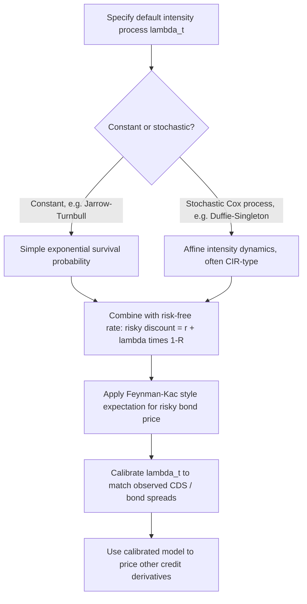

## Reduced-Form Credit Risk Models

### Overview

Reduced-form (intensity-based) credit risk models treat default as an unpredictable, exogenously specified random event governed by a hazard rate (intensity) process, rather than deriving default endogenously from a firm's asset value dynamics as structural models do. Default is modeled as the first jump of a point process (typically a Cox/doubly-stochastic Poisson process), and pricing proceeds by treating the default intensity as an additional "spread" added to the discount rate — an approach that maps directly and tractably onto market-observed credit spreads, making these models the dominant framework for CDS and credit derivatives trading desks.

### Core Philosophy: Default as a Surprise

**Key Points**

- Unlike structural models, reduced-form models make no attempt to explain default in terms of firm fundamentals (asset value, leverage) — default is simply an unpredictable jump event, arriving according to a specified intensity (hazard rate) process $\lambda_t$
- This sidesteps the central practical difficulty of structural models: reduced-form models require no estimation of unobservable firm asset value or asset volatility
- The trade-off is reduced economic interpretability — the intensity process is typically calibrated directly to match observed market credit spreads (CDS, bond spreads) rather than derived from any economic theory of why firms default

### The Default Time as a Stopping Time

Default time $\tau$ is modeled as the first jump of a counting process $N_t$ with stochastic intensity $\lambda_t$:

$$P(\tau \in [t, t+dt) \mid \tau > t, \mathcal{F}_t) \approx \lambda_t\, dt$$

**Key Points**

- $\lambda_t$ is the instantaneous conditional probability of default per unit time, given survival to time $t$ — directly analogous to a hazard rate in survival analysis
- When $\lambda_t$ is itself stochastic (driven by its own diffusion or jump process, correlated with interest rates or other economic factors), $N_t$ is called a **Cox process** (doubly stochastic Poisson process) — the standard and most flexible specification
- The simplest special case, constant $\lambda_t = \lambda$, reduces to a standard homogeneous Poisson process for default arrival, used in Jarrow-Turnbull's original (1995) formulation

### Survival Probability

The probability of survival to time $T$, conditional on no default and information up to $t$:

$$Q(\tau > T \mid \mathcal{F}_t, \tau > t) = E^Q\left[\exp\left(-\int_t^T \lambda_s\, ds\right) \,\middle|\, \mathcal{F}_t\right]$$

**Key Points**

- This formula has an identical mathematical structure to the Feynman-Kac discount-factor formula for zero-coupon bonds under stochastic short rates — replacing $r_s$ with $\lambda_s$ produces the survival probability instead of a discount factor
- This structural parallel is precisely why term-structure modeling techniques (affine intensity models, mirroring affine short-rate models) transfer directly to credit risk modeling
- For constant $\lambda$: survival probability simplifies to $e^{-\lambda(T-t)}$, and default time is exponentially distributed with mean $1/\lambda$

### Risky Bond Pricing: The Credit-Spread Decomposition

For a defaultable zero-coupon bond with recovery rate $R$ (fraction of face value recovered at default) paid at default (or at maturity, depending on convention):

$$P^{risky}(t,T) = E^Q\left[\exp\left(-\int_t^T (r_s + \lambda_s(1-R))\, ds\right) \,\middle|\, \mathcal{F}_t\right]$$

**Key Points**

- This is the central practical result of reduced-form models: the risky discount rate is simply the risk-free rate **plus** a credit spread term $\lambda_t(1-R)$ — often called the "hazard rate times loss given default"
- This additive decomposition is what makes reduced-form models so tractable for trading applications: all the existing machinery for term-structure modeling (affine models, HJM-style forward-rate frameworks) can be reapplied directly, treating $\lambda_t(1-R)$ as an additional "spread process" analogous to a short rate
- The specific recovery assumption matters materially: common conventions include "recovery of face value" (RFV, paid at default), "recovery of market value" (RMV, a fraction of the pre-default market price), and "recovery of Treasury" (RT); different conventions imply different pricing formulas and calibrated intensities from the same market spread data

### Jarrow-Turnbull (1995) Model

The foundational reduced-form model: constant intensity $\lambda$ and (originally) a simple binary recovery assumption.

**Example**

With constant risk-free rate $r$, constant hazard rate $\lambda$, and zero recovery ($R=0$):

$$P^{risky}(0,T) = e^{-(r+\lambda)T}$$

The implied credit spread is simply $\lambda$ (in the zero-recovery case) — directly recoverable from the market price of risky debt relative to an equivalent risk-free bond.

**Key Points**

- This simplicity makes Jarrow-Turnbull the natural starting point for understanding reduced-form pricing, though the constant-intensity assumption is unrealistic for modeling credit spread term structure (real-world credit spread curves are rarely flat)
- Extensions immediately generalize to time-varying deterministic $\lambda(t)$, calibrated to fit an observed term structure of CDS spreads across multiple maturities — directly analogous to how Hull-White generalizes Vasicek to fit an observed yield curve

### Duffie-Singleton (1999) Framework

The Duffie-Singleton framework generalizes reduced-form pricing to allow the intensity $\lambda_t$ to be stochastic (a Cox process) and correlated with the risk-free short rate $r_t$, unifying the credit-spread and interest-rate modeling problems under a single affine framework.

**Key Points**

- Under this framework, the "risky discount rate" $R_t = r_t + \lambda_t(1-R)$ can itself be modeled as an affine process (e.g., $\lambda_t$ following its own CIR-type square-root diffusion, ensuring non-negative default intensity)
- This directly imports all the analytical machinery of **affine term structure models** into credit risk: closed-form or semi-closed-form pricing via the same Riccati ODE system technique used for Vasicek/CIR bond pricing, just applied to the combined $(r_t, \lambda_t)$ state vector
- Correlation between $r_t$ and $\lambda_t$ can be economically motivated (e.g., credit spreads widening during recessions, which also tend to coincide with lower interest rates) — a flexibility structural models don't naturally provide without additional economic assumptions

### Diagram: Reduced-Form Pricing Architecture

### Diagram: Structural vs Reduced-Form Default Mechanism (svg_diagram)

<svg xmlns="http://www.w3.org/2000/svg" viewBox="0 0 640 280">
<text x="320" y="24" text-anchor="middle" font-size="16" font-weight="bold" fill="#1a1a2e">Structural vs Reduced-Form Default Mechanism (svg_diagram)</text>
<line x1="60" y1="230" x2="290" y2="230" stroke="#333" stroke-width="1" />
<line x1="60" y1="50" x2="60" y2="230" stroke="#333" stroke-width="1" />
<text x="120" y="245" font-size="10" fill="#333">Structural: gradual approach</text>
<line x1="60" y1="200" x2="290" y2="200" stroke="#dc2626" stroke-width="1.5" stroke-dasharray="4,3" />
<text x="230" y="192" font-size="9" fill="#dc2626">Default barrier</text>
<path d="M 60 80 C 100 100, 150 140, 190 175 S 250 195, 280 199" fill="none" stroke="#4338ca" stroke-width="2.5" />
<circle cx="280" cy="199" r="4" fill="#dc2626" />
<text x="90" y="70" font-size="10" fill="#4338ca">Firm asset value Vt approaches barrier</text>
<line x1="380" y1="230" x2="610" y2="230" stroke="#333" stroke-width="1" />
<line x1="380" y1="50" x2="380" y2="230" stroke="#333" stroke-width="1" />
<text x="420" y="245" font-size="10" fill="#333">Reduced-form: sudden jump</text>
<line x1="380" y1="100" x2="600" y2="100" fill="none" stroke="#15803d" stroke-width="2.5" />
<line x1="480" y1="100" x2="480" y2="230" stroke="#dc2626" stroke-width="2.5" stroke-dasharray="2,2" />
<circle cx="480" cy="100" r="5" fill="#dc2626" />
<text x="400" y="90" font-size="10" fill="#15803d">Value unremarkable, then sudden default jump</text>
<text x="490" y="160" font-size="9" fill="#dc2626">unpredictable jump at</text>
<text x="490" y="173" font-size="9" fill="#dc2626">intensity lambda_t</text>
</svg>

### CDS Pricing Using Reduced-Form Models

Credit Default Swaps are the primary instrument both calibrated to and priced using reduced-form models. A CDS spread $s$ (paid periodically by the protection buyer until default or maturity) satisfies, at inception:

$$s \sum_{i=1}^{n} \Delta_i\, P(0,t_i)\, Q(\tau > t_i) = (1-R)\int_0^T P(0,u)\, f_\tau(u)\, du$$

(premium leg present value equals protection leg present value), where $f_\tau(u)$ is the default-time density implied by $\lambda_t$.

**Key Points**

- This equation, evaluated using the model's survival probabilities, is the standard basis for **CDS bootstrapping** — extracting a term structure of default intensities/hazard rates from observed CDS spreads at multiple maturities, exactly analogous to bootstrapping a yield curve from bond prices
- The bootstrapped hazard rate curve (or equivalently, the implied survival probability curve) becomes the calibrated $\lambda_t$ used to price other credit-sensitive instruments consistently with observed CDS market data
- [Unverified] Specific bootstrapping conventions (piecewise-constant hazard rates vs. smoother interpolation, exact accrued-premium handling, upfront-vs-running spread conventions post-2009 CDS "Big Bang" standardization) vary across market participants and software implementations; practitioners should verify current ISDA standard model conventions rather than assuming a single universal method

### Correlated Default Modeling

For portfolio credit products (CDOs, basket default swaps, index tranches), reduced-form models extend to multi-name settings requiring a specification of **default correlation** across obligors.

**Key Points**

- Common approaches: correlating individual intensity processes directly (e.g., via a common systematic factor driving all $\lambda_t^i$), or using copula-based approaches (e.g., the Gaussian copula, historically dominant pre-2008 but heavily criticized following the financial crisis for underestimating tail/joint-default risk)
- [Inference] The 2008 financial crisis is widely cited as having exposed significant weaknesses in Gaussian copula-based correlated default models for structured credit products, particularly their tendency to underestimate the probability of simultaneous defaults during systemic stress — this is a well-documented critique in the post-crisis literature, though the specific replacement methodologies (e.g., factor copulas with fatter tails, intensity-based contagion models) vary in adoption across the industry
- Intensity-based **contagion models**, where one firm's default directly increases the default intensity of related firms, offer an alternative to copula methods that more directly captures observed clustering of defaults during crises

### Comparison with Structural Models

| Feature | Reduced-Form | Structural |
| --- | --- | --- |
| Default mechanism | Exogenous intensity (unpredictable jump) | Endogenous (asset value crosses barrier) |
| Requires firm asset value estimation | No | Yes (typically unobservable, must be inferred) |
| Calibration to market spreads | Direct and standard | Indirect, generally more difficult |
| Economic interpretability | Limited (spread treated as a fitted parameter) | Rich (default tied to firm fundamentals) |
| Short-maturity spread behavior | Naturally flexible (calibrated directly) | Basic models understate short-maturity spreads |
| Primary use case | Trading desk pricing, CDS/credit derivatives | Fundamental credit analysis, economic research |

### Common Pitfalls

**Key Points**

- Treating the calibrated intensity $\lambda_t$ as a genuine physical-measure default probability — like risk-neutral probabilities in equity/rate derivatives, $\lambda_t$ calibrated from market spreads embeds a risk premium and generally overstates the physical-measure (real-world) default probability
- Confusing different recovery rate conventions (RFV, RMV, RT) when comparing calibrated hazard rates across models or data sources — the same observed spread implies different $\lambda_t$ depending on the recovery assumption used
- Assuming default correlation is a minor modeling detail for single-name pricing — while irrelevant for single-name CDS, it is the central and most consequential modeling choice for portfolio credit products, where historical modeling failures (pre-2008 Gaussian copula usage) had material real-world consequences
- Ignoring correlation between the intensity process $\lambda_t$ and the risk-free rate $r_t$ — assuming independence when they are in fact correlated (e.g., both responding to macroeconomic conditions) can materially misprice risky bonds relative to the joint Duffie-Singleton-style approach

### Conclusion

Reduced-form credit risk models sidestep the unobservable-firm-value problem inherent to structural models by treating default as an exogenous, calibratable intensity process, mapping default risk directly onto an additive credit-spread term analogous to a short rate. This tractability, combined with direct compatibility with existing affine term-structure machinery (Duffie-Singleton), has made reduced-form models the dominant practical framework for pricing and calibrating to CDS and other credit derivatives, even though the approach sacrifices the economic interpretability that structural models provide.

**Related Topics**

- Structural models of corporate default
- Affine term structure models
- Credit default swap (CDS) pricing and bootstrapping
- Copula models and correlated default (CDO pricing)
- The Feynman-Kac formula
- The Cox-Ingersoll-Ross model (as intensity process specification)
- Recovery rate conventions and modeling
- Credit valuation adjustment (CVA) and counterparty risk