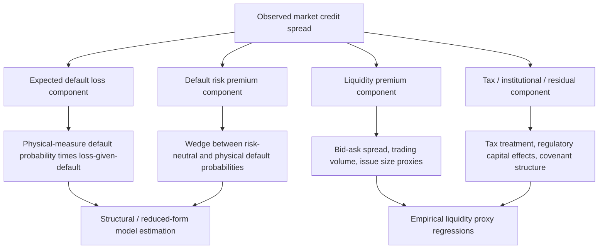

## Determinants of Credit Spreads

### Overview

Credit spreads — the excess yield demanded on risky corporate debt relative to a comparable risk-free benchmark — reflect a combination of expected default losses, priced risk premia, and market frictions. Decomposing what drives credit spreads is both a central empirical puzzle in fixed income (structural models systematically underpredict observed spreads, the so-called "credit spread puzzle") and essential practical knowledge for pricing, hedging, and relative-value analysis across corporate bonds and credit derivatives.

### Basic Decomposition of the Credit Spread

The credit spread can be conceptually decomposed as:

$$\text{Spread} = \underbrace{\lambda(1-R)}_{\text{Expected loss}} + \underbrace{\text{Risk premium}}_{\text{Compensation for uncertainty}} + \underbrace{\text{Liquidity premium}}_{\text{Market frictions}} + \underbrace{\text{Tax/other effects}}_{\text{Residual}}$$

**Key Points**

- $\lambda(1-R)$ (hazard rate times loss-given-default) represents the actuarially fair compensation for expected default losses under the physical measure — this is often the smallest component of observed spreads for investment-grade debt
- The risk premium compensates investors for default risk being systematic (correlated with broader economic downturns) rather than fully diversifiable — analogous to how equity risk premia compensate for non-diversifiable market risk
- Liquidity premium compensates for the cost and difficulty of trading a specific bond, distinct from default risk entirely
- This decomposition is conceptual rather than a rigid formula — empirical studies use varying methodologies to separate these components, and the residual (unexplained) component has historically been substantial, motivating ongoing research

### Expected Default Loss Component

**Key Points**

- Under the physical measure, expected loss equals the (physical-measure) probability of default multiplied by loss-given-default (1 minus recovery rate)
- Structural models (Merton, Black-Cox) and historical/rating-agency-based default probability estimates (e.g., Moody's or S&P historical default tables by rating category) are standard ways to estimate this component
- [Inference] Numerous academic studies (a well-known line of research beginning with Huang and Huang, 2003, and extended by many others) find that expected default losses alone explain only a relatively modest fraction of observed investment-grade credit spreads — this is a widely cited finding in the credit spread literature, though the exact magnitude varies by study, sample period, and methodology, and is sometimes called the "credit spread puzzle" or "corporate bond spread puzzle"

### The Default Risk Premium

**Key Points**

- Default risk is at least partially systematic: corporate defaults cluster during recessions, meaning bondholders cannot fully diversify away default risk across a portfolio of bonds — analogous to how equity risk premia arise from non-diversifiable market risk
- The risk-neutral default probability implied by market spreads (via reduced-form model calibration) is typically substantially higher than the physical-measure (historically observed) default probability for the same credit — this wedge between $Q$-measure and $P$-measure default probabilities *is* the default risk premium, in intensity terms
- This gap tends to widen during periods of financial stress (risk aversion increases, elevating the price investors demand for bearing default risk even when actual default probabilities haven't changed as much) — a well-documented empirical pattern, most visible during the 2008 financial crisis and other stress episodes
- Jump risk (sudden, large asset value declines, as in jump-diffusion structural models) is generally not fully hedgeable through continuous trading, and the associated risk premium for jump/gap risk is considered a meaningful contributor to explaining otherwise-puzzling short-maturity credit spreads

### Liquidity Premium

**Key Points**

- Corporate bonds, especially those of smaller issuers or older ("off-the-run") issues, trade far less frequently than government bonds or on-the-run Treasuries, and bid-ask spreads are correspondingly wider
- Standard proxies for bond-level liquidity include bid-ask spread, trading volume/turnover, issue size, and price impact measures (e.g., the Amihud illiquidity ratio)
- [Inference] Empirical estimates of the liquidity premium's contribution to observed credit spreads vary considerably across studies and time periods, generally ranging from a modest to a substantial fraction of the total spread depending on credit quality, maturity, and market conditions — the specific magnitude is an actively researched and somewhat unsettled empirical question rather than a single agreed-upon figure
- Liquidity premia widen sharply during periods of market stress (e.g., 2008, March 2020) when investors' willingness/ability to hold illiquid assets falls — often termed a "flight to liquidity" or "flight to quality" effect, distinct from (though often correlated with) increases in the default risk premium during the same episodes

### Tax and Institutional Effects

**Key Points**

- In some jurisdictions, corporate bond coupon income is taxed differently from government bond income (historically a factor in the U.S. municipal-vs-Treasury-vs-corporate spread literature), which can create a residual, tax-driven wedge in observed yields unrelated to credit risk per se
- Regulatory capital requirements affect institutional investors' (banks, insurers) demand for different credit qualities and maturities, potentially creating spread effects driven by regulatory constraints rather than pure credit or liquidity considerations
- Bond covenants, seniority, and collateral provisions materially affect the recovery rate assumption embedded in spread calculations — two bonds from the same issuer with different seniority will have different spreads even with identical default probability, purely due to differing loss-given-default

### Macroeconomic and Systematic Determinants

**Key Points**

- Credit spreads are strongly countercyclical: they widen during economic downturns/recessions and narrow during expansions, reflecting both rising actual default risk and rising risk aversion simultaneously
- Aggregate equity market volatility (e.g., VIX) is a commonly cited leading indicator/correlate of credit spread movements, consistent with structural models' prediction that firm asset volatility (proxied by equity volatility) drives credit risk
- Monetary policy and the level of risk-free rates interact with credit spreads in ways that are empirically studied but not fully settled — [Unverified] the precise sign and magnitude of the relationship between risk-free rate changes and credit spread changes varies across studies, economic regimes, and credit quality segments, and should not be assumed to follow a single universal directional relationship
- Firm-specific leverage, profitability, and asset volatility (the core structural-model determinants) remain empirically significant explanators of cross-sectional spread variation, even though aggregate-level puzzle findings suggest these factors alone are insufficient at the market-wide level

### Diagram: Credit Spread Decomposition

### Diagram: Credit Spread Term Structure by Rating (svg_diagram)

<svg xmlns="http://www.w3.org/2000/svg" viewBox="0 0 640 280">
<text x="320" y="24" text-anchor="middle" font-size="16" font-weight="bold" fill="#1a1a2e">Credit Spread Term Structure by Rating (svg_diagram)</text>
<line x1="60" y1="230" x2="600" y2="230" stroke="#333" stroke-width="1" />
<line x1="60" y1="40" x2="60" y2="230" stroke="#333" stroke-width="1" />
<text x="600" y="245" font-size="10" fill="#333">Maturity</text>
<text x="30" y="35" font-size="10" fill="#333">Spread</text>
<path d="M 60 215 C 150 205, 300 195, 450 185 S 550 178, 600 172" fill="none" stroke="#15803d" stroke-width="2.5" />
<text x="440" y="165" font-size="11" fill="#15803d" font-weight="bold">AAA/AA: low, gently rising</text>
<path d="M 60 195 C 150 175, 300 150, 450 135 S 550 125, 600 118" fill="none" stroke="#4338ca" stroke-width="2.5" />
<text x="440" y="108" font-size="11" fill="#4338ca" font-weight="bold">BBB: moderate, steady rise</text>
<path d="M 60 150 C 150 120, 300 100, 450 95 S 550 92, 600 90" fill="none" stroke="#b45309" stroke-width="2.5" />
<text x="380" y="80" font-size="11" fill="#b45309" font-weight="bold">High yield: high, flatter at long end</text>
</svg>

### Empirical Credit Spread Puzzle: Summary of the Debate

**Key Points**

- The "credit spread puzzle" refers to the persistent empirical finding that reasonable calibrations of structural default models (using historical default rates and recovery assumptions) predict spreads considerably narrower than those actually observed in the market, particularly for investment-grade bonds
- Proposed resolutions in the literature include: higher-than-historical estimates of systematic risk premia, jump risk in firm value (addressing especially short-maturity spread underestimation), tax effects, liquidity premia, and model risk/parameter uncertainty (investors demanding compensation for uncertainty about the model itself, not just about default within a given model)
- [Inference] There is no single, universally accepted resolution to the credit spread puzzle in the academic literature; most researchers now view the puzzle as resolved primarily through a *combination* of the factors above rather than any single dominant explanation, though the relative weighting of each factor remains actively debated and appears to vary by time period, credit quality, and market segment

### Practical Implications for Pricing and Risk Management

**Key Points**

- Relative value analysis (identifying "cheap" or "rich" bonds) often involves decomposing an individual bond's spread into estimated default-risk and liquidity components, then comparing the default-risk-adjusted spread to peers of similar credit quality
- Credit valuation adjustment (CVA) calculations for derivatives counterparty risk rely on market-implied (risk-neutral) default probabilities extracted from CDS spreads — which embed the full risk premium, not just expected loss — a deliberate and appropriate choice for pricing/hedging purposes, since CVA should reflect the market cost of hedging counterparty risk, not merely actuarial expected loss
- Risk managers computing regulatory or economic capital, by contrast, often prefer physical-measure default probability estimates (e.g., through-the-cycle ratings-based estimates) precisely to avoid embedding the time-varying risk premium component into capital requirements — illustrating why the choice between $P$-measure and $Q$-measure default probability estimates depends materially on the specific application

### Common Pitfalls

**Key Points**

- Treating the entire observed credit spread as a pure measure of default risk — given the well-documented credit spread puzzle, a substantial portion of observed spreads (particularly for high-grade debt) reflects risk premia, liquidity effects, and other non-default-related factors
- Using risk-neutral (market-implied) default probabilities interchangeably with physical-measure default probabilities — these differ systematically due to the default risk premium, and conflating them can lead to significant errors depending on whether the application requires pricing (needs $Q$) or actual risk assessment (needs $P$)
- Ignoring liquidity effects when comparing spreads across bonds of similar credit quality but different issue sizes, ages, or trading venues — apparent "mispricing" can sometimes be fully explained by liquidity differences rather than genuine credit-risk differences
- Assuming credit spread determinants are stable over time — the relative importance of default risk, risk premia, and liquidity shifts materially across the business cycle and during periods of financial stress, and static historical decompositions may not generalize to different market regimes

### Conclusion

Observed credit spreads reflect a composite of expected default losses, a default risk premium compensating for the systematic (non-diversifiable) nature of credit risk, a liquidity premium reflecting market frictions, and residual tax/institutional effects. The persistent empirical finding that expected losses alone cannot explain observed spread levels — the credit spread puzzle — has motivated substantial research into jump risk, risk premia, and liquidity as complementary explanations, with most current thinking favoring a multi-factor explanation over any single dominant driver. Correctly attributing spread components matters practically: pricing and hedging applications (CVA, derivatives) generally require risk-neutral default probabilities embedding the full risk premium, while risk management and capital applications often require physical-measure estimates that strip the premium back out.

**Related Topics**

- Structural models of corporate default
- Reduced-form credit risk models
- The credit spread puzzle (Huang and Huang and related literature)
- Credit valuation adjustment (CVA) and counterparty risk
- Liquidity risk measurement and asset pricing
- Jump-diffusion processes in asset pricing
- Systematic vs idiosyncratic risk and risk premia
- Credit default swap (CDS) basis and bond-CDS relative value