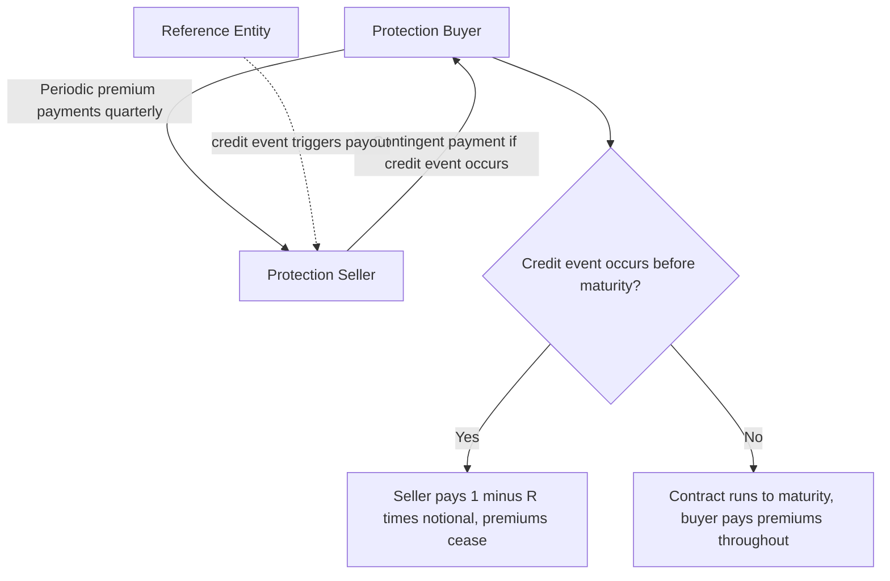

## Credit Default Swaps and Credit Derivatives

### Overview

Credit default swaps (CDS) are bilateral contracts that transfer credit risk from a protection buyer to a protection seller, functioning as insurance against the default of a reference entity. CDS and their extensions (index products, tranches, basket swaps) form the credit derivatives market, which enables hedging, speculation, and the isolation of pure credit risk from interest-rate risk — a decomposition impossible with cash bonds alone. This topic covers CDS mechanics, pricing (building directly on reduced-form credit models), the CDS-bond basis, and portfolio credit derivatives.

### CDS Mechanics

A single-name CDS involves two counterparties referencing a specific obligor (the "reference entity"):

**Key Points**

- The **protection buyer** pays a periodic premium (the CDS spread, quoted in basis points per annum, paid quarterly) to the **protection seller**
- If a **credit event** occurs (default, bankruptcy, or restructuring, as defined by ISDA standard documentation) before maturity, the protection seller compensates the buyer for the loss, and premium payments cease
- Settlement is typically via **cash settlement** post-2009 standardization (ISDA's "Big Bang" and "Small Bang" protocols): an auction process determines the reference entity's post-default bond recovery value, and the seller pays $(1-R) \times \text{Notional}$ to the buyer
- Physical settlement (delivering an eligible defaulted bond in exchange for par) remains contractually available but is used far less frequently than cash settlement in practice since standardization

### CDS as a Pure Credit Risk Instrument

**Key Points**

- Unlike a corporate bond, a CDS has (approximately) zero initial market value and requires no funding of principal — the protection buyer pays only a periodic spread, not the bond's full price, making CDS capital-efficient for expressing credit views
- This isolates credit risk from interest-rate risk: buying a corporate bond exposes the investor to both credit risk and interest-rate/duration risk simultaneously, whereas shorting credit risk via CDS (buying protection) leaves interest-rate exposure largely unaffected
- CDS also enable market participants to take a *negative* view on credit (effectively "shorting" a bond) far more easily than shorting the physical bond itself, which involves borrowing costs and repo market frictions

### CDS Pricing: The Premium Leg and Protection Leg

The CDS spread $s$ is set at inception so the present value of the premium leg equals the present value of the protection leg:

**Premium leg** (payments made by protection buyer until default or maturity):

$$PV_{premium} = s \sum_{i=1}^{n} \Delta_i\, P(0,t_i)\, Q(\tau > t_i) + \text{accrued premium adjustment}$$

**Protection leg** (contingent payment made upon default):

$$PV_{protection} = (1-R)\int_0^T P(0,u)\, f_\tau(u)\, du$$

Setting these equal and solving for $s$ (or, in practice, bootstrapping the survival curve $Q(\tau > t)$ from observed market spreads at each maturity) is the standard CDS valuation procedure.

**Key Points**

- $Q(\tau > t)$, the survival probability, comes directly from the reduced-form intensity framework — CDS pricing is the primary practical application of reduced-form credit models covered elsewhere in this material
- The accrued premium adjustment accounts for the fact that if default occurs between premium payment dates, the buyer typically owes the seller the accrued (partial-period) premium up to the default date
- Post-2009 standardization introduced **fixed coupon conventions** (e.g., 100bp or 500bp standard running spreads) with an **upfront payment** making up the difference between the fixed coupon and the market-clearing spread — a market-structure change that affects quoting conventions but not the underlying valuation principle

### Mark-to-Market of an Existing CDS Position

**Example**

For a CDS entered into at spread $s_0$, its mark-to-market value at a later date, given the current market spread $s_1$ for the same maturity/reference entity, is approximately:

$$MTM \approx (s_1 - s_0) \times \text{Risky Annuity} \times \text{Notional}$$

where the risky annuity is the present value of $1 per annum paid until default or maturity, using current survival probabilities.

**Key Points**

- This linear approximation (analogous to DV01 for interest-rate products, sometimes called "CS01" or "credit spread DV01" for CDS) is widely used for daily P&L estimation and risk management
- Exact mark-to-market requires recomputing both legs using the current survival curve, but the linear approximation is standard for small spread moves and quick risk estimation

### CDS-Bond Basis

The **CDS-bond basis** is defined as: $\text{Basis} = \text{CDS spread} - \text{Bond spread (asset swap spread)}$

**Key Points**

- In theory (under simplifying assumptions — no funding costs, no counterparty risk, identical recovery assumptions), the CDS spread and the corresponding cash bond's credit spread should be approximately equal, since both instruments compensate for the same underlying default risk
- In practice, the basis is frequently non-zero and can be persistently negative or positive, reflecting funding cost differences, counterparty risk in the CDS itself, cheapest-to-deliver optionality in physical settlement, differences in liquidity between the CDS and bond markets, and regulatory/balance-sheet constraints on different market participants
- The basis widened dramatically and became strongly negative during the 2008 financial crisis (bond spreads far exceeded CDS spreads) — widely attributed to funding pressures and forced bond selling, illustrating how the basis can reflect market dislocation and technical factors rather than pure credit-risk mispricing
- "Basis trading" (simultaneously buying a bond and buying CDS protection, or the reverse) is a classic relative-value strategy designed to exploit persistent or dislocated basis levels, though it carries its own risks (basis risk itself can widen further before converging, and financing/repo considerations complicate the trade)

### Diagram: CDS Cash Flow Structure

### Diagram: CDS Payoff Structure vs Bond Ownership (svg_diagram)

<svg xmlns="http://www.w3.org/2000/svg" viewBox="0 0 640 280">
<text x="320" y="24" text-anchor="middle" font-size="16" font-weight="bold" fill="#1a1a2e">CDS Payoff Structure vs Bond Ownership (svg_diagram)</text>
<rect x="40" y="50" width="260" height="180" rx="8" fill="#eef2ff" stroke="#4338ca" stroke-width="1.5" />
<text x="170" y="75" text-anchor="middle" font-size="13" font-weight="bold" fill="#4338ca">Own Corporate Bond</text>
<text x="55" y="100" font-size="11" fill="#1a1a2e">Exposure: credit risk +</text>
<text x="55" y="118" font-size="11" fill="#1a1a2e">interest-rate/duration risk</text>
<text x="55" y="145" font-size="11" fill="#1a1a2e">Requires funding full</text>
<text x="55" y="163" font-size="11" fill="#1a1a2e">bond notional/price</text>
<text x="55" y="190" font-size="11" fill="#1a1a2e">Shorting: difficult</text>
<text x="55" y="208" font-size="11" fill="#1a1a2e">(repo market frictions)</text>
<rect x="340" y="50" width="260" height="180" rx="8" fill="#dcfce7" stroke="#15803d" stroke-width="1.5" />
<text x="470" y="75" text-anchor="middle" font-size="13" font-weight="bold" fill="#15803d">Buy CDS Protection</text>
<text x="355" y="100" font-size="11" fill="#1a1a2e">Exposure: pure credit risk</text>
<text x="355" y="118" font-size="11" fill="#1a1a2e">(minimal duration risk)</text>
<text x="355" y="145" font-size="11" fill="#1a1a2e">No principal funding -</text>
<text x="355" y="163" font-size="11" fill="#1a1a2e">pay periodic spread only</text>
<text x="355" y="190" font-size="11" fill="#1a1a2e">"Shorting" credit: direct</text>
<text x="355" y="208" font-size="11" fill="#1a1a2e">and capital-efficient</text>
</svg>

### CDS Indices

Standardized CDS indices reference a fixed basket of names, rolled semi-annually (new "on-the-run" series).

**Key Points**

- **CDX** indices reference North American corporate names (e.g., CDX.NA.IG for investment grade, CDX.NA.HY for high yield); **iTraxx** indices reference European and Asian names
- Index CDS spreads are highly liquid and serve as key benchmarks for broad credit market sentiment, analogous to how equity indices summarize broad equity market conditions
- The index spread is approximately (though not exactly, due to compositional effects and the "skew") the average of the constituent single-name CDS spreads
- Trading index CDS is a standard, liquid way to hedge or express views on broad credit market direction without taking single-name exposure

### CDS Tranches and Portfolio Credit Derivatives

Tranches divide the losses on a reference portfolio (e.g., a CDS index) into layers of increasing seniority, each absorbing losses within a specified attachment/detachment range.

**Key Points**

- A tranche with attachment point $a$ and detachment point $d$ (both expressed as a percentage of total portfolio notional) absorbs portfolio losses only once cumulative losses exceed $a\%$, up to $d\%$ — e.g., the equity tranche (0-3%) absorbs the first losses and is thus the riskiest, while senior tranches (e.g., 30-100%) are exposed only to extreme, correlated loss scenarios
- Pricing tranches requires a model of **default correlation** across the reference portfolio's constituents — this is fundamentally different from single-name CDS pricing, which requires only a marginal survival curve for one name
- The Gaussian copula model, historically the market-standard approach for tranche pricing pre-2008, was heavily criticized following the financial crisis for underestimating the likelihood of correlated, simultaneous defaults — a well-documented critique in the post-crisis credit derivatives literature
- Base correlation and compound correlation are two standard (though each has known limitations) methodologies for calibrating implied correlation parameters to observed tranche market prices, analogous to how implied volatility calibrates option models to observed option prices

### Basket Default Swaps

**Key Points**

- A first-to-default (FtD) basket swap pays out upon the *first* default among a small basket of reference names — pricing again requires a joint default model (correlation matters significantly for basket products even with a small number of names)
- Nth-to-default variants generalize this to trigger payout upon the Nth default in the basket, requiring progressively more sophisticated joint-default modeling as N increases
- These products, along with tranches, exemplify how portfolio credit derivatives fundamentally require modeling default *dependence*, not merely marginal single-name default probabilities

### Regulatory and Structural Evolution Post-2008

**Key Points**

- The 2008 financial crisis exposed significant counterparty risk concentration in the CDS market (most notably associated with AIG's CDS writing activities), motivating substantial post-crisis regulatory reform
- Central clearing of standardized CDS contracts through central counterparties (CCPs) became mandatory for many market participants under Dodd-Frank (U.S.) and EMIR (EU) regulations, substantially reducing bilateral counterparty risk relative to the pre-crisis over-the-counter structure
- [Unverified] The specific scope of mandatory clearing, margin requirements, and reporting obligations for credit derivatives continues to evolve across jurisdictions; current regulatory requirements should be verified against up-to-date regulatory sources rather than assumed static

### Common Pitfalls

**Key Points**

- Assuming CDS spreads and cash bond spreads for the same issuer will always be approximately equal — the CDS-bond basis can be persistently and substantially non-zero, particularly during periods of market stress or funding dislocation
- Treating CDS index spreads as a simple, unweighted average of constituent single-name spreads without accounting for compositional effects, weighting conventions, and the index/single-name basis (skew)
- Pricing or risk-managing portfolio credit derivatives (tranches, baskets) using only marginal single-name default probabilities without a correlation/dependence model — this is a fundamental modeling error, not a simplification, since tranche and basket payoffs are inherently sensitive to joint default behavior
- Overlooking counterparty risk in bilateral (non-centrally-cleared) CDS positions — the protection buyer's payout depends on the protection seller's own solvency, a risk starkly illustrated by pre-crisis concentrated CDS writing activity

### Conclusion

Credit default swaps provide a capital-efficient, standardized mechanism for isolating and transferring pure credit risk, pricing directly through the reduced-form intensity framework applied to premium and protection leg valuation. Their extension into index products, tranches, and basket swaps introduced portfolio credit derivatives requiring explicit default correlation modeling — a domain whose pre-2008 modeling shortcomings (particularly around the Gaussian copula) were prominently implicated in the financial crisis, driving substantial subsequent reform in both modeling practice and market structure (central clearing, standardized settlement conventions).

**Related Topics**

- Reduced-form credit risk models
- Structural models of corporate default
- Determinants of credit spreads
- Copula models and correlated default (CDO pricing)
- Credit valuation adjustment (CVA) and counterparty risk
- Central clearing and OTC derivatives regulation post-2008
- CDS index products (CDX, iTraxx) and index/tranche basis
- Base correlation and implied correlation skew