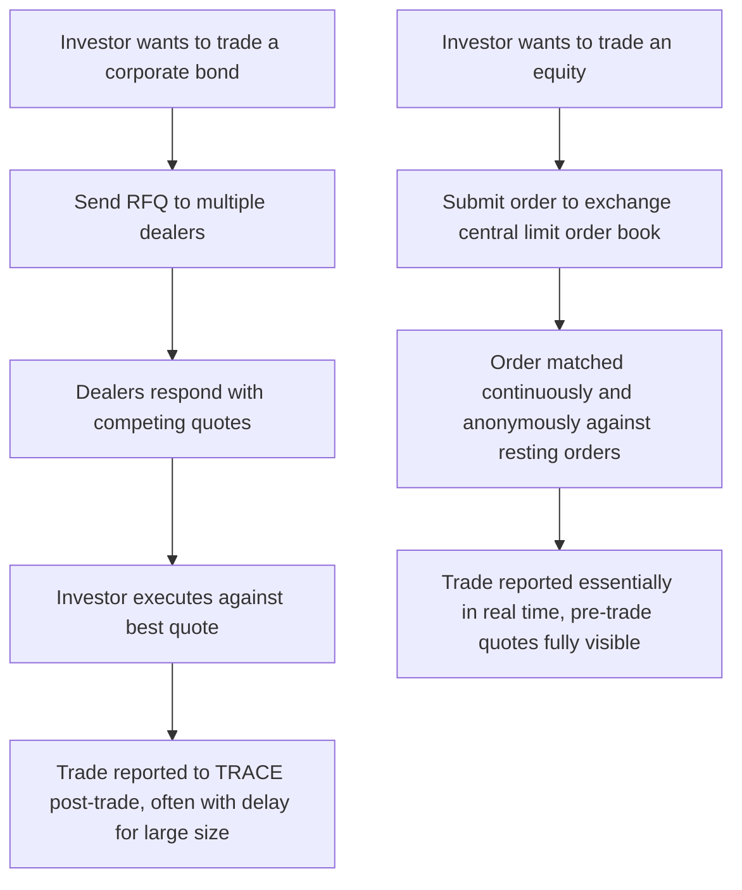

## Corporate Bond Market Microstructure

### Overview

Corporate bond market microstructure studies how corporate debt is actually traded — the trading protocols, dealer intermediation, price formation, and liquidity provision mechanisms that determine execution costs and market quality. Unlike equity markets, which are predominantly exchange-traded with continuous limit order books, corporate bonds trade primarily over-the-counter (OTC) through a dealer-intermediated, request-for-quote framework, producing distinctive liquidity, transparency, and price-formation characteristics that are central to understanding transaction costs, credit spread measurement, and post-crisis market structure reform.

### The Dealer-Intermediated OTC Market Structure

**Key Points**

- The vast majority of corporate bond trading occurs OTC through broker-dealers acting as market makers, rather than on a centralized exchange with a continuous limit order book — a fundamental structural difference from equity market microstructure
- Dealers historically operated as **principal traders**, taking bonds onto their own balance sheet ("dealer inventory") to provide immediate liquidity to clients wanting to buy or sell, profiting from the bid-ask spread
- The number of corporate bond issues vastly exceeds the number of equity securities (a single large corporation may have dozens of outstanding bond issues across different maturities and covenant structures), fragmenting liquidity across a much larger universe of individual securities, most of which trade only sporadically
- This fragmentation means most individual bonds do not have a continuously observable market price — pricing and liquidity vary enormously across "on-the-run" (recently issued, actively traded) versus "off-the-run" (seasoned, thinly traded) issues of the same issuer

### Request-for-Quote (RFQ) Trading Protocol

**Key Points**

- The dominant electronic trading mechanism for corporate bonds is RFQ: an investor requests price quotes from multiple dealers simultaneously (typically 3-5), then executes against the best quote received
- This differs fundamentally from a central limit order book (CLOB) model (standard in equities), where anonymous orders interact continuously in a visible order book
- RFQ inherently reveals trading intent to multiple dealers before execution, creating potential information leakage and market impact — a structural cost not present in fully anonymous order-book trading
- All-to-all trading platforms (allowing buy-side investors to trade directly with each other, not solely through dealers) have grown substantially in the post-2008 period, partially disintermediating the traditional dealer-centric structure, though dealers remain central to the market

### Dealer Inventory and Post-Crisis Balance Sheet Constraints

**Key Points**

- Following the 2008 financial crisis, regulatory reforms (the Volcker Rule under Dodd-Frank, Basel III capital and liquidity requirements) substantially increased the cost of dealer bank balance sheet usage for market-making activities
- [Inference] A substantial body of research and market commentary has documented a marked reduction in dealer bond inventories relative to pre-crisis levels and relative to the growing size of the outstanding corporate bond market — widely attributed at least partly to these regulatory changes, though isolating the precise causal contribution of regulation versus other factors (changing dealer business models, technology, low-rate environment effects on issuance) remains a subject of ongoing empirical debate
- Reduced dealer inventory capacity has shifted market-making increasingly toward an **agency/matching model** (dealers acting more as intermediaries connecting buyers and sellers directly, rather than warehousing risk on their own balance sheet) and toward electronic all-to-all platforms and algorithmic liquidity provision
- This structural shift raises concerns about market resilience during periods of stress, when the ability to warehouse risk (as dealers historically did) may matter most — a concern that received significant attention following liquidity strains observed in March 2020

### Trade Reporting: TRACE and Post-Trade Transparency

**Key Points**

- In the U.S., the Trade Reporting and Compliance Engine (TRACE), introduced by FINRA in 2002, mandates post-trade price and volume reporting for most corporate bond transactions, dramatically increasing transparency relative to the pre-TRACE era when transaction prices were largely private
- TRACE data has become the primary academic and practitioner data source for studying corporate bond transaction costs, liquidity, and price discovery — a substantial share of the empirical corporate bond microstructure literature relies directly on TRACE
- Despite TRACE's post-trade transparency, **pre-trade transparency** (visible bid/ask quotes before a trade, analogous to a visible order book) remains much more limited in corporate bonds than in equities, reflecting the RFQ-based, dealer-intermediated trading protocol
- Large trades ("block trades") historically benefited from reporting size caps/delays (to protect dealers temporarily holding large risk positions from adverse price movements) — a transparency-versus-liquidity-provision trade-off that has been periodically revisited by regulators

### Diagram: Corporate Bond vs Equity Market Structure

### Diagram: Liquidity Spectrum Across Bond Issue Age (svg_diagram)

<svg xmlns="http://www.w3.org/2000/svg" viewBox="0 0 640 260">
<text x="320" y="24" text-anchor="middle" font-size="16" font-weight="bold" fill="#1a1a2e">Liquidity Spectrum Across Bond Issue Age (svg_diagram)</text>
<line x1="60" y1="220" x2="600" y2="220" stroke="#333" stroke-width="1" />
<line x1="60" y1="40" x2="60" y2="220" stroke="#333" stroke-width="1" />
<text x="600" y="235" font-size="10" fill="#333">Time since issuance</text>
<text x="30" y="35" font-size="10" fill="#333">Liquidity</text>

<path d="M 60 80 C 100 75, 130 90, 170 130 S 250 180, 350 200 S 500 212, 600 216" fill="none" stroke="`#4338ca`" stroke-width="2.5" />

<text x="80" y="65" font-size="11" fill="`#4338ca`" font-weight="bold">On-the-run: tight spreads,</text>

<text x="80" y="78" font-size="11" fill="`#4338ca`" font-weight="bold">frequent trading</text>

<text x="420" y="195" font-size="11" fill="`#b45309`" font-weight="bold">Off-the-run: wide spreads,</text>

<text x="420" y="208" font-size="11" fill="`#b45309`" font-weight="bold">sporadic/no trading</text>

</svg>

### Transaction Cost Measurement

**Key Points**

- Standard transaction cost measures include the **effective bid-ask spread** (difference between transaction price and a reference "fair value," typically doubled and expressed relative to the midpoint), and **price impact** measures capturing how much a trade moves subsequent prices
- Transaction costs in corporate bonds are generally documented in the academic literature to be substantially higher than in equity markets of comparable issuer size, particularly for smaller trade sizes and less liquid (off-the-run, high-yield, smaller-issuer) bonds — a well-established empirical finding using TRACE data
- Trade size effects are notably different from many other markets: very large "block" trades sometimes receive *better* (not worse) effective pricing than small "odd-lot" retail-sized trades in corporate bonds, reflecting the fixed-cost component of dealer intermediation and the relationship-based nature of institutional trading — this size-liquidity relationship is a frequently studied and somewhat distinctive feature of corporate bond microstructure
- [Unverified] The precise magnitude of transaction costs varies substantially across studies, time periods (transaction costs have generally declined over time as TRACE transparency and electronic trading have matured), and market segments; specific cost estimates should be sourced from current research rather than assumed constant

### Price Discovery and the Role of CDS Markets

**Key Points**

- Given corporate bonds' relatively sparse and infrequent trading, price discovery for credit risk sometimes occurs more efficiently in the more liquid CDS market, with bond prices subsequently adjusting to reflect CDS-implied credit spread information — a "price discovery leadership" finding documented in parts of the academic literature, particularly during periods of credit stress
- This relates directly to the CDS-bond basis: information flow and relative liquidity between the two markets can drive basis dynamics independent of "pure" credit risk changes
- Electronic trading platforms and algorithmic pricing models increasingly incorporate CDS-implied spreads, comparable bond trades, and machine-learning-based fair value estimates to generate real-time indicative pricing for illiquid bonds that may not have traded recently — a significant evolution from purely dealer-quote-based price discovery

### Electronification and Algorithmic Trading

**Key Points**

- Corporate bond trading has become progressively more electronic over the past two decades, though the transition has lagged equities and even government bonds substantially, owing to the market's fragmentation (many more distinct securities) and historically lower average trading frequency per security
- Electronic platforms (e.g., MarketAxess, Tradeweb, and others) now intermediate a substantial and growing share of investment-grade and high-yield trading volume, particularly for smaller, more standardized trade sizes
- Portfolio trading (executing a basket of many bonds simultaneously as a single transaction, often used by index-tracking or large institutional accounts) has grown notably as an electronic trading innovation, allowing investors to transfer risk across many illiquid individual bonds more efficiently than trading each bond separately
- [Unverified] The specific market share and growth trajectory of electronic and portfolio trading protocols continues to evolve; current statistics should be verified against recent industry data (e.g., from FINRA, MarketAxess, or academic market-structure studies) rather than assumed static

### Implications for Asset Pricing and Credit Spread Research

**Key Points**

- Because observed bond transaction prices reflect both credit-risk-related and pure liquidity-related components, empirical credit spread research must carefully control for liquidity proxies (bid-ask spread, trading frequency, issue size, time since issuance) to avoid conflating liquidity effects with genuine credit risk pricing — directly connecting market microstructure considerations to the credit spread determinants discussed elsewhere in this material
- Stale or infrequent pricing for illiquid bonds can create measurement challenges for portfolio valuation, risk management (e.g., Value-at-Risk calculations), and even academic asset-pricing studies that rely on reported bond prices, since a "price" may reflect a trade (or dealer estimate) from days or weeks earlier rather than current market conditions
- Matrix pricing and evaluated pricing services (third-party vendors providing model-based price estimates for bonds that haven't recently traded) are standard industry tools addressing this stale-pricing problem, though they introduce their own model risk and potential divergence from true executable prices

### Common Pitfalls

**Key Points**

- Assuming corporate bond markets function like equity markets, with continuous, transparent, exchange-based price discovery — the OTC, dealer-intermediated, RFQ-based structure produces materially different liquidity and transaction cost dynamics that must be understood on their own terms
- Treating TRACE-reported prices as equivalent to real-time, continuously available market prices — TRACE provides valuable post-trade transparency, but pre-trade price visibility remains limited, and reported trades may be infrequent for many individual issues
- Ignoring the size-liquidity relationship when analyzing transaction costs — assuming larger trades always incur proportionally higher costs (as might be intuitive from equity market experience) can be misleading in corporate bonds, where relationship-based block trading sometimes achieves comparatively favorable execution
- Conflating credit-risk-driven spread changes with liquidity-driven spread changes when analyzing bond price movements — particularly important during stress periods, when liquidity premia can move sharply even absent corresponding changes in fundamental default risk

### Conclusion

Corporate bond market microstructure — characterized by OTC, dealer-intermediated RFQ trading, substantial cross-sectional liquidity fragmentation, and post-crisis dealer balance sheet constraints — differs fundamentally from the continuous, transparent, exchange-based structure of equity markets. Understanding these structural features is essential not only for practical trading and transaction cost management but also for correctly interpreting observed credit spreads, since liquidity effects and genuine credit risk are frequently intertwined in transaction price data. The ongoing electronification of the market, growth of all-to-all and portfolio trading protocols, and post-2008 regulatory changes to dealer capital requirements continue to reshape how corporate bond liquidity is provided and priced.

**Related Topics**

- Determinants of credit spreads
- Credit default swaps and credit derivatives
- CDS-bond basis and relative value trading
- Liquidity risk measurement and asset pricing
- Post-2008 financial regulation (Volcker Rule, Basel III, Dodd-Frank)
- TRACE data and empirical corporate bond research
- Market making and dealer inventory models
- Electronic trading platforms and portfolio trading in fixed income