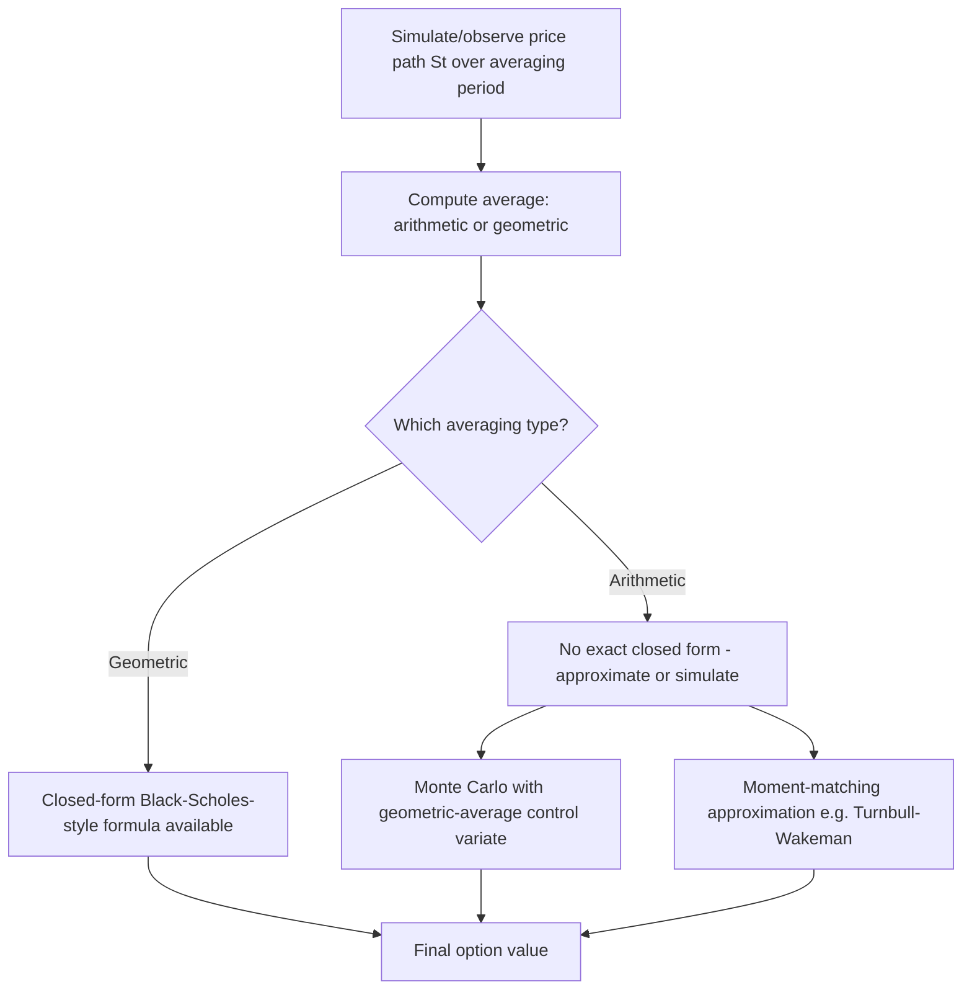

## Path-Dependent Exotic Options


### Overview

Path-dependent exotic options have payoffs determined by the entire trajectory of the underlying asset's price over the option's life, not merely its terminal value. This distinguishes them from standard European options and requires fundamentally different pricing techniques — path-dependent payoffs generally cannot be reduced to a simple terminal-distribution expectation, often demanding PDE methods with additional state variables, specialized closed-form results, or Monte Carlo simulation of full price paths.

### Classification of Path Dependence

**Key Points**

- **Strong path dependence**: the payoff depends on the entire realized path in a way that cannot be captured by a low-dimensional summary statistic (e.g., full Asian averaging with continuous monitoring in certain formulations) — generally requires simulation or high-dimensional numerical methods
- **Weak path dependence**: the payoff depends on the path only through a small number of summary statistics (running maximum, running minimum, arithmetic average) that can themselves be tracked as an additional Markovian state variable — often permits PDE methods with an augmented state space
- This distinction matters practically: weak path dependence frequently still allows PDE/tree-based pricing (by adding the summary statistic as a second state variable), while genuinely strong path dependence more often necessitates Monte Carlo simulation

### Asian Options

Asian options have payoffs based on the average price of the underlying over some period, rather than the terminal price alone.

**Arithmetic average Asian call**: $\text{Payoff} = \max\left(\frac{1}{n}\sum_{i=1}^n S_{t_i} - K, 0\right)$

**Geometric average Asian call**: $\text{Payoff} = \max\left(\left(\prod_{i=1}^n S_{t_i}\right)^{1/n} - K, 0\right)$

**Key Points**

- Averaging reduces the effective volatility of the payoff relative to a standard option on $S_T$ alone — this makes Asian options systematically cheaper than otherwise-comparable European options, and particularly useful for hedging exposures to an average price (e.g., commodity purchases spread over a period)
- The **geometric average** Asian option has a well-known closed-form solution: since the geometric average of log-normal variables is itself log-normal, the geometric Asian option can be priced with a Black-Scholes-style formula using an adjusted volatility and drift
- The **arithmetic average** Asian option has **no exact closed-form solution** in the standard Black-Scholes framework, since the sum of log-normal random variables is not log-normal — this is a classic, well-documented result in derivatives pricing, not merely a computational inconvenience
- Standard practical approaches for arithmetic Asians: Monte Carlo simulation (straightforward but can be slow to converge for high precision), the geometric-average closed form used as a control variate to dramatically reduce Monte Carlo variance, or moment-matching approximations (e.g., approximating the arithmetic average's distribution with a log-normal distribution matched on the first two moments — the Turnbull-Wakeman approximation)

### Diagram: Asian Option Averaging Mechanism



### Barrier Options

Barrier options activate ("knock-in") or deactivate ("knock-out") based on whether the underlying crosses a specified barrier level $B$ during the option's life.

| Type | Description |
| --- | --- |
| Up-and-out | Standard payoff, but voided if $S_t$ rises above $B$ |
| Down-and-out | Standard payoff, but voided if $S_t$ falls below $B$ |
| Up-and-in | Standard payoff activates only if $S_t$ rises above $B$ |
| Down-and-in | Standard payoff activates only if $S_t$ falls below $B$ |

**Key Points**

- Knock-in and knock-out options of the same type sum to a standard vanilla option: e.g., (down-and-in call) + (down-and-out call) = (standard vanilla call) — a widely used static-replication identity ("in-out parity") that provides a valuable pricing and hedging cross-check
- Under Black-Scholes assumptions (continuous monitoring, constant volatility), single-barrier options have **closed-form solutions** derived using the reflection principle for Brownian motion — a classic result (Merton 1973 for down-and-out, extended by others for the full family)
- Barrier options are generally cheaper than equivalent vanilla options (knock-out reduces the range of favorable outcomes; knock-in requires an additional condition to be satisfied) — making them attractive for investors wanting cheaper, conditional exposure
- **Discrete monitoring** (barrier checked only at specific dates, e.g., daily closing prices, rather than continuously) is far more common in practice than continuous monitoring, and requires an adjustment to the continuous-monitoring closed-form formula (the Broadie-Glasserman-Kou correction is a standard approximation technique) since discrete monitoring systematically produces different (typically less extreme) knock-out/knock-in probabilities than continuous monitoring

### Diagram: Barrier Option Path Scenarios (svg_diagram)

<svg xmlns="http://www.w3.org/2000/svg" viewBox="0 0 640 280">
<text x="320" y="24" text-anchor="middle" font-size="16" font-weight="bold" fill="#1a1a2e">Barrier Option Path Scenarios (svg_diagram)</text>
<line x1="60" y1="240" x2="600" y2="240" stroke="#333" stroke-width="1" />
<line x1="60" y1="40" x2="60" y2="240" stroke="#333" stroke-width="1" />
<text x="600" y="255" font-size="10" fill="#333">time</text>
<line x1="60" y1="100" x2="600" y2="100" stroke="#dc2626" stroke-width="1.5" stroke-dasharray="5,3" />
<text x="500" y="93" font-size="11" fill="#dc2626">Barrier B (up)</text>
<path d="M 60 200 C 150 190, 250 175, 350 165 S 500 150, 600 145" fill="none" stroke="#15803d" stroke-width="2.5" />
<text x="380" y="180" font-size="11" fill="#15803d" font-weight="bold">Path 1: stays below B (up-and-out survives)</text>
<path d="M 60 210 C 150 180, 220 120, 260 95" fill="none" stroke="#4338ca" stroke-width="2.5" />
<circle cx="260" cy="95" r="4" fill="#4338ca" />
<path d="M 260 95 L 260 240" stroke="#4338ca" stroke-width="2" stroke-dasharray="2,2" />
<text x="270" y="70" font-size="11" fill="#4338ca" font-weight="bold">Path 2: crosses B (up-and-out knocked out)</text>
</svg>

### Lookback Options

Lookback options pay based on the extreme (maximum or minimum) price achieved over the option's life.

**Floating-strike lookback call**: $\text{Payoff} = S_T - \min_{0 \leq t \leq T} S_t$

**Fixed-strike lookback call**: $\text{Payoff} = \max\left(\max_{0 \leq t \leq T} S_t - K, 0\right)$

**Key Points**

- Floating-strike lookback options guarantee the holder buys at the lowest price (call) or sells at the highest price (put) achieved during the option's life — offering "perfect hindsight" timing, at a correspondingly high premium relative to vanilla options
- Both floating- and fixed-strike lookback options have **closed-form solutions under Black-Scholes assumptions**, again derived via reflection-principle techniques applied to the running maximum/minimum of Brownian motion — this is a classic, well-documented result (Goldman, Sosin, and Gatto, 1979)
- The running maximum/minimum is a weakly path-dependent statistic (it can be tracked as a single additional state variable), which is precisely why closed-form and PDE-based solutions remain tractable despite the payoff depending on the entire path

### Comparison of Path-Dependent Types

| Option Type | Path Dependence Type | Closed Form (Black-Scholes) |
| --- | --- | --- |
| Geometric Asian | Weak (via log-average) | Yes |
| Arithmetic Asian | Strong (sum of log-normals) | No — approximate/simulate |
| Single barrier (continuous monitoring) | Weak (hitting time) | Yes |
| Single barrier (discrete monitoring) | Weak, but discretized | Approximate correction needed |
| Lookback (fixed or floating strike) | Weak (running extremum) | Yes |
| Cliquet / ratchet options | Strong (path of resets) | No — generally requires simulation or PDE with multiple states |

### Cliquet (Ratchet) Options

**Key Points**

- Cliquet options consist of a series of forward-starting options, each resetting its strike periodically (e.g., monthly or annually) to the then-current spot price, with the total payoff summing (and often capping/flooring) the individual period returns
- These are genuinely strongly path-dependent in the sense that the payoff depends on the sequence of period-by-period returns, not merely a single summary statistic — pricing typically requires either Monte Carlo simulation or a PDE approach with the current period's reset level as an evolving state variable
- Cliquets are commonly embedded in structured retail products (e.g., equity-linked structured notes with capped/floored annual returns), making their accurate pricing and Greeks calculation directly relevant to structured products risk management

### Numerical Methods for Path-Dependent Options

**Key Points**

- **Monte Carlo simulation** is the most general and flexible approach, directly simulating full price paths and computing the path-dependent payoff — necessary for genuinely strongly path-dependent products (arithmetic Asians, cliquets) lacking tractable closed forms
- **PDE methods with augmented state variables**: for weakly path-dependent options (barriers, lookbacks, and even arithmetic Asians via an auxiliary running-average state variable), a PDE in an enlarged state space (e.g., $(S_t, A_t)$ where $A_t$ is the running average) can be solved via finite differences — often more computationally efficient than Monte Carlo for lower-dimensional problems, particularly for American-style path-dependent options
- **Binomial/trinomial trees** with an additional state variable for the path-dependent statistic offer another discretization approach, historically important though largely superseded by finite-difference PDE methods and Monte Carlo in modern practice for complex path dependence
- [Unverified] Relative computational efficiency between PDE and Monte Carlo approaches for any specific path-dependent product depends heavily on dimensionality, monitoring frequency, and desired precision; no single method dominates universally across all path-dependent product types

**Output**

```python
import numpy as np

def price_arithmetic_asian_call_mc(S0, K, r, sigma, T, n_steps, n_paths=100_000):
    dt = T / n_steps
    Z = np.random.standard_normal((n_paths, n_steps))
    log_increments = (r - 0.5*sigma**2)*dt + sigma*np.sqrt(dt)*Z
    log_paths = np.cumsum(log_increments, axis=1)
    S_paths = S0 * np.exp(log_paths)
    arithmetic_avg = np.mean(S_paths, axis=1)
    payoff = np.maximum(arithmetic_avg - K, 0)
    price = np.exp(-r*T) * np.mean(payoff)
    std_error = np.exp(-r*T) * np.std(payoff) / np.sqrt(n_paths)
    return price, std_error
```

### American-Style Path-Dependent Options: Additional Complexity

**Key Points**

- Combining early-exercise (American-style) features with path dependence (e.g., American Asian options, American barrier options) compounds numerical difficulty — early-exercise decisions require solving an optimal stopping problem *jointly* with tracking the path-dependent state variable
- These generally require PDE/finite-difference methods with the augmented state space (for weak path dependence) or specialized simulation techniques such as the Longstaff-Schwartz least-squares Monte Carlo method (which handles early exercise within a simulation framework) for strongly path-dependent cases
- [Inference] American path-dependent options are generally considered among the more computationally demanding standard exotic products to price accurately, given the combination of an optimal stopping problem with path dependence, though the specific relative difficulty compared to other complex exotics (e.g., multi-asset options) depends on the particular product structure

### Model Risk Considerations

**Key Points**

- Path-dependent option prices, especially barrier and lookback options, are often considerably more sensitive to the assumed volatility model (constant Black-Scholes volatility vs. local volatility vs. stochastic volatility) than vanilla European options, since path-dependent payoffs are directly exposed to the volatility's behavior throughout the price path, not just at a single terminal date
- Barrier options in particular are known to exhibit substantial pricing differences across volatility models calibrated to the *same* vanilla option smile — a well-documented phenomenon in the derivatives literature, since different models with identical marginal (terminal) distributions can imply very different joint (path) distributions
- This model-dependence makes robust hedging and model validation particularly important for path-dependent exotic desks, and is a standard topic in exotic derivatives risk management discussions

### Common Pitfalls

**Key Points**

- Assuming a closed-form solution exists for all "average" or "extremum" type payoffs — arithmetic averaging fundamentally lacks a closed form under Black-Scholes assumptions, while geometric averaging and running extrema do have closed forms; conflating these leads to using the wrong (or a nonexistent) pricing formula
- Using continuous-monitoring barrier formulas directly for discretely monitored barriers without the appropriate correction — this systematically misprices the option, since discrete monitoring changes the effective barrier-crossing probability
- Underestimating model sensitivity for barrier and lookback options — calibrating only to vanilla option prices and assuming the resulting model is adequate for path-dependent product pricing ignores well-documented differences in path-dependent pricing across models with identical vanilla fit
- Applying naive Monte Carlo without variance reduction (e.g., control variates using the geometric-average closed form) for arithmetic Asian options — this can require an impractically large number of paths for acceptable pricing precision

### Conclusion

Path-dependent exotic options require pricing techniques attentive to the specific nature of their path dependence: weakly path-dependent products (barriers, lookbacks, geometric Asians) often retain closed-form or PDE-tractable solutions via reflection-principle results or augmented state variables, while strongly path-dependent products (arithmetic Asians, cliquets) generally require Monte Carlo simulation or careful approximation techniques. Understanding this classification — and the associated model sensitivity, particularly pronounced for barrier and lookback options — is essential for correctly selecting a pricing methodology and appropriately managing the model risk inherent in exotic derivatives trading.

**Related Topics**

- Ito's lemma and stochastic integration
- Risk-neutral valuation
- Monte Carlo methods and variance reduction techniques
- Local volatility and stochastic volatility models
- American option pricing and free-boundary PDE problems
- Longstaff-Schwartz least-squares Monte Carlo method
- Structured products and cliquet option embedding
- Volatility smile and model risk in exotic derivatives