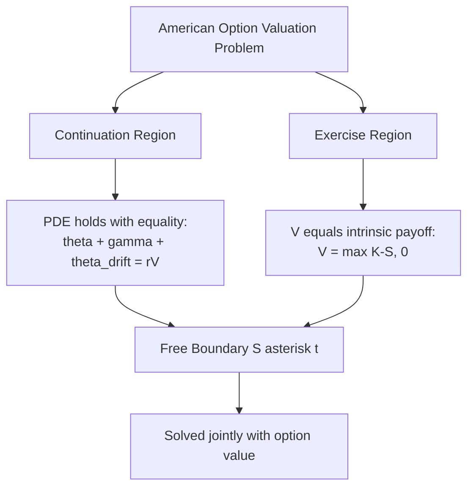

## American Option Pricing Methods

### Overview

American options grant the holder the right to exercise at any time up to and including expiration, in contrast to European options that permit exercise only at maturity. This early exercise feature introduces an optimal stopping problem into the valuation framework: at every point in time, the holder must compare the immediate exercise value against the continuation value of holding the option. Because no general closed-form solution exists for American options (except in a few special cases), practitioners rely on numerical methods.

The valuation problem can be expressed as:

$$V(S,t) = \sup_{\tau \in [t,T]} \mathbb{E}^{\mathbb{Q}}\left[e^{-r(\tau - t)} \Psi(S_\tau)\right]$$

where $\tau$ is a stopping time, $\Psi(S)$ is the payoff function, $\mathbb{Q}$ is the risk-neutral measure, and the supremum is taken over all admissible exercise strategies.

### Why American Options Require Special Treatment

**Key Points**

- For a non-dividend-paying American call, early exercise is never optimal, so its value equals that of the corresponding European call (a well-established result following from put-call parity and the non-negativity of interest rates).
- For American puts, and for American calls on dividend-paying assets, early exercise can be optimal, and the option value must incorporate this possibility.
- The free boundary $S^*(t)$, the critical stock price at which immediate exercise becomes optimal, is unknown in advance and must be solved for jointly with the option value. This makes the problem a **free-boundary problem** (also called an optimal stopping problem).

### The Optimal Stopping / Free Boundary Formulation

For an American put with strike $K$, the option value $V(S,t)$ satisfies the following complementarity conditions:

$$\frac{\partial V}{\partial t} + \frac{1}{2}\sigma^2 S^2 \frac{\partial^2 V}{\partial S^2} + rS\frac{\partial V}{\partial S} - rV \leq 0$$

$$V(S,t) \geq \max(K - S, 0)$$

with equality holding in at least one of the two conditions at every point. This is the **linear complementarity problem (LCP)** formulation, central to PDE-based numerical schemes.

The domain splits into:

- **Continuation region**: where $V(S,t) > \Psi(S)$ and the PDE holds with equality
- **Exercise region**: where $V(S,t) = \Psi(S)$ and holding is suboptimal

The boundary between these regions, $S^*(t)$, is the **early exercise boundary**.

### Method 1: Binomial and Trinomial Trees

**Binomial Tree (Cox-Ross-Rubinstein)**

The asset price is modeled as a discrete-time lattice where, over each step $\Delta t$, the price moves up by factor $u$ or down by factor $d$:

$$u = e^{\sigma\sqrt{\Delta t}}, \quad d = 1/u, \quad p = \frac{e^{r\Delta t} - d}{u - d}$$

Valuation proceeds via **backward induction**. At each node, the holder compares the discounted expected continuation value against immediate exercise:

$$V_{i,j} = \max\left(\Psi(S_{i,j}),\; e^{-r\Delta t}\left[p\,V_{i+1,j+1} + (1-p)\,V_{i+1,j}\right]\right)$$

**Example**

Consider an American put with $S_0 = 50$, $K = 52$, $r = 5\%$, $\sigma = 30\%$, $T = 1$ year, using a 3-step tree ($\Delta t = 1/3$):

- $u = e^{0.30\sqrt{1/3}} \approx 1.189$, $d \approx 0.841$
- $p = \frac{e^{0.05/3} - 0.841}{1.189 - 0.841} \approx 0.492$

At each terminal node, payoff is $\max(K - S_T, 0)$. Rolling backward, at every intermediate node the holder checks whether $K - S_{i,j}$ exceeds the discounted continuation value; if so, that node is set to the exercise value instead. This produces a value at $t=0$ typically a few percent higher than the equivalent European put, reflecting the **early exercise premium**.

**Trinomial trees** add a "stay the same" branch, offering improved convergence stability and better handling of barriers or discrete dividends, at the cost of additional computation per node.

**Convergence properties**: Binomial tree prices converge to the true value at rate $O(1/N)$ typically, with oscillatory convergence due to the strike not aligning cleanly with tree nodes in all steps. Techniques such as Richardson extrapolation, Black-Scholes-based smoothing (BBS), or Broadie-Detemple's control variate technique can significantly accelerate convergence. [Inference: exact convergence order can vary based on implementation and payoff smoothness.]

### Method 2: Finite Difference Methods (PDE-Based)

Finite difference methods discretize the Black-Scholes PDE directly on a grid of asset price and time, then solve for $V$ subject to the early-exercise constraint.

**Explicit, Implicit, and Crank-Nicolson Schemes**

- **Explicit scheme**: Simple to implement but conditionally stable, requiring $\Delta t \leq \frac{(\Delta S)^2}{\sigma^2 S_{max}^2}$ roughly, which can force very fine time steps.
- **Implicit scheme**: Unconditionally stable; requires solving a tridiagonal linear system at each time step.
- **Crank-Nicolson**: Second-order accurate in both time and space; averages explicit and implicit schemes but can exhibit spurious oscillations near non-smooth payoffs (mitigated via Rannacher smoothing).

**Handling the Early Exercise Constraint**

At each time step, after solving the PDE step, the American constraint is imposed via:

**Projected SOR (Successive Over-Relaxation)**: Iteratively solves the LCP by updating grid values and projecting onto the exercise constraint:

$$V_i^{k+1} = \max\left(\Psi(S_i),\; V_i^k + \omega \cdot \frac{(\text{residual})}{a_{ii}}\right)$$

where $\omega$ is a relaxation parameter (typically $1 < \omega < 2$).

**Brennan-Schwartz algorithm**: For tridiagonal systems, applies a direct forward-backward substitution combined with a constraint check, avoiding the iterative overhead of PSOR while exploiting the tridiagonal structure. This method is efficient specifically because American option LCPs on a single underlying asset produce tridiagonal matrices.

**Penalty Methods**: Add a penalty term to the PDE that heavily penalizes values falling below the exercise boundary, converting the LCP into a nonlinear PDE solvable with standard time-stepping:

$$\frac{\partial V}{\partial t} + \mathcal{L}V + \rho \cdot \max(\Psi(S) - V, 0) = 0$$

where $\rho$ is a large penalty parameter.

### Method 3: Monte Carlo Simulation — Least Squares Monte Carlo (LSM)

Standard Monte Carlo simulation is naturally suited to European-style payoffs since it works forward in time, whereas American options require comparing continuation vs. exercise value, which is inherently a backward-looking computation. The **Longstaff-Schwartz (2001) Least Squares Monte Carlo (LSM)** algorithm resolves this by combining forward simulation with backward regression-based estimation of continuation values.

**Algorithm Steps**

1. Simulate $M$ paths of the underlying asset from $t=0$ to $T$ across $N$ time steps.
2. At maturity $T$, set option value equal to intrinsic payoff for each path.
3. Step backward through time. At each exercise date $t_i$, for paths that are **in-the-money**, regress the discounted future cash flows (continuation value) on a set of basis functions of the current stock price (e.g., Laguerre polynomials, or simple powers $1, S, S^2$).
4. Use the fitted regression to estimate the continuation value at $t_i$ for each in-the-money path.
5. Compare estimated continuation value to immediate exercise value; if exercise value is higher, mark that path as exercised at $t_i$ and set future cash flows on that path to zero.
6. Repeat backward to $t=0$; discount and average all realized cash flows to obtain the option value.

**Example**

For pricing an American put via LSM with basis functions $\{1, S, S^2\}$:

$$C(S_{t_i}) \approx \beta_0 + \beta_1 S_{t_i} + \beta_2 S_{t_i}^2$$

The regression coefficients $\beta_0, \beta_1, \beta_2$ are estimated via ordinary least squares using only in-the-money paths at each step, since out-of-the-money paths carry no exercise decision.

**Practical Considerations**

- LSM is well-suited to **high-dimensional problems** (e.g., basket options, options on multiple underlyings) where lattice and PDE grid methods suffer from the curse of dimensionality.
- The choice of basis functions affects accuracy; too few terms can bias continuation value estimates downward, while too many can introduce overfitting on sparse in-the-money path sets. [Inference: the specific bias/variance tradeoff depends on the payoff structure and number of simulated paths.]
- LSM produces a **lower bound** on the true American option price (since it approximates but does not perfectly identify the optimal exercise policy). Complementary techniques (e.g., dual/upper-bound methods by Rogers, or Andersen-Broadie) provide upper bounds to bracket the true value.

### Method 4: Analytical and Quasi-Analytical Approximations

**Barone-Adesi and Whaley (1987) Quadratic Approximation**

Decomposes the American option value into the European value plus an early exercise premium approximated via a quadratic function:

$$V_{American}(S) = V_{European}(S) + \epsilon(S)$$

where $\epsilon(S)$ is derived by approximating the free boundary PDE with a simplified quadratic form. This method is computationally fast (closed-form-like) and reasonably accurate for many practical parameter ranges, though it can lose precision for options far from at-the-money or with very long maturities. [Inference: accuracy degrades under extreme parameter combinations; exact error bounds are implementation- and parameter-dependent.]

**Bjerksund-Stensland Approximation**

An alternative closed-form approximation using an exercise boundary flat-approximation technique, often praised for computational speed and reasonable accuracy, particularly the 2002 refinement which improved upon the original 1993 model.

**MacMillan (1986)**

An early quadratic approximation method for American puts, foundational to the later Barone-Adesi-Whaley extension to calls with dividends.

### Method 5: Integral Equation / Early Exercise Boundary Methods

The American option price can be represented as the European option value plus an early exercise premium expressed as an integral over the (unknown) exercise boundary:

$$V(S,t) = V_{European}(S,t) + \int_t^T e^{-r(u-t)} rK \, \mathbb{Q}(S_u < S^*(u)) \, du$$

(for a put; sign and payoff conventions adjust for calls). The exercise boundary $S^*(t)$ itself satisfies a nonlinear integral (Fredholm-type) equation that must be solved numerically, often via iterative or recursive quadrature schemes. This approach, associated with Kim (1990), Jacka (1991), and Carr-Jarrow-Myneni (1992), offers high accuracy and insight into the boundary's behavior but is more mathematically involved to implement than tree or PDE methods.

### Comparison of Methods

| Method | Speed | Accuracy | Dimensionality | Typical Use |
| --- | --- | --- | --- | --- |
| Binomial/Trinomial Tree | Fast (low-dim) | Good, converges $O(1/N)$ | Low (1-2 assets) | Vanilla American options, teaching |
| Finite Difference (PSOR/Brennan-Schwartz) | Fast | High (grid-dependent) | Low-moderate | Vanilla and barrier-type American options |
| Least Squares Monte Carlo | Moderate-slow | Lower bound, improves with paths/basis | High (multi-asset) | Basket options, path-dependent American features |
| Barone-Adesi-Whaley / Bjerksund-Stensland | Very fast | Approximate | Low | Real-time pricing, initial estimates |
| Integral Equation Methods | Moderate | Very high | Low | Benchmark/reference pricing |

### Early Exercise Boundary Behavior (Illustration)

<svg xmlns="http://www.w3.org/2000/svg" viewBox="0 0 700 420">
<text x="350" y="30" font-size="18" text-anchor="middle" font-family="sans-serif" font-weight="bold">Early Exercise Boundary for American Put (svg_diagram)</text>
<line x1="80" y1="360" x2="650" y2="360" stroke="black" stroke-width="2" />
<line x1="80" y1="360" x2="80" y2="50" stroke="black" stroke-width="2" />
<text x="365" y="395" font-size="14" text-anchor="middle" font-family="sans-serif">Time (t)</text>
<text x="30" y="200" font-size="14" text-anchor="middle" font-family="sans-serif" transform="rotate(-90 30 200)">Stock Price (S)</text>
<line x1="80" y1="100" x2="650" y2="100" stroke="gray" stroke-dasharray="5,5" />
<text x="655" y="104" font-size="12" font-family="sans-serif">K (strike)</text>
<path d="M 80 130 Q 250 180 400 240 T 640 340" stroke="#2563eb" stroke-width="3" fill="none" />
<text x="450" y="220" font-size="13" font-family="sans-serif" fill="#2563eb">Exercise Boundary S*(t)</text>

<text x="150" y="90" font-size="13" font-family="sans-serif" fill="`#16a34a`">Continuation Region</text>

<text x="150" y="340" font-size="13" font-family="sans-serif" fill="`#dc2626`">Exercise Region (S below S*)</text>

<path d="M 80 130 Q 250 180 400 240 T 640 340 L 640 360 L 80 360 Z" fill="#fecaca" opacity="0.4" />
<path d="M 80 130 Q 250 180 400 240 T 640 340 L 640 50 L 80 50 Z" fill="#bbf7d0" opacity="0.4" />
<circle cx="640" cy="340" r="4" fill="black" />
<text x="600" y="365" font-size="12" font-family="sans-serif">T (maturity)</text>
</svg>

The boundary $S^*(t)$ rises monotonically toward the strike $K$ as $t \to T$ for a put, reflecting that near expiration, less time value remains to justify waiting, so the exercise threshold approaches the intrinsic-value breakeven point.

### Practical Implementation Notes

- **Dividend handling**: Discrete dividends complicate tree and PDE methods since the ex-dividend price drop must be incorporated at the correct nodes/time steps, potentially requiring non-recombining trees or specialized adjustments.
- **Greeks extraction**: Finite difference and tree methods naturally yield Greeks (Delta, Gamma) via finite differencing on the grid itself; LSM requires additional techniques (e.g., pathwise or likelihood ratio methods) for stable Greek estimation. [Unverified: LSM Greek stability varies significantly with basis function choice and path count; practitioners should validate against benchmark methods.]
- **Computational cost tradeoffs**: For single-asset vanilla American options, PDE/tree methods are typically preferred due to speed and accuracy; LSM becomes the practical necessity once dimensionality exceeds what grid-based methods can handle efficiently.

### Related Topics

- Optimal stopping theory and martingale methods in option pricing
- Bermudan option pricing and quasi-American approximations
- American options on dividend-paying stocks and foreign exchange (Garman-Kohlhagen adjustments)
- Multi-asset American options and the curse of dimensionality
- Dual/upper-bound Monte Carlo methods (Rogers, Andersen-Broadie, Haugh-Kogan)
- Free boundary problems in mathematical finance
- American-style interest rate derivatives (Bermudan swaptions)
- Real options analysis as an application of American option theory