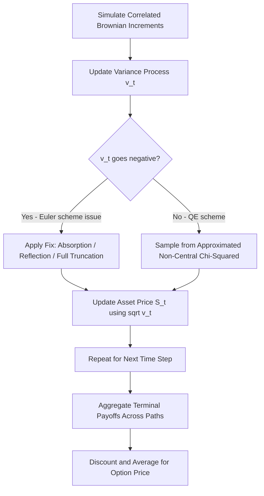

## Stochastic Volatility Models

### Overview

Stochastic volatility (SV) models extend the Black-Scholes framework by treating the volatility of the underlying asset as a random process rather than a constant parameter. This addresses well-documented empirical shortcomings of Black-Scholes, most notably the **volatility smile/skew**, where implied volatilities vary systematically across strikes and maturities, contradicting the constant-volatility assumption.

Under a general SV framework, the asset price and its variance follow a coupled system of stochastic differential equations (SDEs):

$$dS_t = \mu S_t \, dt + \sqrt{v_t}\, S_t \, dW_t^S$$

$$dv_t = \alpha(v_t, t)\, dt + \beta(v_t, t)\, dW_t^v$$

where $W_t^S$ and $W_t^v$ are Brownian motions with correlation $\rho$, i.e., $dW_t^S \, dW_t^v = \rho \, dt$. The correlation $\rho$ is critical: negative $\rho$ produces the **leverage effect** commonly observed in equity markets, where falling prices are associated with rising volatility, generating a negative skew in implied volatility.

### Motivation: Limitations of Constant Volatility

**Key Points**

- Black-Scholes assumes $\sigma$ is constant across all strikes and maturities, but market-observed implied volatilities form a **smile** (for FX) or **skew** (for equities) when plotted against strike.
- Historical volatility exhibits **volatility clustering** (Mandelbrot's observation that large price changes tend to follow large price changes) and **mean reversion**, neither of which a constant-volatility model can capture.
- Asset returns exhibit **fat tails** (excess kurtosis) relative to the lognormal distribution implied by geometric Brownian motion, which SV models can partially reproduce through the volatility-of-volatility term.

### The Heston Model (1993)

The most widely used SV model in practice, chosen for its combination of financial realism and mathematical tractability via a semi-closed-form solution.

**Model Specification**

$$dS_t = \mu S_t \, dt + \sqrt{v_t}\, S_t \, dW_t^S$$

$$dv_t = \kappa(\theta - v_t)\, dt + \xi \sqrt{v_t}\, dW_t^v, \quad dW_t^S \, dW_t^v = \rho \, dt$$

**Parameters**

- $v_t$: instantaneous variance (not volatility) at time $t$
- $\kappa$: speed of mean reversion of variance
- $\theta$: long-run mean variance
- $\xi$ (or $\sigma_v$): volatility of variance ("vol of vol")
- $\rho$: correlation between asset and variance shocks

**Feller Condition**

To ensure the variance process $v_t$ remains strictly positive (does not hit zero), the parameters must satisfy:

$$2\kappa\theta \geq \xi^2$$

When this condition is violated, the variance process can theoretically reach zero, though it remains non-negative under the model's square-root diffusion structure (a Cox-Ingersoll-Ross-type process). [Inference: in practice, many calibrated parameter sets violate the Feller condition without causing numerical breakdown, since the process still respects the CIR boundary behavior; this is a widely noted empirical observation among practitioners.]

**Semi-Closed-Form Solution**

Heston derived a solution using the characteristic function approach combined with Fourier inversion. The European call price is given by:

$$C = S_0 P_1 - K e^{-rT} P_2$$

where $P_1$ and $P_2$ are probabilities obtained by inverting the characteristic function $\phi(u; v_0, T)$ of the log-asset price:

$$P_j = \frac{1}{2} + \frac{1}{\pi}\int_0^\infty \text{Re}\left[\frac{e^{-iu\ln K}\phi_j(u)}{iu}\right] du, \quad j = 1,2$$

This requires numerical integration (quadrature) rather than a fully closed-form expression, but is substantially faster than Monte Carlo simulation for vanilla options and is the standard tool for calibration to market-quoted implied volatility surfaces.

### Calibration and the Volatility Smile

**Example**

Calibrating the Heston model to a market-observed implied volatility surface typically involves:

1. Collecting market prices (or implied volatilities) for European options across multiple strikes and maturities.
2. Defining an objective function, commonly the sum of squared differences between model-implied and market-implied volatilities:

   $$\min_{\kappa,\theta,\xi,\rho,v_0} \sum_{i} w_i \left(\sigma_{model}^{(i)} - \sigma_{market}^{(i)}\right)^2$$
3. Using the semi-closed-form pricing formula (via Fourier methods, e.g., the Carr-Madan FFT approach) to rapidly compute model prices at each optimization iteration.
4. Applying a numerical optimizer (Levenberg-Marquardt, differential evolution, or similar) to find parameters that best fit observed prices.

A well-calibrated Heston model can reproduce a smile/skew shape reasonably well for a single maturity but often struggles to simultaneously fit the **term structure** of skew across multiple maturities, a known limitation motivating extensions discussed below. [Inference: fit quality is highly dependent on the specific market and time period; some markets and maturities calibrate substantially better than others.]

### The SABR Model (Stochastic Alpha, Beta, Rho)

Developed by Hagan, Kumar, Lesniewski, and Woodward (2002), SABR is especially popular in **interest rate derivatives** markets (caps, floors, swaptions) due to its ability to fit the smile with an accurate asymptotic (approximate closed-form) implied volatility formula.

**Model Specification**

$$dF_t = \alpha_t F_t^\beta \, dW_t^F$$

$$d\alpha_t = \nu \alpha_t \, dW_t^\alpha, \quad dW_t^F \, dW_t^\alpha = \rho\, dt$$

**Parameters**

- $F_t$: forward price/rate
- $\alpha_t$: stochastic volatility level
- $\beta$: CEV-type exponent controlling the backbone shape of the volatility curve ($\beta = 1$ is lognormal-like, $\beta = 0$ is normal-like)
- $\nu$: volatility of volatility
- $\rho$: correlation between forward and volatility shocks

**Hagan's Asymptotic Implied Volatility Formula**

SABR's defining practical advantage is Hagan's approximate closed-form formula for implied Black volatility, allowing near-instantaneous calibration without numerical PDE or Monte Carlo solving:

$$\sigma_{Black}(K, F) \approx \frac{\alpha}{(FK)^{(1-\beta)/2}} \cdot \left[1 + \frac{(1-\beta)^2}{24}\ln^2(F/K) + \ldots\right] \cdot \left(\frac{z}{x(z)}\right) \cdot \left[1 + \left(\text{correction terms in } T\right)\right]$$

(the full expression involves several correction terms depending on $\beta$, $\rho$, $\nu$, and time to maturity $T$; the formula is an asymptotic expansion valid for moderate strikes near the forward). [Unverified: this asymptotic approximation is known to break down or produce arbitrage (negative densities) for very low strikes/rates or extreme parameter combinations; practitioners often supplement with shifted-SABR or free-boundary SABR variants for such regimes.]

### Comparison of Common Stochastic Volatility Models

| Model | Variance Process | Closed-Form? | Primary Use Case |
| --- | --- | --- | --- |
| Heston (1993) | CIR (mean-reverting square-root) | Semi-closed-form (Fourier) | Equity/FX vanilla option calibration |
| SABR (2002) | Lognormal-type | Asymptotic approximation | Interest rate smile (caps, swaptions) |
| SABR-Heston hybrids | Combined | Numerical/approximate | Long-dated rates products |
| 3/2 Model | Nonlinear mean reversion | Semi-closed-form | Alternative equity vol dynamics |
| Local Stochastic Volatility (LSV) | Hybrid local+stochastic | Numerical (PDE/MC) | Exotic/path-dependent derivatives |

### Local Stochastic Volatility (LSV) Models

LSV models combine a **local volatility** component (a deterministic function of spot and time, as in Dupire's local volatility model) with a stochastic volatility component:

$$dS_t = \mu S_t \, dt + L(S_t, t)\sqrt{v_t}\, S_t \, dW_t^S$$

where $L(S_t, t)$ is a local volatility "leverage function" calibrated such that the model exactly reproduces the market-observed implied volatility surface (matching Dupire's local volatility surface), while $v_t$ still evolves stochastically (typically following Heston-style dynamics). This hybrid approach is often favored for pricing **exotic and path-dependent options** since it captures both the exact vanilla smile fit of local volatility models and the more realistic forward-looking dynamics of stochastic volatility, which matters significantly for barrier options, cliquets, and other path-dependent structures. [Inference: the relative advantage of LSV over pure local or pure stochastic volatility models can vary by product type and is an area of ongoing practitioner debate.]

### Simulation of Stochastic Volatility Models

**Euler-Maruyama Discretization (Naive)**

The simplest simulation approach discretizes the SDEs directly:

$$v_{t+\Delta t} = v_t + \kappa(\theta - v_t)\Delta t + \xi\sqrt{v_t}\sqrt{\Delta t}\, Z_v$$

$$S_{t+\Delta t} = S_t \exp\left[\left(r - \frac{1}{2}v_t\right)\Delta t + \sqrt{v_t}\sqrt{\Delta t}\, Z_S\right]$$

with $\text{corr}(Z_S, Z_v) = \rho$. A key practical issue is that this discretization can produce **negative variance** values due to the square-root term, requiring a fix such as:

- **Absorption**: set $v_t = \max(v_t, 0)$
- **Reflection**: set $v_t = |v_t|$
- **Full truncation**: use $\max(v_t, 0)$ inside the square root only, allowing $v_t$ itself to go negative before correction

**Andersen's Quadratic-Exponential (QE) Scheme (2008)**

A more accurate and widely adopted simulation scheme specifically designed for the Heston model's CIR-type variance process, which approximates the non-central chi-squared distribution of $v_{t+\Delta t}$ using either a quadratic transformation of a Gaussian (for larger variance values) or an exponential-type distribution (for smaller variance values, closer to zero), substantially reducing discretization bias compared to naive Euler schemes.

### Simulation Path Behavior (Illustration)

### Volatility Smile Shape Across Models (Illustration)

<svg xmlns="http://www.w3.org/2000/svg" viewBox="0 0 700 420">
<text x="350" y="30" font-size="18" text-anchor="middle" font-family="sans-serif" font-weight="bold">Implied Volatility Smile/Skew Comparison (svg_diagram)</text>
<line x1="80" y1="360" x2="650" y2="360" stroke="black" stroke-width="2" />
<line x1="80" y1="360" x2="80" y2="50" stroke="black" stroke-width="2" />
<text x="365" y="395" font-size="14" text-anchor="middle" font-family="sans-serif">Strike (K)</text>
<text x="30" y="200" font-size="14" text-anchor="middle" font-family="sans-serif" transform="rotate(-90 30 200)">Implied Vol</text>
<line x1="365" y1="50" x2="365" y2="360" stroke="gray" stroke-dasharray="4,4" />
<text x="370" y="65" font-size="12" font-family="sans-serif">ATM</text>
<path d="M 100 200 Q 250 90 365 100 T 630 220" stroke="#dc2626" stroke-width="3" fill="none" />
<text x="440" y="150" font-size="13" font-family="sans-serif" fill="#dc2626">Negative rho (equity skew)</text>
<path d="M 100 150 Q 250 300 365 320 T 630 160" stroke="#2563eb" stroke-width="3" fill="none" />
<text x="440" y="330" font-size="13" font-family="sans-serif" fill="#2563eb">Symmetric smile (FX-like, rho near 0)</text>
<line x1="100" y1="200" x2="630" y2="200" stroke="#16a34a" stroke-width="2" stroke-dasharray="6,3" />
<text x="480" y="195" font-size="13" font-family="sans-serif" fill="#16a34a">Black-Scholes (flat, constant vol)</text>
</svg>

### Practical Implementation Notes

- **Model choice by asset class**: Heston and its variants dominate equity index and single-stock derivatives pricing; SABR dominates interest rate derivatives due to its tractable smile formula and natural fit to rate dynamics.
- **Calibration stability**: SV model parameters can exhibit instability day-to-day when recalibrated to market data, particularly $\rho$ and $\xi$, which can be highly correlated with each other in the optimization, leading to non-unique or noisy parameter estimates. [Unverified: the degree of instability varies by market liquidity and calibration methodology; some practitioners impose parameter constraints or use time-series-consistent calibration to mitigate this.]
- **Hedging implications**: Because SV models imply a richer dynamics for volatility, they generate different hedge ratios (Delta, Vega) compared to Black-Scholes, which is one of their key practical motivations beyond simply fitting the smile at a point in time.
- **Model risk**: No SV model perfectly captures all empirical features of volatility simultaneously (smile shape, term structure, dynamics of the smile over time); model selection often depends on which features matter most for the specific product being priced or hedged.

### Related Topics

- Local volatility models (Dupire's equation) and their relationship to SV models
- Jump-diffusion models (Merton, Bates) combining jumps with stochastic volatility
- Rough volatility models (rough Heston, rough Bergomi) and fractional Brownian motion in volatility
- Variance swaps and volatility derivatives
- The volatility risk premium and its role in derivatives pricing
- Calibration techniques: Fourier methods (Carr-Madan, COS method) for characteristic-function-based pricing
- SABR extensions: shifted SABR, free-boundary SABR, and ZABR
- American and exotic option pricing under stochastic volatility (finite difference PDE extensions to two-factor models)