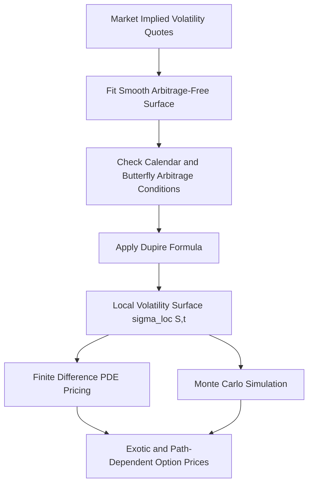

## Local Volatility Models

### Overview

Local volatility models represent volatility as a deterministic function of the underlying asset price and time, $\sigma(S,t)$, rather than a constant (Black-Scholes) or a separate stochastic process (stochastic volatility models). Introduced by Bruno Dupire (1994) and independently by Derman and Kani (1994), the defining feature of local volatility models is that they can be constructed to **exactly reproduce the entire observed market implied volatility surface** for European options, making them a foundational tool for consistent pricing of exotic derivatives against vanilla market quotes.

The underlying asset dynamics under the risk-neutral measure are given by:

$$dS_t = r S_t \, dt + \sigma(S_t, t)\, S_t \, dW_t$$

where $\sigma(S_t,t)$ is a deterministic function of spot and time known as the **local volatility surface**, and $W_t$ is a single Brownian motion (there is no separate volatility risk factor).

### Motivation: The Uniqueness Result

**Key Points**

- A key theoretical result (Breeden-Litzenberger combined with Dupire's insight) is that, given a complete and arbitrage-free set of European option prices across all strikes and maturities, there exists a **unique** diffusion process with state-dependent volatility $\sigma(S,t)$ that reproduces those exact prices.
- This means local volatility models are, by construction, **calibration-consistent**: they fit the vanilla smile perfectly (subject to the quality/density of available market quotes), unlike Heston-type stochastic volatility models, which typically only approximate the smile.
- Local volatility is best understood not as a literal description of how volatility evolves, but as an **effective, risk-neutral summary** of the market's smile, encoded into a single deterministic surface consistent with observed prices.

### Dupire's Equation

Dupire's forward PDE expresses local volatility directly in terms of the market's European call price surface $C(K,T)$ as a function of strike $K$ and maturity $T$:

$$\frac{\partial C}{\partial T} = \frac{1}{2}\sigma^2(K,T) K^2 \frac{\partial^2 C}{\partial K^2} - rK\frac{\partial C}{\partial K}$$

Solving explicitly for local volatility:

$$\sigma^2(K,T) = \frac{\dfrac{\partial C}{\partial T} + rK\dfrac{\partial C}{\partial K}}{\dfrac{1}{2}K^2 \dfrac{\partial^2 C}{\partial K^2}}$$

This is a **forward equation** — it evolves option prices forward in maturity $T$ for a fixed valuation date, in contrast to the backward Black-Scholes PDE which evolves backward from maturity to valuation date. This forward structure makes Dupire's equation particularly efficient for extracting the entire local volatility surface from a single set of option price quotes across all strikes and maturities simultaneously.

### Relationship to Implied Volatility

In practice, local volatility is derived not from raw call prices but from the **implied volatility surface** $\sigma_{impl}(K,T)$, since implied vols are smoother and more numerically stable to work with than raw prices or their derivatives. The relevant transformation (in terms of log-moneyness $k = \ln(K/S_0)$ and using Black-Scholes vega and other Greeks) is often expressed via the Dupire-Gatheral formula:

$$\sigma_{loc}^2(K,T) = \frac{\sigma_{impl}^2 + 2\sigma_{impl} T \left(\frac{\partial \sigma_{impl}}{\partial T} + rK\frac{\partial \sigma_{impl}}{\partial K}\right)}{\left(1 + Kd_1\sqrt{T}\frac{\partial \sigma_{impl}}{\partial K}\right)^2 + K^2 \sigma_{impl} T\left(\frac{\partial^2 \sigma_{impl}}{\partial K^2} - d_1\sqrt{T}\left(\frac{\partial \sigma_{impl}}{\partial K}\right)^2\right)}$$

where $d_1$ is the standard Black-Scholes term. [Inference: exact formula variants differ slightly across textbooks and papers depending on parameterization choices (log-moneyness vs. strike, forward vs. spot); practitioners should verify the specific convention used in their implementation.]

**Key relationship**: local variance at a given point can be interpreted as approximately the market's **risk-neutral expected instantaneous variance conditional on the asset price being at that level**:

$$\sigma_{loc}^2(K,T) = \mathbb{E}^{\mathbb{Q}}\left[\sigma_{true}^2(t) \mid S_T = K\right]$$

This is a well-known and important structural insight: local volatility is a conditional expectation of instantaneous variance under whatever the "true" (possibly stochastic) volatility process is, evaluated at each point on the strike-maturity grid.

### Practical Construction: From Discrete Market Quotes to a Smooth Surface

**Example**

Constructing a usable local volatility surface from market data typically follows these steps:

1. **Collect market quotes**: Obtain implied volatilities for liquid European options across available strikes and maturities (e.g., a matrix of $\sigma_{impl}(K_i, T_j)$ from listed option prices).
2. **Interpolate/smooth the implied vol surface**: Since Dupire's formula requires first and second derivatives with respect to strike, and a first derivative with respect to maturity, raw discrete market quotes must first be fit to a smooth parametric or semi-parametric form. Common choices include:
   - **SVI (Stochastic Volatility Inspired) parameterization** (Gatheral, 2004), fitting a smooth curve per maturity slice
   - Cubic splines across strikes, with careful arbitrage-free constraints
   - Kernel or local regression smoothing
3. **Check for arbitrage**: The fitted surface must satisfy no-arbitrage conditions — the implied total variance must be non-decreasing in maturity (no calendar spread arbitrage), and the price function must be convex in strike (no butterfly arbitrage), since violations produce negative values under the square root in Dupire's formula.
4. **Apply Dupire's formula** (or the implied-vol equivalent) at each grid point to extract $\sigma_{loc}(K,T)$.
5. **Extrapolate/extend** the surface beyond the range of liquid quotes (for very low/high strikes or long maturities) using a chosen extrapolation scheme, since local volatility is highly sensitive to the tails of the interpolated surface.

### Local Volatility Surface Behavior (Illustration)

<svg xmlns="http://www.w3.org/2000/svg" viewBox="0 0 700 420">
<text x="350" y="30" font-size="18" text-anchor="middle" font-family="sans-serif" font-weight="bold">Local Volatility Surface Shape (svg_diagram)</text>
<line x1="80" y1="360" x2="650" y2="360" stroke="black" stroke-width="2" />
<line x1="80" y1="360" x2="80" y2="50" stroke="black" stroke-width="2" />
<text x="365" y="395" font-size="14" text-anchor="middle" font-family="sans-serif">Strike (K)</text>
<text x="30" y="200" font-size="14" text-anchor="middle" font-family="sans-serif" transform="rotate(-90 30 200)">Local Volatility</text>
<line x1="365" y1="50" x2="365" y2="360" stroke="gray" stroke-dasharray="4,4" />
<text x="370" y="65" font-size="12" font-family="sans-serif">Spot S0</text>
<path d="M 100 340 Q 200 280 300 220 Q 365 200 450 240 Q 550 300 620 250" stroke="#7c3aed" stroke-width="3" fill="none" />
<text x="440" y="180" font-size="13" font-family="sans-serif" fill="#7c3aed">Local Vol Surface (steeper than implied skew)</text>
<path d="M 100 260 Q 250 220 365 210 Q 480 220 620 200" stroke="#16a34a" stroke-width="2" stroke-dasharray="5,3" fill="none" />
<text x="440" y="290" font-size="13" font-family="sans-serif" fill="#16a34a">Implied Vol Skew (reference)</text>
</svg>

A well-known empirical feature: the local volatility skew is typically **steeper** (roughly twice the slope, under certain approximations) than the corresponding implied volatility skew for short maturities, a relationship sometimes summarized loosely as the "1/2 rule" near-the-money. [Inference: this approximate relationship holds well near-the-money for short maturities under smooth surfaces but is not a universal exact rule across all market conditions.]

### Numerical Implementation Approaches

**Finite Difference Approach**

Once the local volatility surface $\sigma_{loc}(S,t)$ is constructed, pricing exotic or American-style options proceeds analogously to Black-Scholes-based finite difference methods, but with a *spatially and temporally varying* diffusion coefficient:

$$\frac{\partial V}{\partial t} + \frac{1}{2}\sigma_{loc}^2(S,t) S^2 \frac{\partial^2 V}{\partial S^2} + rS\frac{\partial V}{\partial S} - rV = 0$$

This requires only modest modification to a standard Crank-Nicolson or implicit finite difference scheme: the diffusion coefficient at each grid node is simply looked up from the pre-computed local volatility surface rather than treated as a constant.

**Monte Carlo Simulation**

Simulating under local volatility uses the same discretization approach as Black-Scholes Monte Carlo, with volatility evaluated locally at each simulated point:

$$S_{t+\Delta t} = S_t \exp\left[\left(r - \frac{1}{2}\sigma_{loc}^2(S_t, t)\right)\Delta t + \sigma_{loc}(S_t,t)\sqrt{\Delta t}\, Z\right]$$

A practical complication is that $\sigma_{loc}(S,t)$ must be interpolated from the discretely computed local volatility grid at each simulated path's current spot level, requiring careful interpolation (bilinear or higher-order) to avoid introducing discretization artifacts.

### Comparison: Local Volatility vs. Stochastic Volatility

| Feature | Local Volatility | Stochastic Volatility (e.g., Heston) |
| --- | --- | --- |
| Volatility source | Deterministic function of $(S,t)$ | Separate stochastic process |
| Vanilla smile fit | Exact (by construction) | Approximate |
| Number of risk factors | One (asset price only) | Two or more (asset + variance) |
| Forward smile dynamics | Tends to flatten unrealistically over time | Generally more realistic forward smile evolution |
| Hedging (Vega/Delta) | Can produce different hedge ratios than observed market behavior | Often more consistent with observed dynamic hedging performance |
| Best suited for | Products primarily sensitive to the *current* smile shape (e.g., digital options, some barriers) | Products sensitive to *future* smile dynamics (e.g., cliquets, forward-starting options) |

### Known Limitations of Local Volatility Models

**Key Points**

- **Unrealistic forward smile dynamics**: Local volatility models tend to predict that the volatility smile flattens out significantly for future time periods, which is often inconsistent with actual observed market behavior where smiles persist across time. This is a well-documented and widely cited shortcoming.
- **Sensitivity to interpolation/extrapolation choices**: Because Dupire's formula involves second derivatives of the price/implied vol surface, the resulting local volatility surface can be highly sensitive to the smoothing and extrapolation methodology chosen, especially in regions with sparse market quotes (deep out-of-the-money strikes, long maturities).
- **Hedging performance**: Some empirical studies suggest that Delta and Vega hedges computed under local volatility do not always align well with realized market hedging performance compared to stochastic volatility models, though this is a topic of ongoing debate and depends on the specific product and market. [Unverified: hedging performance comparisons vary across studies, markets, and time periods; no universal consensus ranks one model category as strictly superior for all products.]

### Local Stochastic Volatility (LSV) as a Resolution

To address local volatility's forward-smile-dynamics weakness while retaining exact calibration to the vanilla surface, practitioners commonly combine local and stochastic volatility into a hybrid **Local Stochastic Volatility (LSV)** model:

$$dS_t = rS_t\, dt + L(S_t,t)\sqrt{v_t}\, S_t\, dW_t^S$$

where $L(S_t,t)$ is a "leverage function" calibrated (often via a particle method or Fokker-Planck-based approach) so that the combined model reproduces the exact market smile, while $v_t$ evolves stochastically (e.g., under Heston dynamics), providing more realistic forward smile behavior than pure local volatility alone.

### Practical Implementation Notes

- **Data requirements**: A robust local volatility surface requires a sufficiently dense and liquid set of market option quotes across strikes and maturities; sparse or illiquid markets can produce noisy or unstable local volatility surfaces.
- **Numerical stability**: Small errors or noise in the implied volatility surface can be significantly amplified when computing the second derivative with respect to strike required by Dupire's formula, making surface smoothing a critical practical step rather than an optional refinement.
- **Use case fit**: Local volatility models remain widely used for **first-order consistent pricing** of exotics relative to the vanilla market (e.g., barrier options, digital options), particularly when speed and exact vanilla-smile consistency are prioritized over capturing realistic volatility dynamics through time.
- **Software/library context**: Most derivatives pricing libraries (QuantLib and similar) implement Dupire local volatility construction via implied volatility surface fitting (e.g., SVI or spline-based) followed by finite-difference computation of the required derivatives; exact numerical differentiation schemes can vary by implementation. [Unverified: specific library implementation details and default smoothing choices should be checked against current documentation, as these are subject to change across versions.]

### Related Topics

- Dupire's forward PDE derivation and its relationship to Fokker-Planck equations
- Stochastic volatility models (Heston, SABR) and their calibration tradeoffs relative to local volatility
- Local Stochastic Volatility (LSV) models and leverage function calibration via particle methods
- SVI (Stochastic Volatility Inspired) parameterization and arbitrage-free surface fitting
- Barrier option pricing sensitivity to local volatility model choice
- Forward-starting options and cliquets as tests of forward smile dynamics
- Breeden-Litzenberger formula and risk-neutral density extraction from option prices
- No-arbitrage conditions for implied volatility surfaces (calendar and butterfly spread constraints)