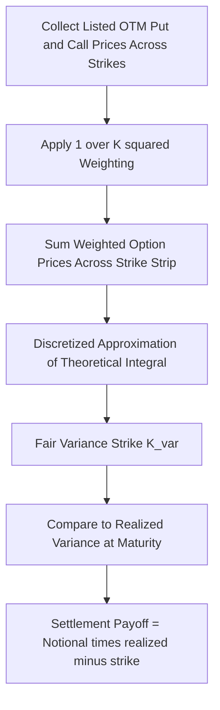

## Variance Swaps and Volatility Derivatives

### Overview

Variance swaps and volatility derivatives are financial instruments that allow direct trading exposure to the realized volatility (or variance) of an underlying asset, independent of its price direction. Unlike vanilla options, whose payoffs depend jointly on the path of the underlying price and its volatility, these instruments are engineered to isolate volatility exposure as cleanly as possible, making them core tools for volatility trading, hedging option books' Vega risk, and speculating on future market turbulence.

### Variance Swaps

**Definition and Payoff**

A variance swap is a forward contract on realized annualized variance. At maturity, the payoff to the long side (the variance buyer) is:

$$\text{Payoff} = N_{var} \times \left(\sigma_{realized}^2 - K_{var}\right)$$

where:

- $\sigma_{realized}^2$ is the realized annualized variance of the underlying's log returns over the contract's life
- $K_{var}$ is the fixed variance strike, set at inception so the swap has zero initial value
- $N_{var}$ is the variance notional (often quoted in terms of "vega notional" for convenience, converted via $N_{var} = N_{vega} / (2\sigma_{strike})$)

**Realized Variance Calculation**

Realized variance is typically computed from daily log returns:

$$\sigma_{realized}^2 = \frac{A}{n}\sum_{i=1}^{n}\left(\ln\frac{S_i}{S_{i-1}}\right)^2$$

where $A$ is the annualization factor (e.g., 252 for daily observations in equity markets) and $n$ is the number of return observations. Contract specifications typically define details such as whether the mean return is subtracted (often it is not, since the impact is negligible for daily-sampled data over typical maturities) and how missing/holiday observations are handled.

### Static Replication: The Theoretical Foundation

**Key Points**

- A variance swap's fair strike can be **statically replicated** using a portfolio of European options across a continuum of strikes, a landmark theoretical result that underlies most practical variance swap pricing and hedging.
- The replication relies on the fact that the log-payoff $-\ln(S_T/S_0)$ can be decomposed into a linear combination of a forward position and a continuum of out-of-the-money puts and calls.

**The Replication Formula**

The fair variance strike (under continuous replication and no dividends, simplified form) is given by:

$$K_{var} = \frac{2}{T}\left[\int_0^{F_0} \frac{P(K)}{K^2}\, dK + \int_{F_0}^\infty \frac{C(K)}{K^2}\, dK\right]$$

where $F_0$ is the forward price, $P(K)$ and $C(K)$ are prices of out-of-the-money puts and calls at strike $K$, and $T$ is time to maturity. This formula shows that the variance swap strike is essentially a **weighted integral over the entire implied volatility smile**, weighted by $1/K^2$, which is why variance swaps are sometimes described as giving exposure to the "average" variance implied across the whole smile rather than just at-the-money volatility.

**Practical Implementation**

Since a continuum of strikes is unavailable in real markets, replication in practice uses a **discretized set of listed option strikes** spanning as wide a range as liquidity allows, with the sum approximating the theoretical integral:

$$K_{var} \approx \frac{2}{T}\sum_i \frac{\Delta K_i}{K_i^2} e^{rT} Q(K_i)$$

where $Q(K_i)$ is the price of the out-of-the-money option at strike $K_i$ and $\Delta K_i$ represents the strike spacing. The accuracy of this discretized replication depends heavily on strike density and the range of available strikes; truncation at the tails (missing very deep OTM options) introduces a systematic bias, typically causing the replicated strike to slightly understate the true theoretical fair strike since tail contributions are omitted.

**Example**

Suppose a trading desk wants to price a 3-month variance swap on an equity index. The desk would:

1. Collect a full strip of listed OTM put and call prices across all available strikes for the 3-month maturity.
2. Compute $\frac{2}{T}\Delta K_i / K_i^2$ weights for each strike.
3. Sum weighted option prices to obtain the replicating cost, which becomes the fair variance strike $K_{var}$.
4. Quote this as either variance strike (e.g., $K_{var} = 0.04$ corresponding to 20% annualized volatility) or converted to a "volatility strike" $\sqrt{K_{var}}$ for client-facing quotation purposes, keeping in mind that $\mathbb{E}[\sigma_{realized}] \neq \sqrt{K_{var}}$ due to Jensen's inequality (a subtlety discussed further below).

### The Volatility Swap and the Convexity Gap

**Volatility Swaps**

A **volatility swap** pays based on realized *volatility* (not variance) directly:

$$\text{Payoff} = N_{vol} \times \left(\sigma_{realized} - K_{vol}\right)$$

Unlike variance swaps, volatility swaps **cannot be statically replicated** using vanilla options, because $\sigma_{realized} = \sqrt{\sigma_{realized}^2}$ is a nonlinear (concave) function of realized variance, and Jensen's inequality implies:

$$\mathbb{E}\left[\sqrt{\sigma_{realized}^2}\right] \leq \sqrt{\mathbb{E}[\sigma_{realized}^2]}$$

This means the fair volatility strike is always **strictly less than or equal to** the square root of the fair variance strike, with the difference known as the **convexity adjustment** or **convexity gap**. Pricing volatility swaps therefore typically requires a model-dependent approach (e.g., under Heston or another stochastic volatility model) to estimate this convexity correction, since no equivalent model-free static replication exists.

$$K_{vol} \approx \sqrt{K_{var}} - \text{(convexity adjustment)}$$

The size of this convexity adjustment depends on the volatility of volatility in the chosen model — higher vol-of-vol widens the gap between the volatility strike and the square root of the variance strike. [Inference: the exact magnitude of the convexity adjustment is model- and market-dependent; there is no universal formula, though Heston-based approximations are commonly used in practice.]

### VIX and Volatility Index Derivatives

**The VIX Index**

The CBOE VIX Index is calculated using a formula closely related to the variance swap replication approach, using a strip of S&P 500 index option prices across a range of strikes to compute a model-free implied 30-day variance, then annualizing and taking the square root:

$$VIX = 100 \times \sqrt{\frac{2}{T}\sum_i \frac{\Delta K_i}{K_i^2}e^{RT}Q(K_i) - \frac{1}{T}\left(\frac{F}{K_0} - 1\right)^2}$$

This formula is essentially the discretized variance swap replication formula (with a small correction term), reflecting that the VIX is conceptually a 30-day forward-looking implied volatility measure derived directly from the market's SPX option smile. [Note: exact VIX methodology details, including strike selection rules and correction terms, are published by CBOE and subject to periodic methodology updates; practitioners should consult current CBOE documentation for implementation-level precision.]

**VIX Futures and Options**

- **VIX futures** are exchange-traded contracts on the future value of the VIX index itself, allowing direct trading of forward volatility expectations without needing to construct a replicating options portfolio.
- **VIX options** are options on the VIX futures/index, providing convex exposure to volatility-of-volatility; because the VIX itself is not a directly tradable asset (it is a calculated index), VIX options require specialized modeling (often using a modified SABR-type or dedicated VIX dynamics model) distinct from standard equity option pricing frameworks.
- A well-documented empirical feature of VIX futures markets is that the VIX futures curve is typically in **contango** (upward sloping, future VIX priced above spot VIX) during calm market periods, and can invert into **backwardation** during periods of market stress, reflecting risk premia and mean-reversion expectations in volatility itself.

### Other Volatility Derivatives

**Corridor Variance Swaps**

Pay based on realized variance accumulated only when the underlying trades within a specified price corridor $[L, U]$, allowing more targeted volatility exposure and typically priced at a discount to a standard variance swap since variance outside the corridor is excluded.

**Gamma Swaps**

Similar to variance swaps but weight each day's squared return contribution by the current underlying price level, giving a payoff that is naturally self-decaying in weight as the underlying moves, and often used as they avoid some of the extreme tail risk sensitivity of pure variance swaps to large price jumps.

**Conditional Variance Swaps**

Pay based on realized variance conditional on the underlying being above or below a certain threshold, useful for directional volatility views (e.g., "I want exposure to volatility only on down days").

**Timer Options**

Options whose maturity is not fixed in calendar time but instead triggers once accumulated realized variance reaches a pre-specified target level, effectively fixing the *variance budget* rather than the time horizon.

### Comparison of Volatility Exposure Instruments

| Instrument | Payoff Basis | Static Replication? | Primary Use |
| --- | --- | --- | --- |
| Variance Swap | Realized variance vs. fixed strike | Yes (via option strip) | Pure variance exposure, Vega hedging |
| Volatility Swap | Realized volatility vs. fixed strike | No (model-dependent) | Direct volatility speculation |
| VIX Futures | Forward VIX index level | N/A (exchange-traded) | Forward volatility expectations |
| VIX Options | Optionality on VIX futures | No (requires VIX-specific model) | Convex volatility-of-volatility exposure |
| Gamma Swap | Weighted realized variance | Approximate | Volatility exposure with reduced tail sensitivity |
| Corridor Variance Swap | Range-conditional realized variance | Approximate (partial strip) | Targeted/range-bound volatility exposure |

### Variance Swap Replication Mechanics (Illustration)

### Volatility Surface Weighting in Variance Swap Replication (Illustration)

<svg xmlns="http://www.w3.org/2000/svg" viewBox="0 0 700 420">
<text x="350" y="30" font-size="18" text-anchor="middle" font-family="sans-serif" font-weight="bold">Variance Swap Strike Weighting Across Strikes (svg_diagram)</text>
<line x1="80" y1="360" x2="650" y2="360" stroke="black" stroke-width="2" />
<line x1="80" y1="360" x2="80" y2="50" stroke="black" stroke-width="2" />
<text x="365" y="395" font-size="14" text-anchor="middle" font-family="sans-serif">Strike (K)</text>
<text x="30" y="200" font-size="14" text-anchor="middle" font-family="sans-serif" transform="rotate(-90 30 200)">Weight (1/K^2) x Option Price</text>
<line x1="365" y1="50" x2="365" y2="360" stroke="gray" stroke-dasharray="4,4" />
<text x="370" y="65" font-size="12" font-family="sans-serif">Forward F0</text>
<path d="M 100 350 Q 200 250 300 150 Q 365 100 430 150 Q 530 250 620 340" stroke="#ea580c" stroke-width="3" fill="none" />
<text x="430" y="120" font-size="13" font-family="sans-serif" fill="#ea580c">Contribution peaks near ATM, tapers at tails</text>
<path d="M 100 350 Q 200 250 300 150 Q 365 100 430 150 Q 530 250 620 340 L 620 360 L 100 360 Z" fill="#fed7aa" opacity="0.5" />
</svg>

The illustration shows that although the weighting formula $1/K^2$ technically extends across all strikes, the actual dollar contribution to the replicating sum is concentrated near-the-money (where option prices remain economically meaningful) and tapers toward the tails, though the theoretical integral formally requires the full strike range to converge to the true fair value.

### Practical Implementation Notes

- **Vega hedging application**: Variance swaps are widely used by option trading desks to hedge aggregate Vega exposure from a book of vanilla options, since the variance swap's payoff structure provides relatively "pure" volatility exposure across the smile, unlike a single option's Vega which is strike- and moneyness-specific.
- **Dividend and interest rate assumptions**: The replication formula assumes continuous, arbitrage-free forward pricing; in practice, discrete dividends and the choice of discounting curve introduce practical adjustments that pricing desks must incorporate.
- **Jump risk**: Because realized variance is computed from squared returns, variance swaps are highly sensitive to large, discrete price jumps (e.g., earnings surprises, market crashes), which contribute disproportionately to the realized variance leg and represent a significant risk for variance swap sellers. Gamma swaps and corridor variance swaps were partly developed to mitigate this jump sensitivity.
- **Liquidity considerations**: The quality of variance swap pricing and hedging depends directly on the liquidity and strike range of the underlying vanilla options market; underlyings with sparse or narrow-strike option markets produce less reliable replication and wider bid-ask spreads on variance products. [Unverified: specific liquidity thresholds and typical bid-ask spread magnitudes vary significantly by underlying and market conditions; current market-specific data should be checked directly with trading desks or data providers.]

### Related Topics

- Model-free implied volatility and the VIX calculation methodology in detail
- Stochastic volatility models (Heston, SABR) for pricing volatility swaps and VIX options
- Volatility risk premium: historical spread between implied and realized variance
- Cliquets and forward-starting options as related volatility-sensitive exotic structures
- Dispersion trading (index variance vs. single-stock variance basket strategies)
- Skew and smile dynamics and their impact on variance swap replication accuracy
- Jump-diffusion models and their implications for variance swap risk management
- Volatility ETPs (exchange-traded products) and their tracking of VIX futures curves