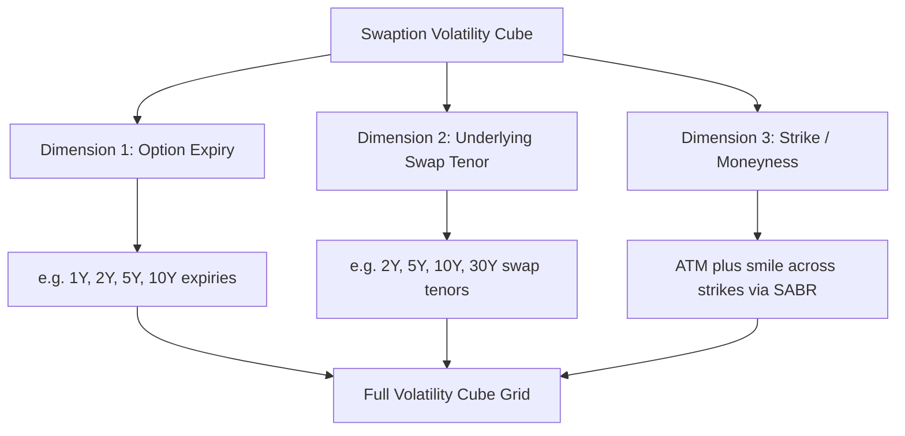

## Interest Rate Caps, Floors, and Swaptions

### Overview

Interest rate caps, floors, and swaptions are the primary over-the-counter derivative instruments used to manage and speculate on interest rate volatility. Caps and floors are portfolios of options on individual forward interest rates (caplets and floorlets), while swaptions are options on interest rate swaps themselves. Together, these instruments form the core building blocks of the fixed income derivatives market and are the primary products for which the SABR model and its variants were originally developed.

### Interest Rate Caps

**Definition and Structure**

An interest rate cap is a contract that provides protection against rising interest rates on a floating-rate liability. It consists of a series of **caplets**, each of which is effectively a call option on a forward interest rate (typically a LIBOR-successor rate such as SOFR-based term rates, or historically LIBOR) for a specified period.

**Caplet Payoff**

For a caplet covering the period $[T_i, T_{i+1}]$ with accrual fraction $\tau_i$, strike rate $K$ (the cap rate), and notional $N$, the payoff at $T_{i+1}$ is:

$$\text{Caplet Payoff} = N \tau_i \max(L(T_i, T_{i+1}) - K, 0)$$

where $L(T_i, T_{i+1})$ is the floating reference rate observed at $T_i$ for the accrual period ending at $T_{i+1}$. A cap is simply the sum of caplets across all reset periods in the contract's life:

$$\text{Cap Value} = \sum_{i} \text{Caplet}_i$$

### Interest Rate Floors

**Definition and Structure**

An interest rate floor is the mirror-image instrument, providing protection against falling interest rates, structured as a series of **floorlets**, each a put option on the forward rate:

$$\text{Floorlet Payoff} = N \tau_i \max(K - L(T_i, T_{i+1}), 0)$$

Floors are commonly used by investors holding floating-rate assets who want to guarantee a minimum yield, or by structured product issuers embedding floor features into complex notes.

### Cap-Floor-Swap Parity

**Key Points**

- A crucial relationship analogous to put-call parity connects caps, floors, and swaps:

$$\text{Cap}(K) - \text{Floor}(K) = \text{Swap}(K)$$

- This means being long a cap and short a floor at the same strike $K$ and same notional/schedule replicates a **payer interest rate swap** (paying fixed at rate $K$, receiving floating), since the combined payoff at each period is $\max(L-K,0) - \max(K-L,0) = L - K$, exactly the payer swap's net cash flow.
- This parity relationship is widely used both as a pricing consistency check and as a practical hedging/replication tool.

### Pricing Caplets: Black's Model

**Black-76 Formula for Caplets**

The market-standard approach for pricing caplets (before smile/skew adjustments) treats the forward rate $L(T_i, T_{i+1})$ as lognormally distributed under the appropriate forward measure (the $T_{i+1}$-forward measure), applying Black's (1976) formula originally developed for commodity futures options:

$$\text{Caplet} = N\tau_i P(0, T_{i+1})\left[F_i N(d_1) - K N(d_2)\right]$$

$$d_1 = \frac{\ln(F_i/K) + \frac{1}{2}\sigma_i^2 T_i}{\sigma_i \sqrt{T_i}}, \quad d_2 = d_1 - \sigma_i\sqrt{T_i}$$

where:

- $F_i$ is the forward rate for the period $[T_i, T_{i+1}]$, observed at time 0
- $P(0, T_{i+1})$ is the discount factor to the payment date
- $\sigma_i$ is the **caplet's Black implied volatility** for that specific forward rate and maturity
- $N(\cdot)$ is the standard normal cumulative distribution function

**Example**

Consider pricing a single caplet with: $N = \$10{,}000{,}000$, $\tau_i = 0.5$ (semi-annual), $F_i = 4.5\%$, $K = 5.0\%$, $\sigma_i = 25\%$, $T_i = 1$ year, and $P(0, T_{i+1}) = 0.955$.

- $d_1 = \frac{\ln(0.045/0.05) + 0.5(0.25)^2(1)}{0.25\sqrt{1}} \approx \frac{-0.1054 + 0.03125}{0.25} \approx -0.297$
- $d_2 = -0.297 - 0.25 \approx -0.547$
- Using $N(d_1) \approx 0.383$ and $N(d_2) \approx 0.292$:
- Caplet $\approx 10{,}000{,}000 \times 0.5 \times 0.955 \times [0.045 \times 0.383 - 0.05 \times 0.292] \approx 10{,}000{,}000 \times 0.5 \times 0.955 \times [0.01724 - 0.0146] \approx \$12{,}600$ (approximate, illustrative)

### Swaptions

**Definition and Structure**

A swaption is an option granting the holder the right, but not the obligation, to enter into an underlying interest rate swap at a predetermined fixed rate (the strike) on a specified future date (the swaption expiry).

- **Payer swaption**: Gives the right to enter a swap paying fixed and receiving floating. Economically similar to a put option on a bond (since rising rates make the fixed-payer position more valuable).
- **Receiver swaption**: Gives the right to enter a swap receiving fixed and paying floating. Economically similar to a call option on a bond.

**Payoff at Expiry**

At swaption expiry $T$, if exercised, the holder enters a swap with fixed rate $K$ against the prevailing market swap rate $S(T)$. The value of a payer swaption at expiry, on a swap with $n$ remaining payment dates and notional $N$, is:

$$\text{Payer Swaption Payoff} = N \max(S(T) - K, 0) \times A(T)$$

where $A(T)$ is the **annuity factor** (present value of a stream of $1 payments on the swap's fixed leg schedule, discounted from each payment date back to $T$):

$$A(T) = \sum_{j=1}^{n} \tau_j P(T, T_j)$$

### Pricing Swaptions: Black's Model with the Swap Measure

**Black's Model for Swaptions**

Under the **annuity (swap) measure**, the forward swap rate $S(t)$ is modeled as a martingale, and Black's formula gives:

$$\text{Payer Swaption} = N \cdot A(0) \cdot \left[S_0 N(d_1) - K N(d_2)\right]$$

$$d_1 = \frac{\ln(S_0/K) + \frac{1}{2}\sigma^2 T}{\sigma\sqrt{T}}, \quad d_2 = d_1 - \sigma\sqrt{T}$$

where $S_0$ is today's forward swap rate, $A(0)$ is today's annuity factor, $\sigma$ is the swaption's Black implied volatility, and $T$ is time to swaption expiry. The receiver swaption follows by put-call symmetry:

$$\text{Receiver Swaption} = N \cdot A(0) \cdot \left[K N(-d_2) - S_0 N(-d_1)\right]$$

### The Swaption Volatility Cube

**Key Points**

- Unlike a single equity underlying, swaptions have volatility that depends on **three dimensions**: option expiry (time until the swaption can be exercised), underlying swap tenor (the length of the swap entered into upon exercise), and strike (moneyness relative to the forward swap rate).
- This three-dimensional structure is known as the **swaption volatility cube**: for each expiry/tenor pair, there exists a full smile/skew across strikes, analogous to a stack of individual volatility smiles indexed by expiry and tenor.
- The **ATM volatility surface** (expiry x tenor, at-the-money only) is often quoted and analyzed separately from the full smile dimension, since ATM volatilities are typically the most liquid and directly observable.

### SABR Model Application to Caps/Floors and Swaptions

The SABR model (covered in detail under stochastic volatility models) is the market-standard approach for capturing the smile/skew across strikes for both caplets and swaptions, since Black's model alone (with a single flat volatility) cannot reproduce the smile observed in the market.

For each expiry/tenor pair in the volatility cube, SABR parameters $(\alpha, \beta, \rho, \nu)$ are calibrated to the observed smile of market-quoted implied volatilities at various strikes, then Hagan's asymptotic formula is used to interpolate/generate implied volatilities at any desired strike, which are subsequently fed into Black's formula for pricing and risk management.

### Comparison: Caps/Floors vs. Swaptions

| Feature | Caps / Floors | Swaptions |
| --- | --- | --- |
| Underlying | Series of forward rates (one per period) | Single forward swap rate |
| Option type | Strip of individual caplets/floorlets | Single option on entering a swap |
| Volatility dimension | Caplet-by-caplet (or "cap vol" as blended average) | Expiry x tenor x strike cube |
| Standard model | Black's model per caplet (with SABR smile) | Black's model on swap rate (with SABR smile) |
| Typical use case | Hedging floating-rate loan/liability exposure | Hedging or speculating on swap-level rate views, mortgage servicing hedging |
| Exercise style | European per caplet (path of resets) | Typically European (Bermudan swaptions allow multiple exercise dates) |

### Bermudan Swaptions (Brief Introduction)

**Bermudan swaptions** allow exercise on multiple specified dates rather than a single expiry, commonly embedded in callable bonds and structured notes. Pricing requires methods capable of handling early-exercise decisions in a multi-factor interest rate setting, such as:

- Short-rate lattice models (Hull-White, Black-Karasinski trees)
- Least Squares Monte Carlo (LSM) adapted to interest rate models (e.g., LIBOR Market Model simulations)
- PDE methods on low-dimensional short-rate models

This connects Bermudan swaption pricing conceptually to American option pricing methods, but within a term-structure modeling framework rather than a single-asset framework.

### Risk Management: Key Greeks

**Key Points**

- **Delta**: Sensitivity to the underlying forward rate (caplet) or forward swap rate (swaption); often expressed as a hedge ratio in terms of the underlying forward-starting swap or FRA notional needed to hedge.
- **Vega**: Sensitivity to implied volatility; given the multi-dimensional nature of the vol cube, desks often track vega bucketed by expiry and tenor to manage cube-shape risk, not just a single aggregate vega number.
- **Theta**: Time decay, particularly relevant for caps/floors given their discrete caplet reset structure, causing "lumpy" theta profiles as caplets successively reset and expire.

### Practical Implementation Notes

- **Rate benchmark transition**: Following the transition away from LIBOR to alternative reference rates such as SOFR (US), €STR (Eurozone), and SONIA (UK), caps, floors, and swaptions are now predominantly written and quoted against these overnight/compounded-in-arrears rate conventions rather than traditional forward-looking LIBOR-style rates, which has required adjustments to accrual and payment conventions in caplet/floorlet structuring. [Note: given the pace of ongoing benchmark reform and convention standardization, practitioners should verify current market conventions for the specific currency and product against up-to-date market documentation.]
- **Normal vs. lognormal volatility quoting**: In low or negative interest rate environments, market participants often quote swaption and cap volatilities using the **Bachelier (normal) model** rather than Black's lognormal model, since the lognormal model breaks down for rates near or below zero; SABR with $\beta$ near 0 approximates this normal-type behavior.
- **Calibration to the volatility cube**: Building a consistent, arbitrage-free volatility cube across all expiry/tenor/strike combinations from available market quotes (which are often sparse for less liquid tenor/expiry combinations) requires careful interpolation and, in many cases, model-based extrapolation using SABR or related parametric forms.
- **Model consistency across products**: Since caps/floors and swaptions reference overlapping segments of the yield curve and volatility surface, pricing desks typically maintain a single consistent term-structure and volatility model (e.g., a calibrated LIBOR Market Model or SABR-LMM hybrid) to ensure caps, floors, and swaption prices remain mutually consistent and arbitrage-free.

### Related Topics

- SABR model calibration and Hagan's asymptotic volatility formula (detailed treatment)
- LIBOR Market Model (LMM) / BGM model for multi-factor term structure dynamics
- Bermudan swaption pricing via least squares Monte Carlo and short-rate trees
- Hull-White and other short-rate models for interest rate derivative pricing
- Cap/floor and swaption volatility cube construction and interpolation methods
- Convexity adjustments in CMS (Constant Maturity Swap) products
- Benchmark rate transition (LIBOR to SOFR/SONIA/€STR) and its impact on derivative conventions
- Structured notes with embedded caps, floors, and callable/Bermudan features