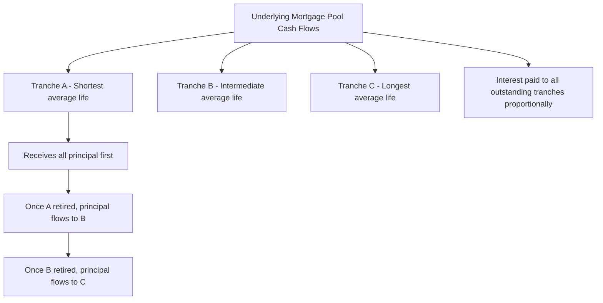

## Mortgage-Backed Securities

### Overview

Mortgage-backed securities (MBS) are fixed income instruments backed by pools of residential or commercial mortgage loans, whose cash flows (principal and interest) are passed through, restructured, or tranched to investors. MBS represent one of the largest fixed income markets globally and introduce distinctive valuation challenges centered on **prepayment risk**, since the embedded prepayment option held by mortgage borrowers behaves like an American-style call option on the underlying loan, but with exercise driven by a mix of financial and non-financial (behavioral, life-event) factors rather than pure rational optimization.

### Basic MBS Structure

**Pass-Through Securities**

The simplest MBS structure is a **pass-through certificate**, where a pool of mortgages is aggregated and cash flows (scheduled principal, scheduled interest, and any prepayments) are passed directly to investors on a pro-rata basis, net of a servicing fee.

$$\text{Cash Flow}_t = \text{Scheduled Principal}_t + \text{Scheduled Interest}_t + \text{Prepayment}_t$$

**Agency vs. Non-Agency MBS**

- **Agency MBS**: Issued or guaranteed by government-sponsored entities (Fannie Mae, Freddie Mac) or a government agency (Ginnie Mae in the US), carrying implicit or explicit credit guarantees that largely remove credit risk from investor consideration, leaving prepayment risk as the dominant valuation concern.
- **Non-agency (private-label) MBS**: Lack such guarantees, requiring investors to additionally account for credit risk (borrower default) alongside prepayment risk, typically addressed through structural credit enhancement (subordination, overcollateralization).

### Prepayment Risk: The Central Valuation Challenge

**Key Points**

- Mortgage borrowers typically have the right to prepay their loan balance at any time without penalty (in most conventional US mortgage products), which is economically equivalent to the borrower holding an embedded American call option on the loan, exercisable by refinancing or otherwise paying off the debt early.
- Unlike financial options, mortgage prepayment behavior is influenced by a mix of factors: interest rate incentive (refinancing when current rates fall meaningfully below the loan's note rate), **home mobility** (sale of the home due to relocation, life events), **seasoning** (age of the loan affecting prepayment propensity), **burnout** (prior exposure to refinancing incentives reducing the pool's sensitivity to further rate declines, since more rate-sensitive borrowers have already refinanced), and seasonal patterns (higher prepayments in summer months tied to home-buying seasons).
- This mixture of rational financial motivation and behavioral/demographic factors means prepayment cannot be modeled as a purely optimal-exercise decision (unlike a standard American option), requiring **empirically calibrated prepayment models** rather than pure no-arbitrage optimal stopping theory.

### Prepayment Modeling Conventions

**PSA (Public Securities Association) Prepayment Model**

A standardized benchmark curve expressing prepayment speed as a percentage of the **Conditional Prepayment Rate (CPR)**, ramping up over the first 30 months of a loan's life and then leveling off:

\text{CPR}_t = \begin{cases} 0.06 \times \frac{t}{30} & t \leq 30 \text{ months} \\ 0.06 & t > 30 \text{ months} \end{cases} \quad \text{(100% PSA benchmark)}

Actual pools are often quoted as a multiple of this benchmark (e.g., "150% PSA" implies prepayment speeds 1.5x the standard curve).

**Conditional Prepayment Rate (CPR) and Single Monthly Mortality (SMM)**

CPR is the annualized prepayment rate; it is converted to a monthly rate (SMM) via:

$$SMM = 1 - (1 - CPR)^{1/12}$$

**Example**

If a pool has a CPR of 8% annually, the corresponding SMM is:

$$SMM = 1 - (1 - 0.08)^{1/12} = 1 - (0.92)^{0.0833} \approx 1 - 0.9931 \approx 0.69\%$$

This means approximately 0.69% of the remaining pool balance (beyond scheduled amortization) is expected to prepay each month.

### Modern Empirical Prepayment Models

**Key Points**

- Practitioner-grade prepayment models go well beyond the simple PSA benchmark, incorporating **econometric regression** or **machine learning-based models** fit to historical loan-level prepayment data, with explanatory variables including:
  - Refinancing incentive (spread between the loan's note rate and current market mortgage rates)
  - Loan age / seasoning
  - Burnout (cumulative prior refinancing incentive exposure)
  - Seasonality (calendar month effects)
  - Loan-to-value ratio, credit score, geography (for non-agency/credit-sensitive pools)
  - Housing turnover-driven prepayment (independent of rate incentive)
- These models are typically proprietary to major dealers, agencies, and specialized analytics vendors, and represent one of the most significant sources of valuation disagreement across market participants for MBS, since two dealers using different prepayment model assumptions can derive materially different fair values for the same security. [Unverified: the degree of valuation divergence varies by security type, market conditions, and vendor model methodology; exact comparative figures should be sourced from current market practice.]

### Collateralized Mortgage Obligations (CMOs)

**Structure and Tranching**

CMOs restructure the cash flows of an underlying mortgage pool (or pool of pass-throughs) into multiple **tranches** with different priority claims on principal and interest, allowing the redistribution of prepayment risk across investor classes with different risk appetites.

**Sequential-Pay Tranches**

The simplest CMO structure directs all principal payments (scheduled plus prepaid) to the first tranche until fully retired, then to the second tranche, and so on:

**PAC (Planned Amortization Class) and Companion Tranches**

PAC tranches are structured to receive a **stable, predetermined principal repayment schedule** as long as actual prepayment speeds remain within a specified band (the "PAC collar"), with any excess or shortfall in prepayments absorbed by **companion (support) tranches**, which bear the concentrated prepayment risk in exchange for typically offering higher yield to compensate for that risk.

- If prepayments occur **faster** than the PAC band's upper bound, companion tranches absorb the excess principal, shortening their average life.
- If prepayments occur **slower** than the PAC band's lower bound, companion tranches receive less principal than scheduled to keep the PAC tranche on its planned schedule, extending companion average life (this is the well-known "extension risk" concentrated in support tranches).

**Interest-Only (IO) and Principal-Only (PO) Strips**

- **IO strips**: Receive only the interest cash flows from the underlying pool; their value is inversely related to prepayment speed, since faster prepayments shrink the outstanding principal balance generating interest, reducing future IO cash flows. IO strips exhibit **negative duration** in certain rate environments (their value can rise when rates rise, since higher rates typically slow prepayments, extending the interest-generating balance).
- **PO strips**: Receive only the principal cash flows; their value benefits from faster prepayment, since PO holders are essentially owed a fixed sum ($100 par per unit) that is realized sooner when prepayments accelerate, effectively acting like a deep-discount, prepayment-accelerated bond.

### MBS Valuation: Option-Adjusted Spread (OAS)

**Concept**

Because MBS cash flows depend on the future path of interest rates (through the prepayment option), simple static discounting (yield-to-maturity based on a single assumed prepayment speed) is inadequate for full valuation. The **Option-Adjusted Spread (OAS)** framework instead:

1. Simulates numerous interest rate paths consistent with a chosen term structure model (e.g., a calibrated short-rate model or LIBOR Market Model).
2. Applies the prepayment model to each simulated rate path to generate path-specific cash flows (since prepayment behavior depends on the simulated rate environment along that path).
3. Discounts each path's cash flows along that same path's simulated discount factors.
4. Averages the discounted values across all paths to obtain a model price.
5. Solves for the constant spread (the OAS) that must be added to each path's discount rate so that the average simulated price matches the security's observed market price.

$$\text{Model Price} = \mathbb{E}\left[\sum_t \frac{CF_t(\text{path})}{\prod(1+r_s(\text{path}) + OAS)}\right] = \text{Market Price}$$

**Interpretation**

OAS represents the spread over the risk-free (or benchmark) curve that compensates investors for prepayment risk (and, for non-agency MBS, credit risk), *after* accounting for the value of the embedded prepayment optionality itself — hence "option-adjusted." A wider OAS suggests the security is cheap relative to the model's prepayment and rate assumptions; a narrower OAS suggests it is rich, though these conclusions are entirely conditional on the specific prepayment and term structure model used. [Inference: cross-dealer OAS comparisons must be interpreted cautiously since different prepayment models can generate materially different OAS values for the same bond and market price.]

### MBS Duration and Convexity: Negative Convexity

**Key Points**

- MBS pass-throughs typically exhibit **negative convexity**: as interest rates fall, prepayments accelerate (borrowers refinance), which shortens the security's effective duration precisely when investors would otherwise want their fixed income holdings to extend duration (to capture the price appreciation from falling rates) — the opposite of the desirable convexity behavior of a standard non-callable bond.
- This negative convexity means MBS underperform relative to a comparable non-callable bond both when rates rise sharply (extension risk suppresses price recovery) and when rates fall sharply (accelerated prepayment caps price appreciation), producing a characteristically "compressed" price-rate relationship relative to an option-free bond.

### MBS Price-Rate Relationship: Negative Convexity (Illustration)

<svg xmlns="http://www.w3.org/2000/svg" viewBox="0 0 700 420">
<text x="350" y="30" font-size="18" text-anchor="middle" font-family="sans-serif" font-weight="bold">MBS Negative Convexity vs. Option-Free Bond (svg_diagram)</text>
<line x1="80" y1="360" x2="650" y2="360" stroke="black" stroke-width="2" />
<line x1="80" y1="360" x2="80" y2="50" stroke="black" stroke-width="2" />
<text x="365" y="395" font-size="14" text-anchor="middle" font-family="sans-serif">Interest Rate</text>
<text x="30" y="200" font-size="14" text-anchor="middle" font-family="sans-serif" transform="rotate(-90 30 200)">Price</text>
<path d="M 100 340 Q 250 220 365 160 Q 480 100 620 60" stroke="#16a34a" stroke-width="3" fill="none" stroke-dasharray="6,3" />
<text x="450" y="90" font-size="13" font-family="sans-serif" fill="#16a34a">Option-Free Bond (positive convexity)</text>
<path d="M 100 320 Q 250 240 365 180 Q 480 150 620 140" stroke="#dc2626" stroke-width="3" fill="none" />
<text x="440" y="200" font-size="13" font-family="sans-serif" fill="#dc2626">MBS Pass-Through (negative convexity region)</text>
<line x1="365" y1="50" x2="365" y2="360" stroke="gray" stroke-dasharray="4,4" />
<text x="370" y="65" font-size="12" font-family="sans-serif">Current Rate</text>
</svg>

The MBS price curve flattens (and can even curve downward in price appreciation) as rates fall below the point where a significant portion of the pool becomes refinancing-incentivized, illustrating the "prepayment ceiling" on price appreciation that distinguishes MBS from option-free bonds.

### Comparison of Key MBS Structures

| Structure | Cash Flow Priority | Prepayment Risk Profile | Typical Investor |
| --- | --- | --- | --- |
| Pass-Through | Pro-rata to all holders | Full exposure to pool prepayment | Broad fixed income investors |
| Sequential CMO Tranche | Ordered (shortest to longest) | Concentrated by tranche seniority | Investors targeting specific average life |
| PAC Tranche | Scheduled, protected within collar | Reduced (protected by companions) | Duration-sensitive/insurance investors |
| Companion Tranche | Absorbs excess/shortfall prepayment | Concentrated, higher volatility | Yield-seeking, prepayment risk-tolerant investors |
| IO Strip | Interest cash flows only | Negative duration exposure | Rate-rise hedgers, specialized traders |
| PO Strip | Principal cash flows only | Benefits from faster prepayment | Rate-decline speculators |

### Practical Implementation Notes

- **Model dependency**: MBS valuation is unusually model-dependent compared to most fixed income products, since both the term structure model (for discounting and generating rate paths) and the prepayment model (for cash flow projection) jointly determine value; small changes in either model assumption can produce materially different prices and risk metrics for the same security.
- **Effective duration and convexity**: Because of the embedded option, MBS risk is typically measured using **effective duration** and **effective convexity** (computed by shocking rates up and down within the valuation model and observing resulting price changes) rather than analytical/modified duration formulas applicable to option-free bonds.
- **Basis risk in hedging**: Hedging MBS portfolios with Treasury or swap instruments introduces basis risk, since MBS spreads (OAS) can move independently of the underlying rate level due to changes in prepayment expectations, volatility assumptions, or MBS-specific supply/demand dynamics.
- **Data and analytics infrastructure**: Given the complexity of prepayment modeling and OAS analysis, MBS valuation in practice typically relies on specialized third-party analytics platforms (e.g., Yield Book, Intex, Bloomberg's MBS analytics) rather than in-house model-building for most market participants, particularly for complex structured tranches. [Unverified: specific platform capabilities and market share evolve over time; current vendor documentation should be consulted for implementation specifics.]

### Related Topics

- Option-Adjusted Spread (OAS) modeling in detail, including term structure model selection
- Short-rate models (Hull-White, Black-Karasinski) as the term structure engine for OAS analysis
- Commercial Mortgage-Backed Securities (CMBS) and their distinct credit/prepayment risk profile
- Collateralized Debt Obligations (CDOs) and further structured credit tranching techniques
- American option pricing methods, as a conceptual parallel to the embedded prepayment option
- Effective duration and effective convexity computation methodologies
- To-Be-Announced (TBA) market mechanics for agency MBS trading
- Credit risk transfer securities (Fannie Mae CAS, Freddie Mac STACR) and non-agency credit modeling